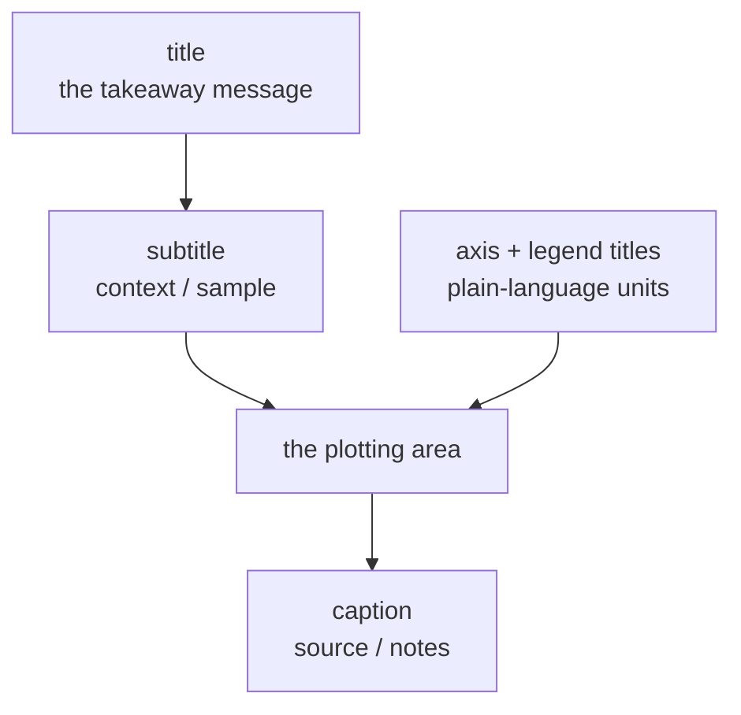

A chart can be *technically correct* and still fail to communicate. The
final layer of craft is **labeling and annotation**: titles that state
the message, axis labels in plain language, and marks that point the
reader to what matters. These are small additions with an outsized
effect.

## labs(): one place for all the text

`labs()` sets every text label on the plot — axis titles, the legend
title, the plot title, subtitle, and caption. Notice that the legend
title comes from the *aesthetic name*, so you label it by naming the
aesthetic:

<CodeBlock
  adapter="r"
  starterCode={`library(ggplot2)

ggplot(mpg, aes(displ, hwy, color = drv)) +
  geom_point() +
  labs(
    title    = "Bigger engines are less fuel-efficient",
    subtitle = "Highway MPG vs. engine displacement, 234 cars",
    x        = "Engine displacement (litres)",
    y        = "Highway miles per gallon",
    color    = "Drivetrain",
    caption  = "Source: ggplot2 mpg dataset"
  )
`}
/>

<Callout type="info" title="Make the title the takeaway, not the topic">
"Bigger engines are less fuel-efficient" tells the reader the
*conclusion*. "MPG vs. displacement" only names the axes — information
the axis labels already provide. A good title states what you want the
reader to *learn*, turning a chart into an argument.
</Callout>

The role of each text slot:

## Annotating directly on the plot

Legends cost the reader a glance back and forth. Often it is clearer to
write **directly on the plot** with `annotate()`, which adds a single
text label or shape at coordinates you choose — *not* tied to the data:

<CodeBlock
  adapter="r"
  starterCode={`library(ggplot2)

ggplot(mpg, aes(displ, hwy)) +
  geom_point(alpha = 0.5) +
  annotate("text",
    x = 6, y = 40,
    label = "Big engines,\\nbut still efficient?",
    color = "darkred", fontface = "bold"
  ) +
  annotate("rect",
    xmin = 5, xmax = 7, ymin = 22, ymax = 30,
    alpha = 0.1, fill = "red"
  )
`}
/>

`annotate()` differs from a geom: it draws **one** thing from values
you supply, rather than one mark per data row. Use it for callouts,
shaded regions, and arrows that explain.

## Reference lines guide the eye

Horizontal, vertical, and diagonal reference lines give the reader a
baseline to compare against — an average, a target, a threshold:

<CodeBlock
  adapter="r"
  starterCode={`library(ggplot2)

avg <- mean(mpg$hwy)

ggplot(mpg, aes(displ, hwy)) +
  geom_point(alpha = 0.5) +
  geom_hline(yintercept = avg, linetype = "dashed", color = "blue") +
  annotate("text",
    x = 6.5, y = avg + 1.5,
    label = "average", color = "blue", size = 3
  )
`}
/>

- `geom_hline(yintercept = ...)` — horizontal line (a target/average)
- `geom_vline(xintercept = ...)` — vertical line (a date, a cutoff)
- `geom_abline(slope =, intercept =)` — any diagonal (e.g. `y = x`)

The dashed line instantly answers "which cars are above average?"
without the reader doing arithmetic.

## The communication layer

Step back and see what these tools share: none of them change the
*analysis*. They change how readily a reader *extracts the message*.
This is the last mile of the grammar — once the components correctly
encode the data, labels and annotations make the encoding *legible*.

<MultipleChoice
  markdown={`In \`labs()\`, how do you set the *legend* title for a color legend?

- With a special \`legend.title\` argument.
  > \`legend.title\` is a *theme* element for styling, not for setting the text in \`labs()\`.
- You cannot change a legend title.
  > You can — by naming the aesthetic that produced it.
- [o] By setting the argument named after the aesthetic, e.g. \`labs(color = "Drivetrain")\`.
  > The legend title is the aesthetic's name, so you set it via that aesthetic in \`labs()\`.
- By editing the data column name only.
  > Renaming the column works too, but \`labs(color = ...)\` is the direct way without altering data.

A legend is the visible face of an aesthetic's scale, so its title is
set through that aesthetic's name in \`labs()\`.`}
/>

<MultipleChoice
  markdown={`How does \`annotate("text", ...)\` differ from adding a \`geom_text()\` layer?

- \`annotate()\` is just an alias for \`geom_text()\`.
  > They behave differently with respect to data.
- \`annotate()\` can only draw rectangles, not text.
  > \`annotate()\` can draw text, rectangles, segments, and more.
- [o] \`annotate()\` draws a single element from values you supply directly, while \`geom_text()\` draws one label per row of mapped data.
  > Annotations are one-off marks not tied to the data; geoms iterate over rows.
- \`geom_text()\` cannot use the plot's coordinate system.
  > \`geom_text()\` very much uses the coordinate system; the difference is per-row vs. one-off.

Use \`annotate()\` for standalone callouts and \`geom_text()\` when a label
should appear for every observation.`}
/>

<MultipleChoice
  markdown={`What is the best practice for a plot *title*?

- Restate the axis variables, e.g. "MPG vs. displacement."
  > That duplicates the axis labels and wastes the most prominent text slot.
- Leave it blank so the chart speaks for itself.
  > A blank title forfeits a prime chance to communicate the message.
- [o] State the takeaway or conclusion, e.g. "Bigger engines are less fuel-efficient," so the chart reads as an argument.
  > A message-driven title tells the reader what to learn from the chart.
- Put the data source in the title.
  > The source belongs in the caption, not the title.

The title is the most-read text on a chart; spend it on the message,
not on information the axes already carry.`}
/>

## Key takeaways

- `labs()` sets **all** plot text — title, subtitle, caption, axis
  titles, and legend titles (named by their aesthetic).
- Make the **title the takeaway**, not a restatement of the axes.
- `annotate()` adds **one-off** text or shapes from supplied
  coordinates; `geom_text()` labels **every row**.
- Reference lines (`geom_hline/vline/abline`) give the reader a
  **baseline** to compare against.
- This layer changes **legibility, not analysis** — the final mile of
  the grammar.
