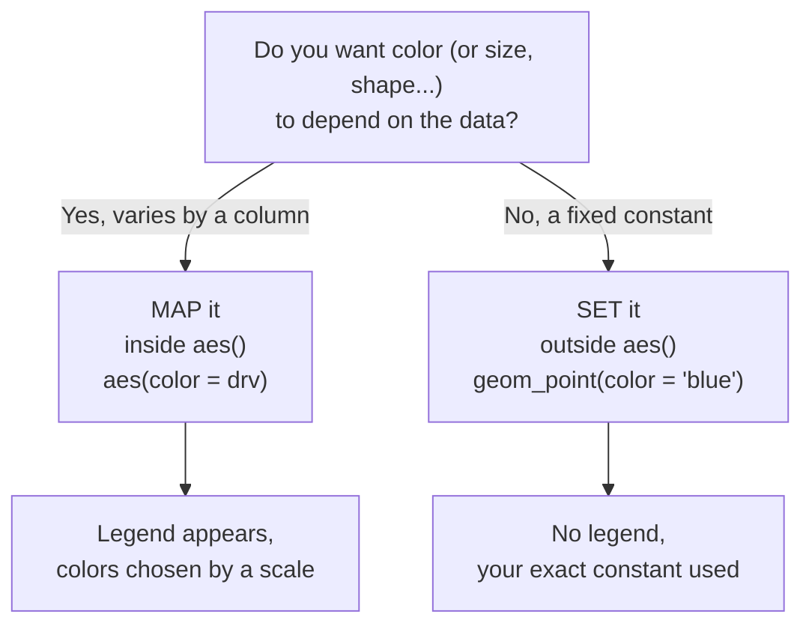

This page covers the mistake *every* ggplot2 learner makes at least
once. It is worth its own page because once it clicks, a whole class of
"why is my chart the wrong color?" bugs disappears forever.

## The two situations

There are two completely different things you might want to do with a
visual property like color:

1. **Map** it — let a *column* control it, so the value varies row by
   row. → goes **inside** `aes()`.
2. **Set** it — fix it to a *constant*, the same for every mark. →
   goes **outside** `aes()`.

## Setting: a constant for every mark

When you want *every* point blue, you **set** color outside `aes()`:

<CodeBlock
  adapter="r"
  starterCode={`library(ggplot2)

# SET: every point the same constant color. No legend.
ggplot(mpg, aes(displ, hwy)) +
  geom_point(color = "blue", size = 3)
`}
/>

`color = "blue"` lives in `geom_point()`, *outside* `aes()`. Result:
every point is exactly blue, and there is **no legend** — because no
variable is being encoded.

## Mapping: a column controls it

When you want color to *encode a variable*, you **map** it inside
`aes()`:

<CodeBlock
  adapter="r"
  starterCode={`library(ggplot2)

# MAP: drv controls color. ggplot2 picks colors and adds a legend.
ggplot(mpg, aes(displ, hwy, color = drv)) +
  geom_point(size = 3)
`}
/>

Here color varies with `drv`, ggplot2 chooses the palette via a scale,
and a legend appears automatically. *You do not get to pick the exact
colors here* — that is the scale's job (a later chapter).

## The classic bug

Now the trap. What happens if you put a *constant* color **inside**
`aes()`?

<CodeBlock
  adapter="r"
  starterCode={`library(ggplot2)

# BUG: "blue" inside aes() is treated as DATA, not a color.
ggplot(mpg, aes(displ, hwy, color = "blue")) +
  geom_point(size = 3)
`}
/>

Run it. The points are **red (or salmon), not blue** — and there is a
useless legend labeled `"blue"`.

Why? Because everything inside `aes()` is interpreted as **data to be
mapped**. ggplot2 sees `color = "blue"` and thinks: *"Ah, a new
variable whose value is the constant string `'blue'` for every row.
Map that variable to color through the color scale."* The scale then
assigns the *first default color* (reddish) to the single category
`"blue"`, and builds a legend for it.

<Callout type="warn" title="The mnemonic">
**Inside `aes()` = the name of a column / a variable to encode.
Outside `aes()` = a literal value to use as-is.**

If you ever see an unwanted legend whose label is a literal color name
like `"blue"` or `"red"`, you have set a constant inside `aes()` by
mistake.
</Callout>

## Side by side

The fix for the bug is simply to move the constant *out* of `aes()`:

<CodeBlock
  adapter="r"
  starterCode={`library(ggplot2)

# Wrong (mapping a constant): reddish points + bogus legend.
p_bug   <- ggplot(mpg, aes(displ, hwy, color = "blue")) + geom_point()

# Right (setting a constant): actually blue, no legend.
p_fixed <- ggplot(mpg, aes(displ, hwy)) + geom_point(color = "blue")

print(p_bug)
print(p_fixed)
`}
/>

## Does this apply to all aesthetics? Yes.

The same rule governs `size`, `shape`, `alpha`, `fill` — everything:

- `geom_point(size = 4)` → every point size 4 (setting).
- `aes(size = cty)` → size varies with `cty`, legend appears (mapping).

<CodeBlock
  adapter="r"
  starterCode={`library(ggplot2)

# size MAPPED to a column (varies + legend) vs size SET to a constant.
ggplot(mpg, aes(displ, hwy, size = cty)) +   # mapping
  geom_point(alpha = 0.5)                     # alpha set as a constant
`}
/>

<MultipleChoice
  markdown={`What is the difference between \`geom_point(color = "red")\` and \`geom_point(aes(color = "red"))\`?

- They are identical; \`aes()\` makes no difference here.
  > The placement relative to \`aes()\` changes the meaning entirely.
- The first throws an error.
  > Setting a constant outside \`aes()\` is the correct, error-free way to fix a color.
- [o] The first *sets* every point to the literal color red; the second *maps* a constant variable \`"red"\` to color, producing scale-chosen colors and a spurious legend.
  > Inside \`aes()\`, \`"red"\` is treated as data; outside, it is a literal color.
- The second is the correct way to make points red.
  > It will not reliably produce red; the scale chooses the color and adds a legend.

Inside \`aes()\` everything is data to be mapped; outside it, values are
literal. This is the root of the classic "wrong color" bug.`}
/>

<MultipleChoice
  markdown={`You want every point in your plot to be exactly the same shade of dark green. Where does \`color = "darkgreen"\` belong?

- Inside \`aes()\`, as \`aes(color = "darkgreen")\`.
  > That maps a constant variable and lets the scale override your color, adding a legend.
- [o] Outside \`aes()\`, as an argument to the geom: \`geom_point(color = "darkgreen")\`.
  > Setting a constant outside \`aes()\` applies it literally to every mark, with no legend.
- In a \`theme()\` call.
  > Themes style non-data elements; per-mark color belongs on the geom.
- It cannot be done; ggplot2 always chooses colors itself.
  > ggplot2 chooses colors only when you *map*; setting a constant gives you full control.

A fixed, data-independent property is *set* outside \`aes()\`. ggplot2
only takes over color selection when you *map* a variable.`}
/>

<MultipleChoice
  markdown={`A learner's plot shows reddish points and a legend titled with the literal text \`"blue"\`. What almost certainly happened?

- The data has a column literally named \`blue\`.
  > Possible in theory, but the tell-tale sign here is a *constant* string in \`aes()\`.
- ggplot2 is broken.
  > The behavior is correct and well-defined given the code.
- [o] They wrote \`aes(color = "blue")\`, so the constant \`"blue"\` was treated as a one-category variable and mapped through the color scale.
  > Inside \`aes()\`, \`"blue"\` becomes data; the scale assigns a default color and builds a legend.
- They forgot to call \`library(ggplot2)\`.
  > Without the library the plot would not render at all.

A legend labeled with a literal color name is the signature of setting
a constant inside \`aes()\` by mistake.`}
/>

## Key takeaways

- **Map** (inside `aes()`) when a *column* should control a property —
  the value varies per row and a legend appears.
- **Set** (outside `aes()`, as a geom argument) when you want a
  *constant* — applied literally, no legend.
- Everything **inside `aes()` is treated as data**. A constant placed
  there becomes a bogus one-category variable.
- A legend labeled with a literal value (like `"blue"`) is the
  signature of this mistake.
- The rule applies to **all** aesthetics: color, fill, size, shape,
  alpha, linetype.
