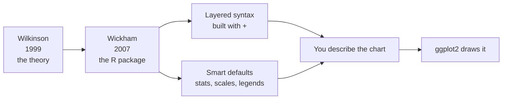

Wilkinson's *Grammar of Graphics* was a theory. Theories are
wonderful, but you cannot run a theory. Someone had to turn it into a
tool that real analysts could use on real data. That someone was
**Hadley Wickham**.

## From theory to package

In 2005, while a graduate student, Hadley Wickham built **ggplot** — a
direct attempt to implement Wilkinson's grammar in R. A couple of
years later he rewrote it from scratch with a cleaner, more consistent
interface. That rewrite is **ggplot2**, first released in 2007, and it
is the version everyone uses today.

<Callout type="info" title="Why the '2'?">
The name is refreshingly literal. **ggplot2** is the *second version*
of ggplot — a full rewrite, not a patch. The original `ggplot` is long
retired. The "**gg**" stands for **g**rammar of **g**raphics, the
theory the package implements.
</Callout>

So the name decodes as: **g**rammar of **g**raphics, version **2**.

## What the package actually contributes

Wilkinson described *what* the components are. Wickham's contribution
was an opinionated, ergonomic *way to write them down* in R — the part
that makes the grammar pleasant to use day to day:

- A **layered** model, where a plot is built by *adding* layers
  together with `+`.
- Sensible **defaults**, so that `geom_histogram()` already knows it
  needs to *bin and count* — you do not specify the statistic by hand.
- **Automatic** scales, legends, and axes derived from your mappings,
  so the bookkeeping that base R made you do disappears.

## How ggplot2 differs from traditional plotting APIs

Hold the two worldviews side by side:

| | Traditional API (base R, matplotlib) | ggplot2 |
| --- | --- | --- |
| Mental model | A sequence of drawing commands | A description of components |
| How a plot grows | Add more drawing commands | Add more layers with `+` |
| Color/size legends | You build and sync them by hand | Generated automatically from mappings |
| Axes and scales | You set limits and ticks manually | Derived from data and scales |
| A "new" chart | Hope a function exists | Recombine components |

The difference is not cosmetic. In a traditional API you tell the
computer *how to draw*. In ggplot2 you tell it *what the chart is*, and
the drawing follows. Compare the same scatter plot we struggled with
earlier:

<CodeBlock
  adapter="r"
  initialCode={`library(ggplot2)

# The whole chart described as components:
# data = mtcars, x = wt, y = mpg, color = cylinder count, mark = point.
ggplot(mtcars, aes(x = wt, y = mpg, color = factor(cyl))) +
  geom_point(size = 3)
`}
/>

Run it. Notice what you did **not** do: no color lookup table, no
manual legend, no axis math. You declared that `cyl` *maps to* color,
and ggplot2 produced the colored points **and** a matching legend
automatically. The legend cannot fall out of sync because you never
built it — it is a *consequence* of the mapping.

## Why this changed how analysts think

Because ggplot2 makes you state a chart as **data + mappings +
layers**, it gently trains you to *think* that way. After a while you
stop reaching for "the boxplot function" and start asking: *what is my
data, what maps to what, and what marks do I want?* That question works
for charts you have made a thousand times and for charts you are
inventing on the spot.

That habit of mind — decomposing any visualization into its components
— is the real skill this course builds. ggplot2 is how we practice it.

<Callout type="success" title="A note on tidyverse">
ggplot2 is part of the **tidyverse**, a family of R packages that
share conventions. You will sometimes see data prepared with `dplyr`
before plotting. This course keeps such detours minimal — our subject
is ggplot2 itself.
</Callout>

<MultipleChoice
  markdown={`What does the name "ggplot2" stand for?

- "Good graphics plot, take 2."
  > Close in spirit but wrong: the "gg" is a specific acronym.
- [o] The **g**rammar of **g**raphics, version 2 — the second, rewritten implementation of the original ggplot package.
  > "gg" = grammar of graphics; "2" = it is the second version, a full rewrite.
- "Geographic graphing plot."
  > ggplot2 is general-purpose, not geographic; the name is unrelated to maps.
- It is just a brand name with no meaning.
  > The name is quite literal and meaningful.

Decoding the name reinforces the package's purpose: it is an
implementation of Wilkinson's grammar of graphics.`}
/>

<MultipleChoice
  markdown={`In the colored scatter example, why did a correct legend appear without you writing any legend code?

- ggplot2 randomly adds legends to most plots.
  > Legends are not random; they are tied to mappings.
- You secretly called a legend function.
  > No legend function was called anywhere in the snippet.
- [o] You *mapped* the \`cyl\` variable to color inside \`aes()\`, and ggplot2 derives the legend automatically from that mapping.
  > The legend is a consequence of the aesthetic mapping, so it stays consistent by construction.
- Legends only appear when you use \`factor()\`.
  > \`factor()\` affects how the variable is treated, but the legend comes from the *mapping*, not from \`factor()\` alone.

Because the legend is generated from the mapping rather than drawn by
hand, it cannot drift out of sync with the data — the central
advantage over traditional APIs.`}
/>

## Key takeaways

- **ggplot2** was created by **Hadley Wickham** to implement
  **Wilkinson's** Grammar of Graphics in R.
- The name means **g**rammar of **g**raphics, version **2** — it is a
  full rewrite of the original `ggplot`.
- It adds a *layered* syntax (build with `+`) and *smart defaults* on
  top of the theory.
- Its defining trait: you describe *what a chart is*; ggplot2 handles
  *how it is drawn*, including scales and legends.
