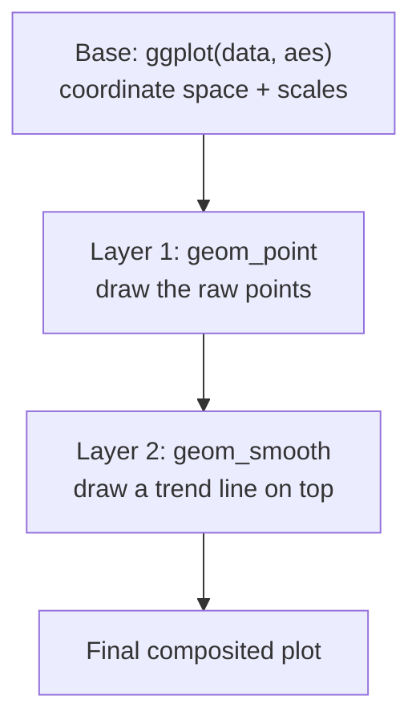

The single most distinctive feature of ggplot2 is the `+`. A plot is
not one monolithic object; it is a **stack of layers**, each drawn on
top of the previous one. Understanding layering is what separates
people who *copy* ggplot code from people who *write* it.

## What a layer is

A layer is, roughly, **one geometry plus the data, mappings, and
statistic it uses**. When you write `+ geom_point()`, you add a layer.
When you add `+ geom_smooth()`, you add another. They render in order,
bottom to top:

The base `ggplot()` call sets up the shared space; each `+ geom_*()`
paints a transparent sheet over it.

## Layers stack in order

Because layers draw in the order you add them, **order can matter**
visually. Watch how the trend line sits behind or in front of the
points depending on order:

<CodeBlock
  adapter="r"
  starterCode={`library(ggplot2)

# Points first, then the line on TOP of them.
ggplot(mpg, aes(displ, hwy)) +
  geom_point() +
  geom_smooth(se = FALSE, color = "red")
`}
/>

<CodeBlock
  adapter="r"
  starterCode={`library(ggplot2)

# Line first, then points on TOP of it.
ggplot(mpg, aes(displ, hwy)) +
  geom_smooth(se = FALSE, color = "red") +
  geom_point()
`}
/>

Same components, different stacking order, different result where they
overlap. The points and line are *independent layers*; you composite
them in whatever order tells your story best.

## Each layer can have its own data and mappings

This is the part that unlocks advanced figures. A layer is not forced
to use the base data. You can highlight a subset by giving **one
layer** a different data frame:

<CodeBlock
  adapter="r"
  starterCode={`library(ggplot2)

# Base layer: all cars in grey. Second layer: only 7+ seat-equivalent
# big engines (displ > 5), redrawn larger and in red, on top.
big <- subset(mpg, displ > 5)

ggplot(mpg, aes(displ, hwy)) +
  geom_point(color = "grey70") +
  geom_point(data = big, color = "red", size = 3)
`}
/>

The first layer drew every car in grey. The second layer used a
*different data frame* (`big`) to redraw just the large-engine cars in
red on top. Two layers, two data sources, one coherent plot. There is
no equivalent of "the chart function" here — you are *composing*.

<Callout type="info" title="Why layering scales so well">
Adding detail to a ggplot is *additive*: you append a layer instead of
rewriting the chart. The base R scatter plot from the first chapter
would need restructuring to highlight a subset. Here you just `+` a
second `geom_point` with its own data. Complexity grows by *addition*,
not *rewriting*.
</Callout>

## Layers are objects you can store and reuse

Because a ggplot is a value, you can build it incrementally in
variables — handy for experimenting:

<CodeBlock
  adapter="r"
  starterCode={`library(ggplot2)

base <- ggplot(mpg, aes(displ, hwy)) # shared base, no layers yet

base + geom_point() # one chart
base + geom_point() + geom_smooth() # a different chart, same base
`}
/>

The `base` object holds the data and mappings; you bolt different
layer stacks onto it without retyping. This is the grammar showing its
compositional nature: plots are *built up*, not declared whole.

<MultipleChoice
  markdown={`In ggplot2, what does adding \`+ geom_smooth()\` after \`+ geom_point()\` do?

- It replaces the points with a smooth line.
  > Adding a layer does not remove earlier layers; both are drawn.
- It throws an error because a plot can only have one geom.
  > A plot can have many layers; that is the entire point of layering.
- [o] It adds a second layer that is drawn on top of the points, so both the points and the trend line appear.
  > Layers composite together in the order added.
- It changes the points into a different color.
  > It draws a new layer; it does not recolor the existing one.

Each \`+ geom_*()\` appends an independent layer; they stack rather than
replace.`}
/>

<MultipleChoice
  markdown={`Why can you give a single \`geom_point()\` layer its own \`data =\` argument that differs from the data in \`ggplot()\`?

- You cannot; all layers must use the same data.
  > Layers may each carry their own data and mappings — a key source of ggplot2's flexibility.
- Because \`data =\` in a geom deletes the base data.
  > It does not delete anything; it simply overrides the data *for that one layer*.
- [o] Because each layer is independent and may override the base data and mappings, letting one layer draw a different subset on top of the rest.
  > Per-layer data is exactly how highlight-a-subset plots are built.
- Because \`geom_point\` is the only geom that allows it.
  > Per-layer data works for any geom, not just points.

Per-layer data and mappings are what let you composite, for example, a
grey "all points" layer with a red "highlighted subset" layer.`}
/>

<MultipleChoice
  markdown={`Two plots use the identical geoms and data but swap the order of \`geom_point()\` and \`geom_smooth()\`. What is the visible difference?

- There is never any difference; order is ignored.
  > Order is not ignored; later layers are drawn over earlier ones.
- The axes flip.
  > Axis orientation is unrelated to layer order.
- [o] Whichever layer is added later is drawn on top, so the points may sit over the line or the line over the points where they overlap.
  > Compositing order determines what covers what in overlapping regions.
- One version will fail to render.
  > Both render fine; they only differ in stacking.

Layer order controls compositing — a small but real design lever for
emphasis and readability.`}
/>

## Key takeaways

- A ggplot is a **stack of layers** composited bottom-to-top with `+`.
- **Layer order matters** where layers overlap — later layers draw on
  top.
- Each layer can carry its **own data and mappings**, enabling
  highlights and overlays that traditional APIs make painful.
- You build plots by **addition**, storing partial plots in variables
  and bolting on layers — complexity grows without rewrites.
