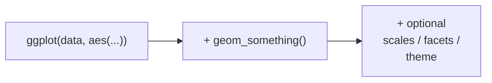

Now we slow down and construct a plot from an empty canvas, watching
each component earn its place. By the end you will be able to *read*
any basic ggplot as an English sentence.

## The skeleton

Almost every ggplot follows the same shape:

Three pieces:

1. `ggplot(data, aes(...))` — name the **data** and the **mappings**.
2. `+ geom_*()` — add at least one **geometry**.
3. `+ ...` — optionally add more components.

## Step 1: an empty plot

What does `ggplot()` with *only* data and mappings produce?

<CodeBlock
  adapter="r"
  starterCode={`library(ggplot2)

ggplot(mpg, aes(x = displ, y = hwy))
`}
/>

Run it. You get **axes but no points**. That is not a bug — it is the
grammar being honest. You told ggplot2 *what the data is* and *what
maps to x and y*, so it drew the coordinate system and scaled the
axes. But you never said *what marks to draw*, so it draws no marks.

<Callout type="info" title="A blank panel is informative">
The empty plot proves that **data + mappings** is a real, separate
stage. The axes already span the right range because the scales were
computed from the data — before any geometry existed.
</Callout>

## Step 2: add a geometry

Give it a geom and the marks appear:

<CodeBlock
  adapter="r"
  starterCode={`library(ggplot2)

ggplot(mpg, aes(x = displ, y = hwy)) +
  geom_point()
`}
/>

Read this aloud as a sentence:

> "Take `mpg`; map engine displacement to x and highway MPG to y; draw
> a **point** for each row."

Every row of `mpg` becomes one dot positioned by its `displ` and `hwy`.
That is the entire chart.

## Step 3: add another mapping

Want color to encode drivetrain? Add one mapping. You do **not** touch
the geometry, the axes, or anything else.

<CodeBlock
  adapter="r"
  starterCode={`library(ggplot2)

ggplot(mpg, aes(x = displ, y = hwy, color = drv)) +
  geom_point()
`}
/>

One new word — `color = drv` — and you get colored points **plus** a
legend, for free. This is the payoff from the intro: mappings produce
their own legends.

## Step 4: add a second geometry

Layers stack. Add a smoother *on top of* the points by adding a second
geom with `+`:

<CodeBlock
  adapter="r"
  starterCode={`library(ggplot2)

ggplot(mpg, aes(x = displ, y = hwy)) +
  geom_point() +
  geom_smooth()
`}
/>

The points and the trend line share the *same* data and the *same*
mappings (declared once in `ggplot()`), but draw different marks. We
will explore this layering idea fully on the next page.

## Two ways to write the same plot

The mappings can live in `ggplot()` (shared by all layers) or inside a
specific geom (used by that layer only). These two are equivalent:

<CodeBlock
  adapter="r"
  starterCode={`library(ggplot2)

# Mapping in ggplot(): shared by every layer.
p1 <- ggplot(mpg, aes(x = displ, y = hwy)) +
  geom_point()

# Mapping in the geom: belongs to that layer only.
p2 <- ggplot(mpg) +
  geom_point(aes(x = displ, y = hwy))

print(p1)
print(p2)
`}
/>

Putting shared mappings in `ggplot()` is the common style, because
most layers want the same x and y. Put a mapping inside a geom when
**only that layer** should use it.

<Callout type="warn" title="Mind the + placement">
The `+` must end the line, not begin the next one. Write
`geom_point() +` then a newline — never a line that *starts* with `+`.
A leading `+` makes R think the previous statement was finished and
throws an error.
</Callout>

<MultipleChoice
  markdown={`Running \`ggplot(mpg, aes(x = displ, y = hwy))\` with no geom produces axes but no points. Why?

- It is an error that happens to render.
  > It renders intentionally — no error occurred.
- The data failed to load.
  > The data loaded fine; the axes were scaled from it.
- [o] Data and mappings define the coordinate space and scales, but *marks* are only drawn by a geometry, which has not been added yet.
  > Without a geom there is nothing to draw, even though the axes are ready.
- ggplot always requires \`color\` to be mapped before drawing.
  > Color is optional; the missing piece is a geometry, not a color mapping.

The blank panel demonstrates that *data + mappings* is a genuine,
separate stage from *drawing marks*.`}
/>

<MultipleChoice
  markdown={`You want a scatter plot where x and y are shared by all layers but a \`geom_point\` layer is colored by \`drv\` and a \`geom_smooth\` layer is **not**. Where should \`color = drv\` go?

- In \`ggplot(aes(...))\`, so every layer shares it.
  > That would color the smoother too, fitting a separate line per drivetrain — not what we asked for.
- Nowhere; you cannot do this in ggplot2.
  > You can, by scoping the mapping to a single layer.
- [o] Inside \`geom_point(aes(color = drv))\`, so only that layer uses the color mapping.
  > Layer-level mappings apply to just that geom, leaving the smoother uncolored.
- In the \`theme()\`.
  > Themes style non-data elements; they cannot map a variable to color.

Shared mappings go in \`ggplot()\`; layer-specific mappings go in that
layer's \`aes()\`. This control is central to building multi-layer plots.`}
/>

## Key takeaways

- The ggplot skeleton is `ggplot(data, aes(...)) + geom_*()`.
- `ggplot()` alone draws axes from the data and mappings — geometries
  draw the actual marks.
- Read a ggplot as a sentence: *take this data, map these columns,
  draw these marks*.
- Mappings in `ggplot()` are shared by all layers; mappings inside a
  geom belong to that layer only.
- The `+` ends a line; it never begins one.
