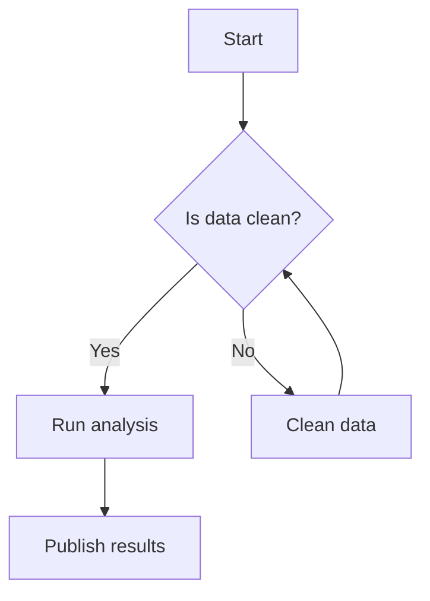
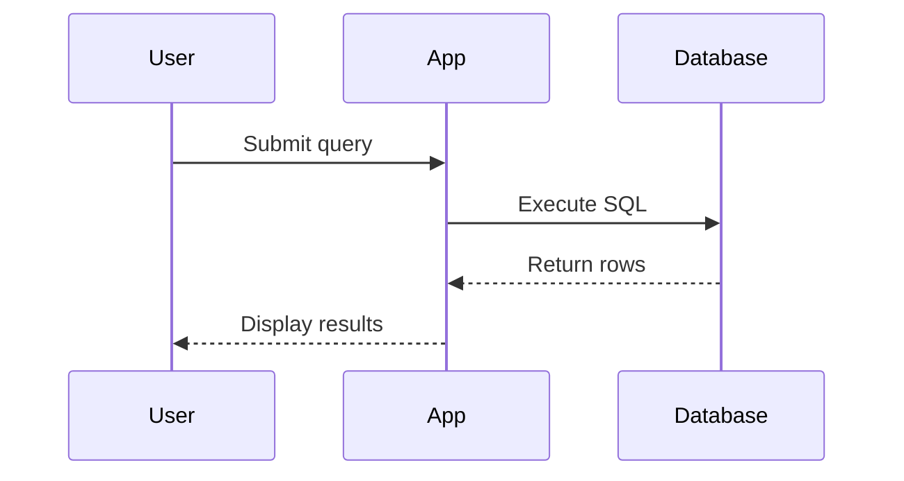
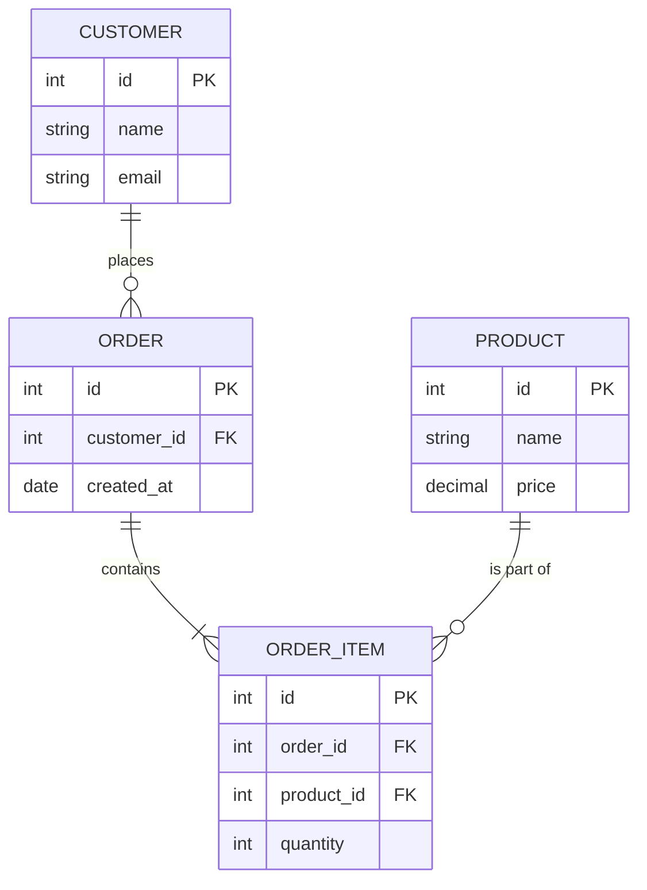
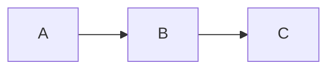

## Overview

You can embed [Mermaid.js](https://mermaid.js.org/) diagrams directly in any learn page using a fenced code block with the `mermaid` language identifier. The diagram is rendered client-side and automatically adapts to the current light/dark theme.

## Flowchart



## Sequence Diagram



## Entity-Relationship Diagram



## How to Add a Diagram

Add a fenced code block with ` ```mermaid ` as the opening fence anywhere in your MDX file:

````md

````
