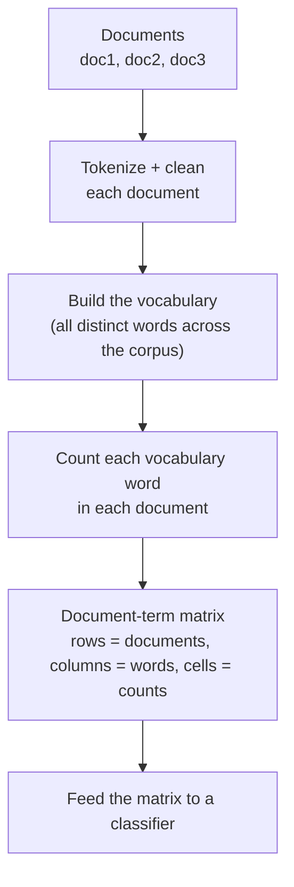

Everything so far has produced *words* — clean tokens, roots, tags, n-grams.
But most algorithms that *use* text, from a spam filter to a clustering
routine, do not consume words. They consume **numbers**. The bridge from a
list of tokens to a row of numbers is called **feature extraction**, and the
oldest, simplest, and still-everywhere technique for it is the **bag-of-words**
model.

The name is the whole idea: take a document, throw all its words into a bag,
and shake it. You keep *which* words appear and *how many times*, but you throw
away the *order*. A document becomes a tally of word counts — and a tally is
just a vector of numbers, which is exactly what an algorithm can work with.

## The feature extraction process

Bag-of-words turns a whole collection of documents into a table of numbers in
a fixed sequence of steps.

The output is a **document-term matrix**: one row per document, one column per
vocabulary word, and each cell holding how many times that word appeared in
that document. Every row is a numeric vector that represents its document, and
that is precisely the form a classifier wants.

## Building it by hand

The model is simple enough to build from scratch with a `Counter`, and doing
so demystifies it completely. Watch a tiny three-document corpus become a
matrix of numbers.

<CodeBlock
  adapter="python"
  initCode={`# ── NLTK setup (read-only) ─────────────────────────────────────────────
# Installs NLTK and loads the tokenizer this page needs. nltk.download()
# isn't available here, so we fetch the archives directly.
import io, os, zipfile
import micropip
await micropip.install("nltk")
import nltk
from pyodide.http import pyfetch

_GH = "https://raw.githubusercontent.com/nltk/nltk_data/gh-pages/packages"
if "/nltk_data" not in nltk.data.path:
    nltk.data.path.insert(0, "/nltk_data")

async def _load_nltk(category, package):
    dest = os.path.join("/nltk_data", category)
    os.makedirs(dest, exist_ok=True)
    if os.path.exists(os.path.join(dest, package)):
        return
    resp = await pyfetch(_GH + "/" + category + "/" + package + ".zip")
    if resp.status != 200:
        raise RuntimeError("Could not download " + category + "/" + package)
    with zipfile.ZipFile(io.BytesIO(await resp.bytes())) as zf:
        zf.extractall(dest)

await _load_nltk("tokenizers", "punkt_tab")
from nltk.tokenize import word_tokenize`}
  initialCode={`from collections import Counter
import pandas as pd

corpus = [
    "the cat sat on the mat",
    "the dog sat on the log",
    "the cat and the dog played",
]

# 1. Tokenize + clean each document into a list of words.
docs = [[t.lower() for t in word_tokenize(d) if t.isalpha()] for d in corpus]

# 2. Build the vocabulary: every distinct word, in sorted order.
vocab = sorted({word for doc in docs for word in doc})
print("Vocabulary:", vocab)

# 3. Count each vocabulary word in each document -> one vector per document.
rows = []
for doc in docs:
    counts = Counter(doc)
    rows.append([counts[word] for word in vocab])

# 4. Assemble the document-term matrix.
dtm = pd.DataFrame(rows, columns=vocab, index=["doc1", "doc2", "doc3"])
display(dtm)
`}
/>

That table *is* the bag-of-words representation. Read doc1's row: "the" appears
twice (a 2 in the "the" column), "cat", "sat", "on", and "mat" once each, and
every other vocabulary word zero times. The sentence has become a row of
integers — and crucially, all three rows have the **same length** (the size of
the vocabulary), so they can be compared, added, and fed to an algorithm
uniformly.

<Callout type="info" title="Why a shared vocabulary matters">
Every document is counted against the *same* vocabulary, so every document
vector has the same dimensions in the same order. That alignment is what lets
an algorithm treat "count of the word 'cat'" as a consistent feature across all
documents. Build the vocabulary once from your whole corpus, then vectorize
each document against it.
</Callout>

## Counts vs. presence (binary bag-of-words)

Sometimes you care only *whether* a word appears, not how often — for short
texts or spam-style signals, presence is enough and is less swayed by length.
That variant is **binary** bag-of-words: each cell is 1 or 0 instead of a
count.

<CodeBlock
  adapter="python"
  initialCode={`from collections import Counter

vocab = ["cheap", "free", "meeting", "report", "winner"]

def count_vector(tokens, vocab):
    counts = Counter(tokens)
    return [counts[w] for w in vocab]

def binary_vector(tokens, vocab):
    present = set(tokens)
    return [1 if w in present else 0 for w in vocab]

spam = "free free free winner cheap".split()

print("vocab:        ", vocab)
print("count vector: ", count_vector(spam, vocab))
print("binary vector:", binary_vector(spam, vocab))
`}
/>

The count vector records that "free" appeared three times (a strong spam
signal); the binary vector just records that it appeared at all. Which is
better depends on the task — another small pipeline choice, in the spirit of
the previous page.

<Callout type="tip" title="In practice you'd reach for a vectorizer">
Building bag-of-words by hand, as we just did, is the right way to *understand*
it. In real projects you would typically use a ready-made vectorizer (such as
scikit-learn's `CountVectorizer`) that does tokenizing, vocabulary-building, and
counting in one step and returns an efficient sparse matrix. The mechanics are
identical to what you just coded — vocabulary, then per-document counts — so you
now know exactly what such a tool produces under the hood.
</Callout>

## The limitations (and what they motivate)

Bag-of-words is powerful for its simplicity, but its simplifications are real
and worth naming, because each one points to a technique you have met or will
meet.

- **It ignores word order.** "dog bites man" and "man bites dog" produce the
  *identical* bag. This is the blind spot **n-grams** patch: adding bigram
  columns ("not good", "machine learning") puts a little order back in.
- **It is sparse and high-dimensional.** A real vocabulary has tens of
  thousands of words, so each document vector is mostly zeros. This costs
  memory and is why real tools use *sparse* matrices, and why stopword removal
  and stemming/lemmatization (which shrink the vocabulary) help here.
- **It has no notion of meaning.** "great" and "excellent" are different
  columns with nothing connecting them; the model has no idea they are
  near-synonyms. Capturing meaning is what **word embeddings** (like Word2Vec)
  were invented for — conceptually, they place similar words near each other in
  a numeric space so "great" and "excellent" are close rather than unrelated.
  That is a topic for later study; bag-of-words remains the right first model
  to understand.

<Callout type="warn" title="Bag-of-words throws away order — on purpose">
The "bag" metaphor is a literal description: order is gone. For many tasks
(topic detection, spam filtering) that loss is acceptable and the simplicity is
worth it. For tasks where order is meaning (sentiment, where "not good" must
not look like "good not"), compensate by adding n-gram features. Knowing *what*
bag-of-words discards tells you exactly when you need to shore it up.
</Callout>

<MultipleChoice
  markdown={`In a bag-of-words representation, what does each **column** of the
document-term matrix correspond to?

- One document in the corpus
- [o] One word in the shared vocabulary, with each cell counting that word's occurrences in a document
  > Rows are documents and columns are vocabulary words; a cell is the count (or presence) of that word in that document. The shared columns make all document vectors comparable.
- One sentence in a document
- One character in the text

Columns are vocabulary words; rows are documents; cells are counts.`}
/>

## Your turn: vectorize a document

<ChallengeCard
  adapter="python"
  title="Turn a document into a bag-of-words vector"
  category="feature extraction · bag-of-words · vectors"
  estimatedTime="~6 min"
  instructions={`Write a function \`bow_vector(tokens, vocab)\` that returns the bag-of-words
**count vector** for one document: a list with the same length as \`vocab\`,
where position \`i\` holds the number of times \`vocab[i]\` appears in \`tokens\`.
Words in \`tokens\` that are not in \`vocab\` are simply ignored.

For example, with \`vocab = ["cat", "dog", "fish"]\` and
\`tokens = ["dog", "cat", "dog", "bird"]\`, the result is \`[1, 2, 0]\` — one
"cat", two "dog", zero "fish", and "bird" ignored.

Tip: \`collections.Counter\` makes this clean (it returns 0 for missing keys).`}
  initCode={`from collections import Counter`}
  initialCode={`def bow_vector(tokens, vocab):
    # return a list of counts aligned to vocab
    return []

print(bow_vector(["dog", "cat", "dog", "bird"], ["cat", "dog", "fish"]))
`}
  solutionCode={`def bow_vector(tokens, vocab):
    counts = Counter(tokens)
    return [counts[w] for w in vocab]

print(bow_vector(["dog", "cat", "dog", "bird"], ["cat", "dog", "fish"]))
`}
  tests={[
    {
      id: "basic_counts",
      name: "Counts vocabulary words correctly",
      description: "['dog','cat','dog','bird'] over ['cat','dog','fish'] -> [1,2,0]",
      code: `out = bow_vector(["dog", "cat", "dog", "bird"], ["cat", "dog", "fish"])
assert out == [1, 2, 0], "Got: " + repr(out)`,
    },
    {
      id: "length_matches_vocab",
      name: "Vector length equals vocabulary size",
      description: "One entry per vocabulary word",
      code: `vocab = ["a", "b", "c", "d", "e"]
out = bow_vector(["a", "a", "c"], vocab)
assert len(out) == len(vocab), "Expected length " + str(len(vocab)) + "; got " + str(len(out))`,
    },
    {
      id: "ignores_oov",
      name: "Ignores words not in the vocabulary",
      description: "Out-of-vocabulary words contribute nothing",
      code: `out = bow_vector(["x", "y", "z"], ["cat", "dog"])
assert out == [0, 0], "Out-of-vocab words should be ignored; got " + repr(out)`,
    },
    {
      id: "empty_doc",
      name: "Empty document is all zeros",
      description: "No tokens -> a zero vector of the right length",
      code: `out = bow_vector([], ["cat", "dog", "fish"])
assert out == [0, 0, 0], "Got: " + repr(out)`,
    },
  ]}
/>

## Check your understanding

<MultipleChoice
  markdown={`Why do we convert text to a bag-of-words vector at all?

- Because vectors take less disk space than text
- [o] Because most algorithms operate on numbers, not words, so each document must be turned into a fixed-length numeric vector before it can be fed to them
  > Feature extraction bridges words and math. A bag-of-words vector gives every document the same numeric shape (one entry per vocabulary word), which is exactly what classifiers and clustering algorithms require.
- Because it makes the text easier for humans to read
- Because it translates the document into another language

The point is to produce numeric features an algorithm can consume.`}
/>

<MultipleChoice
  markdown={`"dog bites man" and "man bites dog" produce the *same* bag-of-words vector.
What does this reveal, and how is it commonly addressed?

- It is a bug in the counting code
- [o] Bag-of-words discards word order, so different orderings of the same words collapse together; adding n-gram (e.g., bigram) features puts some local order back
  > The bag keeps counts but not order, so both sentences have identical word tallies. When order matters, bigram/trigram features ("bites man" vs "bites dog") restore enough of it to distinguish them.
- It means the two sentences have different vocabularies
- It proves bag-of-words cannot be used for any real task

Order-loss is inherent to the bag; n-grams are the standard remedy.`}
/>

<MultipleChoice
  markdown={`How does **binary** bag-of-words differ from **count** bag-of-words?

- Binary uses words; count uses numbers
- [o] Binary records only whether each word is present (1 or 0); count records how many times it appears
  > Both share the same vocabulary-aligned vector shape. Binary collapses any nonzero count to 1, which can be more robust to document length, while counts preserve frequency information that may itself be a useful signal.
- Binary is always more accurate than count
- They produce vectors of different lengths

Presence (1/0) versus frequency (counts) is the only difference, and which is better depends on the task.`}
/>

<MultipleChoice
  markdown={`Bag-of-words gives "great" and "excellent" entirely separate columns with no
connection between them. What limitation is this, and what technique is aimed
at it?

- A sparsity problem, fixed by stopword removal
- [o] It captures no *meaning*/similarity between words; word embeddings (e.g., Word2Vec) address it by placing similar words close together in a numeric space
  > Bag-of-words treats every word as an independent dimension, so synonyms are unrelated. Embeddings encode semantic similarity numerically, so related words end up near each other — a more advanced topic, but the conceptual fix for this exact limitation.
- A word-order problem, fixed by n-grams
- There is no limitation here

Bag-of-words has no semantics; embeddings are the conceptual answer to that gap.`}
/>

You can now turn documents into numeric features. In the final page we put the
*entire* course together — preprocessing choices, features, and a touch of
n-gram thinking — to build a small but complete **rule-based sentiment
classifier** from scratch, and watch every earlier lesson pay off.
