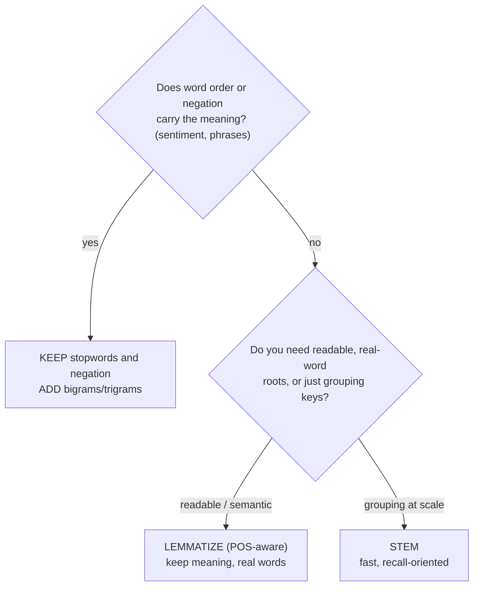
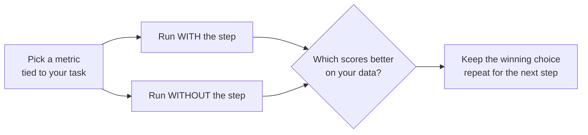

If you remember one page from this course, make it this one. Every previous
page taught a *technique*. This page teaches the *judgment* to combine those
techniques well — and that judgment, far more than knowing the function names,
is what separates someone who can run NLTK from someone who can build a text
system that works.

The central truth is uncomfortable for beginners who want a recipe: **there is
no universal "correct" pipeline.** Lowercasing, stopword removal, stemming,
lemmatization, n-grams — each is a *choice*, and a step that sharpens one task
will quietly sabotage another. Choosing well means understanding what each
step does to your data and matching it to what your task needs.

## The pipeline is a menu, not a fixed recipe

Picture the steps as a menu of optional transformations. Only tokenization is
nearly mandatory; everything after it is a decision.

You almost always **tokenize** first. After that, every step is a question
with no default answer:

- Lowercase?
- Remove stopwords?
- Stem or lemmatize?
- Add n-grams?

Answer all four and you arrive at **analysis**. To answer each one, apply a
single guiding principle.

<Callout type="info" title="The one question to ask at every step">
For each optional step, ask: **"Does the information this step changes or
destroys matter to my task?"** Lowercasing destroys capitalization — does your
task need it (names, acronyms)? Stopword removal destroys function words —
does your task need them (negation, phrases, author style)? If the destroyed
information is noise for your task, apply the step. If it is signal, skip it.
That single question resolves most pipeline decisions.
</Callout>

## A decision framework

Two of the highest-stakes choices can be captured in a small decision tree.

This does not cover every case, but it captures the two decisions people get
wrong most often: stripping negation before sentiment, and reaching for
stemming when meaning matters.

## Task by task

The clearest way to internalize "it depends" is to walk through real tasks and
see the *opposite* choices they demand.

**Search indexing.** You want a query for "running" to match "ran" and "runs".
Lowercase (case is noise for matching), remove stopwords (they bloat the index
and rarely help relevance), and **stem** (fast, and a stem is only ever
compared to other stems). Readability does not matter — no human sees the
index.

**Topic analysis / keyword extraction.** You want the content words that say
what a document is about. Lowercase, remove stopwords (they drown out content),
and **lemmatize** so the keywords you surface are real words a person can read.

**Sentiment analysis.** Now the calculus flips. **Do not** strip stopwords
naively — negations ("not", "no", "nor") and contrasts ("but") live there and
reverse meaning. Lowercasing is usually fine but ALL-CAPS can be a signal worth
keeping. Punctuation like "!" can carry intensity. And **bigrams help a lot**,
because "not good" must survive as a unit. The aggressive cleaning that helps
topic analysis is exactly wrong here.

**Authorship attribution.** The most counterintuitive case. Here the
**stopwords are the signal** — an author's unconscious rate of "the", "of",
"that" is a fingerprint — and the content words are noise. So you *keep*
stopwords and often discard content words: the inverse of every other task.

**Named-entity recognition.** Capitalization is the main clue that "Apple" is a
company. **Do not lowercase**, do not strip stopwords (they delimit entities),
and tag parts of speech *before* any normalization.

Here is the same advice as a table. Read across each row and notice that no two
columns agree.

| Task | Lowercase? | Remove stopwords? | Stem / Lemmatize? | N-grams? |
| --- | --- | --- | --- | --- |
| Search indexing | yes | yes | stem | sometimes |
| Topic / keywords | yes | yes | lemmatize | sometimes |
| Sentiment analysis | careful | **no** (keep negation) | light, if any | **bigrams help** |
| Authorship attribution | no | **no** (it's the signal) | no | sometimes |
| Named-entity recognition | **no** | no | no | n/a |

The cells disagree everywhere. That disagreement *is* the lesson: preprocessing
must be designed for the task, not applied by reflex.

## Seeing it: one text, two pipelines

Let us run a single sentence through a "topic" pipeline and a "sentiment"
pipeline and watch them produce deliberately different results.

<CodeBlock
  adapter="python"
  files={[
    {
      filename: "main.py",
      initCode: `# ── NLTK setup (read-only) ─────────────────────────────────────────────
# Installs NLTK and loads the tokenizer and stopwords this page needs.
# nltk.download() isn't available here, so we fetch the archives directly.
import io, os, zipfile
import micropip
await micropip.install("nltk")
import nltk
from pyodide.http import pyfetch

_GH = "https://raw.githubusercontent.com/nltk/nltk_data/gh-pages/packages"
if "/nltk_data" not in nltk.data.path:
    nltk.data.path.insert(0, "/nltk_data")

async def _load_nltk(category, package):
    dest = os.path.join("/nltk_data", category)
    os.makedirs(dest, exist_ok=True)
    if os.path.exists(os.path.join(dest, package)):
        return
    resp = await pyfetch(_GH + "/" + category + "/" + package + ".zip")
    if resp.status != 200:
        raise RuntimeError("Could not download " + category + "/" + package)
    with zipfile.ZipFile(io.BytesIO(await resp.bytes())) as zf:
        zf.extractall(dest)

await _load_nltk("tokenizers", "punkt_tab")
await _load_nltk("corpora", "stopwords")
from nltk.tokenize import word_tokenize
from nltk.corpus import stopwords
from nltk.util import ngrams`,
      starterCode: `review = "The plot was not good, but the acting was brilliant!"
stop = set(stopwords.words("english"))

# TOPIC pipeline: lowercase, drop punctuation, drop ALL stopwords.
topic = [t.lower() for t in word_tokenize(review) if t.isalpha()]
topic = [t for t in topic if t not in stop]
print("TOPIC features (what is it about?):")
print("  ", topic)

# SENTIMENT pipeline: lowercase, drop punctuation, KEEP negation/contrast,
# and add bigrams so 'not good' survives as a unit.
keep = {"not", "no", "nor", "never", "but"}
sent_stop = stop - keep
sent = [t.lower() for t in word_tokenize(review) if t.isalpha()]
sent = [t for t in sent if t not in sent_stop]
sent_bigrams = list(ngrams(sent, 2))
print("SENTIMENT features (how does it feel?):")
print("  unigrams:", sent)
print("  bigrams: ", sent_bigrams)
`,
    },
  ]}
/>

Look at the difference. The topic pipeline threw away "not" and "but" — fine,
because for "what is this review about?" the answer is "plot, acting". But the
sentiment pipeline *kept* them and added the bigram `("not", "good")`, because
for "how does the reviewer feel?" those words are everything. Same input,
deliberately different preprocessing, because the tasks need different
information preserved.

<Callout type="danger" title="The cardinal sin: copy-pasting someone else's pipeline">
The most common real-world NLP mistake is lifting a preprocessing snippet from
a blog post — usually "lowercase, remove stopwords, stem" — and applying it to
a task it was never meant for. That exact recipe is great for search and
disastrous for sentiment. Always re-derive the pipeline from *your* task, even
if the code looks boilerplate.
</Callout>

## How to actually decide: evaluate, do not guess

The framework above gets you a strong starting point, but the honest answer to
"should I remove stopwords here?" is often **try it both ways and measure on
your task.** This is called an **ablation**: hold everything else fixed, toggle
one step, and compare results on a metric you care about.

The key discipline is to change **one step at a time** so you can attribute any
change in the result to that step. If you flip three options at once and the
score moves, you have learned nothing about which one mattered. Disciplined,
one-at-a-time evaluation turns pipeline design from superstition into
engineering.

<Callout type="tip" title="Defaults are a starting point, not an answer">
Reasonable defaults for an unknown task: tokenize, lowercase, and *keep*
stopwords until you have a reason to drop them (dropping is the riskier,
information-destroying move). Then evaluate each additional step against your
metric. Starting conservative and adding aggression only when it earns its keep
is safer than starting aggressive and hoping.
</Callout>

<MultipleChoice
  markdown={`What is the single most useful question to ask when deciding whether to apply
a preprocessing step?

- "Is this step in the most popular tutorial?"
  > Popularity of a tutorial has nothing to do with whether a step suits your data or task; copying pipelines blindly is the cardinal sin this page warns against.
- [o] "Does the information this step adds or destroys matter to my specific task?"
  > Every step changes the data — lowercasing destroys case, stopword removal destroys function words. The decision reduces to whether that changed information is noise or signal *for your task*. That question resolves most pipeline choices.
- "Is this step the fastest to run?"
  > Speed is a secondary concern; a fast step that destroys signal you need is worse than a slower step that preserves it.
- "Does this step reduce the number of tokens?"
  > Reducing token count is a side effect, not a goal — some reductions help (stopword removal for topics) and some hurt (removing negations for sentiment).

Match the step to whether the affected information is signal or noise for your task.`}
/>

## Your turn: a configurable, task-aware step

The cleanest way to respect "it depends" in code is to make a step
*configurable* and choose the setting per task. Implement a preprocessing
function whose stopword removal can be turned off — so the *same* function
serves both a topic pipeline (remove stopwords) and a sentiment pipeline (keep
them).

<ChallengeCard
  adapter="python"
  title="A pipeline with a task-aware switch"
  category="pipeline design · trade-offs · configuration"
  estimatedTime="~7 min"
  instructions={`Write \`preprocess(text, remove_stopwords)\` that:

1. Word-tokenizes \`text\`.
2. Lowercases each token and keeps only alphabetic tokens.
3. **If** \`remove_stopwords\` is \`True\`, also removes English stopwords;
   if it is \`False\`, leaves all words in.

This single switch lets the same function serve a topic pipeline
(\`remove_stopwords=True\`) and a sentiment pipeline
(\`remove_stopwords=False\`, so negations survive).

Examples:

- \`preprocess("This is NOT good", True)\` -> \`["good"]\`
- \`preprocess("This is NOT good", False)\` -> \`["this", "is", "not", "good"]\``}
  files={[
    {
      filename: "main.py",
      initCode: `# ── NLTK setup (read-only) ─────────────────────────────────────────────
import io, os, zipfile
import micropip
await micropip.install("nltk")
import nltk
from pyodide.http import pyfetch

_GH = "https://raw.githubusercontent.com/nltk/nltk_data/gh-pages/packages"
if "/nltk_data" not in nltk.data.path:
    nltk.data.path.insert(0, "/nltk_data")

async def _load_nltk(category, package):
    dest = os.path.join("/nltk_data", category)
    os.makedirs(dest, exist_ok=True)
    if os.path.exists(os.path.join(dest, package)):
        return
    resp = await pyfetch(_GH + "/" + category + "/" + package + ".zip")
    if resp.status != 200:
        raise RuntimeError("Could not download " + category + "/" + package)
    with zipfile.ZipFile(io.BytesIO(await resp.bytes())) as zf:
        zf.extractall(dest)

await _load_nltk("tokenizers", "punkt_tab")
await _load_nltk("corpora", "stopwords")
from nltk.tokenize import word_tokenize
from nltk.corpus import stopwords
stop = set(stopwords.words("english"))`,
      starterCode: `def preprocess(text, remove_stopwords):
    tokens = word_tokenize(text)
    # lowercase + keep alphabetic
    # then conditionally remove stopwords
    return tokens

print("topic    :", preprocess("This is NOT good", True))
print("sentiment:", preprocess("This is NOT good", False))
`,
      solutionCode: `def preprocess(text, remove_stopwords):
    tokens = [t.lower() for t in word_tokenize(text) if t.isalpha()]
    if remove_stopwords:
        tokens = [t for t in tokens if t not in stop]
    return tokens

print("topic    :", preprocess("This is NOT good", True))
print("sentiment:", preprocess("This is NOT good", False))
`,
    },
  ]}
  tests={[
    {
      id: "remove_true",
      name: "remove_stopwords=True drops stopwords",
      description: "'This is NOT good' -> ['good']",
      code: `out = preprocess("This is NOT good", True)
assert out == ["good"], "Got: " + repr(out)`,
    },
    {
      id: "remove_false_keeps_negation",
      name: "remove_stopwords=False keeps negation",
      description: "'This is NOT good' -> ['this','is','not','good']",
      code: `out = preprocess("This is NOT good", False)
assert out == ["this", "is", "not", "good"], "Got: " + repr(out)`,
    },
    {
      id: "lowercased",
      name: "Always lowercases and drops punctuation",
      description: "Both modes lowercase and remove punctuation",
      code: `out = preprocess("WOW, Amazing!", False)
assert out == ["wow", "amazing"], "Got: " + repr(out)`,
    },
    {
      id: "returns_list",
      name: "Returns a list in both modes",
      description: "preprocess returns a list",
      code: `assert isinstance(preprocess("hello world", True), list)
assert isinstance(preprocess("hello world", False), list)`,
    },
  ]}
/>

## Check your understanding

<MultipleChoice
  markdown={`Why is the "standard" recipe *lowercase → remove stopwords → stem* a poor
default for **sentiment analysis**?

- It is too slow for product reviews
  > Speed is not the issue; the problem is that the recipe destroys linguistic information sentiment analysis depends on, regardless of the size of the dataset.
- [o] Stopword removal deletes negations like "not", and stemming/over-cleaning erodes the phrase-level cues sentiment depends on, so a negative review can look positive
  > Sentiment lives in negation, contrast, and short phrases — exactly what that recipe destroys. The recipe suits search/topic tasks; for sentiment, keep negation and prefer bigrams over aggressive cleaning.
- Stemming is not available in NLTK
  > Stemming is fully available in NLTK via \`PorterStemmer\` and others; this choice is factually wrong and unrelated to why the recipe fails for sentiment.
- Lowercasing is never allowed
  > Lowercasing is generally fine for sentiment; the real problem is stopword removal stripping negations and aggressive cleaning eroding phrase-level signals.

The classic recipe optimizes for the wrong information when the task is sentiment.`}
/>

<MultipleChoice
  markdown={`For **authorship attribution** (deciding who wrote an anonymous text), how
should you treat stopwords, and why?

- Remove them, because they never carry useful information
  > Stopwords carry no content for topic analysis, but for authorship attribution they are the primary signal — an author's unconscious usage rates of function words is a fingerprint that is hard to fake.
- [o] Keep them — an author's habitual use of function words ("the", "of", "that") is a distinctive fingerprint, so here the stopwords are the signal and content words are closer to noise
  > Authorship attribution famously relies on stopword usage patterns, which are stable and hard to fake. This is the inverse of topic analysis, and a vivid example of why pipeline choices are task-specific.
- Replace each stopword with a random word
  > Replacing stopwords with random words destroys both content and the stylistic signal that makes authorship attribution work; it is not a recognized NLP technique.
- Lowercase them but keep everything else uppercase
  > Selectively lowercasing stopwords while uppercasing other words is not meaningful for authorship attribution, and the question is about whether to keep or remove stopwords, not about casing them.

What is noise for one task can be the entire signal for another.`}
/>

<MultipleChoice
  markdown={`You want to know empirically whether removing stopwords helps your classifier.
What is the disciplined way to find out?

- Flip stopword removal, lemmatization, and n-grams all at once and see if the score changes
  > Changing multiple steps simultaneously makes it impossible to know which change caused any improvement or degradation; the ablation principle requires isolating one variable at a time.
- [o] Run an ablation: hold everything else fixed, toggle *only* stopword removal, and compare your task metric with vs. without — so any change is attributable to that one step
  > Changing one step at a time (an ablation) isolates its effect. If you change several options simultaneously and the score moves, you cannot tell which step caused it. One-at-a-time evaluation turns guessing into measurement.
- Ask which option is most popular online and use that
  > Popularity online reflects common use cases, not your specific task; what works for someone else's data may not work for yours.
- Always remove stopwords; measuring is unnecessary
  > Stopword removal is a choice, not a universal rule — it helps for topic analysis but can hurt sentiment or authorship attribution, so measuring on your own task is the only reliable guide.

Isolating one variable at a time is how you actually learn what helps.`}
/>

<MultipleChoice
  markdown={`A reasonable *conservative default* for a brand-new task you do not yet
understand is to:

- Apply every preprocessing step as aggressively as possible
  > Aggressive preprocessing is the risky direction — it destroys information, and once destroyed it cannot be recovered; starting conservative and adding steps only when they help is safer.
- [o] Tokenize, lowercase, and keep stopwords (avoid the information-destroying steps) until evaluation shows a step earns its place
  > Removing information is the risky, irreversible move. Starting conservative — minimal destruction — and adding steps only when they measurably help is safer than starting aggressive and hoping nothing important was thrown away.
- Skip tokenization to save time
  > Tokenization is the step that creates the units everything else operates on; skipping it leaves a single raw string that cannot be lowercased, filtered, or counted word by word.
- Remove all words and keep only punctuation
  > Keeping only punctuation would discard all lexical content; punctuation alone carries no semantic meaning useful for most NLP tasks.

Start by destroying as little as possible, then add aggression only when it proves its worth.`}
/>

<MultipleChoice
  markdown={`Which statement is the truest summary of preprocessing design?

- There is one correct pipeline that works for every NLP task
  > No universal pipeline exists — the same steps that help topic analysis (removing stopwords, stemming) actively hurt sentiment analysis and authorship attribution.
- [o] The right pipeline depends on the downstream task; each step trades information away or adds it, and good design matches those trades to what the task needs
  > "It depends on the task" is not a cop-out — it is the core skill. Each step is a deliberate trade, and matching trades to task requirements is what designing a pipeline *means*.
- Preprocessing never affects results, so any pipeline is fine
  > Preprocessing has significant effects — the same text processed differently can produce completely different classification results, as the sentiment vs. topic example demonstrates.
- More preprocessing always produces better results
  > More preprocessing destroys more information; for tasks that need that information (negation for sentiment, function words for authorship, capitalization for entities), more is strictly worse.

No universal recipe exists; deliberate, task-driven choices do.`}
/>

You now know how to *choose* your steps. The last two pages turn clean tokens
into something a model can consume — first by converting text into numeric
**features** (bag-of-words), then by assembling everything into a working
**rule-based sentiment classifier.**
