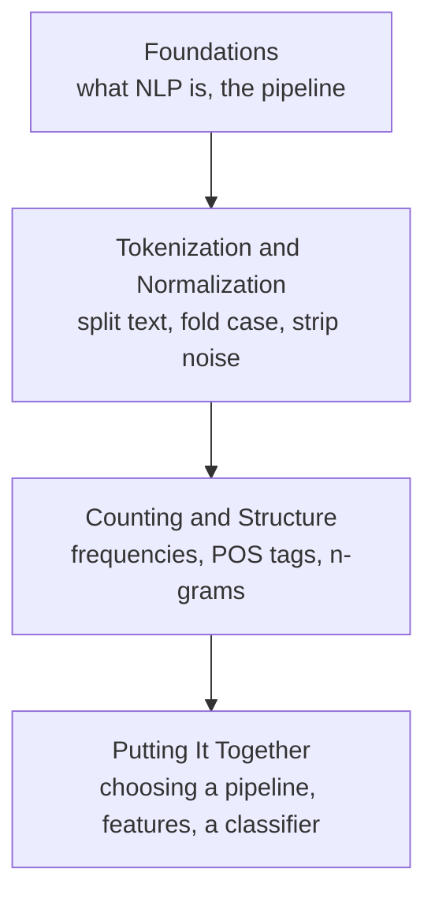

Welcome to **Natural Language Processing with Python**. This course is for
the person who can already write Python — strings, lists, loops,
dictionaries, a comprehension or two, maybe a regular expression — and who
keeps hearing the phrase "natural language processing" and wants to
understand what it *actually is*, not just which function to call.

Human language is gloriously messy. The word "lead" can be a metal or a
verb. "New York" is two words but one thing. "don't" hides the word "not"
inside a contraction. A period sometimes ends a sentence and sometimes ends
"Dr." Computers are superb at exact, regular data and hopeless at the
ambiguous, irregular, context-soaked data that is ordinary text. NLP is the
collection of techniques we use to bridge that gap — to turn a paragraph a
human wrote into something a program can count, compare, and reason about.

This is not an API reference. You can always look up the arguments to
`word_tokenize`. What you cannot google in the moment is **judgment**:
whether you should lowercase your text, whether removing stopwords will help
or quietly destroy your meaning, whether stemming is good enough or you need
lemmatization. That judgment is the real subject of this course.

<Callout type="info" title="No setup required">
Every code block on every page runs a full Python environment right here, in
this page. There is nothing to install — no Python, no NLTK, no data
packages. Edit the code, press **Run**, and the output appears beneath the
editor. The challenge cards work the same way: write a solution, press
**Check Answer**, and see which tests pass. Each interactive block quietly
loads the NLTK data it needs in a collapsed, read-only setup section so you
can focus entirely on the NLP code.
</Callout>

## Who this course is for

You will feel at home here if most of these describe you:

- You are comfortable writing Python: functions, loops, lists, dictionaries,
  list comprehensions.
- You know basic string methods: `strip`, `split`, `lower`, `replace`.
- You have seen the `re` module and understand what a regular expression is,
  even if you reach for a cheat sheet.

You do **not** need:

- Any prior NLP or linguistics background.
- Any machine learning experience.
- Statistics or heavy mathematics.

<Callout type="warn" title="This is a foundations course, on purpose">
We focus on the classic, transparent toolkit of NLP — tokenization,
normalization, stopwords, stemming, lemmatization, frequency analysis,
part-of-speech tagging, and n-grams — all through **NLTK**, the Natural
Language Toolkit. We deliberately **do not** cover deep learning,
transformers, BERT, GPT, attention, or word embeddings beyond the occasional
concept. Those are wonderful topics, but they make far more sense once the
fundamentals below are second nature. Master how text actually flows through
a pipeline first, and the modern tools become much easier to learn.
</Callout>

## What you will be able to do

By the end you will be able to:

- Explain *why* raw text is hard for computers, in terms of ambiguity and
  structure.
- Break text into sentences and words correctly — and explain why
  `text.split()` is not tokenization.
- Normalize text (case folding, punctuation stripping) and reason about what
  that normalization throws away.
- Decide *whether* to remove stopwords — and recognize the tasks where
  removing them is a serious mistake.
- Choose between **stemming** and **lemmatization** and justify the choice.
- Measure a text with frequency distributions and lexical diversity.
- Tag words with their part of speech and use those tags downstream.
- Capture local word order with **bigrams** and **trigrams**.
- Turn documents into features (bag-of-words) and build a small, transparent
  **rule-based sentiment classifier** from scratch.

## How the course is organized

Notice that **tokenization and normalization** come first and everything
else builds on them. That ordering is intentional. Almost every mistake in a
text pipeline is really a tokenization or normalization mistake that
propagated downstream. We establish those habits early and return to them on
nearly every page.

## A taste of what is coming

Here is a complete, classic NLP pipeline. It takes a short paragraph and runs
it through the whole journey of this course: split into words, normalize,
drop stopwords, reduce to dictionary roots, and count what is left. Press
**Run** — and then open the collapsed setup section above the editor if you
are curious what is being loaded for you.

<CodeBlock
  adapter="python"
  initCode={`# ── NLTK setup (read-only) ─────────────────────────────────────────────
# Installs NLTK and loads just the data this page needs. nltk.download()
# isn't available in this environment, so we fetch the data archives
# directly and unpack them into NLTK's data directory.
import io, os, zipfile
import micropip
await micropip.install("nltk")
import nltk
from pyodide.http import pyfetch

_GH = "https://raw.githubusercontent.com/nltk/nltk_data/gh-pages/packages"
if "/nltk_data" not in nltk.data.path:
    nltk.data.path.insert(0, "/nltk_data")

async def _load_nltk(category, package):
    dest = os.path.join("/nltk_data", category)
    os.makedirs(dest, exist_ok=True)
    if os.path.exists(os.path.join(dest, package)):
        return
    resp = await pyfetch(_GH + "/" + category + "/" + package + ".zip")
    if resp.status != 200:
        raise RuntimeError("Could not download " + category + "/" + package)
    with zipfile.ZipFile(io.BytesIO(await resp.bytes())) as zf:
        zf.extractall(dest)

await _load_nltk("tokenizers", "punkt_tab")
await _load_nltk("corpora", "stopwords")
await _load_nltk("corpora", "wordnet")
from nltk.tokenize import word_tokenize
from nltk.corpus import stopwords
from nltk.stem import WordNetLemmatizer`}
  starterCode={`text = (
    "Natural language processing lets computers work with human language. "
    "It powers the search bars, spam filters, and assistants you use daily."
)

# 1. TOKENIZE: split the text into individual words and punctuation.
tokens = word_tokenize(text)

# 2. NORMALIZE: lowercase, and keep only alphabetic tokens (drop punctuation).
words = [t.lower() for t in tokens if t.isalpha()]

# 3. REMOVE STOPWORDS: drop ultra-common words that carry little meaning.
stop = set(stopwords.words("english"))
content = [w for w in words if w not in stop]

# 4. LEMMATIZE: reduce words to their dictionary form.
lemmatizer = WordNetLemmatizer()
lemmas = [lemmatizer.lemmatize(w) for w in content]

print("Tokens:  ", tokens)
print("Content: ", content)
print("Lemmas:  ", lemmas)
`}
/>

Five short steps, and a result a program can actually work with. You do not
yet need to understand every line — that is what the next pages are for. But
notice the *shape* already: **tokenize, normalize, filter, reduce, count.**
That shape barely changes from project to project. Every technique in this
course is a way to do one of those steps better, or a reason to skip one of
them on purpose.

## How the interactive widgets work

You will meet three kinds of widget:

1. **Executable code blocks** — like the one above. Edit and re-run them as
   much as you like; experimentation is the entire point.
2. **Challenge cards** — small problems with hidden tests. You write the
   solution and press **Check Answer** to see which tests pass.
3. **Multiple-choice questions** — quick conceptual checks with an
   explanation for *every* option, right or wrong.

<Callout type="info" title="Each code block starts fresh">
Variables you define in one code block are **not** carried into the next one,
even on the same page. When a block needs setup from an earlier one, we
either repeat it or provide it for you in the read-only setup section. This
keeps every example self-contained and re-runnable in any order. The first
run on a page does a little loading; after that, runs are quick.
</Callout>

## A note on philosophy

Most NLP tutorials are a parade of function calls: tokenize, stem, remove
stopwords, admire the output, move on. You finish with a vocabulary but no
understanding, and the first time your results look strange you have no idea
why.

We take the slower, more durable path. For every step in the pipeline we ask
the same questions: **What ambiguity or structural problem does this solve?
Why does it exist? When should you reach for it — and when should you
absolutely not? What do people get wrong about it? Where does it show up in
the real world?** Tools only make sense once you understand the job they
were built for.

<Callout type="tip" title="How to use this course">
Run every code block. Then change something — the input text, a rule, the
order of two steps — and predict what will happen before you press **Run**
again. The gap between what you expected and what you got is exactly where
the learning happens.
</Callout>

Let us start at the very beginning: what makes human text so hard for a
computer in the first place?
