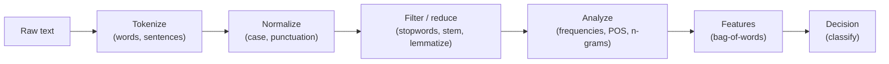

You started this course with a flat string of characters and the vague sense
that human language is "hard for computers." You are finishing it able to walk
any paragraph through a complete, deliberate pipeline — and, more importantly,
able to *explain every choice along the way.* That is real, durable
understanding, and it is the part of NLP that does not go out of date.

## What you can now do

Look back at the journey. Each stage is something you can now reason about, not
just run.

Concretely, you can now:

- Explain **why** raw text is hard — ambiguity and missing structure — and what
  a pipeline is for.
- **Tokenize** into words and sentences, and articulate why `.split()` is not
  tokenization.
- **Normalize** with case folding and punctuation stripping, while naming what
  each step throws away.
- Decide **whether** to remove stopwords — and recognize the negation trap that
  makes it dangerous for sentiment.
- Choose between **stemming** and **lemmatization**, and lemmatize accurately
  using POS tags.
- Measure text with **frequency distributions** and **lexical diversity**.
- Capture local order with **bigrams and trigrams**, and explain the sparsity
  trade-off.
- Turn documents into **bag-of-words features**.
- Assemble all of it into a working, explainable **sentiment classifier**.

<Callout type="success" title="The most important takeaway">
It is not any single function — it is the judgment to *design a pipeline for a
task*. You learned that there is no universal recipe, that every step trades
information away or adds it, and that matching those trades to the job is the
real skill. That judgment transfers to every NLP tool you will ever use.
</Callout>

## From rules to learning: machine-learning text classification

Your rule-based sentiment classifier used a hand-written lexicon. The natural
next step is to let a model **learn** word sentiment (and much more) from
labeled examples. The classic recipe is wonderfully close to what you already
know: take your **bag-of-words** (or TF-IDF-weighted) features and feed them to
a simple classifier like Naive Bayes or logistic regression.

- **TF-IDF** is the upgrade to raw counts we flagged on the frequencies page:
  it down-weights words that are common across *all* documents and up-weights
  the distinctive ones, so "the" stops dominating and topical words shine.
- **Naive Bayes** and **logistic regression** are the workhorse text
  classifiers — fast, strong baselines that consume exactly the kind of feature
  vectors you built by hand.

If you want to take this step, the [Machine Learning with
scikit-learn](/learn/machine-learning-scikit-learn) course picks up right here,
with train/test discipline, model evaluation, and the reasoning behind each
algorithm. Everything you learned about preprocessing feeds directly into it.

<Callout type="info" title="Your foundations do not disappear">
Every modern approach — TF-IDF models, spaCy pipelines, even giant
transformers — still **tokenizes and normalizes text** as a first step. The
specifics differ (transformers use subword tokenization, for instance), but the
*concepts* are the ones you just learned. You are not starting over; you are
adding floors to a foundation you already poured.
</Callout>

## Modern toolkits and topics to explore

When you are ready to broaden out, here is the lay of the land — and how it
connects back to what you know.

- **spaCy** — a fast, production-oriented library that does tokenization, POS
  tagging, lemmatization, and named-entity recognition out of the box. It makes
  different speed/accuracy trade-offs than NLTK, but every concept maps onto a
  page from this course.
- **Named-entity recognition (NER)** — pulling people, places, and
  organizations out of text. It builds directly on POS tagging and the
  capitalization signal you learned not to throw away.
- **Topic modeling (e.g., LDA)** — discovering the themes that run through a
  collection of documents, built on the bag-of-words representation you now
  understand.
- **Word embeddings (Word2Vec, GloVe)** — the conceptual fix for bag-of-words'
  blindness to meaning: they place similar words near each other in a numeric
  space, so "great" and "excellent" are close rather than unrelated.
- **Transformers (BERT, GPT)** — the deep-learning models behind modern
  assistants and translators. They are powerful and complex, and they make far
  more sense *after* you understand tokens, normalization, and why text needs
  structure — which is exactly what you now have.

<Callout type="tip" title="A piece of advice as you go further">
Resist the urge to jump straight to the most powerful model. The discipline you
practiced here — *ask what the task needs, choose steps deliberately, evaluate
one change at a time, prefer the simplest thing that works* — matters even more
as the tools get more powerful and more opaque. A transparent baseline you
understand beats a black box you do not.
</Callout>

## Keep practicing

The fastest way to cement these skills is to use them on text you care about.
Grab a few product reviews, a chunk of an article, your own writing — and run it
through the pipeline. Tokenize it. Look at its frequency distribution. Tag its
parts of speech. Pull out its bigrams. Score its sentiment with the classifier
you built. Then change a preprocessing choice and watch what happens.

If you want adjacent foundations, these Dataslope courses pair naturally with
this one:

- [Machine Learning with scikit-learn](/learn/machine-learning-scikit-learn) —
  the natural next step: learn classifiers from labeled text features.
- [Data Analysis with Python Pandas](/learn/data-analysis-python-pandas) — for
  wrangling and summarizing the tabular results your pipelines produce.
- [Statistics for Data Science with Python](/learn/statistics-for-data-science-python)
  — for reasoning carefully about the counts and distributions you measure.

<Callout type="success" title="Well done">
You have built a genuine, working understanding of how text becomes something a
computer can reason about — from a raw string all the way to a classified
verdict, with sound judgment at every step. That foundation will serve you
across the entire field of natural language processing. Go build something with
it.
</Callout>
