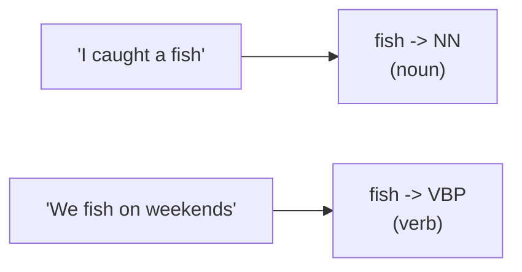
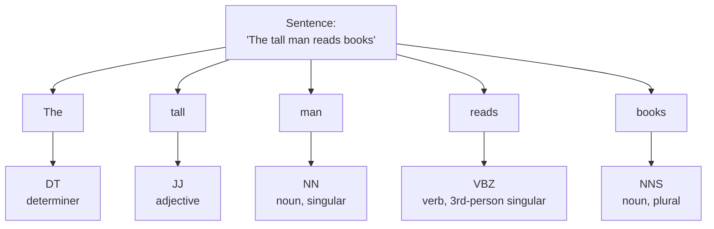

So far every step has treated words as interchangeable atoms: a token is a
token, counted and filtered without regard to its *role* in the sentence. But
the same word can play different roles. In "I caught a **fish**", "fish" is a
noun. In "We **fish** every weekend", "fish" is a verb. To a frequency counter
these are identical; grammatically they could not be more different.

**Part-of-speech (POS) tagging** assigns each word its grammatical category —
noun, verb, adjective, adverb, and so on. It is the first step that pays
attention to *syntax* rather than just the word's spelling, and it unlocks a
lot: better lemmatization, extracting "all the nouns", recognizing names, and
finding grammatical patterns.

## The problem POS tagging solves: words wear many hats

A word's category depends on **context**, not just the word itself. This is
why POS tagging cannot be a simple dictionary lookup — the same spelling needs
different tags in different sentences.

A tagger must read the surrounding words to decide. NLTK's default tagger,
the **averaged perceptron tagger**, does exactly that: it was trained on a
large hand-tagged corpus and predicts each word's tag from features of the
word and its neighbors. Let us watch it disambiguate "fish".

<CodeBlock
  adapter="python"
  initCode={`# ── NLTK setup (read-only) ─────────────────────────────────────────────
# Installs NLTK and loads the tokenizer and the part-of-speech tagger model.
# nltk.download() isn't available here, so we fetch the archives directly.
import io, os, zipfile
import micropip
await micropip.install("nltk")
import nltk
from pyodide.http import pyfetch

_GH = "https://raw.githubusercontent.com/nltk/nltk_data/gh-pages/packages"
if "/nltk_data" not in nltk.data.path:
    nltk.data.path.insert(0, "/nltk_data")

async def _load_nltk(category, package):
    dest = os.path.join("/nltk_data", category)
    os.makedirs(dest, exist_ok=True)
    if os.path.exists(os.path.join(dest, package)):
        return
    resp = await pyfetch(_GH + "/" + category + "/" + package + ".zip")
    if resp.status != 200:
        raise RuntimeError("Could not download " + category + "/" + package)
    with zipfile.ZipFile(io.BytesIO(await resp.bytes())) as zf:
        zf.extractall(dest)

await _load_nltk("tokenizers", "punkt_tab")
await _load_nltk("taggers", "averaged_perceptron_tagger_eng")
from nltk import pos_tag
from nltk.tokenize import word_tokenize`}
  initialCode={`for sentence in ["I caught a big fish.",
                 "We fish on weekends."]:
    tokens = word_tokenize(sentence)
    tagged = pos_tag(tokens)
    # Show just the word 'fish' and the tag it received.
    for word, tag in tagged:
        if word.lower() == "fish":
            print(f"{sentence!r}\n   -> 'fish' tagged as {tag}")
`}
/>

Same word, two sentences, two different tags — `NN` (noun) in the first,
`VBP` (a verb tag) in the second. The tagger got there from context. This is
*the* reason POS tagging is more than a lookup table.

## Reading the tags: the Penn Treebank tagset

`pos_tag` returns a list of `(word, tag)` tuples. The tags come from the
**Penn Treebank** tagset, which is more fine-grained than "noun/verb" — it
distinguishes singular from plural nouns, verb tenses, and so on. You do not
need to memorize all ~36 tags, but you should recognize the common families.

| Tag | Meaning | Example |
| --- | --- | --- |
| `NN` / `NNS` | noun, singular / plural | dog / dogs |
| `NNP` / `NNPS` | proper noun, singular / plural | Alice / Americas |
| `VB` / `VBD` / `VBG` / `VBZ` | verb: base / past / gerund / 3rd-person | run / ran / running / runs |
| `JJ` / `JJR` / `JJS` | adjective / comparative / superlative | big / bigger / biggest |
| `RB` | adverb | quickly |
| `DT` | determiner | the, a |
| `IN` | preposition / subordinating conjunction | in, of |
| `PRP` | personal pronoun | I, you, it |
| `CC` | coordinating conjunction | and, but |

<Callout type="tip" title="The first letter is the shortcut">
You can decode most tags from their first letter: `N…` is a noun, `V…` is a
verb, `J…` is an adjective, `R…` is an adverb. This is so useful that we will
use it in code in a moment to convert Penn tags into the simpler categories a
lemmatizer wants. When you only care about coarse categories, `tag[0]` or
`tag.startswith("NN")` is often all you need.
</Callout>

Here is a full sentence tagged, laid out as a tree of word-to-tag mappings.

<CodeBlock
  adapter="python"
  initCode={`# ── NLTK setup (read-only) ─────────────────────────────────────────────
import io, os, zipfile
import micropip
await micropip.install("nltk")
import nltk
from pyodide.http import pyfetch

_GH = "https://raw.githubusercontent.com/nltk/nltk_data/gh-pages/packages"
if "/nltk_data" not in nltk.data.path:
    nltk.data.path.insert(0, "/nltk_data")

async def _load_nltk(category, package):
    dest = os.path.join("/nltk_data", category)
    os.makedirs(dest, exist_ok=True)
    if os.path.exists(os.path.join(dest, package)):
        return
    resp = await pyfetch(_GH + "/" + category + "/" + package + ".zip")
    if resp.status != 200:
        raise RuntimeError("Could not download " + category + "/" + package)
    with zipfile.ZipFile(io.BytesIO(await resp.bytes())) as zf:
        zf.extractall(dest)

await _load_nltk("tokenizers", "punkt_tab")
await _load_nltk("taggers", "averaged_perceptron_tagger_eng")
from nltk import pos_tag
from nltk.tokenize import word_tokenize`}
  initialCode={`sentence = "The tall man reads books."
tagged = pos_tag(word_tokenize(sentence))

for word, tag in tagged:
    print(f"  {word:10} {tag}")
`}
/>

## A real payoff: extracting syntactic patterns

Once words carry tags, you can pull out grammatical patterns cheaply. Want
every noun in a document (to guess what it is about)? Keep tokens whose tag
starts with `NN`. Want adjectives (useful for opinion mining)? Keep `JJ`. This
"filter by tag" move is the backbone of simple information extraction.

<CodeBlock
  adapter="python"
  initCode={`# ── NLTK setup (read-only) ─────────────────────────────────────────────
import io, os, zipfile
import micropip
await micropip.install("nltk")
import nltk
from pyodide.http import pyfetch

_GH = "https://raw.githubusercontent.com/nltk/nltk_data/gh-pages/packages"
if "/nltk_data" not in nltk.data.path:
    nltk.data.path.insert(0, "/nltk_data")

async def _load_nltk(category, package):
    dest = os.path.join("/nltk_data", category)
    os.makedirs(dest, exist_ok=True)
    if os.path.exists(os.path.join(dest, package)):
        return
    resp = await pyfetch(_GH + "/" + category + "/" + package + ".zip")
    if resp.status != 200:
        raise RuntimeError("Could not download " + category + "/" + package)
    with zipfile.ZipFile(io.BytesIO(await resp.bytes())) as zf:
        zf.extractall(dest)

await _load_nltk("tokenizers", "punkt_tab")
await _load_nltk("taggers", "averaged_perceptron_tagger_eng")
from nltk import pos_tag
from nltk.tokenize import word_tokenize`}
  initialCode={`text = "The talented young engineer quietly designed a brilliant new system."
tagged = pos_tag(word_tokenize(text))

nouns = [w for w, t in tagged if t.startswith("NN")]
adjectives = [w for w, t in tagged if t.startswith("JJ")]
verbs = [w for w, t in tagged if t.startswith("VB")]
adverbs = [w for w, t in tagged if t.startswith("RB")]

print("Nouns:     ", nouns)
print("Adjectives:", adjectives)
print("Verbs:     ", verbs)
print("Adverbs:   ", adverbs)
`}
/>

## POS tagging makes lemmatization accurate

Remember the big lemmatization gotcha: `WordNetLemmatizer` assumes every word
is a noun unless told otherwise, so verbs come back unchanged. POS tagging is
the missing piece. Tag first, convert each Penn tag to the coarse category
WordNet understands, then lemmatize with that category. This is the standard,
accurate lemmatization recipe.

<CodeBlock
  adapter="python"
  initCode={`# ── NLTK setup (read-only) ─────────────────────────────────────────────
import io, os, zipfile
import micropip
await micropip.install("nltk")
import nltk
from pyodide.http import pyfetch

_GH = "https://raw.githubusercontent.com/nltk/nltk_data/gh-pages/packages"
if "/nltk_data" not in nltk.data.path:
    nltk.data.path.insert(0, "/nltk_data")

async def _load_nltk(category, package):
    dest = os.path.join("/nltk_data", category)
    os.makedirs(dest, exist_ok=True)
    if os.path.exists(os.path.join(dest, package)):
        return
    resp = await pyfetch(_GH + "/" + category + "/" + package + ".zip")
    if resp.status != 200:
        raise RuntimeError("Could not download " + category + "/" + package)
    with zipfile.ZipFile(io.BytesIO(await resp.bytes())) as zf:
        zf.extractall(dest)

await _load_nltk("tokenizers", "punkt_tab")
await _load_nltk("taggers", "averaged_perceptron_tagger_eng")
await _load_nltk("corpora", "wordnet")
from nltk import pos_tag
from nltk.tokenize import word_tokenize
from nltk.stem import WordNetLemmatizer
from nltk.corpus import wordnet`}
  initialCode={`lemmatizer = WordNetLemmatizer()

def to_wordnet_pos(treebank_tag):
    # Map a Penn Treebank tag to the coarse POS WordNet expects.
    if treebank_tag.startswith("J"):
        return wordnet.ADJ
    if treebank_tag.startswith("V"):
        return wordnet.VERB
    if treebank_tag.startswith("R"):
        return wordnet.ADV
    return wordnet.NOUN   # default, including N* tags

sentence = "The runners were running and they had eaten well."
tagged = pos_tag(word_tokenize(sentence))

print("Naive (default noun) lemmas:")
print("  ", [lemmatizer.lemmatize(w) for w, t in tagged])

print("POS-aware lemmas:")
print("  ", [lemmatizer.lemmatize(w, to_wordnet_pos(t)) for w, t in tagged])
`}
/>

Compare the two lines. Without POS, "running" and "eaten" survive unchanged.
With POS, "running" → "run" and "eaten" → "eat". The tagger supplied the
context the lemmatizer needed. This tag-then-lemmatize pattern is worth
committing to memory — it is how accurate normalization is done in practice.

<Callout type="warn" title="Tagging is contextual, and not perfect">
Because the tagger predicts from context, it can be *wrong* — especially on
short, ungrammatical, or unusual text (headlines, tweets, product titles). It
is right the large majority of the time on well-formed English, but treat its
output as a strong guess, not gospel. Lowercasing or stripping punctuation
*before* tagging tends to hurt accuracy, since the tagger uses capitalization
and punctuation as clues — another reason to tag relatively early.
</Callout>

<MultipleChoice
  markdown={`Why can't part-of-speech tagging be done with a simple dictionary that maps
each word to one fixed tag?

- Dictionaries are too slow to look words up in
- [o] A word's part of speech depends on context — "fish" is a noun in "I caught a fish" but a verb in "we fish on weekends" — so the same word needs different tags in different sentences
  > Many words are category-ambiguous. The correct tag depends on the surrounding words, which is why taggers read context (and why NLTK's tagger is a trained model, not a lookup table).
- Every word in English has exactly one possible part of speech
- Tagging only works on numbers

Context-dependence is the whole reason POS tagging is a prediction problem, not a lookup.`}
/>

## Real-world uses of POS tags

- **Accurate lemmatization** (as above) — the most common pairing.
- **Named-entity recognition** builds on proper-noun tags (`NNP`) to find
  people, places, and organizations.
- **Information extraction**: pull all noun phrases to summarize "what" a
  document discusses, or adjective–noun pairs for opinion mining ("great
  battery", "slow service").
- **Grammar and writing tools** flag, e.g., a sentence with no verb.
- **Search**: knowing a query word is a verb vs. a noun can sharpen results.

## Your turn: extract the nouns

<ChallengeCard
  adapter="python"
  title="Pull every noun out of a sentence"
  category="POS tagging · pos_tag · syntactic filtering"
  estimatedTime="~6 min"
  instructions={`Write a function \`get_nouns(text)\` that returns a list of the words in
\`text\` that are tagged as nouns — that is, words whose Penn Treebank tag
**starts with** \`"NN"\` (this covers \`NN\`, \`NNS\`, \`NNP\`, and \`NNPS\`, so both
common and proper nouns count).

Steps: word-tokenize the text, run \`pos_tag\` on the tokens, then keep the
words whose tag starts with \`"NN"\`.

For example, \`get_nouns("The hungry cat chased a small mouse.")\` should return
\`["cat", "mouse"]\`.`}
  initCode={`# ── NLTK setup (read-only) ─────────────────────────────────────────────
import io, os, zipfile
import micropip
await micropip.install("nltk")
import nltk
from pyodide.http import pyfetch

_GH = "https://raw.githubusercontent.com/nltk/nltk_data/gh-pages/packages"
if "/nltk_data" not in nltk.data.path:
    nltk.data.path.insert(0, "/nltk_data")

async def _load_nltk(category, package):
    dest = os.path.join("/nltk_data", category)
    os.makedirs(dest, exist_ok=True)
    if os.path.exists(os.path.join(dest, package)):
        return
    resp = await pyfetch(_GH + "/" + category + "/" + package + ".zip")
    if resp.status != 200:
        raise RuntimeError("Could not download " + category + "/" + package)
    with zipfile.ZipFile(io.BytesIO(await resp.bytes())) as zf:
        zf.extractall(dest)

await _load_nltk("tokenizers", "punkt_tab")
await _load_nltk("taggers", "averaged_perceptron_tagger_eng")
from nltk import pos_tag
from nltk.tokenize import word_tokenize`}
  initialCode={`def get_nouns(text):
    # tokenize -> pos_tag -> keep words whose tag starts with "NN"
    return []

print(get_nouns("The hungry cat chased a small mouse."))
print(get_nouns("Alice traveled to Paris."))
`}
  solutionCode={`def get_nouns(text):
    tagged = pos_tag(word_tokenize(text))
    return [w for w, t in tagged if t.startswith("NN")]

print(get_nouns("The hungry cat chased a small mouse."))
print(get_nouns("Alice traveled to Paris."))
`}
  tests={[
    {
      id: "common_nouns",
      name: "Finds the common nouns",
      description: "'The hungry cat chased a small mouse.' -> ['cat', 'mouse']",
      code: `out = get_nouns("The hungry cat chased a small mouse.")
assert out == ["cat", "mouse"], "Got: " + repr(out)`,
    },
    {
      id: "proper_nouns",
      name: "Includes proper nouns (NNP)",
      description: "'Alice' and 'Paris' should both be returned",
      code: `out = get_nouns("Alice traveled to Paris.")
assert "Alice" in out and "Paris" in out, "Got: " + repr(out)`,
    },
    {
      id: "excludes_nonnouns",
      name: "Excludes determiners, verbs, adjectives",
      description: "'the', 'chased', 'hungry' must not appear",
      code: `out = get_nouns("The hungry cat chased a small mouse.")
for w in ["the", "chased", "hungry", "small", "a"]:
    assert w not in out, "Should not include " + repr(w) + "; got " + repr(out)`,
    },
    {
      id: "returns_list",
      name: "Returns a list",
      description: "get_nouns should return a list",
      code: `assert isinstance(get_nouns("Dogs bark."), list), "Should return a list"`,
    },
  ]}
/>

## Check your understanding

<MultipleChoice
  markdown={`What does \`pos_tag\` return when given a list of tokens?

- A single string naming the sentence's overall grammar
- [o] A list of \`(word, tag)\` tuples, one per token, where the tag is the word's part of speech in context
  > \`pos_tag\` pairs each token with a Penn Treebank tag, producing tuples like \`("book", "NN")\`. You typically iterate over these pairs to filter by category or feed POS into lemmatization.
- A list of only the nouns
- The lemmatized form of each word

It tags every token with its grammatical category, as (word, tag) pairs.`}
/>

<MultipleChoice
  markdown={`In the Penn Treebank tagset, which tags would the filter \`tag.startswith("NN")\`
match?

- Only \`NN\` (singular common nouns)
- [o] \`NN\`, \`NNS\`, \`NNP\`, and \`NNPS\` — singular and plural common nouns *and* proper nouns
  > All noun tags begin with "NN": \`NN\`/\`NNS\` for common nouns and \`NNP\`/\`NNPS\` for proper nouns. The prefix test is a handy way to grab "all nouns" at once.
- All verbs
- Determiners and prepositions

The "NN" prefix covers the whole noun family, common and proper, singular and plural.`}
/>

<MultipleChoice
  markdown={`Why does tagging *before* lemmatizing produce better results than lemmatizing
alone?

- Tagging makes the text shorter
- [o] The tag tells the lemmatizer each word's part of speech, so verbs lemmatize as verbs ("running" → "run") instead of being left unchanged under the default noun assumption
  > \`WordNetLemmatizer\` needs the POS to do its job; without it, verbs and adjectives often pass through unchanged. POS tagging supplies that information, enabling the accurate tag-then-lemmatize pipeline.
- Lemmatizing first would delete all the verbs
- Tagging removes stopwords automatically

POS tags give the lemmatizer the context it needs to reduce non-nouns correctly.`}
/>

<MultipleChoice
  markdown={`A teammate runs the tagger on a batch of all-lowercase, punctuation-stripped
product titles and gets noticeably worse tags than on clean sentences. What is
the most likely reason?

- The tagger only works in the morning
- [o] The tagger uses capitalization and punctuation as contextual clues; stripping them away beforehand removes signal the model relies on, lowering accuracy
  > Aggressive normalization before tagging deletes cues (capital letters for proper nouns, sentence punctuation) that the tagger uses. Tag earlier — on text that still has its case and punctuation — then normalize.
- POS tagging cannot be applied to product titles at all
- The titles need to be translated first

This is the recurring order lesson: normalize after tagging, not before, when tags matter.`}
/>

You can now label words by grammatical role. Notice a limitation though: every
step so far treats words *individually*. But "New York", "machine learning",
and "not good" are multi-word units whose meaning lives in the *combination*.
To capture local word order, we turn to **n-grams**.
