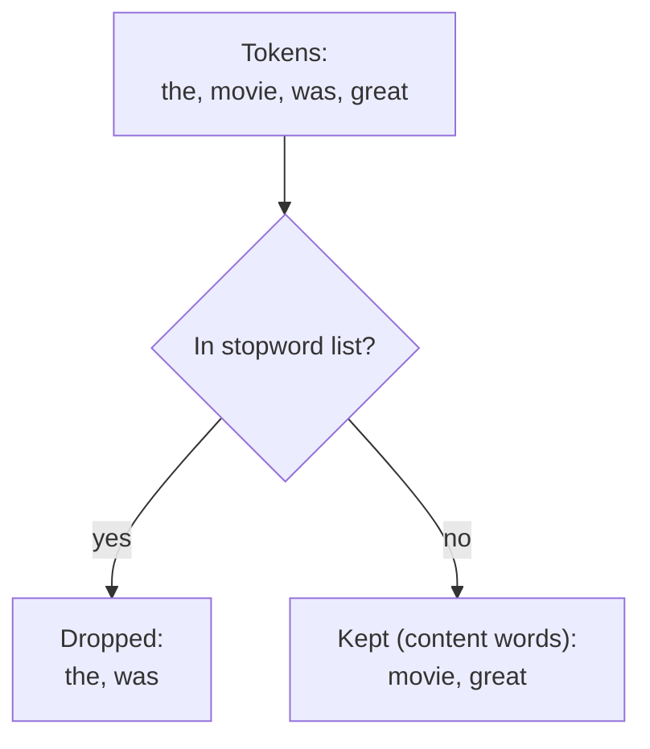
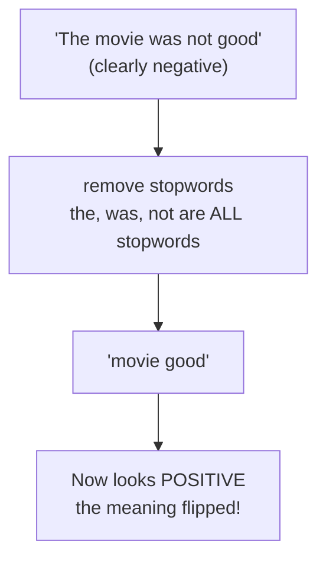

Some words are everywhere. In almost any English text, "the", "is", "of",
"and", and "to" are among the most frequent words — and they are also among
the *least* informative about what the text is *about*. These ultra-common,
low-content words are called **stopwords**, and deciding whether to remove
them is one of the most consequential — and most frequently botched — choices
in a text pipeline.

This page has a split personality on purpose. The first half shows you why
removing stopwords is useful. The second half shows you a task where removing
them is a disaster. Holding both in your head is the whole point.

<svg
  viewBox="0 0 640 200"
  role="img"
  aria-label="A sentence line where solid blue content chips stay in place over faint empty slots, while small gray stopword chips — and one red negation chip — sink and fade below the line"
  style={{ display: "block", width: "100%", maxWidth: "640px", height: "auto", margin: "2.5rem auto" }}
>
  <g fill="currentColor">
    <rect x="60" y="100" width="520" height="6" rx="3" opacity="0.12" />
    <rect x="70" y="70" width="56" height="30" rx="12" opacity="0.07" />
    <rect x="216" y="70" width="36" height="30" rx="12" opacity="0.07" />
    <rect x="346" y="70" width="62" height="30" rx="12" opacity="0.07" />
    <rect x="490" y="70" width="44" height="30" rx="12" opacity="0.07" />
  </g>
  <g style={{ color: "var(--ds-blue-500)" }} fill="currentColor">
    <rect x="138" y="70" width="66" height="30" rx="12" fillOpacity="0.9" />
    <rect x="264" y="70" width="70" height="30" rx="12" fillOpacity="0.9" />
    <rect x="420" y="70" width="58" height="30" rx="12" fillOpacity="0.9" />
  </g>
  <g fill="currentColor">
    <rect x="76" y="128" width="52" height="24" rx="10" opacity="0.22" transform="rotate(-7 102 140)" />
    <rect x="222" y="146" width="34" height="22" rx="9" opacity="0.14" transform="rotate(6 239 157)" />
    <rect x="494" y="134" width="42" height="24" rx="10" opacity="0.18" transform="rotate(-5 515 146)" />
  </g>
  <g style={{ color: "var(--ds-red-500)" }} fill="currentColor">
    <rect x="350" y="152" width="58" height="24" rx="10" fillOpacity="0.35" transform="rotate(5 379 164)" />
  </g>
</svg>

## What are stopwords, and why remove them?

A stopword is a word so common and grammatically functional that it carries
little meaning *on its own*. NLTK ships a ready-made English list. Let us look
at it.

<CodeBlock
  adapter="python"
  files={[
    {
      filename: "main.py",
      initCode: `# ── NLTK setup (read-only) ─────────────────────────────────────────────
# Installs NLTK and loads the data this page needs. nltk.download() isn't
# available in this environment, so we fetch the data archives directly
# and unpack them into NLTK's data directory.
import io, os, zipfile
import micropip
await micropip.install("nltk")
import nltk
from pyodide.http import pyfetch

_GH = "https://raw.githubusercontent.com/nltk/nltk_data/gh-pages/packages"
if "/nltk_data" not in nltk.data.path:
    nltk.data.path.insert(0, "/nltk_data")

async def _load_nltk(category, package):
    dest = os.path.join("/nltk_data", category)
    os.makedirs(dest, exist_ok=True)
    if os.path.exists(os.path.join(dest, package)):
        return
    resp = await pyfetch(_GH + "/" + category + "/" + package + ".zip")
    if resp.status != 200:
        raise RuntimeError("Could not download " + category + "/" + package)
    with zipfile.ZipFile(io.BytesIO(await resp.bytes())) as zf:
        zf.extractall(dest)

await _load_nltk("corpora", "stopwords")
from nltk.corpus import stopwords`,
      starterCode: `stop = stopwords.words("english")

print("Number of English stopwords:", len(stop))
print("First 25:", stop[:25])
print()
print("Is 'the' a stopword? ", "the" in stop)
print("Is 'python' a stopword?", "python" in stop)
`,
    },
  ]}
/>

The list is short — under 200 words — but those words make up a huge fraction
of any text. Removing them has two appealing effects: it shrinks your data,
and it concentrates attention on **content words** (nouns, verbs, adjectives)
that actually signal the topic.

Here is the filter in action. The pattern is always the same: build a `set`
of stopwords for fast lookup, then keep only the tokens that are not in it.

<CodeBlock
  adapter="python"
  files={[
    {
      filename: "main.py",
      initCode: `# ── NLTK setup (read-only) ─────────────────────────────────────────────
import io, os, zipfile
import micropip
await micropip.install("nltk")
import nltk
from pyodide.http import pyfetch

_GH = "https://raw.githubusercontent.com/nltk/nltk_data/gh-pages/packages"
if "/nltk_data" not in nltk.data.path:
    nltk.data.path.insert(0, "/nltk_data")

async def _load_nltk(category, package):
    dest = os.path.join("/nltk_data", category)
    os.makedirs(dest, exist_ok=True)
    if os.path.exists(os.path.join(dest, package)):
        return
    resp = await pyfetch(_GH + "/" + category + "/" + package + ".zip")
    if resp.status != 200:
        raise RuntimeError("Could not download " + category + "/" + package)
    with zipfile.ZipFile(io.BytesIO(await resp.bytes())) as zf:
        zf.extractall(dest)

await _load_nltk("corpora", "stopwords")
await _load_nltk("tokenizers", "punkt_tab")
from nltk.corpus import stopwords
from nltk.tokenize import word_tokenize`,
      starterCode: `text = "The quick brown fox jumps over the lazy dog in the park"
stop = set(stopwords.words("english"))  # a set -> fast membership tests

tokens = [t.lower() for t in word_tokenize(text)]
content = [t for t in tokens if t not in stop]

print("All tokens:   ", tokens)
print("Content words:", content)
print(f"Removed {len(tokens) - len(content)} of {len(tokens)} tokens.")
`,
    },
  ]}
/>

The content words — "quick", "brown", "fox", "jumps", "lazy", "dog", "park" —
tell you what the sentence is *about*. The stopwords — "the", "over", "in" —
mostly just hold the grammar together. For a task like topic detection or
building a search index, dropping them is a clear win.

<Callout type="info" title="Why a set, not a list?">
Checking `token in stop` is done once per token, potentially millions of
times. Membership testing in a Python `set` is roughly constant time, while a
`list` scans every element. Converting the stopword list to a `set` once,
up front, can make the filtering step dramatically faster on large texts. It
is a small habit that scales well.
</Callout>

## The negation trap: when removing stopwords is a disaster

Now the other personality. Look closely at what is *in* the stopword list.

<CodeBlock
  adapter="python"
  files={[
    {
      filename: "main.py",
      initCode: `# ── NLTK setup (read-only) ─────────────────────────────────────────────
import io, os, zipfile
import micropip
await micropip.install("nltk")
import nltk
from pyodide.http import pyfetch

_GH = "https://raw.githubusercontent.com/nltk/nltk_data/gh-pages/packages"
if "/nltk_data" not in nltk.data.path:
    nltk.data.path.insert(0, "/nltk_data")

async def _load_nltk(category, package):
    dest = os.path.join("/nltk_data", category)
    os.makedirs(dest, exist_ok=True)
    if os.path.exists(os.path.join(dest, package)):
        return
    resp = await pyfetch(_GH + "/" + category + "/" + package + ".zip")
    if resp.status != 200:
        raise RuntimeError("Could not download " + category + "/" + package)
    with zipfile.ZipFile(io.BytesIO(await resp.bytes())) as zf:
        zf.extractall(dest)

await _load_nltk("corpora", "stopwords")
from nltk.corpus import stopwords`,
      starterCode: `stop = set(stopwords.words("english"))

for word in ["not", "no", "nor", "never", "but", "against", "don't", "won't"]:
    print(f"  is '{word}' a stopword? {word in stop}")
`,
    },
  ]}
/>

The negation words — "not", "no", "nor" — are stopwords. So are many negated
contractions. These are the words that *reverse meaning*, and the standard
stoplist deletes them. Watch what that does to a negative product review.

<CodeBlock
  adapter="python"
  files={[
    {
      filename: "main.py",
      initCode: `# ── NLTK setup (read-only) ─────────────────────────────────────────────
import io, os, zipfile
import micropip
await micropip.install("nltk")
import nltk
from pyodide.http import pyfetch

_GH = "https://raw.githubusercontent.com/nltk/nltk_data/gh-pages/packages"
if "/nltk_data" not in nltk.data.path:
    nltk.data.path.insert(0, "/nltk_data")

async def _load_nltk(category, package):
    dest = os.path.join("/nltk_data", category)
    os.makedirs(dest, exist_ok=True)
    if os.path.exists(os.path.join(dest, package)):
        return
    resp = await pyfetch(_GH + "/" + category + "/" + package + ".zip")
    if resp.status != 200:
        raise RuntimeError("Could not download " + category + "/" + package)
    with zipfile.ZipFile(io.BytesIO(await resp.bytes())) as zf:
        zf.extractall(dest)

await _load_nltk("corpora", "stopwords")
await _load_nltk("tokenizers", "punkt_tab")
from nltk.corpus import stopwords
from nltk.tokenize import word_tokenize`,
      starterCode: `review = "The movie was not good at all"
stop = set(stopwords.words("english"))

tokens = [t.lower() for t in word_tokenize(review)]
content = [t for t in tokens if t not in stop]

print("Original review:", review)
print("After stopwords:", content)
print()
print("A naive sentiment reader now sees the word 'good' and no 'not'.")
print("The negative review has been turned positive.")
`,
    },
  ]}
/>

The review "not good" became simply "good". A sentiment system reading the
filtered tokens would conclude the reviewer *liked* the movie — the exact
opposite of the truth. This is not a contrived edge case; negation is
everywhere in opinionated text, and blindly removing stopwords before
sentiment analysis is a classic, costly mistake.

<Callout type="danger" title="Do not remove stopwords before sentiment analysis (at least not naively)">
The standard stopword list contains the very words that carry sentiment
structure: negations ("not", "no", "nor"), contrasts ("but"), and
intensity ("very" — also a stopword). Strip them and you can flip a review's
meaning. For sentiment, either **keep stopwords**, or use a **custom list
that preserves negation and contrast words**. The same caution applies to any
task where small function words change meaning.
</Callout>

## More tasks where stopwords are precious

Sentiment is not the only place the default list hurts. Stopwords are
essential — sometimes they are the *entire signal* — in several tasks:

- **Phrases and idioms.** "To be or not to be" is *all* stopwords. Remove
  them and the most famous line in English vanishes into nothing.
- **Machine translation.** Function words encode tense, number, and
  relationships. You cannot translate by throwing them away.
- **Question answering.** "Who" vs "whom", "can" vs "cannot" — the small
  words often *are* the question.
- **Authorship attribution.** Remarkably, *how* an author uses stopwords
  (their unconscious rate of "the", "of", "that") is a fingerprint used to
  identify who wrote a text. Here the stopwords are the data and the content
  words are the noise — the exact inverse of topic analysis.

<Callout type="warn" title="Two more misconceptions to retire">
**"Always remove stopwords."** No — it is a task-dependent choice, and for a
large class of tasks it is harmful. **"The stopword list is universal."**
Also no. There is no single official list; NLTK's differs from spaCy's and
from scikit-learn's, and the right list for *your* domain often needs
customizing. In a corpus of movie reviews, the word "movie" is so ubiquitous
it acts like a stopword; in legal text, "herein" and "pursuant" might. Good
practitioners curate the list for the job.
</Callout>

## Customizing the stoplist

Because the list is just a Python collection, you can add domain-specific
noise words and — crucially — remove words you must keep.

<CodeBlock
  adapter="python"
  files={[
    {
      filename: "main.py",
      initCode: `# ── NLTK setup (read-only) ─────────────────────────────────────────────
import io, os, zipfile
import micropip
await micropip.install("nltk")
import nltk
from pyodide.http import pyfetch

_GH = "https://raw.githubusercontent.com/nltk/nltk_data/gh-pages/packages"
if "/nltk_data" not in nltk.data.path:
    nltk.data.path.insert(0, "/nltk_data")

async def _load_nltk(category, package):
    dest = os.path.join("/nltk_data", category)
    os.makedirs(dest, exist_ok=True)
    if os.path.exists(os.path.join(dest, package)):
        return
    resp = await pyfetch(_GH + "/" + category + "/" + package + ".zip")
    if resp.status != 200:
        raise RuntimeError("Could not download " + category + "/" + package)
    with zipfile.ZipFile(io.BytesIO(await resp.bytes())) as zf:
        zf.extractall(dest)

await _load_nltk("corpora", "stopwords")
from nltk.corpus import stopwords`,
      starterCode: `base = set(stopwords.words("english"))

# Keep negation/contrast words so sentiment survives:
keep = {"not", "no", "nor", "never", "but"}
# Add domain noise words (imagine a corpus of movie reviews):
add = {"movie", "film", "watch"}

custom = (base - keep) | add

print("'not' still a stopword?  ", "not" in custom, "  <- kept for sentiment")
print("'movie' now a stopword?  ", "movie" in custom, " <- added domain noise word")
print("'the' still a stopword?  ", "the" in custom)
`,
    },
  ]}
/>

This three-line recipe — start from the base list, *subtract* the words you
must protect, *add* the words specific to your domain — is how stopword
removal is done responsibly in practice.

<MultipleChoice
  markdown={`A sentiment analysis pipeline removes NLTK's default English stopwords before
scoring reviews. Reviews like "this is not good" keep getting classified as
positive. What is the root cause?

- The reviews are too short to classify
  > Length is not the issue; even a short phrase like "not good" is sufficient for classification — the problem is that stopword removal strips the negation and inverts the meaning.
- [o] "not" is on the stopword list, so removing stopwords deletes the negation and "not good" collapses to "good", flipping the sentiment
  > NLTK's stopword list includes negation words. Stripping them throws away the words that reverse meaning, so negative statements look positive. For sentiment, preserve negation (or keep stopwords entirely).
- Sentiment analysis is impossible in Python
  > Sentiment analysis is entirely feasible in Python; this course builds a working classifier using NLTK and standard Python.
- The pipeline forgot to lowercase the text
  > Case folding does not affect whether "not" survives; both "not" and "Not" are on the stopword list (after lowercasing), so the negation would still be removed.

Negation lives in the stoplist, and sentiment lives in negation — a dangerous combination.`}
/>

## Your turn: filter stopwords without losing negation

<ChallengeCard
  adapter="python"
  title="Remove stopwords but keep the negations"
  category="stopwords · sentiment-safe filtering"
  estimatedTime="~7 min"
  instructions={`Write a function \`clean_keep_negation(tokens)\` that removes English
stopwords from a list of **already-lowercased** tokens, but **preserves**
these negation/contrast words so sentiment survives: \`not\`, \`no\`, \`nor\`,
\`never\`, \`but\`.

Build a custom stop set by starting from \`stopwords.words("english")\` and
subtracting those five words, then keep only tokens not in that custom set.

For example, given \`["this", "is", "not", "good"]\`, the function should
return \`["not", "good"]\` — ordinary stopwords gone, the negation kept.`}
  files={[
    {
      filename: "main.py",
      initCode: `# ── NLTK setup (read-only) ─────────────────────────────────────────────
import io, os, zipfile
import micropip
await micropip.install("nltk")
import nltk
from pyodide.http import pyfetch

_GH = "https://raw.githubusercontent.com/nltk/nltk_data/gh-pages/packages"
if "/nltk_data" not in nltk.data.path:
    nltk.data.path.insert(0, "/nltk_data")

async def _load_nltk(category, package):
    dest = os.path.join("/nltk_data", category)
    os.makedirs(dest, exist_ok=True)
    if os.path.exists(os.path.join(dest, package)):
        return
    resp = await pyfetch(_GH + "/" + category + "/" + package + ".zip")
    if resp.status != 200:
        raise RuntimeError("Could not download " + category + "/" + package)
    with zipfile.ZipFile(io.BytesIO(await resp.bytes())) as zf:
        zf.extractall(dest)

await _load_nltk("corpora", "stopwords")
from nltk.corpus import stopwords`,
      starterCode: `KEEP = {"not", "no", "nor", "never", "but"}

def clean_keep_negation(tokens):
    # Build a custom stop set, then filter.
    return tokens

print(clean_keep_negation(["this", "is", "not", "good"]))
print(clean_keep_negation(["the", "food", "was", "never", "fresh"]))
`,
      solutionCode: `KEEP = {"not", "no", "nor", "never", "but"}

def clean_keep_negation(tokens):
    custom = set(stopwords.words("english")) - KEEP
    return [t for t in tokens if t not in custom]

print(clean_keep_negation(["this", "is", "not", "good"]))
print(clean_keep_negation(["the", "food", "was", "never", "fresh"]))
`,
    },
  ]}
  tests={[
    {
      id: "keeps_not",
      name: "Keeps the negation 'not'",
      description: "['this','is','not','good'] -> ['not','good']",
      code: `out = clean_keep_negation(["this", "is", "not", "good"])
assert out == ["not", "good"], "Got: " + repr(out)`,
    },
    {
      id: "keeps_never",
      name: "Keeps 'never' and drops ordinary stopwords",
      description: "['the','food','was','never','fresh'] -> ['food','never','fresh']",
      code: `out = clean_keep_negation(["the", "food", "was", "never", "fresh"])
assert out == ["food", "never", "fresh"], "Got: " + repr(out)`,
    },
    {
      id: "removes_ordinary",
      name: "Still removes ordinary stopwords",
      description: "Common stopwords like 'the','is','of' must be gone",
      code: `out = clean_keep_negation(["the", "is", "of", "apple"])
assert out == ["apple"], "Got: " + repr(out)`,
    },
    {
      id: "all_kept_words_survive",
      name: "All five protected words survive",
      description: "not, no, nor, never, but are each preserved",
      code: `out = clean_keep_negation(["not", "no", "nor", "never", "but"])
assert set(out) == {"not", "no", "nor", "never", "but"}, "Got: " + repr(out)`,
    },
  ]}
/>

## Check your understanding

<MultipleChoice
  markdown={`What best describes a **stopword**?

- A word that signals the end of a sentence
  > Sentence-ending signals are punctuation marks like periods and question marks; stopwords are high-frequency function words like "the" and "is" that appear throughout a sentence, not just at its end.
- [o] A very common, low-content word (like "the", "is", "of") that appears across nearly all texts and carries little topical meaning on its own
  > Stopwords are high-frequency function words. They are everywhere, so they say little about what a *particular* document is about — which is why topic-focused tasks often remove them.
- A misspelled word that should be corrected
  > Spelling correction is a separate preprocessing step; stopwords are correctly spelled, extremely common function words, not errors.
- A word that must always be removed from any text
  > Whether to remove stopwords is a task-dependent choice; for sentiment analysis, translation, and authorship attribution, keeping them is often essential.

Stopwords are defined by being common and low-content, not by being errors or by any "must remove" rule.`}
/>

<MultipleChoice
  markdown={`For which task is removing stopwords most clearly **beneficial**?

- [o] Building a search index where you want to match on meaningful content words
  > Search and topic analysis benefit from dropping ubiquitous function words so that matching and counting focus on content. This is the classic motivating use case for stopword removal.
- Analyzing the sentiment of opinionated product reviews
  > Sentiment is exactly where stopword removal backfires, because negation words live in the stoplist.
- Translating a sentence from English to French
  > Translation needs function words to encode grammar; removing them breaks it.
- Identifying which author wrote an anonymous text
  > Authorship attribution often relies on stopword usage patterns as a fingerprint.

Topic-oriented matching is the sweet spot; the other three are cases where stopwords matter.`}
/>

<MultipleChoice
  markdown={`Why is "the stopword list is universal and official" a misconception?

- Because stopword lists change every day
  > Stopword lists in libraries like NLTK are stable and rarely updated; the misconception is not about frequency of change but about the false belief that any one list is universal.
- [o] Because there is no single canonical list — different libraries ship different lists, and the right list depends on your domain (a movie corpus might treat "movie" as a stopword)
  > Stoplists are conventions, not standards. NLTK, spaCy, and scikit-learn all differ, and effective practitioners customize the list for their domain rather than treating any one list as authoritative.
- Because stopwords do not exist in English
  > Stopwords clearly exist in English — "the", "is", "of", and hundreds more are universally recognized as high-frequency, low-content words; the misconception is that one fixed list covers all use cases.
- Because only nouns can be stopwords
  > Most stopwords are function words: prepositions, articles, conjunctions, and pronouns — almost never nouns; the claim that only nouns qualify inverts the typical pattern.

Treat any stoplist as a starting point to curate, not a fixed law.`}
/>

<MultipleChoice
  markdown={`You must remove ordinary stopwords from movie reviews but protect negation so
sentiment survives. Which approach is correct?

- Remove every stopword, then add "not" back to random positions
  > Reinserting "not" at random positions would corrupt the text and bear no relationship to where negations originally appeared; the solution is to preserve them during filtering, not reinsert them arbitrarily.
- [o] Start from the base stoplist, subtract the negation/contrast words you must keep, and filter tokens against that customized set
  > Subtracting protected words from the base set (then filtering) cleanly removes ordinary stopwords while leaving negation intact. It is the standard responsible recipe for sentiment-safe filtering.
- Skip tokenization so stopwords never appear
  > Without tokenization there are no individual tokens to filter at all; and skipping it does not protect negation — it simply makes the text unprocessable.
- Convert the reviews to uppercase first
  > Changing case does not affect which tokens appear in the text or solve the negation-preservation problem; the standard stopword list uses lowercase, so uppercasing would actually prevent the filter from matching anything.

Customizing the set — subtract what you must keep, add domain noise — is how this is done in practice.`}
/>

<MultipleChoice
  markdown={`Converting the stopword list to a Python \`set\` before filtering mainly
improves:

- The accuracy of the filtering
  > A set and a list with the same elements produce identical filtering results; converting to a set changes only the speed of each membership test, not which tokens are kept or removed.
- [o] The speed, because membership tests (\`token in stop\`) are roughly constant-time in a set versus a linear scan in a list
  > A set gives near-constant-time lookups, so checking each token against it is far faster than scanning a list — important when filtering large corpora. It does not change *which* tokens are removed, only how fast.
- The number of stopwords in the list
  > Converting to a set does not add or remove any words from the list; the number of stopwords remains the same — only the data structure and lookup speed change.
- The language of the text
  > The data structure (set vs. list) has no effect on the language of the text being filtered; the language is determined by which stopword list you load, not how you store it.

Same result, faster execution — a cheap and worthwhile habit.`}
/>

Stopword removal trims the *common* words. The next page tackles a different
kind of redundancy: the fact that "run", "runs", "running", and "ran" are all
the same underlying word wearing different endings. That is the job of
**stemming and lemmatization**.
