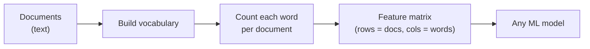
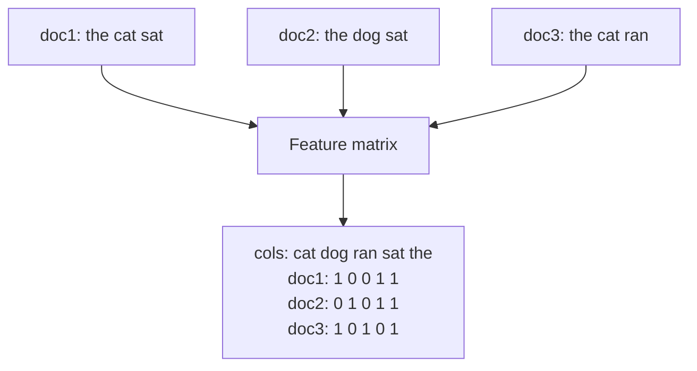
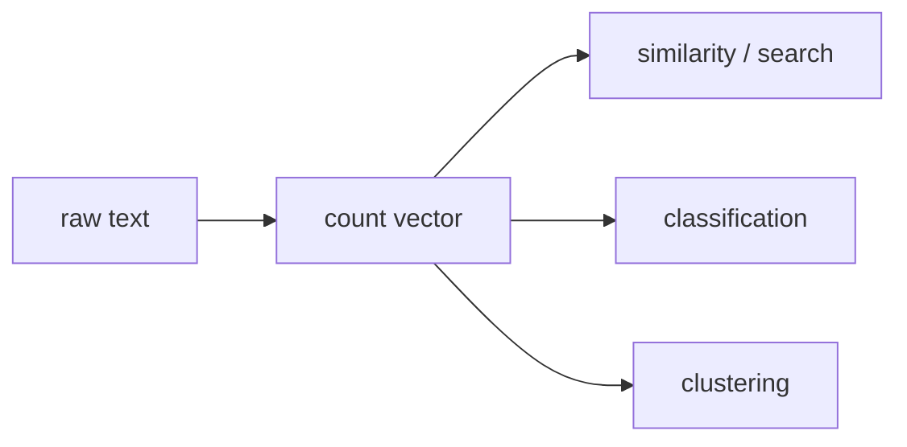
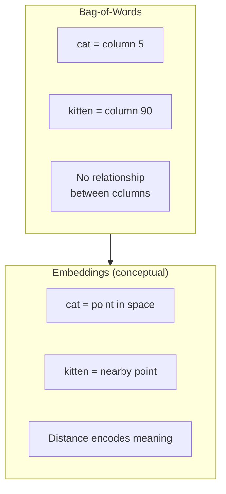

Algorithms do arithmetic; they cannot multiply the word `"cat"`. The final
bridge in the pipeline is **feature extraction**: converting cleaned tokens
into **numbers**. The simplest and most important method is the
**bag-of-words (BoW)** model, and despite its age it still underlies a
huge amount of real text classification.

## The idea: a document is its word counts

The bag-of-words model makes one bold simplification: **represent each
document by how many times each vocabulary word appears in it, ignoring
order.** "Bag" is literal — imagine dumping all the words of a document
into a bag and shaking it; you keep the *contents* but lose the
*sequence*.

Building a BoW matrix is a two-step recipe:

1. **Fit a vocabulary** — the sorted set of all distinct words across every
   document. Each word becomes a **column**.
2. **Vectorize each document** — count how often each vocabulary word
   appears in it. Each document becomes a **row** of counts.

## Build a bag-of-words from scratch

You do not need a heavy library to understand BoW — Python's `Counter` is
enough. Watch three short documents become a clean numeric table:

<CodeBlock
  adapter="python"
  initialCode={`from collections import Counter
import pandas as pd

docs = ["the cat sat", "the dog sat", "the cat ran"]
tokenized = [d.split() for d in docs]

# 1. Fit the vocabulary (sorted set of all words):
vocab = sorted({word for doc in tokenized for word in doc})
print("Vocabulary:", vocab)

# 2. Vectorize each document by counting:
rows = [[Counter(doc)[word] for word in vocab] for doc in tokenized]

matrix = pd.DataFrame(rows, columns=vocab,
                      index=["doc1", "doc2", "doc3"])
display(matrix)
`}
/>

Every document is now a **vector** of the same length (one slot per
vocabulary word). That fixed-length numeric form is exactly what a
classifier, a clustering algorithm, or a similarity function expects.
Notice `the` is a column of all `1`s — it adds no discriminating power,
which is the BoW-era argument for removing stopwords.

## Why this representation is so powerful

Once documents are vectors, the entire toolbox of numeric methods opens
up:

- **Similarity:** two documents are "close" if their count vectors point in
  the same direction (cosine similarity) — the basis of search and
  recommendation.
- **Classification:** a model learns which words predict which label (spam
  vs. not, positive vs. negative).
- **Clustering:** group documents with similar word profiles.

## The limitations you must remember

Bag-of-words is powerful *and* lossy. Keeping its weaknesses in mind tells
you when to reach for something more:

<Callout type="warn" title="What bag-of-words throws away">
- **Word order** — `"dog bites man"` and `"man bites dog"` get the
  **identical** vector. (Add **bigrams** as extra columns to recover some
  order.)
- **Meaning / synonyms** — `big` and `large` are different columns; the
  model has no idea they're related.
- **Sparsity** — real vocabularies have tens of thousands of words, so each
  document vector is mostly zeros, which is memory-hungry.
</Callout>

### Raw counts vs. TF-IDF (briefly)

Raw counts over-reward words that are simply common. A refinement called
**TF-IDF** down-weights words that appear in *many* documents (like `the`)
and up-weights words distinctive to *one* document. You will meet TF-IDF
constantly in practice; conceptually it is just "bag-of-words, but weight
each word by how informative it is." The core BoW idea — *documents as
vectors over a vocabulary* — is unchanged.

### Where embeddings fit (conceptually)

Bag-of-words treats every word as an isolated, unrelated column — `cat`
and `kitten` are as different as `cat` and `helicopter`. Modern **word
embeddings** (Word2Vec, GloVe) instead place each word at a point in a
continuous space where *similar words sit near each other*, so `cat` and
`kitten` end up close together.

<Callout type="info" title="We stay with bag-of-words on purpose">
Embeddings and transformers are powerful, but they are also opaque and
heavy. Bag-of-words is the representation you can build by hand, inspect
column by column, and fully understand — and it is still a strong baseline
for many classification tasks. Master the transparent version first; the
intuition (text → vector → model) transfers directly to every fancier
method.
</Callout>

## Try it yourself

<ChallengeCard
  adapter="python"
  title="Vectorize a new document"
  instructions={`A fixed \`vocab\` (sorted list of words) is provided. Write a function-free snippet that builds **\`vector\`**: a list of integers, the same length as \`vocab\`, where \`vector[i]\` is the number of times \`vocab[i]\` appears in the tokens of \`new_doc\`.

Words in \`new_doc\` that are **not** in \`vocab\` are simply ignored (this is the "out-of-vocabulary" case).`}
  initCode={`from collections import Counter

vocab = ["cat", "dog", "ran", "sat", "the"]
new_doc = "the cat and the cat sat on a llama"
`}
  initialCode={`# 'vocab' and 'new_doc' are ready.
tokens = new_doc.split()
counts = Counter(tokens)

vector = None  # TODO: counts aligned to vocab order

print("Vocab :", vocab)
print("Vector:", vector)
`}
  solutionCode={`tokens = new_doc.split()
counts = Counter(tokens)
vector = [counts[word] for word in vocab]
print("Vocab :", vocab)
print("Vector:", vector)
`}
  tests={[
    {
      id: "is_list_len",
      name: "Vector matches vocab length",
      description: "vector should be a list as long as vocab",
      code: `assert isinstance(vector, list) and len(vector) == len(vocab), "vector must align with vocab"`,
    },
    {
      id: "counts_correct",
      name: "Counts are correct",
      description: "the=2, cat=2, sat=1, dog=0, ran=0",
      code: `assert vector == [2, 0, 0, 1, 2], f"expected [2, 0, 0, 1, 2], got {vector}"`,
    },
    {
      id: "oov_ignored",
      name: "Out-of-vocab words ignored",
      description: "'and', 'on', 'a', 'llama' must not affect the vector length",
      code: `assert len(vector) == 5, "out-of-vocabulary words must be ignored, not added as columns"`,
    },
  ]}
/>

## Check your understanding

<MultipleChoice
  markdown={`In the bag-of-words model, what does a single **row** of the feature matrix represent?

- One word in the vocabulary.
  > Words are the *columns*, not the rows.
- [o] One document, represented as the counts of each vocabulary word it contains.
  > Each row is a document's count vector over the shared vocabulary.
- One sentence's grammatical structure.
  > BoW discards structure entirely.
- The similarity between two documents.
  > Similarity is computed *from* rows; it isn't a row itself.

Rows are documents, columns are vocabulary words, and each cell is a count.
That layout turns text into a numeric matrix.`}
/>

<MultipleChoice
  markdown={`Why do \`"dog bites man"\` and \`"man bites dog"\` produce the **same** bag-of-words vector?

- Because the tokenizer fails on these sentences.
  > Tokenization is fine; the loss happens in the representation.
- [o] Because bag-of-words records only word *counts* and discards word *order*.
  > Both sentences contain the same words once each, so their count vectors are identical.
- Because \`bites\` is a stopword.
  > \`bites\` is not a stopword, and that wouldn't explain the equality.
- Because the two sentences have different vocabularies.
  > They share the exact same vocabulary, which is why their vectors match.

Order-blindness is BoW's defining limitation. Adding bigram columns is the
classic way to reintroduce a little order.`}
/>

<MultipleChoice
  markdown={`How do **word embeddings** (Word2Vec, GloVe) conceptually differ from bag-of-words columns?

- They count words faster than bag-of-words.
  > Speed is not the conceptual difference.
- [o] They place words as points in a continuous space where similar words (\`cat\`, \`kitten\`) are near each other, encoding meaning that BoW's independent columns cannot.
  > Embeddings capture relatedness via geometric proximity.
- They remove the need to tokenize text.
  > Embeddings still require tokenization first.
- They are identical to bag-of-words with stopwords removed.
  > Removing stopwords doesn't give columns any notion of similarity.

In BoW, every word is an isolated column with no relationship to any other.
Embeddings instead encode similarity as distance — the key conceptual leap
toward modern NLP.`}
/>

You now have the full pipeline: text → tokens → clean tokens → numbers.
Let's put every piece together and build something that makes a real
decision — a **rule-based sentiment classifier**.
