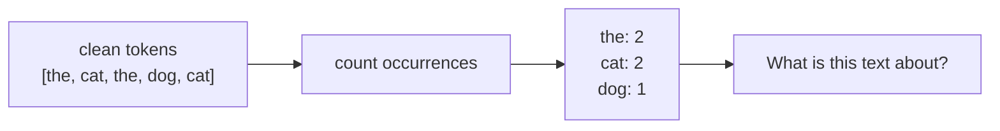
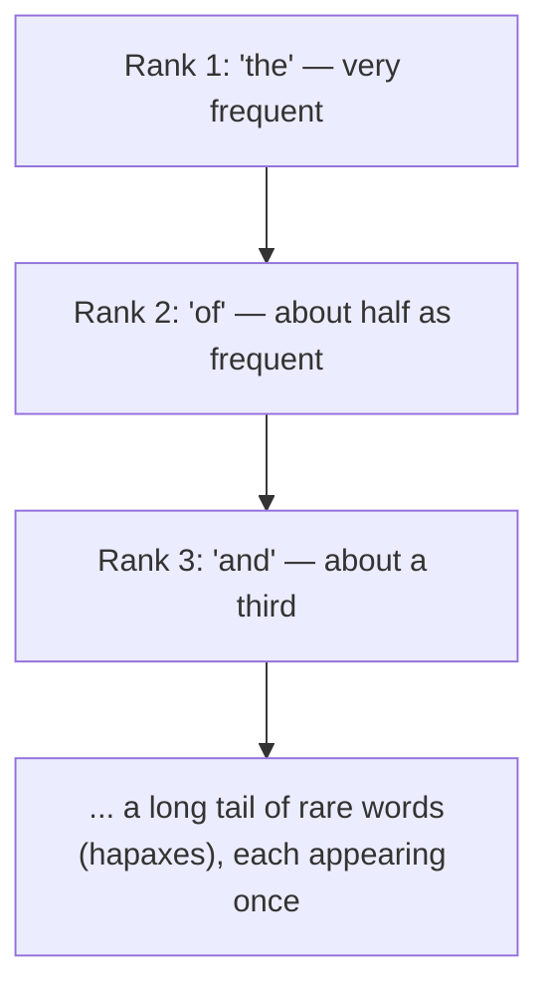

Once text is tokenized and cleaned, the very first *analysis* you can do is
breathtakingly simple: **count how often each token appears.** A
**frequency distribution** is just a tally — token → count — and it turns
out to be one of the most useful objects in all of NLP. Search ranking,
keyword extraction, spam detection, and word clouds all start here.

## Why counting matters

A frequency distribution converts a *sequence* of words into a *summary*
of the text. That summary answers questions like:

- **What is this document about?** The most frequent content words are a
  decent first guess.
- **Which words are distinctive?** Words frequent *here* but rare in
  general are good keywords.
- **How rich is the vocabulary?** The ratio of unique words to total words
  is a measure of lexical diversity.

This is the bridge from *text processing* to *text analysis*: counts are
numbers, and numbers can be sorted, compared, and fed to algorithms.

## `FreqDist`: NLTK's counter

NLTK's `FreqDist` is a specialized dictionary (built on Python's
`collections.Counter`) with handy NLP methods.

<CodeBlock
  adapter="python"
  initCode={`import micropip
await micropip.install("nltk")
import nltk
nltk.download("punkt_tab", quiet=True)`}
  initialCode={`from nltk import FreqDist
from nltk.tokenize import word_tokenize

text = "the cat sat on the mat the cat ran the dog sat the cat and the dog"
tokens = word_tokenize(text)

fd = FreqDist(tokens)

print("Most common 3:", fd.most_common(3))
print("Count of 'the':", fd["the"])
print("Total tokens (N):", fd.N())
print("Unique tokens   :", len(fd))
print("Words appearing once (hapaxes):", fd.hapaxes())
`}
/>

A few methods you'll reach for constantly:

| Method | Returns |
| --- | --- |
| `fd["word"]` | Count of one token |
| `fd.most_common(k)` | The `k` most frequent `(token, count)` pairs |
| `fd.N()` | Total number of tokens counted |
| `len(fd)` | Number of *distinct* tokens (vocabulary size) |
| `fd.hapaxes()` | Tokens that appear exactly once |
| `fd.freq("word")` | Relative frequency (count / N) |

<Callout type="info" title="FreqDist is basically Counter, specialized for text">
If you know `collections.Counter`, you already know 90% of `FreqDist`.
The NLP-specific extras — `hapaxes()`, `freq()`, and a built-in `plot()` —
are what make it convenient for language data.
</Callout>

## Raw counts are dominated by stopwords

Here is the catch, and it ties straight back to an earlier chapter. If you
count *raw* tokens, the top of the list is almost always **stopwords** —
`the`, `of`, `and`, `to`. In the example above, `the` appeared 6 times,
swamping the words that actually describe the text (`cat`, `dog`). Counting
tells you a lot — but only *after* you remove the words that are common
everywhere.

<CodeBlock
  adapter="python"
  initCode={`import micropip
await micropip.install("nltk")
import nltk
nltk.download("punkt_tab", quiet=True)
nltk.download("stopwords", quiet=True)`}
  initialCode={`from nltk import FreqDist
from nltk.tokenize import word_tokenize
from nltk.corpus import stopwords

text = ("Natural language processing lets computers process language. "
        "Language is everywhere, and processing language at scale is the "
        "goal of natural language processing.")

stop = set(stopwords.words("english"))
tokens = [t.lower() for t in word_tokenize(text)
          if t.isalpha() and t.lower() not in stop]

fd = FreqDist(tokens)
print("Top content words:", fd.most_common(4))
`}
/>

After filtering, the top words — `language`, `processing`, `natural` —
genuinely summarize the passage. This is why a frequency analysis is
usually the *last* step of preprocessing, not the first: each earlier step
(tokenize, normalize, drop stopwords, lemmatize) exists partly to make
these counts meaningful.

## Basic text statistics

A handful of derived numbers describe a text's style and richness:

<CodeBlock
  adapter="python"
  initCode={`import micropip
await micropip.install("nltk")
import nltk
nltk.download("punkt_tab", quiet=True)`}
  initialCode={`from nltk import FreqDist
from nltk.tokenize import word_tokenize, sent_tokenize

text = ("Data is the new oil. Data must be refined. "
        "Refined data drives decisions, and decisions drive value.")

words = [t.lower() for t in word_tokenize(text) if t.isalpha()]
sents = sent_tokenize(text)
fd = FreqDist(words)

n_words = len(words)
n_unique = len(fd)
n_sents = len(sents)

print("Total words        :", n_words)
print("Unique words       :", n_unique)
print("Sentences          :", n_sents)
print("Avg words/sentence :", round(n_words / n_sents, 2))
print("Lexical diversity  :", round(n_unique / n_words, 3))
`}
/>

- **Lexical diversity** (`unique / total`) is near 1.0 when every word is
  different and near 0 when a few words repeat heavily. It is a rough proxy
  for vocabulary richness — useful for comparing authors or reading levels.
- **Average sentence length** hints at complexity and readability.

<Callout type="warn" title="Counts hide order and context">
A frequency distribution is a **bag** of words — it throws away word
*order* entirely. `"dog bites man"` and `"man bites dog"` produce identical
counts but mean opposite things. Frequency analysis is powerful precisely
because it is simple, but that simplicity is also its blind spot. We start
to recover order in the **next** chapter with n-grams.
</Callout>

## Zipf's law: a glimpse of language's structure

If you count words in any large natural text and sort by frequency, you
see a striking pattern: the most common word appears about twice as often
as the second, three times as often as the third, and so on. A few words
are extremely common; a vast "long tail" appears just once or twice. This
is **Zipf's law**, and it explains *why* stopword removal is so effective
— a tiny number of word types account for a huge fraction of all tokens.

## Try it yourself

<ChallengeCard
  adapter="python"
  title="Top content words"
  instructions={`From \`text\`, produce **\`top3\`**: a list of the 3 most common **content words** as \`(word, count)\` tuples.

A content word here means: lowercase it, keep only alphabetic tokens, and drop NLTK English stopwords. Use \`FreqDist.most_common(3)\` for the final result.`}
  initCode={`import micropip
await micropip.install("nltk")
import nltk
nltk.download("punkt_tab", quiet=True)
nltk.download("stopwords", quiet=True)
from nltk import FreqDist
from nltk.tokenize import word_tokenize
from nltk.corpus import stopwords

text = ("The search engine ranks pages. A good search engine ranks the best "
        "pages first, because a search is only as good as its ranking.")
`}
  initialCode={`# 'text', FreqDist, word_tokenize, stopwords are ready.
top3 = None  # TODO

print(top3)
`}
  solutionCode={`stop = set(stopwords.words("english"))
tokens = [t.lower() for t in word_tokenize(text)
          if t.isalpha() and t.lower() not in stop]
top3 = FreqDist(tokens).most_common(3)
print(top3)
`}
  tests={[
    {
      id: "is_list_pairs",
      name: "`top3` is 3 (word, count) pairs",
      description: "top3 should be a list of three 2-tuples",
      code: `assert isinstance(top3, list) and len(top3) == 3 and all(len(t) == 2 for t in top3), "top3 must be 3 (word, count) tuples"`,
    },
    {
      id: "no_stopwords",
      name: "No stopwords in result",
      description: "'the' and 'a' must not appear",
      code: `words = [w for w, _ in top3]
assert "the" not in words and "a" not in words, "a stopword leaked into the result"`,
    },
    {
      id: "search_on_top",
      name: "'search' is the most common",
      description: "'search' appears 3 times and should rank first",
      code: `assert top3[0][0] == "search" and top3[0][1] == 3, f"expected ('search', 3) first, got {top3[0]}"`,
    },
  ]}
/>

## Check your understanding

<MultipleChoice
  markdown={`If you count **raw** tokens (no stopword removal) in an English paragraph, what will the most frequent tokens almost always be?

- The most topically important words.
  > Those are usually buried below the stopwords in raw counts.
- [o] Stopwords like \`the\`, \`of\`, and \`and\`, which appear in nearly every sentence.
  > By Zipf's law a few function words dominate raw counts.
- Rare, unique words (hapaxes).
  > Hapaxes are the *least* frequent by definition.
- Punctuation only.
  > Punctuation is often filtered out and isn't what dominates content.

Raw frequency is swamped by high-frequency function words. That is exactly
why we remove stopwords *before* a frequency analysis if we care about
topic.`}
/>

<MultipleChoice
  markdown={`\`"dog bites man"\` and \`"man bites dog"\` have identical frequency distributions. What key limitation does this reveal?

- FreqDist counts characters, not words.
  > It counts tokens (words), not characters.
- [o] A frequency distribution is a *bag of words*: it discards word order, so sentences with the same words but different meaning look identical.
  > Losing order is the central limitation of pure frequency.
- FreqDist cannot count more than two words.
  > It can count arbitrarily many tokens.
- The two phrases actually have different counts.
  > They have the same multiset of words, hence identical counts.

Frequency analysis trades away word order for simplicity. Recovering some
of that order is the motivation for n-grams.`}
/>

<MultipleChoice
  markdown={`What does a **lexical diversity** value of \`unique / total\` close to **1.0** indicate?

- The text is mostly stopwords.
  > Heavy stopword repetition would *lower* diversity, not raise it.
- [o] Almost every word in the text is different — little repetition, a rich vocabulary.
  > When unique ≈ total, words rarely repeat.
- The text has exactly one sentence.
  > Diversity says nothing directly about sentence count.
- The tokenizer failed.
  > A high ratio is a normal property of short or varied text.

Lexical diversity near 1 means few repeats; near 0 means a few words repeat
a lot. It's a quick proxy for vocabulary richness.`}
/>

Frequency tells us *which* words appear, but not *which words appear
together*. To capture a little word order — and the phrases it forms — we
turn to **n-grams**.
