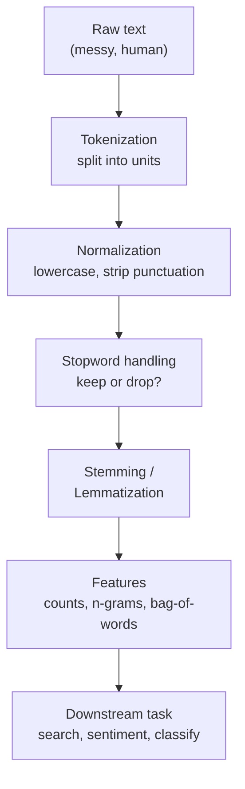

Welcome to **Natural Language Processing with Python**. This course
teaches you how computers turn messy human language — tweets, reviews,
emails, search queries, support tickets — into something a program can
count, compare, and reason about.

We deliberately stay in the world of **classic, rule-and-statistics NLP
built on [NLTK](https://www.nltk.org/)**. You will not train a neural
network or fine-tune a transformer here. Instead you will build the
*intuition* that every modern system — including ChatGPT — is still
standing on: how to break text into pieces, how to normalize it, how to
measure it, and how to turn it into features a downstream task can use.

<Callout type="info" title="Who this course is for">
You should already be comfortable with **Python fundamentals** —
strings, lists, loops, dictionaries, and list comprehensions — and the
basics of **string methods** (`strip`, `split`, `lower`, `replace`) and
**regular expressions** (the `re` module). You do **not** need any prior
exposure to linguistics, machine learning, or NLTK.
</Callout>

## Why this course exists

It is tempting to think NLP is "just string processing." After all,
`"the cat sat".split()` already gives you a list of words. Why do we
need a whole library, a whole field, a whole course?

Because human language is **ambiguous, irregular, and context-dependent**
in ways that break naive code almost immediately:

- Is `"U.S.A."` one token or three? Is `"don't"` one word or two?
- Are `"Apple"` (the company) and `"apple"` (the fruit) the same thing?
- Do `"run"`, `"running"`, `"ran"`, and `"runs"` mean the same thing for
  a search engine? (Usually yes.) For a grammar checker? (No.)
- Does removing the word `"not"` from `"not good"` change the meaning?
  (Catastrophically.)

Every preprocessing step you will learn here exists to solve a *specific*
problem like these. The goal of this course is that by the end you can
look at a text task and reason: *which* steps do I need, in *what* order,
and — just as important — which steps would *hurt*.

## The shape of the journey

The course follows this pipeline from left to right:

1. **Foundations** — what NLP is, why text is genuinely hard, and the
   standard preprocessing pipeline as a mental model.
2. **Tokenization** — splitting text into words and sentences, and why
   `str.split()` is *not* tokenization.
3. **Normalization** — lowercasing, punctuation handling, and stopword
   removal, including when each one *backfires*.
4. **Morphology & syntax** — stemming vs. lemmatization, and
   part-of-speech tagging.
5. **Counting & patterns** — frequency distributions, basic text
   statistics, and n-grams.
6. **Building something** — turning text into a bag-of-words feature
   matrix and writing a small rule-based sentiment classifier.

## How the interactive widgets work

Every code block on these pages runs **entirely in your browser** via
**Pyodide** (CPython compiled to WebAssembly). The first block on a page
that needs NLTK will quietly install it and download the small data files
it requires — so the very first run may take a few extra seconds, and
after that everything is cached.

<Callout type="warn" title="The first run downloads NLTK data">
NLTK ships its tokenizers, stopword lists, and dictionaries as separate
data packages. The interactive blocks call `nltk.download(...)` for you
inside the (collapsed) initialization code. If a block seems to hang on
its first run, it is fetching data — give it a moment.
</Callout>

Here is your very first NLP program. Run it, then try editing the
sentence.

<CodeBlock
  adapter="python"
  initCode={`import micropip
await micropip.install("nltk")
import nltk
nltk.download("punkt_tab", quiet=True)`}
  initialCode={`from nltk.tokenize import word_tokenize

text = "Hello, NLP! Let's turn language into data."

tokens = word_tokenize(text)
print("Tokens:", tokens)
print("Number of tokens:", len(tokens))
`}
/>

Notice what NLTK did that a plain `.split()` could not: it separated the
comma from `Hello`, the `!` from `NLP`, and split `Let's` into `Let` and
`'s`. That is your first hint that tokenization is more than splitting on
spaces — and we will dig into exactly why in the chapters ahead.

<Callout type="tip" title="Each block is isolated">
Variables you define in one code block are **not** visible in the next,
even on the same page. This keeps every example self-contained. If you
want a long-lived scratchpad, open the
[Python Playground](/playground/python) in another tab.
</Callout>

Ready? Let's begin by asking the most basic question of all: what *is*
Natural Language Processing, and why is it so much harder than it looks?
