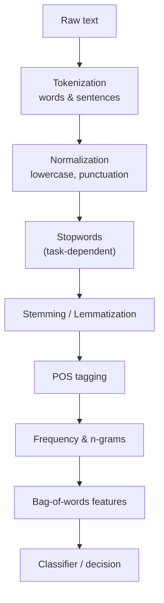
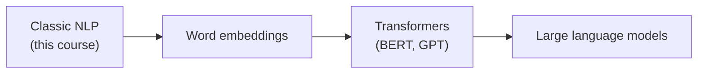

You started with raw, messy strings and finished by building a working
classifier that turns text into a decision. Along the way you built the
single most transferable skill in NLP: the ability to look at a text task
and reason about *which* steps it needs, in *what* order, and — crucially —
which steps would *hurt*.

## What you have learned

You can now:

- **Tokenize** text into words and sentences, and explain why this is more
  than `str.split()`.
- **Normalize** with lowercasing and punctuation handling — and name the
  cases where each backfires.
- Decide **when to remove stopwords** and when removing them (e.g. `not`)
  would wreck your task.
- Distinguish **stemming** (fast, crude chopping) from **lemmatization**
  (dictionary lookup) and choose between them deliberately.
- **POS-tag** text to resolve ambiguity and drive better lemmatization.
- Summarize text with **frequency distributions** and basic statistics.
- Capture local order with **n-grams**.
- Turn documents into **bag-of-words** feature vectors.
- Assemble it all into a transparent **rule-based classifier**.

## The most important idea to keep

<Callout type="info" title="Every step is a trade-off">
If you remember one thing from this course, make it this: **no
preprocessing step is automatically good.** Lowercasing helps search and
hurts entity recognition. Stopword removal helps topic analysis and wrecks
sentiment. Stemming is great for indexing and wrong for chatbots. The skill
is not *knowing the functions* — it is choosing them for the task in front
of you, because every step trades some information away.
</Callout>

## Where to go from here

This course deliberately stayed in the world of classic, transparent NLP.
Here is the map of what lies beyond, and roughly when you'd reach for it.

### 1. Statistical machine learning for text

The natural next step from the rule-based classifier: feed bag-of-words (or
TF-IDF) vectors into a learned model that discovers word weights from
labeled data.

| Topic | Why it matters |
| --- | --- |
| **TF-IDF weighting** | Reweights bag-of-words so distinctive words count more |
| **Naive Bayes** | The classic, fast text classifier — a probabilistic cousin of your lexicon scorer |
| **Logistic regression / SVM** | Strong, still-interpretable baselines for classification |
| **scikit-learn** | The standard library that ties vectorizing and modeling together |

### 2. Word embeddings

Move from "every word is an isolated column" to "words live in a space
where similar words are close." **Word2Vec** and **GloVe** are the classic
entry points, and they connect directly to the conceptual diagram from the
bag-of-words chapter.

### 3. Modern deep learning and LLMs

Transformers and large language models (BERT, GPT, and successors) are
extraordinarily capable. But notice where they sit on the map: *on top of*
everything you just learned. They still tokenize. They still benefit from
the next-token-prediction intuition you built with n-grams. Your
foundations make these systems far easier to understand and use well.

<Callout type="tip" title="Tools you'll meet next">
When you move beyond NLTK, you'll encounter **spaCy** (fast, production
pipelines), **scikit-learn** (classical ML), and **Hugging Face
Transformers** (modern models). We stuck with NLTK because it makes every
step visible and inspectable — the best way to *learn*. With these
fundamentals, picking up the production tools is mostly a matter of new
syntax, not new ideas.
</Callout>

## Keep practicing

The fastest way to cement these ideas is to apply the whole pipeline to
text you care about:

- Classify your own messages or reviews with the rule-based classifier, then
  expand its lexicon.
- Build a frequency distribution of a favorite book or article and find its
  most distinctive words.
- Extract adjective–noun pairs from product reviews with POS tagging.
- Compare stemming vs. lemmatization on the same paragraph and note where
  they disagree.

Every code block in this course is editable and runs in your browser — and
the [Python Playground](/playground/python) gives you a persistent
scratchpad to combine these techniques into something of your own.

<Callout type="success" title="Well done">
You've built a genuine, working understanding of how computers turn
language into data — from the first naive `.split()` to a negation-aware
classifier. That intuition is the durable foundation under every NLP system
you'll ever use, classic or cutting-edge. Go build something with it.
</Callout>
