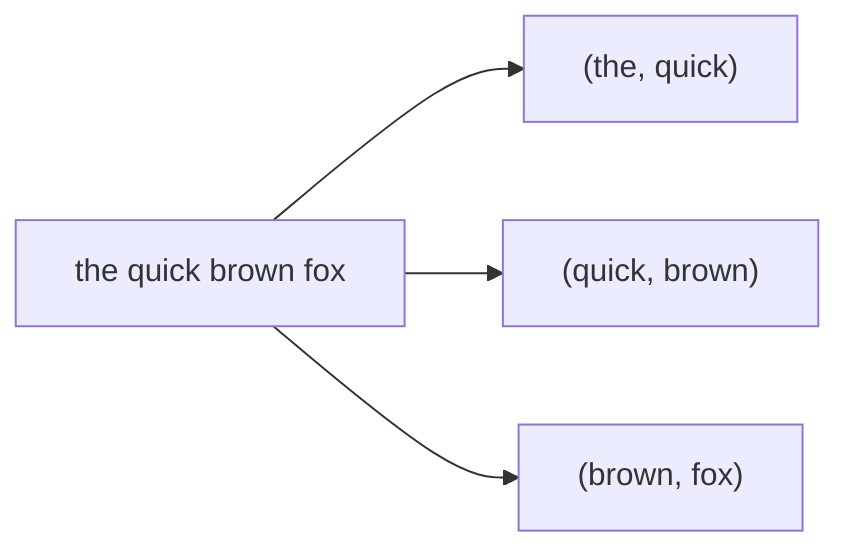
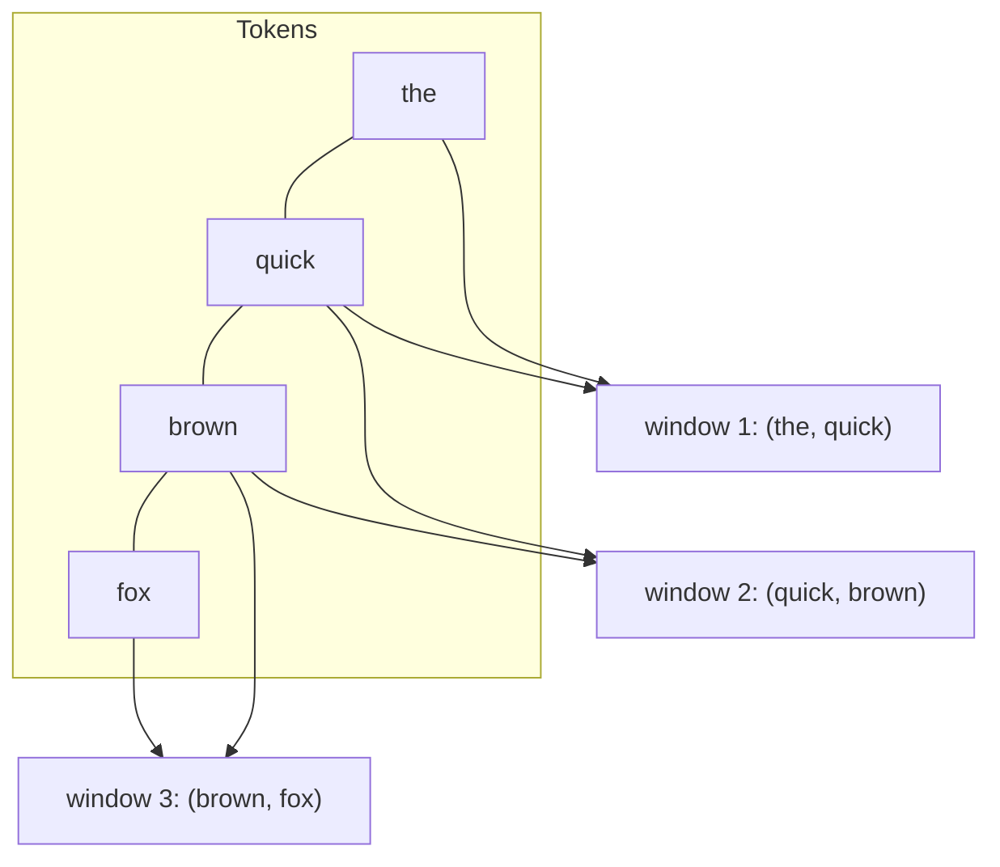
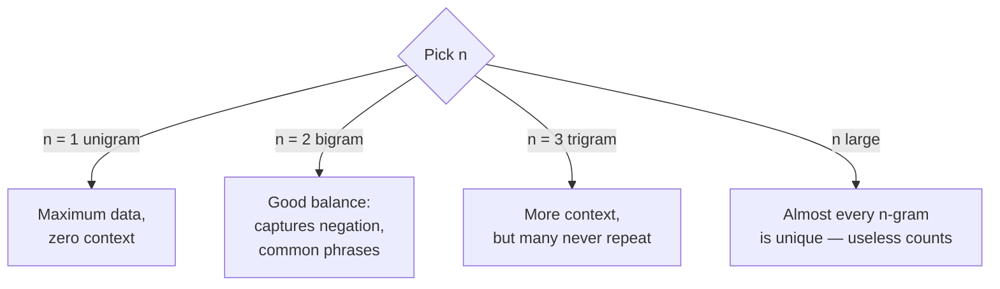

A frequency distribution throws away word order. **N-grams** are the
classic, lightweight way to win some of it back. An n-gram is simply a
**contiguous sequence of `n` tokens**. Slide a window of width `n` across
the text and record what you see:

- **Unigrams** (`n=1`): single tokens — `the`, `cat`, `sat`.
- **Bigrams** (`n=2`): pairs — `the cat`, `cat sat`.
- **Trigrams** (`n=3`): triples — `the cat sat`.

## The problem n-grams solve

Single words lose context. `not` and `good` as separate unigrams say
nothing about each other; but the **bigram** `(not, good)` captures the
fact that they occurred *together, in that order*. N-grams are the simplest
tool that can represent:

- **Negation:** `not good`, `never works`.
- **Multi-word concepts:** `New York`, `machine learning`, `credit card`.
- **Predictive context:** after `New York`, what word comes next?

By moving from unigrams to bigrams or trigrams, you let your features
"remember" a small window of order — without any of the machinery of a
neural network.

## Generating n-grams in NLTK

`nltk.ngrams(tokens, n)` returns the sliding-window tuples:

<CodeBlock
  adapter="python"
  initCode={`import micropip
await micropip.install("nltk")
import nltk`}
  initialCode={`from nltk import ngrams

tokens = ["the", "quick", "brown", "fox", "jumps"]

print("Bigrams:")
for g in ngrams(tokens, 2):
    print("  ", g)

print("Trigrams:")
for g in ngrams(tokens, 3):
    print("  ", g)
`}
/>

## How the window slides

The key intuition is that n-grams **overlap**. Each step moves the window
forward by exactly one token, so every interior token participates in
several n-grams. That overlap is what stitches local context together.

From a list of `L` tokens you get exactly `L - n + 1` n-grams (4 tokens, 3
bigrams; 4 tokens, 2 trigrams). The bigger `n` is, the fewer windows you
get — a trade-off we examine below.

## Counting n-grams: phrases, not just words

Combine n-grams with `FreqDist` and you get the most common *phrases*
rather than the most common *words*. This is the heart of phrase
extraction and predictive text:

<CodeBlock
  adapter="python"
  initCode={`import micropip
await micropip.install("nltk")
import nltk
nltk.download("punkt_tab", quiet=True)`}
  initialCode={`from nltk import ngrams, FreqDist
from nltk.tokenize import word_tokenize

text = ("I do not like it. I do not like that. "
        "I really do like this, but I do not like those.")

tokens = [t.lower() for t in word_tokenize(text) if t.isalpha()]

bigrams = list(ngrams(tokens, 2))
fd = FreqDist(bigrams)

print("Most common bigrams:")
for gram, count in fd.most_common(3):
    print(f"  {gram} -> {count}")
`}
/>

The top bigram `('do', 'not')` and `('not', 'like')` reveal a *pattern of
negation* that counting single words would completely miss. A unigram
counter would just see lots of `like` and conclude the text is positive.

## N-grams power autocomplete

Predictive text is essentially: "given the last `n-1` words, which word
most often comes next?" That is an n-gram frequency question.

<CodeBlock
  adapter="python"
  initCode={`import micropip
await micropip.install("nltk")
import nltk
nltk.download("punkt_tab", quiet=True)`}
  initialCode={`from nltk import ngrams, FreqDist
from nltk.tokenize import word_tokenize

corpus = ("I want to go home. I want to go now. I want to learn NLP. "
          "I want to go to the park.")
tokens = [t.lower() for t in word_tokenize(corpus) if t.isalpha()]

# Build trigram counts, then predict the word after "want to":
trigrams = FreqDist(ngrams(tokens, 3))

prefix = ("want", "to")
candidates = {g[2]: c for g, c in trigrams.items() if g[:2] == prefix}

print("After 'want to', candidates:", candidates)
best = max(candidates, key=candidates.get)
print("Predicted next word:", best)
`}
/>

The model predicts `go` after `want to`, because that sequence appeared
most often. This is — in miniature — exactly how classic statistical
language models and phone keyboards work.

## Choosing `n`: the sparsity trade-off

There is a fundamental tension:

- **Small `n`** (unigrams): lots of repetition, so counts are reliable —
  but you capture no context.
- **Large `n`** (4-grams, 5-grams): rich context, but most long sequences
  appear only **once** in any realistic corpus, so their counts can't
  support reliable statistics. This is the **sparsity** problem.

<Callout type="tip" title="Bigrams and trigrams are the workhorses">
In practice, **bigrams** and **trigrams** hit the sweet spot for most
classic NLP. They capture negation and common phrases while still
repeating often enough to count meaningfully. Going beyond trigrams
usually yields diminishing returns unless you have an enormous corpus.
</Callout>

<Callout type="info" title="N-grams are the bridge to modern NLP">
The intuition "predict the next token from the previous ones" scales all
the way up: a large language model is, in spirit, an extraordinarily
sophisticated next-token predictor with an effectively huge context
window. N-grams are the simplest, most transparent version of that same
idea — which is why they are such valuable intuition to build.
</Callout>

## Try it yourself

<ChallengeCard
  adapter="python"
  title="Most common trigram"
  instructions={`From \`text\`, build the list of word **trigrams** (lowercase, alphabetic tokens only) and store the single most common trigram tuple in **\`top_trigram\`** (just the tuple, not the count).

Hint: \`FreqDist(...).most_common(1)\` returns a list with one \`(gram, count)\` pair.`}
  initCode={`import micropip
await micropip.install("nltk")
import nltk
nltk.download("punkt_tab", quiet=True)
from nltk import ngrams, FreqDist
from nltk.tokenize import word_tokenize

text = ("thank you very much. thank you very kindly. "
        "we thank you very much for coming.")
`}
  initialCode={`# 'text', ngrams, FreqDist, word_tokenize are ready.
top_trigram = None  # TODO: the most common 3-gram tuple

print(top_trigram)
`}
  solutionCode={`tokens = [t.lower() for t in word_tokenize(text) if t.isalpha()]
fd = FreqDist(ngrams(tokens, 3))
top_trigram = fd.most_common(1)[0][0]
print(top_trigram)
`}
  tests={[
    {
      id: "is_tuple3",
      name: "`top_trigram` is a 3-tuple",
      description: "It should be a tuple of three tokens",
      code: `assert isinstance(top_trigram, tuple) and len(top_trigram) == 3, "top_trigram should be a 3-tuple"`,
    },
    {
      id: "correct",
      name: "Correct trigram",
      description: "The most common trigram is ('thank', 'you', 'very')",
      code: `assert top_trigram == ("thank", "you", "very"), f"got {top_trigram}"`,
    },
  ]}
/>

## Check your understanding

<MultipleChoice
  markdown={`What is a **bigram**?

- A word that appears exactly twice.
  > That's unrelated to n-grams; a word appearing twice is just a count of 2.
- [o] A contiguous sequence of two tokens, e.g. \`(not, good)\`.
  > A bigram is a 2-token sliding-window sequence.
- The two most frequent words in a text.
  > Frequency rank is a different concept.
- A two-sentence document.
  > N-grams are about token sequences, not sentences.

An n-gram is \`n\` consecutive tokens; a bigram is the \`n = 2\` case.`}
/>

<MultipleChoice
  markdown={`A unigram model counts \`not\` and \`good\` separately and sees lots of \`good\`, so it calls a review positive — but the review is full of \`not good\`. How do **bigrams** help?

- They remove the word \`not\`.
  > N-grams don't remove anything; they record sequences.
- [o] The bigram \`(not, good)\` records that the two words occurred together in order, capturing the negation a unigram misses.
  > N-grams preserve local order, which is exactly what negation needs.
- They lemmatize \`good\` to \`bad\`.
  > N-grams do no lemmatization, and \`good\` doesn't lemmatize to \`bad\`.
- They sort the words alphabetically.
  > Ordering of the vocabulary is irrelevant here.

Bigrams capture a one-word window of context, letting features represent
phrases like \`not good\` that single words cannot.`}
/>

<MultipleChoice
  markdown={`Why are very large n-grams (say 5-grams) usually unhelpful for counting-based methods?

- They are too fast to compute.
  > Speed is not the issue.
- [o] In any realistic corpus most long sequences appear only once, so their counts are too sparse to support reliable statistics.
  > This is the sparsity problem; rare sequences give unreliable counts.
- NLTK cannot generate n-grams beyond trigrams.
  > \`ngrams\` works for any \`n\`.
- Longer n-grams contain fewer words.
  > A 5-gram contains *more* words than a bigram.

As \`n\` grows, the number of distinct possible sequences explodes and most
occur once, so counts stop being meaningful. Bigrams and trigrams balance
context against repeatability.`}
/>

We have now turned text into tokens, tags, counts, and phrases. The final
step of the pipeline is to assemble these into a **feature matrix** a
machine-learning model can consume — the **bag-of-words** representation.
