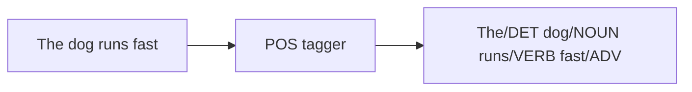
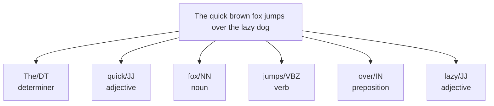

**Part-of-speech (POS) tagging** labels each token with its grammatical
category: noun, verb, adjective, adverb, pronoun, preposition, and so on.
It is the first step in this course that looks at a word *in context*
rather than in isolation — and that context is exactly what lets it
resolve ambiguity that single-word steps cannot.

## The problem POS tagging solves

Recall the **ambiguity** problem: the same string can play different
grammatical roles. Consider the word `fish`:

- "I **fish** every Sunday." → `fish` is a **verb**.
- "I caught a big **fish**." → `fish` is a **noun**.

The string is identical; only the surrounding words reveal the role. A POS
tagger reads the whole sentence and assigns the right tag to each word
based on context. This unlocks several things:

- **Disambiguation** — distinguish `book` (reserve) from `book` (object).
- **Better lemmatization** — recall that `WordNetLemmatizer` needs to know
  whether `running` is a noun or a verb.
- **Pattern extraction** — find all "adjective + noun" pairs (product
  features), or all verbs (actions) in a document.

## Tagging in NLTK

`nltk.pos_tag` takes a list of tokens and returns a list of
`(token, tag)` tuples. The tags come from the **Penn Treebank** tagset.

<CodeBlock
  adapter="python"
  initCode={`import micropip
await micropip.install("nltk")
import nltk
nltk.download("punkt_tab", quiet=True)
nltk.download("averaged_perceptron_tagger_eng", quiet=True)
nltk.download("averaged_perceptron_tagger", quiet=True)`}
  initialCode={`from nltk import pos_tag
from nltk.tokenize import word_tokenize

sentence = "The quick brown fox jumps over the lazy dog."
tokens = word_tokenize(sentence)
tags = pos_tag(tokens)

for token, tag in tags:
    print(f"{token:8} -> {tag}")
`}
/>

## Reading Penn Treebank tags

The tagset is detailed, but the first one or two letters tell you the
broad category, which is usually all you need:

| Tag | Meaning | Example |
| --- | --- | --- |
| `NN` / `NNS` | Noun (singular / plural) | dog / dogs |
| `NNP` | Proper noun | London |
| `VB` / `VBD` / `VBG` / `VBZ` | Verb (base / past / gerund / 3rd-person) | run / ran / running / runs |
| `JJ` / `JJR` / `JJS` | Adjective (base / comparative / superlative) | big / bigger / biggest |
| `RB` | Adverb | quickly |
| `PRP` | Personal pronoun | she |
| `DT` | Determiner | the, a |
| `IN` | Preposition / subordinating conj. | in, over |
| `CC` | Coordinating conjunction | and, but |
| `MD` | Modal | can, will |

<Callout type="tip" title="You rarely memorize the full tagset">
Notice the pattern: tags starting with `N` are nouns, `V` are verbs, `J`
are adjectives, `R` are adverbs. For most tasks you map the detailed tag to
one of these coarse buckets. You can always look a tag up at runtime with
`nltk.help.upenn_tagset("VBZ")`.
</Callout>

## Context, not the word, decides the tag

This is the heart of why POS tagging is more than a dictionary lookup.
Watch the *same word* `fish` get two different tags purely from context:

<CodeBlock
  adapter="python"
  initCode={`import micropip
await micropip.install("nltk")
import nltk
nltk.download("punkt_tab", quiet=True)
nltk.download("averaged_perceptron_tagger_eng", quiet=True)
nltk.download("averaged_perceptron_tagger", quiet=True)`}
  initialCode={`from nltk import pos_tag
from nltk.tokenize import word_tokenize

for sentence in ["I fish every Sunday.", "I caught a big fish."]:
    tags = pos_tag(word_tokenize(sentence))
    fish_tag = [t for w, t in tags if w == "fish"][0]
    print(f"{sentence:26} -> fish is tagged {fish_tag}")
`}
/>

In the first sentence `fish` is `VBP` (a verb); in the second it is `NN` (a
noun). No isolated dictionary lookup could do this — the tagger uses the
neighboring words (`I fish` vs. `a big fish`) to decide.

## POS-aware lemmatization: the payoff

Now we can close the loop from the previous chapter. By feeding the POS
tag into the lemmatizer, we lemmatize *correctly* across nouns, verbs, and
adjectives at once:

<CodeBlock
  adapter="python"
  initCode={`import micropip
await micropip.install("nltk")
import nltk
nltk.download("punkt_tab", quiet=True)
nltk.download("averaged_perceptron_tagger_eng", quiet=True)
nltk.download("averaged_perceptron_tagger", quiet=True)
nltk.download("wordnet", quiet=True)
nltk.download("omw-1.4", quiet=True)`}
  initialCode={`from nltk import pos_tag
from nltk.tokenize import word_tokenize
from nltk.stem import WordNetLemmatizer
from nltk.corpus import wordnet

def penn_to_wordnet(tag):
    # Map a Penn Treebank tag to a WordNet POS the lemmatizer understands.
    if tag.startswith("J"):
        return wordnet.ADJ
    if tag.startswith("V"):
        return wordnet.VERB
    if tag.startswith("R"):
        return wordnet.ADV
    return wordnet.NOUN  # default

lem = WordNetLemmatizer()
text = "The striped bats were hanging on their feet and eating best fruits"

tokens = word_tokenize(text)
tagged = pos_tag(tokens)

lemmas = [lem.lemmatize(word, penn_to_wordnet(tag)) for word, tag in tagged]
print("Tokens:", tokens)
print("Lemmas:", lemmas)
`}
/>

With POS information, `were → be`, `hanging → hang`, `feet → foot`, and
`eating → eat` all resolve correctly — something neither a stemmer nor a
POS-blind lemmatizer could achieve.

<Callout type="warn" title="POS taggers are statistical — they make mistakes">
The tagger is a trained model, not an oracle. On unusual, very short, or
grammatically odd sentences it will occasionally mislabel a word (for
example tagging an imperative verb as a noun). For clean prose it is highly
accurate, but never assume 100% correctness — downstream code should
tolerate the occasional wrong tag.
</Callout>

## A real-world use: extract adjective–noun pairs

POS tags let you pull out structured patterns. Product-review mining, for
instance, often looks for **adjective + noun** pairs (`great camera`,
`poor battery`) as candidate opinions about features:

<CodeBlock
  adapter="python"
  initCode={`import micropip
await micropip.install("nltk")
import nltk
nltk.download("punkt_tab", quiet=True)
nltk.download("averaged_perceptron_tagger_eng", quiet=True)
nltk.download("averaged_perceptron_tagger", quiet=True)`}
  initialCode={`from nltk import pos_tag
from nltk.tokenize import word_tokenize

review = "The camera has great image quality but a poor battery and slow software."
tags = pos_tag(word_tokenize(review))

pairs = []
for (w1, t1), (w2, t2) in zip(tags, tags[1:]):
    if t1.startswith("JJ") and t2.startswith("NN"):
        pairs.append(f"{w1} {w2}")

print("Adjective + noun pairs:", pairs)
`}
/>

In a few lines, raw text became a list of opinion phrases — the kind of
feature extraction that powers product-review summarizers.

## Try it yourself

<ChallengeCard
  adapter="python"
  title="Collect all the verbs"
  instructions={`Tag the \`sentence\` and build a list called **\`verbs\`** containing every **token whose POS tag starts with \`"VB"\`** (all verb forms: VB, VBD, VBG, VBN, VBP, VBZ).

Keep the original token text (not the tag).`}
  initCode={`import micropip
await micropip.install("nltk")
import nltk
nltk.download("punkt_tab", quiet=True)
nltk.download("averaged_perceptron_tagger_eng", quiet=True)
nltk.download("averaged_perceptron_tagger", quiet=True)
from nltk import pos_tag
from nltk.tokenize import word_tokenize

sentence = "She quickly wrote the report, printed it, and emailed her boss."
`}
  initialCode={`# 'sentence', pos_tag, and word_tokenize are ready.
tags = pos_tag(word_tokenize(sentence))
print("Tags:", tags)

verbs = None  # TODO: tokens whose tag starts with "VB"

print("Verbs:", verbs)
`}
  solutionCode={`tags = pos_tag(word_tokenize(sentence))
verbs = [w for w, t in tags if t.startswith("VB")]
print("Tags:", tags)
print("Verbs:", verbs)
`}
  tests={[
    {
      id: "is_list",
      name: "`verbs` is a list",
      description: "verbs should be a list",
      code: `assert isinstance(verbs, list), "verbs should be a list"`,
    },
    {
      id: "has_verbs",
      name: "Finds the verbs",
      description: "'wrote', 'printed', and 'emailed' should be present",
      code: `for v in ["wrote", "printed", "emailed"]:
    assert v in verbs, f"missing verb: {v}"`,
    },
    {
      id: "no_nouns",
      name: "Excludes non-verbs",
      description: "'report' and 'boss' are nouns and must not appear",
      code: `for n in ["report", "boss"]:
    assert n not in verbs, f"'{n}' is not a verb and should be excluded"`,
    },
  ]}
/>

## Check your understanding

<MultipleChoice
  markdown={`What does part-of-speech tagging assign to each token?

- Its sentiment (positive or negative).
  > That's sentiment analysis, a different task.
- [o] Its grammatical category in context (noun, verb, adjective, etc.).
  > Correct — POS tagging labels the word's syntactic role.
- Its frequency in the document.
  > That's a frequency distribution, covered later.
- Its dictionary definition.
  > A tagger gives the grammatical role, not the definition.

POS tagging answers "what *kind* of word is this, here?" — a grammatical
label that depends on context.`}
/>

<MultipleChoice
  markdown={`In "I fish every Sunday" the tagger labels \`fish\` a verb, but in "I caught a big fish" it labels \`fish\` a noun. What does this demonstrate?

- The tagger is inconsistent and unreliable.
  > It's being *correct* — the two \`fish\`es really do have different roles.
- [o] A word's part of speech depends on context, so the tagger uses surrounding words rather than the word alone.
  > Exactly — context decides the tag, which is why a plain dictionary lookup can't do this.
- \`fish\` is always a noun and the first tag is wrong.
  > \`fish\` is genuinely a verb in "I fish every Sunday."
- The tagger first lemmatizes the word.
  > Tagging does not lemmatize; it labels grammatical roles.

The same string can take different tags depending on its neighbors. That
context-sensitivity is the entire reason POS tagging exists.`}
/>

<MultipleChoice
  markdown={`Why is POS tagging useful *before* lemmatization?

- It removes stopwords for the lemmatizer.
  > Tagging doesn't remove anything.
- [o] The lemmatizer needs each word's part of speech to choose the correct base form (e.g. \`running\`→\`run\` only when treated as a verb).
  > Correct — feeding the POS into the lemmatizer fixes verbs and adjectives that the noun default would miss.
- Lemmatization is impossible without tagging.
  > It's possible (POS defaults to noun), just less accurate.
- Tagging makes lemmatization run faster.
  > It improves *accuracy*, not speed.

POS-aware lemmatization is the payoff: with the tag in hand, \`were\`→\`be\`
and \`feet\`→\`foot\` resolve correctly across all word classes.`}
/>

We can now label words by role. Next we shift from *structure* to
*statistics*: how often does each word appear, and what does that tell us?
That's the world of **frequency distributions**.
