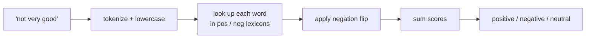
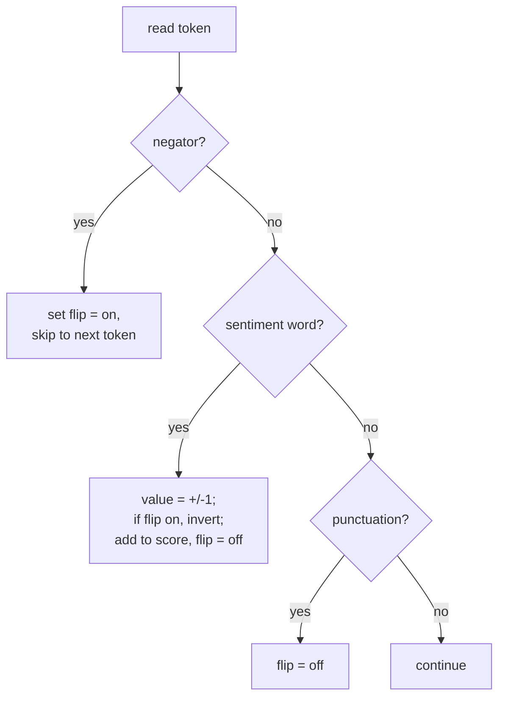
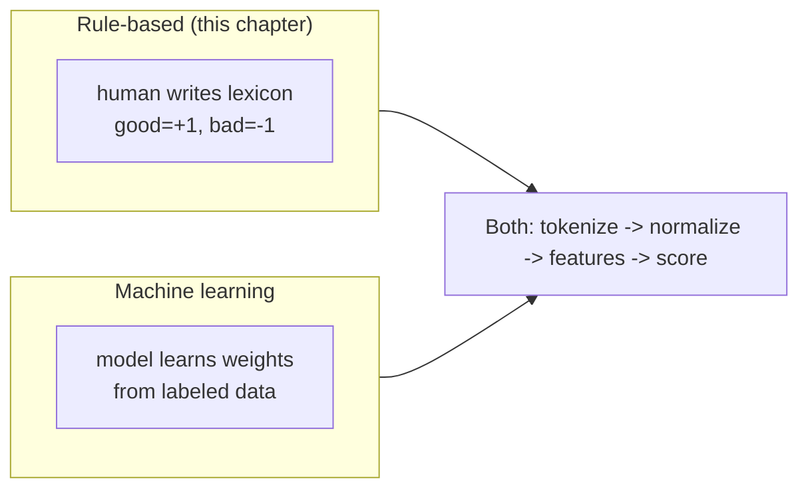

Time to build something end-to-end. In this capstone we assemble the
pieces from every previous chapter into a **rule-based sentiment
classifier**: a program that reads a sentence and decides whether it is
**positive**, **negative**, or **neutral** — using nothing but
tokenization, normalization, word lists, and the negation insight from the
stopwords chapter.

No machine learning, no training data. Just transparent rules you can read,
trace, and debug. That transparency is the whole point: you will *see*
exactly why each step from the pipeline mattered.

## The strategy: sentiment lexicons

A **lexicon** is just a list of words with known polarity: `good`, `great`,
`love` are positive; `bad`, `terrible`, `hate` are negative. The simplest
sentiment system counts positive words, subtracts negative words, and
reports the sign of the total.

<CodeBlock
  adapter="python"
  initCode={`import micropip
await micropip.install("nltk")
import nltk
nltk.download("punkt_tab", quiet=True)`}
  initialCode={`from nltk.tokenize import word_tokenize

positive = {"good", "great", "love", "excellent", "amazing",
            "wonderful", "best", "happy", "fantastic", "nice", "awesome"}
negative = {"bad", "terrible", "hate", "awful", "worst", "poor",
            "horrible", "disappointing", "boring", "slow", "broken"}

def naive_score(text):
    tokens = [t.lower() for t in word_tokenize(text)]
    score = 0
    for t in tokens:
        if t in positive:
            score += 1
        elif t in negative:
            score -= 1
    return score

for review in ["This movie was great!", "The food was terrible and boring."]:
    print(f"{naive_score(review):+d}  {review}")
`}
/>

So far so good — `+1` for the praise, `-2` for the complaint. But this
naive version has the exact flaw we warned about in the **stopwords**
chapter.

## The negation problem strikes again

Run the naive scorer on a negated sentence and watch it fail:

<CodeBlock
  adapter="python"
  initCode={`import micropip
await micropip.install("nltk")
import nltk
nltk.download("punkt_tab", quiet=True)`}
  initialCode={`from nltk.tokenize import word_tokenize

positive = {"good", "great", "love", "nice"}
negative = {"bad", "terrible", "hate"}

def naive_score(text):
    tokens = [t.lower() for t in word_tokenize(text)]
    return sum((1 if t in positive else -1 if t in negative else 0)
               for t in tokens)

review = "This movie was not good at all."
print(f"Score: {naive_score(review):+d}  ->  {review}")
print("The word 'good' scored +1, but the review is NEGATIVE!")
`}
/>

`not good` scored `+1` because the scorer never noticed the `not`. This is
the **context** problem made concrete: the meaning of `good` depends on the
word before it. To fix it, we handle negation explicitly.

## Adding negation handling

The classic trick: when we see a **negator** (`not`, `no`, `never`,
`n't`), **flip the polarity of the next sentiment word**. We reset the flip
at punctuation, because negation does not usually carry across a clause
boundary.

Here is the complete classifier:

<CodeBlock
  adapter="python"
  initCode={`import micropip
await micropip.install("nltk")
import nltk
nltk.download("punkt_tab", quiet=True)`}
  initialCode={`from nltk.tokenize import word_tokenize

positive = {"good", "great", "love", "excellent", "amazing", "wonderful",
            "best", "happy", "fantastic", "nice", "awesome", "like"}
negative = {"bad", "terrible", "hate", "awful", "worst", "poor",
            "horrible", "disappointing", "boring", "slow", "broken"}
negators = {"not", "no", "never", "n't", "without"}
clause_breaks = {".", "!", "?", ",", ";"}

def classify(text):
    tokens = [t.lower() for t in word_tokenize(text)]
    score = 0
    negate = False
    for t in tokens:
        if t in negators:
            negate = True
            continue
        value = 1 if t in positive else -1 if t in negative else 0
        if value != 0:
            if negate:
                value = -value      # flip the polarity
            score += value
            negate = False          # negation applies to one word
        if t in clause_breaks:
            negate = False          # negation doesn't cross clauses
    label = "positive" if score > 0 else "negative" if score < 0 else "neutral"
    return score, label

reviews = [
    "This movie was great!",
    "This movie was not good at all.",
    "The food was terrible and boring.",
    "I do not hate it, it is actually nice.",
    "It is okay.",
]
for r in reviews:
    score, label = classify(r)
    print(f"{label:9} ({score:+d})  {r}")
`}
/>

Now read the results:

- `"not good"` → **negative** — the negation flip worked.
- `"I do not hate it ... nice"` → **positive** — `not hate` flips to
  positive, and `nice` adds to it.
- `"It is okay."` → **neutral** — no lexicon words matched, score `0`.

Every earlier chapter shows up here: **tokenization** exposed `n't` as a
separate token, **normalization** (lowercasing) let the lexicon match
regardless of case, and the **stopwords** lesson told us never to discard
`not`.

## Why a rule-based approach — and its limits

<Callout type="success" title="Strengths of rule-based classifiers">
- **Transparent:** you can explain *exactly* why any text got its label.
- **No training data:** works on day one with a hand-written lexicon.
- **Easy to tweak:** add a domain word to a set and you're done.
- **Fast and tiny:** no model to train or host.
</Callout>

<Callout type="warn" title="Where rule-based classifiers break">
- **Coverage:** any sentiment word not in your lexicon is invisible.
- **Sarcasm & irony:** "Oh *great*, it broke again" scores positive.
- **Intensity & context:** it can't tell `good` from `absolutely
  phenomenal`, or know that `cold` is bad for soup but fine for beer.
- **Comparatives:** "better than nothing" is hard to score by word lookup.

These are the very limits that motivate **machine-learning** classifiers,
which learn word weights (and even context) from labeled examples instead
of relying on a fixed list. But notice: an ML sentiment model still
*tokenizes*, *normalizes*, and turns text into *features* first. You have
already built the foundation it stands on.
</Callout>

## How this connects to bag-of-words

A machine-learning classifier replaces our hand-written `+1 / -1` lexicon
with **learned weights** for every word in a bag-of-words vector. Instead of
*you* deciding `good = +1`, the model reads thousands of labeled reviews
and discovers that `good` predicts positive and `refund` predicts negative.
The pipeline is identical; only the source of the weights changes.

## Try it yourself

<ChallengeCard
  adapter="python"
  title="Add intensity-free negation scoring"
  instructions={`Complete the \`classify\` function so it returns the integer **\`score\`** for the given \`text\`, applying the negation rule:

- Lowercase and tokenize with \`word_tokenize\`.
- A word in \`positive\` is worth \`+1\`; a word in \`negative\` is worth \`-1\`.
- If a **negator** (in \`negators\`) was the previous meaningful token, **flip** the sign of the next sentiment word, then clear the negation.
- A negator itself contributes \`0\` to the score.

Return just the integer score.`}
  initCode={`import micropip
await micropip.install("nltk")
import nltk
nltk.download("punkt_tab", quiet=True)
from nltk.tokenize import word_tokenize

positive = {"good", "great", "love", "nice", "happy"}
negative = {"bad", "terrible", "hate", "sad"}
negators = {"not", "no", "never", "n't"}

text = "I do not love it but it is not bad."
`}
  initialCode={`def classify(text):
    tokens = [t.lower() for t in word_tokenize(text)]
    score = 0
    negate = False
    # TODO: loop over tokens, apply +1/-1 with the negation flip
    return score

print("Score:", classify(text))
`}
  solutionCode={`def classify(text):
    tokens = [t.lower() for t in word_tokenize(text)]
    score = 0
    negate = False
    for t in tokens:
        if t in negators:
            negate = True
            continue
        value = 1 if t in positive else -1 if t in negative else 0
        if value != 0:
            if negate:
                value = -value
            score += value
            negate = False
    return score

print("Score:", classify(text))
`}
  tests={[
    {
      id: "not_love",
      name: "Handles 'not love'",
      description: "'I do not love it' alone should score -1",
      code: `assert classify("I do not love it") == -1, "negated positive should be -1"`,
    },
    {
      id: "not_bad",
      name: "Handles 'not bad'",
      description: "'it is not bad' alone should score +1",
      code: `assert classify("it is not bad") == 1, "negated negative should be +1"`,
    },
    {
      id: "plain",
      name: "Handles plain sentiment",
      description: "'great and happy' should score +2",
      code: `assert classify("great and happy") == 2, "two positives should be +2"`,
    },
    {
      id: "full_sentence",
      name: "Scores the full example",
      description: "'I do not love it but it is not bad.' -> -1 + 1 = 0",
      code: `assert classify("I do not love it but it is not bad.") == 0, "expected net score 0"`,
    },
  ]}
/>

## Check your understanding

<MultipleChoice
  markdown={`What is a sentiment **lexicon**?

- A neural network trained on reviews.
  > That's a machine-learning model, not a lexicon.
- [o] A list of words labeled with their polarity (positive or negative) used to score text by lookup.
  > A lexicon is just polarity-tagged words.
- A tokenizer specialized for emotions.
  > Tokenizing and lexicon lookup are separate steps.
- The vocabulary of all words in a document.
  > A plain vocabulary has no polarity labels.

A lexicon maps words to sentiment values. The simplest classifier sums
those values across a text.`}
/>

<MultipleChoice
  markdown={`In the negation-aware classifier, why do we reset the negation flag at punctuation like \`.\` or \`,\`?

- Punctuation tokens are positive words.
  > They carry no polarity in this design.
- [o] Negation typically applies only within a clause, so it should not carry across a clause boundary marked by punctuation.
  > Resetting at punctuation keeps "not good, but happy" from mis-flipping \`happy\`.
- Because \`word_tokenize\` deletes punctuation.
  > It keeps punctuation as its own tokens, which is why we can check for them.
- To make the score larger.
  > Resetting has nothing to do with inflating the score.

Negation scope is local. Clearing the flag at clause boundaries stops a
\`not\` in one clause from inverting sentiment words in the next.`}
/>

<MultipleChoice
  markdown={`The classifier labels "Oh great, it broke again" as **positive**. Which limitation of rule-based sentiment does this expose?

- A tokenization bug.
  > Tokenization is correct; the issue is meaning.
- A stopword-removal error.
  > No stopword handling is involved here.
- [o] It cannot detect **sarcasm/irony** — it takes \`great\` at face value despite the negative intent.
  > Literal lexicon lookup has no way to sense ironic intent.
- The lexicon is missing the word \`broke\`.
  > Even with \`broke\` added, the sarcastic \`great\` would still mislead a literal scorer.

Sarcasm flips surface meaning in a way a fixed word list can't capture —
one of the classic reasons teams move from rules to learned models.`}
/>

<MultipleChoice
  markdown={`How does a **machine-learning** sentiment classifier most fundamentally differ from this rule-based one?

- It skips tokenization and normalization.
  > It still tokenizes and normalizes; those steps don't disappear.
- [o] Instead of a human assigning \`+1/-1\` weights, the model **learns** per-word weights from labeled examples.
  > The source of the weights changes from hand-authored to data-driven.
- It cannot handle negation at all.
  > ML models can learn negation effects from data.
- It requires no features.
  > It consumes features (e.g. bag-of-words) just like any text model.

The pipeline (text → tokens → features → score) is shared; ML simply
replaces the hand-written lexicon with weights learned from data.`}
/>

You have built a complete, working NLP system from raw text to a decision.
The final page looks at where to go next — including the modern methods we
deliberately set aside.
