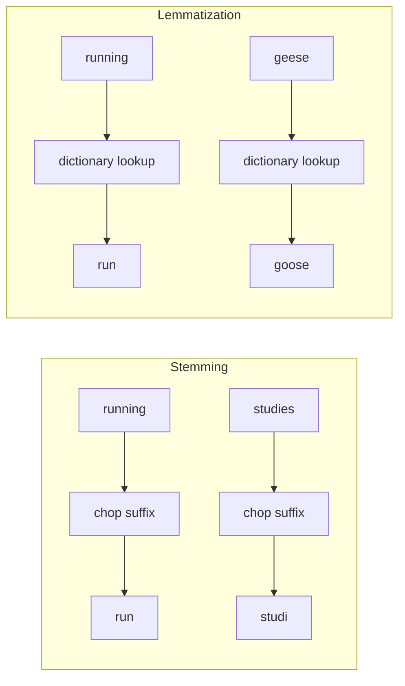
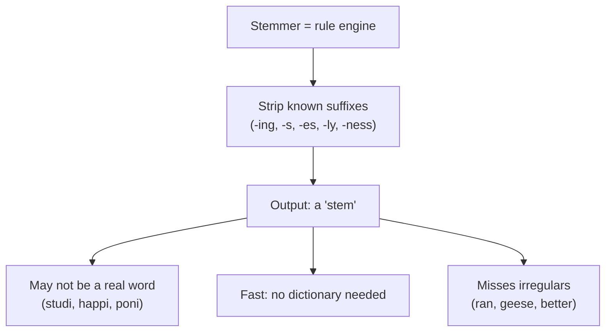
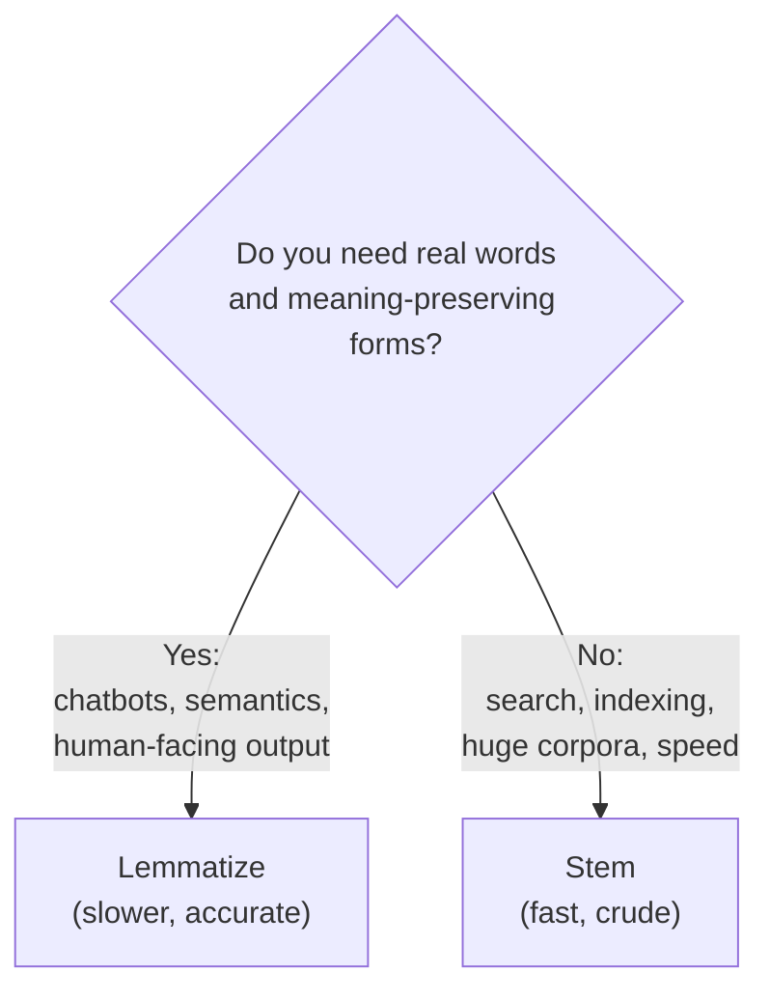

`run`, `runs`, `running`, and `ran` are four spellings of one idea. For
many tasks we want them to count as the **same** token. The two classic
techniques for collapsing inflected forms are **stemming** and
**lemmatization**. They aim at the same goal but work in completely
different ways, and confusing them is a common source of bugs.

## The shared problem: morphological variation

Languages add prefixes and suffixes to a root to express tense, number,
and so on. This is called **inflection**: `cat` → `cats`, `study` →
`studied` → `studying`. To a string-comparing computer these are unrelated
tokens. Both stemming and lemmatization attack this **variation** problem
by mapping many forms to one canonical form, shrinking the vocabulary and
letting different forms of a word match.

The difference is *how* they find that canonical form.

## Stemming: fast, crude suffix-chopping

A **stemmer** applies a fixed set of rules that chop off common endings.
It does not know any words; it just rewrites suffixes. NLTK's most famous
stemmer is the **Porter stemmer**.

<CodeBlock
  adapter="python"
  initCode={`import micropip
await micropip.install("nltk")
import nltk`}
  initialCode={`from nltk.stem import PorterStemmer

stemmer = PorterStemmer()

words = ["running", "runs", "ran", "studies", "studying",
         "happiness", "ponies", "easily", "caresses"]

for w in words:
    print(f"{w:12} -> {stemmer.stem(w)}")
`}
/>

Run it and study the output carefully — the quirks are the whole point:

- `running`, `runs` → `run` 
- `studies`, `studying` → `studi` — **not a real word!**
- `happiness` → `happi`, `ponies` → `poni`, `easily` → `easili`
- `ran` → `ran` — the *irregular* past tense is **not** collapsed to `run`,
  because no suffix rule applies.

<Callout type="info" title="Why would we want non-words like 'studi'?">
Because consistency matters more than prettiness for many tasks. As long
as `studies`, `studied`, and `studying` *all* map to the same stem
`studi`, a search engine can match them to each other. The stem is just an
internal key; nobody needs to read it. Stemming trades human-readability
for speed and simplicity.
</Callout>

## Lemmatization: slower, dictionary-based normalization

A **lemmatizer** maps a word to its **lemma** — its real dictionary
base form — using a vocabulary and (ideally) the word's part of speech.
NLTK's `WordNetLemmatizer` looks words up in the WordNet dictionary.

<CodeBlock
  adapter="python"
  initCode={`import micropip
await micropip.install("nltk")
import nltk
nltk.download("wordnet", quiet=True)
nltk.download("omw-1.4", quiet=True)`}
  initialCode={`from nltk.stem import WordNetLemmatizer

lem = WordNetLemmatizer()

# Irregular plurals — where stemming fails — lemmatization nails:
for w in ["mice", "feet", "geese", "cats"]:
    print(f"{w:8} -> {lem.lemmatize(w)}")
`}
/>

`mice → mouse`, `feet → foot`, `geese → goose`: a lemmatizer knows these
irregular forms because they are *in the dictionary*, whereas a
suffix-chopping stemmer has no rule for them. Every lemma is guaranteed to
be a real word.

### Lemmatization needs the part of speech

Here is the subtlety that trips up most beginners: `WordNetLemmatizer`
assumes every word is a **noun** unless you tell it otherwise. That makes
it leave verbs and adjectives alone:

<CodeBlock
  adapter="python"
  initCode={`import micropip
await micropip.install("nltk")
import nltk
nltk.download("wordnet", quiet=True)
nltk.download("omw-1.4", quiet=True)`}
  initialCode={`from nltk.stem import WordNetLemmatizer

lem = WordNetLemmatizer()

print("Default (treats word as a NOUN):")
print("  running ->", lem.lemmatize("running"))   # 'running' (unchanged!)
print("  better  ->", lem.lemmatize("better"))    # 'better'  (unchanged!)
print()
print("With the correct part of speech:")
print("  running ->", lem.lemmatize("running", pos="v"))  # 'run'
print("  better  ->", lem.lemmatize("better",  pos="a"))  # 'good'
`}
/>

Telling the lemmatizer that `running` is a verb (`pos="v"`) yields `run`;
telling it `better` is an adjective (`pos="a"`) yields `good`. This is why
lemmatization and **part-of-speech tagging** (next chapter) are natural
partners: good lemmatization wants to know each word's POS.

## Stemming vs. lemmatization at a glance

| | **Stemming** | **Lemmatization** |
| --- | --- | --- |
| **Method** | Chop suffixes by rules | Dictionary lookup |
| **Output** | A stem (maybe not a real word) | A lemma (always a real word) |
| **Needs POS?** | No | Yes, for good results |
| **Speed** | Very fast | Slower |
| **Irregulars** (`geese`, `ran`) | Missed | Handled |
| **Readability** | Low (`studi`, `happi`) | High (`study`, `happy`) |
| **Best for** | Search, IR, speed-critical | Semantics, readable output, chatbots |

<Callout type="tip" title="Why lemmatization is preferred for semantic tasks">
When the *meaning* of the output matters — a chatbot that must understand
`was`, `is`, and `were` all mean **be**, or a system that should treat
`better` and `good` as related — lemmatization wins because it maps to
true base forms and respects irregular words. Stemming's `wa` (from `was`)
or `gees` (from `geese`) would break that semantic linking. Reserve
stemming for when you only need *consistency* and *speed*, not meaning.
</Callout>

<Callout type="warn" title="Common misconception">
"Lemmatization is just a better stemmer, so always use it." Not quite.
Lemmatization is slower and needs POS information and a dictionary
download. For indexing billions of documents where you only need different
forms to *collide*, a stemmer is often the pragmatic, correct engineering
choice. Neither is universally "better" — they optimize for different
things.
</Callout>

## See them disagree

<CodeBlock
  adapter="python"
  initCode={`import micropip
await micropip.install("nltk")
import nltk
nltk.download("wordnet", quiet=True)
nltk.download("omw-1.4", quiet=True)`}
  initialCode={`from nltk.stem import PorterStemmer, WordNetLemmatizer

ps = PorterStemmer()
lem = WordNetLemmatizer()

words = ["studies", "studying", "geese", "better", "happiness", "caring"]

print(f"{'word':12}{'stem':12}{'lemma (noun)':14}")
print("-" * 38)
for w in words:
    print(f"{w:12}{ps.stem(w):12}{lem.lemmatize(w):14}")
`}
/>

Notice `studies`: the stemmer gives `studi` (not a word); the lemmatizer
gives `study` (a word). And `geese`: the stemmer gives `gees`; the
lemmatizer gives `goose`. The lemmatizer's outputs are always real words;
the stemmer's are just consistent keys.

## Try it yourself

<ChallengeCard
  adapter="python"
  title="Compare stem and lemma side by side"
  instructions={`For each word in \`words\`, build a list of tuples called **\`pairs\`** where each tuple is \`(word, porter_stem, wordnet_lemma)\`.

Use a \`PorterStemmer\` for the stem and a \`WordNetLemmatizer\` with the **default** part of speech (noun) for the lemma.`}
  initCode={`import micropip
await micropip.install("nltk")
import nltk
nltk.download("wordnet", quiet=True)
nltk.download("omw-1.4", quiet=True)
from nltk.stem import PorterStemmer, WordNetLemmatizer

words = ["mice", "studies", "running", "happiness"]
`}
  initialCode={`# 'words', PorterStemmer, and WordNetLemmatizer are ready.
ps = PorterStemmer()
lem = WordNetLemmatizer()

pairs = None  # TODO: list of (word, stem, lemma) tuples

for row in pairs:
    print(row)
`}
  solutionCode={`ps = PorterStemmer()
lem = WordNetLemmatizer()
pairs = [(w, ps.stem(w), lem.lemmatize(w)) for w in words]
for row in pairs:
    print(row)
`}
  tests={[
    {
      id: "is_list",
      name: "`pairs` is a list of triples",
      description: "pairs should be a list of 3-tuples",
      code: `assert isinstance(pairs, list) and all(len(t) == 3 for t in pairs), "pairs must be a list of 3-tuples"`,
    },
    {
      id: "stem_correct",
      name: "Stems are correct",
      description: "Porter stem of 'studies' is 'studi'",
      code: `d = {t[0]: t[1] for t in pairs}
assert d["studies"] == "studi", f"expected 'studi', got {d['studies']}"`,
    },
    {
      id: "lemma_correct",
      name: "Lemmas are correct",
      description: "Lemma of 'mice' is 'mouse'",
      code: `d = {t[0]: t[2] for t in pairs}
assert d["mice"] == "mouse", f"expected 'mouse', got {d['mice']}"`,
    },
  ]}
/>

## Check your understanding

<MultipleChoice
  markdown={`What is the fundamental difference between stemming and lemmatization?

- Stemming works on sentences; lemmatization works on words.
  > Both operate on individual words.
- [o] Stemming chops suffixes by fixed rules and may produce non-words; lemmatization looks words up in a dictionary and always returns a real base form.
  > Rule-based chopping vs. dictionary-based lookup is the core distinction.
- Stemming uses a dictionary; lemmatization uses rules.
  > It's the reverse — lemmatization is the dictionary-based one.
- They are two names for the same algorithm.
  > They are genuinely different approaches with different trade-offs.

Stemming is a fast rule engine that can output non-words like \`studi\`;
lemmatization is a dictionary lookup that returns real lemmas like
\`study\`.`}
/>

<MultipleChoice
  markdown={`Why does the Porter stemmer turn \`studies\` into \`studi\` instead of \`study\`?

- It has a bug.
  > It's behaving exactly as designed.
- [o] It mechanically strips the \`-es\` suffix without consulting any dictionary, so it produces a consistent key rather than a real word.
  > The stem is an internal key, not meant to be a real word.
- \`studi\` is the correct English base form of \`studies\`.
  > The real base form is \`study\`; \`studi\` is just the stem.
- It first lemmatizes, then chops.
  > Stemming does no dictionary lookup at all.

Stemmers value speed and consistency over correctness. As long as all
forms of a word map to the same stem, the non-word output is acceptable
for tasks like search.`}
/>

<MultipleChoice
  markdown={`You are building a **chatbot** that must understand that \`was\`, \`is\`, and \`were\` all refer to the verb *be*. Which tool is the better fit, and why?

- A stemmer, because it is faster.
  > Speed isn't the deciding factor here, and a stemmer would give \`wa\`/\`is\`/\`were\`, not \`be\`.
- [o] A lemmatizer (with verb POS), because it maps irregular forms to the true base \`be\`, preserving meaning.
  > Semantic understanding needs real base forms, which only lemmatization provides.
- Neither — stemming and lemmatization are interchangeable.
  > They are not; only lemmatization recovers \`be\` from \`was\`.
- A stopword filter, because \`was\` and \`is\` are stopwords.
  > Removing them would discard the verb entirely, which is worse.

For meaning-preserving tasks, lemmatization's dictionary lookup is
essential. A stemmer would mangle \`was\` into \`wa\` and never connect it
to \`be\`.`}
/>

<MultipleChoice
  markdown={`By default, \`WordNetLemmatizer().lemmatize("running")\` returns \`"running"\` unchanged. Why?

- WordNet does not contain the word \`running\`.
  > It does; the issue is the assumed part of speech.
- [o] The lemmatizer assumes a **noun** unless told otherwise, and \`running\` is a valid noun, so it isn't reduced. Passing \`pos="v"\` returns \`run\`.
  > POS controls lemmatization, and the noun default leaves verb forms untouched.
- The lemmatizer is broken without a stemmer.
  > It works fine; it just needs the right POS.
- \`running\` is a stopword.
  > It is not a stopword.

\`WordNetLemmatizer\` is POS-sensitive and defaults to noun. That is exactly
why lemmatization pairs so naturally with part-of-speech tagging — our next
topic.`}
/>

Lemmatization works best when it knows each word's part of speech. So
let's learn how to *find* the part of speech of every word: **POS
tagging**.
