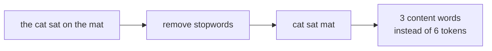
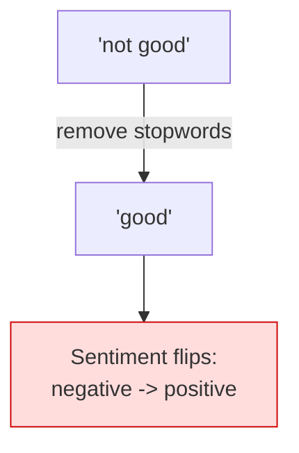
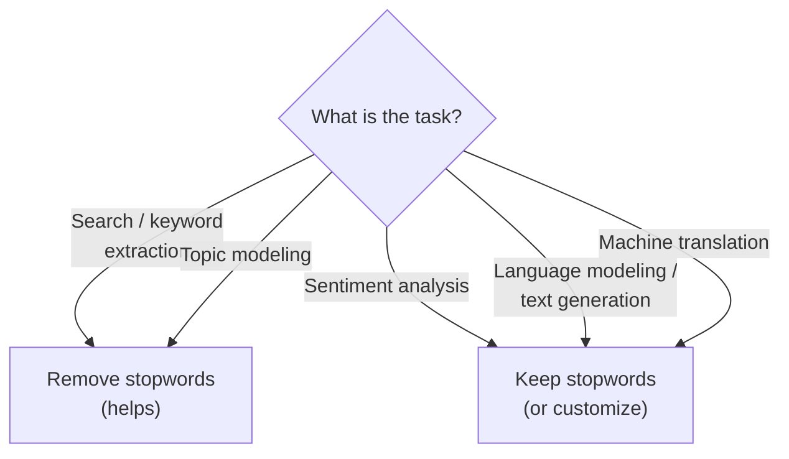

**Stopwords** are extremely common words — `the`, `is`, `at`, `and`, `a`,
`of` — that appear in almost every document and therefore carry little
information about what a document is *about*. Removing them is a classic
preprocessing step, but it is also one of the most over-applied steps in
all of NLP. This chapter is as much about *when not* to remove stopwords
as about how.

## The problem stopwords removal addresses

Imagine indexing a million documents for search. The word `the` appears in
essentially every one of them. Knowing a document contains `the` tells you
*nothing* about which documents are relevant to a query. These
high-frequency, low-information words:

- inflate your vocabulary and storage,
- dominate raw word counts, drowning out meaningful words,
- add noise to similarity comparisons between documents.

For tasks where a document is summarized by *which content words it
contains* — search, topic modeling, keyword extraction — dropping
stopwords sharpens the signal.

## Removing stopwords with NLTK

NLTK ships curated stopword lists for many languages. Run this to inspect
the English list and apply it:

<CodeBlock
  adapter="python"
  initCode={`import micropip
await micropip.install("nltk")
import nltk
nltk.download("punkt_tab", quiet=True)
nltk.download("stopwords", quiet=True)`}
  initialCode={`from nltk.corpus import stopwords
from nltk.tokenize import word_tokenize

stop = set(stopwords.words("english"))
print("Number of English stopwords:", len(stop))
print("A sample:", sorted(list(stop))[:12])
print()

text = "The quick brown fox jumps over the lazy dog"
tokens = [t.lower() for t in word_tokenize(text)]
kept = [t for t in tokens if t not in stop]

print("Original:", tokens)
print("Kept    :", kept)
`}
/>

The sentence drops from 9 tokens to the 6 content words
(`quick brown fox jumps lazy dog`) that actually describe it. Notice we
convert the list to a `set` first — membership testing in a set is far
faster than in a list, which matters when filtering millions of tokens.

<Callout type="info" title="Stopword lists are opinionated, not universal">
There is no single official list of English stopwords. NLTK's list has
just under 200 words; other libraries use different lists. Some lists
include `not`; some exclude it. Some include `against`, `off`, `only`.
Because the list is a *choice*, you should always inspect it — and often
customize it — for your task rather than trusting a default blindly.
</Callout>

## The danger: when removing stopwords destroys meaning

Here is the single most important warning in this chapter. NLTK's English
stopword list **includes negation and contrast words** like `not`, `no`,
`nor`, and `but`. For sentiment analysis, those words are the *most*
important ones in the sentence — and removing them flips the meaning.

<CodeBlock
  adapter="python"
  initCode={`import micropip
await micropip.install("nltk")
import nltk
nltk.download("punkt_tab", quiet=True)
nltk.download("stopwords", quiet=True)`}
  initialCode={`from nltk.corpus import stopwords
from nltk.tokenize import word_tokenize

stop = set(stopwords.words("english"))

review = "This movie was not good at all."
tokens = [t.lower() for t in word_tokenize(review) if t.isalpha()]
kept = [t for t in tokens if t not in stop]

print("Is 'not' a stopword?", "not" in stop)
print("Tokens:", tokens)
print("After removing stopwords:", kept)
print()
print("A naive sentiment model now sees only:", kept)
print("-> It would likely call this POSITIVE. The opposite of the truth!")
`}
/>

The negation `not` was discarded as a "common, unimportant" word, leaving
`good` to stand alone. A classifier counting positive/negative words would
now score this **positive** — the exact opposite of the reviewer's intent.

<Callout type="danger" title="Rule of thumb">
**Do not blindly remove stopwords for sentiment analysis, or for any task
where negation, contrast, or function words carry meaning.** If you must
remove stopwords for such a task, remove a *customized* list that
preserves `not`, `no`, `never`, `nor`, `but`, and similar words.
</Callout>

## When to remove stopwords — and when not to

| Remove stopwords for... | Keep stopwords for... |
| --- | --- |
| Search / information retrieval | Sentiment analysis (negation!) |
| Keyword & topic extraction | Language modeling / generation |
| Document classification by topic | Machine translation |
| Word clouds | Authorship attribution (style lives in function words) |

The pattern: remove stopwords when you care about a document's **topic**;
keep them when you care about its **meaning, grammar, or style**.

<Callout type="info" title="A surprising case: authorship attribution">
Function words like `the`, `of`, and `upon` are nearly useless for *topic*
— but they are a fingerprint of *style*. Forensic linguists identify
anonymous authors partly by their unconscious stopword habits. For that
task, the stopwords are the *only* part worth keeping. The lesson recurs:
whether a word is "noise" depends entirely on the question you are asking.
</Callout>

## Try it yourself

<ChallengeCard
  adapter="python"
  title="A negation-safe stopword filter"
  instructions={`Build a list called **\`kept\`** from \`text\` that:

1. tokenizes and lowercases (keep only alphabetic tokens), then
2. removes stopwords — **except** that you must *preserve* the negation words in the set \`{"not", "no", "never", "nor"}\` even though some of them are in NLTK's stopword list.

In other words, your effective stopword set is NLTK's English stopwords **minus** those four negation words.`}
  initCode={`import micropip
await micropip.install("nltk")
import nltk
nltk.download("punkt_tab", quiet=True)
nltk.download("stopwords", quiet=True)
from nltk.corpus import stopwords
from nltk.tokenize import word_tokenize

text = "I would not say this is a bad film, but it is never boring."
`}
  initialCode={`# 'text', 'stopwords', and 'word_tokenize' are ready.
negations = {"not", "no", "never", "nor"}

kept = None  # TODO

print(kept)
`}
  solutionCode={`negations = {"not", "no", "never", "nor"}
stop = set(stopwords.words("english")) - negations
tokens = [t.lower() for t in word_tokenize(text) if t.isalpha()]
kept = [t for t in tokens if t not in stop]
print(kept)
`}
  tests={[
    {
      id: "is_list",
      name: "`kept` is a list",
      description: "kept should be a list",
      code: `assert isinstance(kept, list), "kept should be a list"`,
    },
    {
      id: "keeps_not",
      name: "Negations preserved",
      description: "'not' and 'never' must survive filtering",
      code: `assert "not" in kept and "never" in kept, "negation words were removed"`,
    },
    {
      id: "removes_plain_stopwords",
      name: "Ordinary stopwords removed",
      description: "Common words like 'i', 'this', 'is', 'a', 'it', 'but' should be gone",
      code: `for w in ["i", "this", "is", "a", "it", "but"]:
    assert w not in kept, f"ordinary stopword '{w}' should have been removed"`,
    },
    {
      id: "keeps_content",
      name: "Content words kept",
      description: "Words like 'say', 'bad', 'film', 'boring' should remain",
      code: `for w in ["say", "bad", "film", "boring"]:
    assert w in kept, f"content word '{w}' is missing"`,
    },
  ]}
/>

## Check your understanding

<MultipleChoice
  markdown={`What is the core justification for removing stopwords in a **search engine**?

- Stopwords are grammatically incorrect.
  > They are perfectly grammatical; the issue is information content.
- [o] Stopwords appear in nearly every document, so they carry almost no information about which documents match a query.
  > Correct — a word that is everywhere can't help you discriminate between documents.
- Removing stopwords makes the remaining words longer.
  > It doesn't change word length.
- Stopwords are always misspelled.
  > They are not.

Stopwords are high-frequency, low-information words. For topic/relevance
tasks, dropping them concentrates the signal in the content words.`}
/>

<MultipleChoice
  markdown={`A sentiment classifier removes NLTK's default English stopwords and then misclassifies \`"not good"\` as positive. What is the precise cause?

- The tokenizer failed to split the phrase.
  > Tokenization works fine; the damage is in stopword removal.
- [o] NLTK's stopword list includes \`not\`, so the negation was deleted, leaving only \`good\`.
  > Exactly — losing \`not\` inverts the sentiment of the phrase.
- \`good\` is a stopword and was kept by mistake.
  > \`good\` is not a stopword; it's a content word and was correctly kept.
- Sentiment analysis cannot use word counts at all.
  > It can; the issue is specifically the discarded negation.

This is the canonical "stopword removal backfires" case. Negation words are
stopwords by frequency but critical by meaning, so removing them wrecks
sentiment.`}
/>

<MultipleChoice
  markdown={`Which task would *benefit* from **keeping** stopwords rather than removing them?

- Building a word cloud of a document's main topics.
  > Word clouds want content words, so stopwords are removed.
- Extracting keywords for a search index.
  > Keyword/search tasks remove stopwords to sharpen relevance.
- [o] Authorship attribution, where a writer's unconscious use of function words is a stylistic fingerprint.
  > Correct — for style-based tasks, function words are the signal, not noise.
- Counting how often each topic word appears.
  > Topic counting drops stopwords.

Whether a word is "noise" depends on the question. For *topic*, stopwords
are noise; for *style*, they are exactly the evidence you need.`}
/>

So far we have cleaned and filtered tokens, but `run`, `runs`, and
`running` are still three different tokens. Collapsing them is the job of
**stemming and lemmatization** — and the difference between the two is one
of the most important distinctions in classic NLP.
