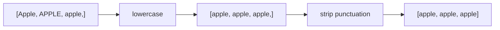
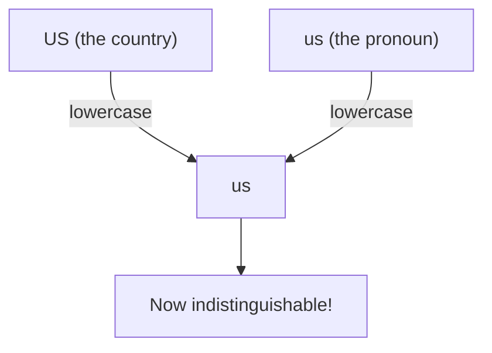

**Normalization** is the set of steps that fold away differences between
tokens that *shouldn't* matter for your task, so that surface variants of
the same thing become identical. The two most common operations are
**lowercasing** and **punctuation removal**, but normalization is a family
of techniques, and each one is a trade-off.

## The problem normalization solves

Recall the **variation** problem: one idea, many surface forms. To a
computer, `Apple`, `APPLE`, and `apple` are three different strings with
three different hash values. If you are counting how often the company is
mentioned, that split is pure noise — you want all three to count as one
token.

<CodeBlock
  adapter="python"
  initialCode={`words = ["Apple", "APPLE", "apple"]

# Three different strings as far as Python is concerned:
print("Distinct strings:", set(words))

# Lowercasing collapses them into one:
print("After lowercasing:", set(w.lower() for w in words))
`}
/>

That single `set()` shrinking from three items to one is the whole point:
normalization **reduces the size of your vocabulary** by merging tokens
that mean the same thing, which makes counts more meaningful and models
smaller.

## Lowercasing: helpful, until it isn't

Lowercasing is the most common normalization step. It is also the clearest
example of a step that is *usually* good and *occasionally* terrible.

<CodeBlock
  adapter="python"
  initCode={`import micropip
await micropip.install("nltk")
import nltk
nltk.download("punkt_tab", quiet=True)`}
  initialCode={`from nltk.tokenize import word_tokenize

text = "Apple's CEO said US sales fell. APPLE rocks!"
tokens = word_tokenize(text)
lowered = [t.lower() for t in tokens]

print("Original:", tokens)
print("Lowered :", lowered)
`}
/>

Now look carefully at what lowercasing just did:

- It correctly merged `APPLE` and `Apple` → `apple`. 
- But it also turned `US` (the country) into `us` (the pronoun, a common
  stopword). 
- And `CEO` became `ceo`, losing the signal that it was an acronym.

<Callout type="warn" title="When lowercasing hurts">
Lowercasing destroys **case-carried meaning**:
- **Named entities:** `Apple` (company) vs. `apple` (fruit); `US`
  vs. `us`; `Polish` (nationality) vs. `polish` (verb).
- **Acronyms:** `WHO` vs. `who`, `IT` vs. `it`, `AIDS` vs. `aids`.
- **Emphasis / shouting:** `"GREAT"` may signal stronger sentiment than
  `"great"`.

For tasks like **named-entity recognition** or **sentiment that uses
emphasis**, you may keep case, or add a feature that records whether a
token was originally uppercase. For **search** and **topic counting**,
lowercasing is almost always the right call.
</Callout>

## Removing punctuation

Punctuation tokens like `,` `.` `!` often carry little information for
counting-based tasks, and they fragment vocabulary (`star`, `star!`,
`star.`). A common step is to drop tokens that are *pure* punctuation.
Python's `string.punctuation` gives you the character set for free:

<CodeBlock
  adapter="python"
  initCode={`import micropip
await micropip.install("nltk")
import nltk
nltk.download("punkt_tab", quiet=True)`}
  initialCode={`import string
from nltk.tokenize import word_tokenize

print("Punctuation chars:", string.punctuation)

text = "Wow!! This is great, really -- the best."
tokens = word_tokenize(text)

# Drop tokens that are entirely punctuation:
clean = [t for t in tokens if t not in string.punctuation]

print("Tokens:", tokens)
print("Clean :", clean)
`}
/>

<Callout type="info" title="A subtlety: 'pure punctuation' vs. 'contains punctuation'">
The filter above drops a token only if the *entire* token is in
`string.punctuation`. That keeps useful tokens like `best-performing`,
`3.50`, and `e-mail` intact while removing standalone `!` and `,`. If you
instead strip *every* punctuation character from inside words, you'd turn
`3.50` into `350` and `e-mail` into `email` — sometimes desirable,
sometimes not. As always: decide based on the task.
</Callout>

### When punctuation matters

Punctuation is not always noise:

- `:)` and `:(` are **sentiment signals** in informal text.
- `!!!` can indicate intensity.
- In `"Let's eat, Grandma"` vs. `"Let's eat Grandma"`, the comma is
  literally life-or-death. 
- Question marks distinguish questions from statements — useful for intent
  detection.

## Other normalization steps you'll meet

Lowercasing and punctuation are the headline acts, but normalization is a
broad toolkit:

| Step | Example | When useful |
| --- | --- | --- |
| **Strip whitespace** | `"  hi \n"` → `"hi"` | Almost always |
| **Unicode/accent folding** | `café` → `cafe` | Cross-source matching |
| **Expand contractions** | `don't` → `do not` | Negation-aware tasks |
| **Number handling** | `2024` → `<NUM>` | When exact numbers don't matter |
| **Spelling correction** | `definately` → `definitely` | Noisy user text |

<Callout type="tip" title="casefold() is stronger than lower()">
For aggressive case-insensitive matching across languages, Python's
`str.casefold()` is more thorough than `str.lower()`. For example the
German `"Straße".casefold()` returns `"strasse"`, matching how someone
might type it without the ß. For everyday English, `lower()` is fine.
</Callout>

## Try it yourself

<ChallengeCard
  adapter="python"
  title="Normalize to a clean word list"
  instructions={`Write code that turns \`text\` into a list called **\`clean\`** that is:

1. tokenized with \`word_tokenize\`,
2. lowercased, and
3. filtered to remove any token that is entirely punctuation.

Use \`string.punctuation\` for the punctuation set.`}
  initCode={`import micropip
await micropip.install("nltk")
import nltk
nltk.download("punkt_tab", quiet=True)
import string
from nltk.tokenize import word_tokenize

text = "HELLO, World! NLP is FUN -- right?"
`}
  initialCode={`# 'text', 'string', and 'word_tokenize' are ready.
clean = None  # TODO: tokenize -> lowercase -> drop pure punctuation

print(clean)
`}
  solutionCode={`tokens = word_tokenize(text)
clean = [t.lower() for t in tokens if t not in string.punctuation]
print(clean)
`}
  tests={[
    {
      id: "is_list",
      name: "`clean` is a list",
      description: "clean should be a Python list",
      code: `assert isinstance(clean, list), "clean should be a list"`,
    },
    {
      id: "lowercased",
      name: "All lowercase",
      description: "No token should contain an uppercase letter",
      code: `assert all(t == t.lower() for t in clean), "found a non-lowercase token"`,
    },
    {
      id: "no_punct",
      name: "No pure-punctuation tokens",
      description: "Standalone punctuation must be removed",
      code: `import string
assert all(t not in string.punctuation for t in clean), "pure-punctuation token remains"`,
    },
    {
      id: "expected",
      name: "Correct result",
      description: "clean should equal the expected list",
      code: `assert clean == ['hello', 'world', 'nlp', 'is', 'fun', 'right'], f"Unexpected: {clean}"`,
    },
  ]}
/>

## Check your understanding

<MultipleChoice
  markdown={`What is the main *benefit* of lowercasing tokens before counting them?

- It removes stopwords automatically.
  > Lowercasing doesn't remove any tokens; it only changes their case.
- [o] It merges case-variants (\`Apple\`, \`APPLE\`, \`apple\`) into one token, shrinking the vocabulary and making counts more meaningful.
  > Collapsing case is a direct attack on the variation problem.
- It separates punctuation from words.
  > That's tokenization's job, not lowercasing.
- It corrects spelling mistakes.
  > Spelling correction is a separate normalization step.

Lowercasing collapses one specific kind of variation — case — so that the
same word written differently counts as the same token.`}
/>

<MultipleChoice
  markdown={`A team builds a system to extract **company and country names** from news articles and lowercases everything first. Why is this risky?

- Lowercasing is always wrong and should never be used.
  > It's often useful; the issue is specific to case-carried meaning.
- [o] Lowercasing erases the capitalization that distinguishes entities like \`US\`/\`us\` and \`Apple\`/\`apple\`, which the task depends on.
  > For named-entity work, case *is* signal, and discarding it removes the very clue the task needs.
- Lowercasing makes the text longer.
  > It doesn't change length.
- Lowercasing only affects punctuation.
  > It affects letter case, not punctuation.

Normalization always trades away some information. For entity extraction,
case is exactly the information you must keep — so lowercasing is the wrong
default there.`}
/>

<MultipleChoice
  markdown={`Why does the recommended filter drop a token only when the **whole token** is punctuation (e.g. \`t not in string.punctuation\`) rather than stripping every punctuation character from inside tokens?

- Because Python can't remove characters from inside strings.
  > It can; the choice is about preserving meaningful tokens.
- Because punctuation never appears inside meaningful tokens.
  > It does — in \`3.50\`, \`e-mail\`, \`best-performing\`.
- [o] Because stripping inner punctuation would damage meaningful tokens like \`3.50\`, \`e-mail\`, and \`best-performing\`, while the whole-token check leaves them intact.
  > Dropping only standalone punctuation removes noise without mangling real tokens.
- Because \`string.punctuation\` is empty by default.
  > It contains the standard punctuation characters.

Whole-token filtering removes the obviously-noisy standalone marks while
protecting tokens whose internal punctuation is meaningful.`}
/>

Lowercasing and punctuation handle *surface* variation. Next we tackle a
more aggressive idea: throwing away entire words — **stopwords** — and the
surprising ways it can backfire.
