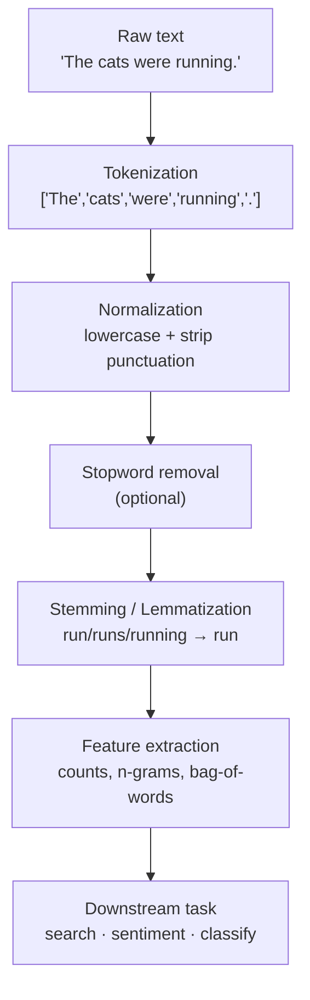
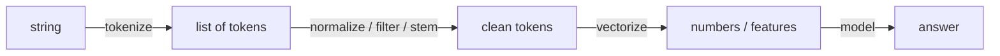

Almost every classic NLP system is built from the same small set of steps,
applied in roughly the same order. Learning this **pipeline** as a mental
model is the most valuable thing in the course: once you have it, each
later chapter is simply "zoom in on one box."

## Why this particular order?

The order is not arbitrary — each step assumes the previous one has
happened:

1. **Tokenization first.** Every later step operates on *tokens* (units),
   not on a raw string. You cannot lowercase "words" or count "words"
   until you have decided what a word *is*.
2. **Normalization next.** Once you have tokens, you fold away
   differences that don't matter for your task (case, punctuation), so
   that `Cat`, `cat`, and `cat,` become the same token.
3. **Stopword removal (optional).** With clean tokens, you *may* drop very
   common, low-information words — but only if your task allows it.
4. **Stemming / lemmatization.** Collapse inflected forms so `run`,
   `runs`, and `running` count together.
5. **Feature extraction.** Turn the cleaned token list into numbers — the
   only thing downstream algorithms actually consume.

<Callout type="warn" title="The pipeline is a default, not a law">
This is the *typical* order, not a sacred one. Real projects add, remove,
and reorder steps for the task at hand. A sentiment classifier often
**keeps** stopwords (so it doesn't lose `not`). A search engine often
**skips** lemmatization in favor of fast stemming. The skill is choosing
steps deliberately — which is why every chapter explains *when not* to use
a step, not just how.
</Callout>

## Watch data flow through the whole pipeline

Here is the entire classic pipeline in one runnable block. Read the output
of each stage and notice how the list of tokens gets shorter and cleaner.

<CodeBlock
  adapter="python"
  initCode={`import micropip
await micropip.install("nltk")
import nltk
nltk.download("punkt_tab", quiet=True)
nltk.download("stopwords", quiet=True)
nltk.download("wordnet", quiet=True)
nltk.download("omw-1.4", quiet=True)`}
  initialCode={`import string
from nltk.tokenize import word_tokenize
from nltk.corpus import stopwords
from nltk.stem import WordNetLemmatizer

text = "The investors were quickly reviewing the best-performing stocks."

# 1. Tokenize
tokens = word_tokenize(text)
print("1. tokens        :", tokens)

# 2. Normalize: lowercase
lowered = [t.lower() for t in tokens]
print("2. lowercased    :", lowered)

# 3. Normalize: drop pure-punctuation tokens
no_punct = [t for t in lowered if t not in string.punctuation]
print("3. no punctuation:", no_punct)

# 4. Remove stopwords
stop = set(stopwords.words("english"))
no_stop = [t for t in no_punct if t not in stop]
print("4. no stopwords  :", no_stop)

# 5. Lemmatize (collapse inflected forms)
lemmatizer = WordNetLemmatizer()
lemmas = [lemmatizer.lemmatize(t) for t in no_stop]
print("5. lemmatized    :", lemmas)
`}
/>

That final list — `['investor', 'quickly', 'reviewing', 'best-performing',
'stock']` — is what a downstream task would actually see. The 9-token
sentence became 5 information-dense tokens, with `investors → investor`
and `stocks → stock`.

<Callout type="info" title="Garbage in, garbage out">
Every downstream task inherits the decisions made in preprocessing. If you
strip the `not` out of `not good`, no classifier — however sophisticated —
can recover it. This is why preprocessing deserves real thought: it is the
foundation everything else stands on.
</Callout>

## The mental model to carry forward

For the rest of the course, hold this picture in your head:

Three transformations: **string → tokens → clean tokens → numbers.** Each
chapter from here on is a deep dive into one of these arrows.

## Check your understanding

<MultipleChoice
  markdown={`Why does **tokenization** come first in the pipeline?

- Because it is the slowest step and should be done while the machine is fresh.
  > Ordering in a pipeline is about data dependencies, not performance scheduling.
- [o] Because every later step operates on tokens, so the text must be split into units before anything else can run.
  > You cannot lowercase, filter, or count "words" until you've decided what the words are.
- Because tokenization removes stopwords.
  > Tokenization only splits text into units; stopword removal is a separate, later step.
- Because the downstream task requires raw strings, not tokens.
  > Downstream tasks consume features derived from tokens, not raw strings.

The pipeline order reflects **data dependencies**: each step needs the
output of the previous one. Tokens are the currency every later step
spends.`}
/>

<MultipleChoice
  markdown={`The pipeline diagram marks stopword removal as "(optional)". What is the best reading of that label?

- Stopword removal is outdated and should never be used.
  > It is still widely useful — for example in search and topic analysis.
- Stopword removal is required for all NLP tasks.
  > It is genuinely optional and can hurt some tasks.
- [o] Whether to remove stopwords depends on the task — it helps some (search, topic modeling) and hurts others (sentiment).
  > It is a deliberate, task-dependent choice, not an automatic step.
- Stopword removal must always be done before tokenization.
  > It operates on tokens, so it can only happen *after* tokenization.

"Optional" means *choose deliberately*. A recurring theme of this course
is that preprocessing steps are tools with trade-offs, not boxes to tick
mechanically.`}
/>

With the map in hand, let's zoom into the very first box — and discover
why splitting text into tokens is far trickier than calling `.split()`.
