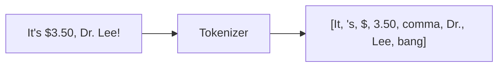
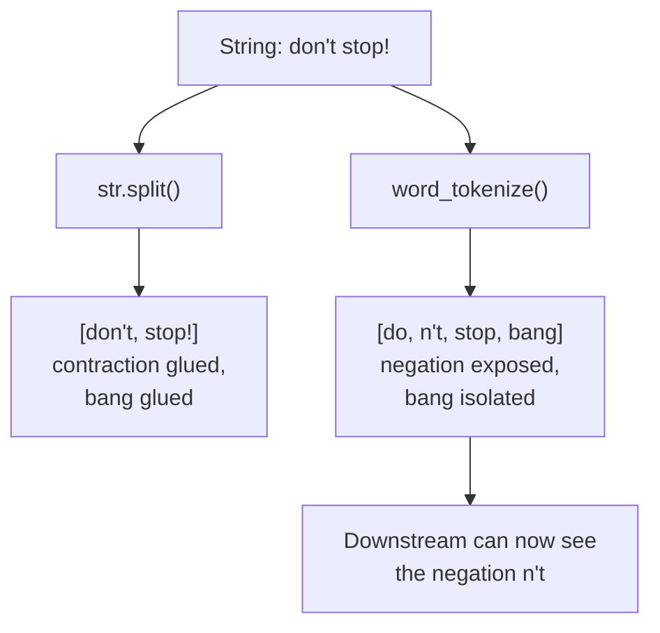

**Tokenization** is the process of breaking text into smaller units called
**tokens** — usually words and punctuation, sometimes sentences. It is the
very first transformation in the pipeline, and everything downstream
depends on it.

The most common misconception in all of NLP is that *tokenization is just
splitting on spaces*. It is not. Let's build the intuition for why a real
tokenizer is worth its weight.

## The problem tokenization solves

Computers see text as a flat sequence of characters. To do anything useful
— count words, look up a dictionary, tag parts of speech — we first need
to decide **where one unit ends and the next begins**. That boundary
decision is harder than it looks because punctuation, contractions,
numbers, and abbreviations all complicate it.

## Why `str.split()` is not tokenization

`str.split()` cuts only on whitespace. That glues punctuation onto words
and mishandles contractions, prices, and emails. Compare a real tokenizer
to a naive split:

<CodeBlock
  adapter="python"
  initCode={`import micropip
await micropip.install("nltk")
import nltk
nltk.download("punkt_tab", quiet=True)`}
  initialCode={`from nltk.tokenize import word_tokenize

text = "Email me at jo@x.com about the $3.50 item—it's 5-star!!"

print("str.split():")
print(" ", text.split())
print()
print("word_tokenize():")
print(" ", word_tokenize(text))
`}
/>

Look at the differences:

| Issue | `split()` produces | `word_tokenize()` produces |
| --- | --- | --- |
| Price | `'$3.50'` (glued) | `'$'`, `'3.50'` (separated) |
| Contraction | `"item—it's"` (one blob) | `'it'`, `"'s"` (split out) |
| Trailing punctuation | `'5-star!!'` | `'5-star'`, `'!'`, `'!'` |

A tokenizer encodes **linguistic rules**: keep `3.50` together as a
number, peel `'s` off a contraction, treat `!` as its own token. Those
rules are exactly what `.split()` lacks.

<Callout type="info" title="Why separate the punctuation at all?">
Because downstream steps treat punctuation differently from words. You
might *count* word frequencies (ignoring `!`), but also *detect* that
three `!` in a row signals excitement. Keeping `!` as its own token lets
you make that choice later. If `!` stays glued to `star`, then `star!`,
`star!!`, and `star` all look like different words — fragmenting your
counts.
</Callout>

## How a real tokenizer succeeds where splitting fails

That exposed `n't` matters enormously. A sentiment system that never
separates `don't` can never *see* the negation. Tokenization isn't
cosmetic — it determines what information later steps are even able to
access.

## Word tokenization vs. sentence tokenization

There are two granularities you'll use constantly:

- **Word tokenization** — split a string into word/punctuation tokens.
- **Sentence tokenization** — split a document into sentences.

Sentence splitting has its own trap: you cannot just split on `.` because
periods appear in abbreviations (`Dr.`), decimals (`3.50`), and ellipses
(`...`). NLTK's sentence tokenizer was trained to tell these apart.

<CodeBlock
  adapter="python"
  initCode={`import micropip
await micropip.install("nltk")
import nltk
nltk.download("punkt_tab", quiet=True)`}
  initialCode={`from nltk.tokenize import sent_tokenize

text = "We waited 3 hrs... no luck. Dr. Lee agreed it was odd. Email me!"

# Naive: split on every period
print("Naive split on '.':")
print(" ", text.split("."))
print()

# Real sentence tokenizer:
print("sent_tokenize():")
for i, s in enumerate(sent_tokenize(text), 1):
    print(f"  {i}. {s}")
`}
/>

The naive split shatters `Dr.` and `...` into broken fragments and even
produces empty strings. The sentence tokenizer keeps `Dr. Lee` and the
ellipsis intact and finds exactly three real sentences.

## When `.split()` *is* good enough

Tokenization is about choosing the right tool for the data:

<Callout type="tip" title="Match the tokenizer to the text">
- **Clean, controlled text** (e.g. space-separated keywords you generated
  yourself): `.split()` may be perfectly fine and faster.
- **Natural prose** (reviews, articles, chat): use a real word tokenizer.
- **Social media** (hashtags, @mentions, emoji, `:)`): use a specialized
  tokenizer like NLTK's `TweetTokenizer`, which keeps `#deal` and `:)`
  together instead of shredding them.
- **Code or structured logs**: you often want a custom regex tokenizer.

There is no single "correct" tokenization — only the one that preserves
the units *your* task cares about.
</Callout>

Here is the social-media case, where even `word_tokenize` is suboptimal:

<CodeBlock
  adapter="python"
  initCode={`import micropip
await micropip.install("nltk")
import nltk
nltk.download("punkt_tab", quiet=True)`}
  initialCode={`from nltk.tokenize import word_tokenize, TweetTokenizer

tweet = "Loved it!! #deal :) @store"

print("word_tokenize :", word_tokenize(tweet))
# Splits ':)' into ':' and ')', and '#deal' into '#' and 'deal'.

tt = TweetTokenizer()
print("TweetTokenizer:", tt.tokenize(tweet))
# Keeps ':)' and '#deal' intact — better for social text.
`}
/>

## Try it yourself

<ChallengeCard
  adapter="python"
  title="Count real word tokens"
  instructions={`Using NLTK's \`word_tokenize\`, tokenize the provided \`text\` and build a list called **\`words\`** that contains only the **alphabetic** tokens (drop punctuation and numbers).

A token counts as alphabetic if \`token.isalpha()\` is \`True\`. Keep the original case for this exercise.`}
  initCode={`import micropip
await micropip.install("nltk")
import nltk
nltk.download("punkt_tab", quiet=True)
from nltk.tokenize import word_tokenize

text = "Wow, NLTK split 3.50 and don't correctly — amazing!"
`}
  initialCode={`# 'text' and 'word_tokenize' are already available.
tokens = word_tokenize(text)
print("All tokens:", tokens)

# Build a list 'words' with only alphabetic tokens:
words = None  # TODO

print("Words:", words)
`}
  solutionCode={`tokens = word_tokenize(text)
words = [t for t in tokens if t.isalpha()]
print("All tokens:", tokens)
print("Words:", words)
`}
  tests={[
    {
      id: "is_list",
      name: "`words` is a list",
      description: "words should be a Python list",
      code: `assert isinstance(words, list), "words should be a list"`,
    },
    {
      id: "only_alpha",
      name: "Only alphabetic tokens",
      description: "Every element of words must be alphabetic",
      code: `assert all(w.isalpha() for w in words), "words contains a non-alphabetic token"`,
    },
    {
      id: "correct_words",
      name: "Correct tokens kept",
      description: "Punctuation and numbers must be dropped",
      code: `assert words == ['Wow', 'NLTK', 'split', 'and', 'do', "n't", 'correctly', 'amazing'] or words == ['Wow', 'NLTK', 'split', 'and', 'do', 'correctly', 'amazing'], f"Unexpected words: {words}"`,
    },
  ]}
/>

<Callout type="info" title="Note on that challenge">
`don't` tokenizes to `do` + `n't`. Since `n't` contains an apostrophe,
`"n't".isalpha()` is `False`, so it is correctly dropped — another example
of why exposing the contraction matters.
</Callout>

## Check your understanding

<MultipleChoice
  markdown={`Which statement best captures why tokenization is *not* the same as \`str.split()\`?

- They are the same; \`word_tokenize\` just runs \`split()\` internally.
  > It does not — it applies linguistic rules that \`split()\` has no concept of.
- [o] A tokenizer applies linguistic rules (handling punctuation, contractions, numbers), while \`split()\` only cuts on whitespace.
  > That rule-awareness is the entire difference.
- \`split()\` is more accurate but slower than tokenization.
  > \`split()\` is faster but *less* accurate on natural text.
- Tokenization only works on sentences, not words.
  > Tokenization works at both word and sentence granularity.

\`split()\` is a blunt whitespace cut; a tokenizer encodes how a language
actually composes words, punctuation, and numbers.`}
/>

<MultipleChoice
  markdown={`Why can't you reliably split sentences just by cutting on the \`.\` character?

- Because sentences never end with a period.
  > They usually do — the problem is that periods appear in *other* places too.
- [o] Because periods also appear in abbreviations (\`Dr.\`), decimals (\`3.50\`), and ellipses (\`...\`), so a period is not always a sentence end.
  > The sentence tokenizer must distinguish sentence-ending periods from these other uses.
- Because Python's \`split\` can only cut on whitespace.
  > \`split('.')\` can cut on periods; the issue is that doing so is linguistically wrong.
- Because sentences must be tokenized into words first.
  > Sentence and word tokenization are independent; neither requires the other first.

A period is overloaded: it ends sentences *and* marks abbreviations,
decimals, and ellipses. Reliable sentence splitting needs a model that
tells these uses apart.`}
/>

<MultipleChoice
  markdown={`For a stream of tweets full of hashtags, \`@mentions\`, and emoticons like \`:)\`, which tokenizer is the best fit?

- \`str.split()\`, because tweets are short.
  > Length isn't the issue; \`split()\` keeps \`#deal\` and \`:)\` but mangles everything attached to punctuation.
- The default \`word_tokenize\`, because it is always best.
  > It shreds \`:)\` into \`:\` \`)\` and splits \`#deal\` into \`#\` \`deal\`, losing the social-media units.
- [o] A specialized tokenizer such as NLTK's \`TweetTokenizer\`, which preserves hashtags, mentions, and emoticons as single tokens.
  > Matching the tokenizer to the text is the whole point.
- No tokenizer can handle tweets.
  > Specialized tweet tokenizers handle them well.

There is no universal "correct" tokenizer. The right one is whichever
keeps the units *your* task depends on — and for social text that means
preserving emoticons and hashtags.`}
/>

You now have clean tokens. The next question is: should `Cat`, `cat`, and
`cat,` be treated as the same token? That is the job of **normalization**.
