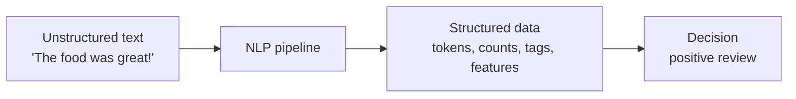
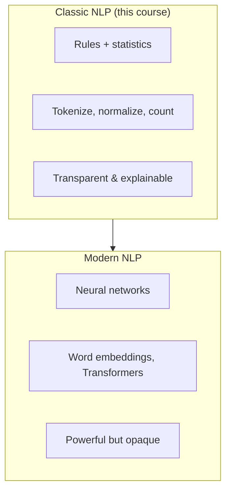

**Natural Language Processing (NLP)** is the part of computer science
concerned with getting computers to *work with human language* — to read
it, measure it, search it, classify it, translate it, and sometimes
generate it. The "natural" in the name distinguishes human languages
(English, Hindi, Swahili) from *formal* languages like Python or SQL,
which were designed to be unambiguous.

That single word — *natural* — is the whole challenge. Programming
languages have a grammar that a parser can apply with zero ambiguity.
Human language evolved over millennia with no committee, no spec, and a
deep tolerance for ambiguity, because humans resolve it effortlessly from
context. Computers do not get context for free.

## A more practical definition

For this course, think of NLP as a **pipeline that converts text into
structured data**, so that ordinary algorithms — counting, sorting,
comparing, classifying — can operate on it.

Almost everything in this course is some variation of that middle box:
turning a string into rows, columns, counts, and labels that a downstream
task can use.

## Where you already use NLP

You interact with NLP dozens of times a day, usually without noticing:

| Application | What the NLP is doing |
| --- | --- |
| **Search engines** | Matching your query words to documents, ignoring trivial words, treating *run/running/ran* as related |
| **Spam filters** | Classifying an email as spam vs. not from the words it contains |
| **Autocomplete / predictive text** | Guessing the next word from the previous ones (an n-gram idea) |
| **Voice assistants** | Converting speech to text, then extracting intent |
| **Review analysis** | Deciding whether a product review is positive or negative |
| **Machine translation** | Mapping text in one language to another |

The first four of these can be built — at least in a basic form — with
exactly the classic techniques in this course. The point of NLP is rarely
"understand language like a human." It is usually "do something *useful*
with language at scale," and useful is often surprisingly achievable with
counting and good preprocessing.

## Two broad eras of NLP

Modern systems (BERT, GPT, and friends) are extraordinarily powerful, but
they are *built on top of* the classic foundations, not instead of them.
A transformer still has to **tokenize** its input before it can do
anything. It still benefits from understanding **frequency** and
**context windows** (n-grams generalized). Learning the classic pipeline
is the fastest way to build durable intuition that transfers to *any* NLP
system you meet later.

<Callout type="info" title="Why we stick to NLTK and classic methods">
Classic NLP is **transparent**: every step is something you can inspect,
print, and reason about. That makes it the ideal place to *learn*. Once
you understand why each step exists, the modern tools become much easier
to use well — you will know what they are doing under the hood and when
their defaults will hurt you.
</Callout>

## Check your understanding

<MultipleChoice
  markdown={`What is the key difference between a *natural* language (like English) and a *formal* language (like Python)?

- Natural languages are spoken, while formal languages are only written.
  > Many natural languages are primarily written, and code is often read aloud — the spoken/written split is not the defining difference.
- [o] Natural languages are inherently ambiguous and context-dependent, while formal languages are designed to be unambiguous.
  > Exactly — a Python parser can interpret code with zero ambiguity, but human sentences routinely have multiple valid readings.
- Formal languages have grammar, but natural languages do not.
  > Natural languages have rich grammar too; the difference is that their grammar tolerates ambiguity.
- Natural languages can be processed by computers, but formal languages cannot.
  > It's the reverse intuition — formal languages were *designed* for computers; natural language is the hard case.

The defining challenge of NLP is that natural language was never designed
to be unambiguous. Humans resolve ambiguity from context automatically;
computers must be given tools to cope with it.`}
/>

<MultipleChoice
  markdown={`In this course, NLP is framed primarily as a process that does what?

- Generates new human-like text from scratch.
  > Text *generation* is one application, but it is not the framing this course uses, and it is mostly a modern-NLP topic.
- [o] Converts unstructured text into structured data that ordinary algorithms can use.
  > Yes — the whole pipeline turns strings into tokens, counts, tags, and features.
- Translates between human languages.
  > Translation is one application of NLP, not its general definition.
- Replaces the need for preprocessing with neural networks.
  > Even neural networks tokenize and preprocess; preprocessing does not disappear.

Throughout this course, the mental model is: *text in → structured data
out → decision*. Everything we build is a variation on that theme.`}
/>

Next, let's make the difficulty concrete: we'll look at exactly *why*
human text is so hard for computers, with examples that break naive code.
