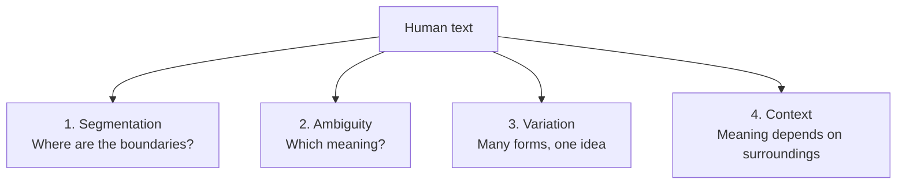

Before learning *how* to process text, it pays to feel *why* it is hard.
Almost every technique in this course is a response to one of four
recurring problems. If you can name the problem a step solves, you will
always know when to use it.

## Problem 1: Segmentation — where are the boundaries?

It seems obvious that words are separated by spaces. But the moment you
look closely, the boundaries blur:

- `"don't"` — one word, or `do` + `n't` (i.e. *do not*)?
- `"New York"` — two words, but **one** place.
- `"U.S.A."` — the periods are part of the token, not sentence ends.
- `"state-of-the-art"` — one concept, three hyphens.
- In Chinese and Japanese, **there are no spaces between words at all.**

Splitting on spaces is a guess that fails constantly. Run this to see how
badly:

<CodeBlock
  adapter="python"
  initialCode={`text = "I don't like New York-style pizza... do you?"

# The naive approach: split on whitespace
naive = text.split()
print("Naive split:", naive)

# Notice the problems:
# - "don't"   stays glued together
# - "York-style" is one chunk
# - "pizza..." drags the ellipsis along
# - "you?"   keeps the question mark
`}
/>

Every messy token above (`don't`, `York-style`, `pizza...`, `you?`) is a
**segmentation** failure. Fixing it is the job of a *tokenizer*, which we
cover next chapter.

## Problem 2: Ambiguity — which meaning?

The same string can mean different things, and the same meaning can be
written many ways. Linguists slice ambiguity into layers:

| Kind | Example | The two readings |
| --- | --- | --- |
| **Lexical** | "I went to the **bank**." | River bank? Money bank? |
| **Part-of-speech** | "I **book** a flight" vs. "I read a **book**" | Verb vs. noun |
| **Syntactic** | "I saw the man with the telescope." | Who has the telescope? |
| **Referential** | "Sara told Mia she won." | Who won? |

Humans disambiguate instantly from context. A program that just counts
words sees `bank` as one symbol regardless of meaning — which is
sometimes fine (a spam filter doesn't care) and sometimes fatal (a
translation system absolutely does).

<Callout type="info" title="A famous example">
"Time flies like an arrow; fruit flies like a banana." The first half and
the second half use *flies* and *like* with completely different
grammatical roles. This sentence is a classic demonstration that you
cannot assign meaning to a word without looking at its neighbors — the
motivation for **part-of-speech tagging** later in the course.
</Callout>

## Problem 3: Variation — many forms, one idea

A single concept appears in many surface forms:

- **Inflection:** `run`, `runs`, `running`, `ran`
- **Case:** `Apple`, `apple`, `APPLE`
- **Synonyms:** `big`, `large`, `huge`
- **Spelling/typos:** `color` vs. `colour`, `definitely` vs. `definately`

If a search engine treated `run` and `running` as unrelated, searching
for "running shoes" would miss a page titled "shoes for runners." The
techniques of **normalization**, **stemming**, and **lemmatization** all
exist to collapse variation so that *forms of the same idea count as the
same thing*.

<CodeBlock
  adapter="python"
  initialCode={`words = ["run", "Runs", "RUNNING", "ran"]

# To a computer, these are four completely different strings:
print("Are they equal?")
for w in words:
    print(f"  'run' == '{w}'  ->  {'run' == w}")

# Lowercasing collapses ONE kind of variation (case):
print()
print("After lowercasing:", [w.lower() for w in words])
# ...but 'running' and 'ran' are still different. That needs stemming
# or lemmatization, which we'll meet soon.
`}
/>

## Problem 4: Context — meaning depends on surroundings

Even after you solve the first three problems, the *combination* of words
carries meaning that no single word does:

- `"good"` is positive. `"not good"` is negative. The word `not` flips
  everything after it.
- `"New York"` means something the words `New` and `York` do not mean
  apart.
- `"machine learning"` is a field; `"machine"` and `"learning"` separately
  are not.

This is why we cannot *always* just throw words into a bag and count them.
**N-grams** (looking at short sequences instead of single words) are the
classic tool for capturing a little bit of context, and we devote a whole
chapter to them.

<Callout type="warn" title="The biggest beginner trap">
The single most common mistake in NLP is assuming a step is "just string
manipulation" with no downstream cost. Lowercasing seems harmless until it
merges `US` (the country) with `us` (the pronoun). Removing stopwords
seems helpful until it deletes the `not` in `not good`. **Every step has a
trade-off.** This course will keep returning to *when a step helps* and
*when it hurts*.
</Callout>

## Check your understanding

<MultipleChoice
  markdown={`"I saw the man with the telescope." Which kind of ambiguity does this sentence illustrate?

- Lexical ambiguity (one word, multiple meanings).
  > No single word here has two dictionary meanings; the ambiguity is about *structure*.
- [o] Syntactic ambiguity (the grammatical structure has two valid parses).
  > The phrase "with the telescope" could attach to "saw" or to "the man".
- Referential ambiguity (unclear what a pronoun refers to).
  > There is no pronoun whose reference is unclear here.
- There is no ambiguity in this sentence.
  > There is: either *you* used the telescope to see, or *the man* was holding it.

Syntactic ambiguity comes from multiple valid ways to group the words,
even when every individual word's meaning is clear.`}
/>

<MultipleChoice
  markdown={`Why might treating \`run\`, \`running\`, and \`ran\` as three unrelated tokens hurt a **search engine**?

- It wouldn't — keeping them separate always improves search.
  > For search we usually *want* these to match, so keeping them separate hurts recall.
- [o] A search for one form would fail to match documents using another form, reducing recall.
  > "running shoes" should match a page about "shoes for runners"; treating the forms as unrelated breaks that.
- It makes the index smaller and therefore less accurate.
  > Keeping forms separate makes the vocabulary *larger*, not smaller, and the issue is matching, not index size.
- Search engines never need to handle word variation.
  > Handling variation (via stemming/lemmatization) is one of the oldest tricks in information retrieval.

This is the **variation** problem, and it motivates stemming and
lemmatization — collapsing inflected forms so different surface forms of
the same idea match each other.`}
/>

<MultipleChoice
  markdown={`A naive sentiment system removes common words and then counts positive/negative words. On the phrase \`"not good"\` it deletes \`not\` (a common word) and keeps \`good\`. What problem does this illustrate?

- Segmentation — the phrase was split incorrectly.
  > The phrase was split fine; the damage happened after splitting.
- Variation — \`good\` has many forms.
  > Variation isn't the issue here; the issue is that meaning came from the *pair* of words.
- [o] Context — the meaning of \`good\` depends on the surrounding word \`not\`, which was discarded.
  > \`not\` flips the sentiment, so dropping it inverts the meaning.
- Ambiguity — \`good\` has two dictionary meanings.
  > \`good\` isn't lexically ambiguous here; the problem is the lost context.

Context means meaning lives in *combinations* of words. This is precisely
why blindly removing stopwords can wreck a sentiment classifier — a
trade-off we examine in detail in the stopwords chapter.`}
/>

Now that you can name the four problems, let's see the standard sequence
of steps NLP uses to fight them: the **preprocessing pipeline**.
