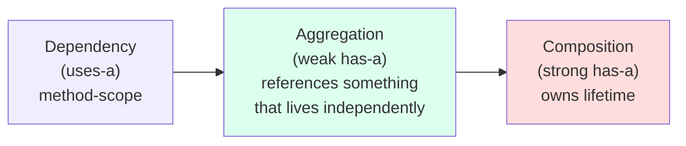
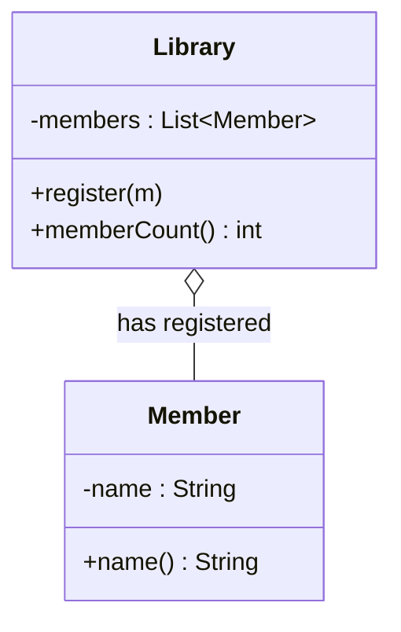
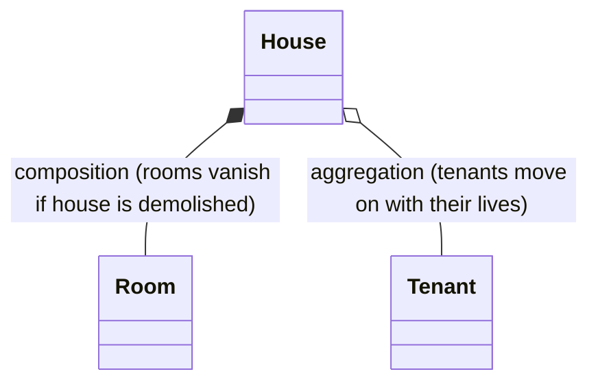
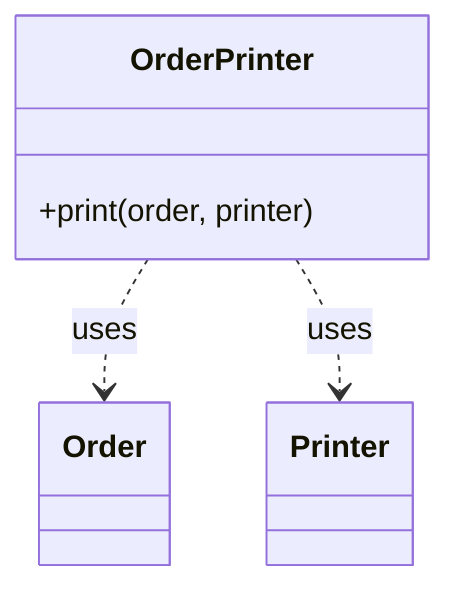

Not every relationship between two objects is the strong ownership we
saw with composition. Often one object simply *uses* another, or
*holds a reference to* another that exists independently. UML and the
OOP tradition give these weaker relationships names: **aggregation**
and **dependency**.

Knowing the difference is not pedantry — it changes *how you draw
your model*, *which object's constructor takes which*, and *what
happens when one object goes away*.

<svg
  viewBox="0 0 640 210"
  role="img"
  aria-label="Three pairs of shapes bond ever more loosely — a green part sealed inside its whole, a part docked half out of the edge, and a part merely waved at across a gap — composition, aggregation, and dependency"
  style={{ display: "block", width: "100%", maxWidth: "640px", height: "auto", margin: "2.5rem auto" }}
>
  <g style={{ color: "var(--ds-blue-500)" }} fill="currentColor">
    <rect x="60" y="60" width="110" height="90" rx="14" fillOpacity="0.2" />
    <rect x="250" y="60" width="110" height="90" rx="14" fillOpacity="0.2" />
    <rect x="440" y="60" width="110" height="90" rx="14" fillOpacity="0.2" />
  </g>
  <g style={{ color: "var(--ds-green-500)" }} fill="currentColor">
    <rect x="85" y="88" width="60" height="36" rx="10" />
    <rect x="330" y="88" width="60" height="36" rx="10" />
    <rect x="588" y="88" width="44" height="36" rx="10" />
  </g>
  <g fill="currentColor" opacity="0.35">
    <circle cx="558" cy="106" r="3" />
    <circle cx="570" cy="106" r="3" />
    <circle cx="580" cy="106" r="3" />
  </g>
  <g style={{ color: "var(--ds-blue-500)" }} fill="currentColor">
    <circle cx="100" cy="174" r="4.5" fillOpacity="0.7" />
    <circle cx="115" cy="174" r="4.5" fillOpacity="0.7" />
    <circle cx="130" cy="174" r="4.5" fillOpacity="0.7" />
    <circle cx="297" cy="174" r="4.5" fillOpacity="0.7" />
    <circle cx="312" cy="174" r="4.5" fillOpacity="0.7" />
    <circle cx="495" cy="174" r="4.5" fillOpacity="0.7" />
  </g>
</svg>

## A spectrum of relationships

| Relationship | Lifetime | UML arrow | Java shape |
| --- | --- | --- | --- |
| **Dependency** | The collaborator is borrowed for one method call | dashed arrow `..>` | Method parameter or local |
| **Aggregation** | The whole holds a reference, but the part lives independently | open diamond `o--` | Field, but constructed *outside* and passed in |
| **Composition** | The whole owns the part; both live and die together | filled diamond `*--` | Field, usually constructed *inside* the whole |

## Aggregation: a Library has Members (who exist on their own)

A `Library` keeps a list of its `Member`s. But each `Member` is a
person who exists in the world whether or not the library does. If
the library closed tomorrow, the members would not vanish — they
would just stop being members. That is **aggregation**.

<CodeBlock
  adapter="java"
  entryFilename="Main.java"
  files={[
    {
      filename: "Main.java",
      starterCode: `public class Main {
  public static void main(String[] args) {
    // Members exist on their own:
    Member ada = new Member("Ada");
    Member ken = new Member("Ken");

    // The library aggregates them — it holds references, but didn't make them:
    Library lib = new Library();
    lib.register(ada);
    lib.register(ken);

    System.out.println("members: " + lib.memberCount());
    System.out.println("ada still exists: " + (ada != null)); // yes, of course
  }
}
`,
    },
    {
      filename: "Member.java",
      starterCode: `public class Member {
  private final String name;
  public Member(String name) { this.name = name; }
  public String name() { return name; }
}
`,
    },
    {
      filename: "Library.java",
      starterCode: `import java.util.ArrayList;
import java.util.List;

public class Library {
  // The list is owned by the Library (composition), but the Members
  // inside it are aggregated — they were created elsewhere.
  private final List<Member> members = new ArrayList<>();

  public void register(Member m) { members.add(m); }

  public int memberCount() { return members.size(); }
}
`,
    },
  ]}
/>

Two signals in the code reveal that this is aggregation rather than
composition:

1. `Library` did not call `new Member(...)`. It received the members
   from the outside.
2. The same `Member` object could be registered with two different
   libraries simultaneously — the membership relationship is not
   exclusive.

## Composition vs. aggregation, side by side

To make the difference vivid, here are two models of a `House`. In
one, the `Room`s are part of the house (composition). In the other,
the `Tenant`s are people who happen to live in the house this year
(aggregation).

You can usually decide which one applies by asking: **"If the whole
disappears, does the part disappear too?"** If yes → composition. If
the part keeps existing → aggregation.

## Dependency: a method that *uses* another object briefly

A **dependency** is the briefest relationship of all. One class
doesn't *hold* a reference to another, but does briefly *touch* it
to do its job. In the code, this usually looks like a method
parameter or a local variable.

<CodeBlock
  adapter="java"
  entryFilename="Main.java"
  files={[
    {
      filename: "Main.java",
      starterCode: `public class Main {
  public static void main(String[] args) {
    Order o = new Order("ORD-42", 19.95);
    Printer console = new Printer();

    OrderPrinter op = new OrderPrinter();
    op.print(o, console); // OrderPrinter doesn't *own* either of these
  }
}
`,
    },
    {
      filename: "Order.java",
      starterCode: `public class Order {
  private final String id;
  private final double total;
  public Order(String id, double total) {
    this.id = id;
    this.total = total;
  }
  public String id() { return id; }
  public double total() { return total; }
}
`,
    },
    {
      filename: "Printer.java",
      starterCode: `public class Printer {
  public void write(String line) { System.out.println("[printer] " + line); }
}
`,
    },
    {
      filename: "OrderPrinter.java",
      starterCode: `public class OrderPrinter {
  public void print(Order o, Printer printer) {
    printer.write("Order " + o.id() + " total = " + o.total());
  }
}
`,
    },
  ]}
/>

`OrderPrinter` has *no* fields. It needs an `Order` and a `Printer`
only for the duration of `print`. That is a dependency. It's the
loosest possible coupling: as soon as `print` returns, the two
references go away.

## Why these distinctions matter in practice

The category you choose changes *who is responsible for what*:

| Question | Composition | Aggregation | Dependency |
| --- | --- | --- | --- |
| Who creates the part? | The whole | Someone else | Someone else (per call) |
| Where is the reference held? | A field in the whole | A field in the whole | A parameter / local |
| What if the part is shared? | It shouldn't be | Fine | Fine |
| Lifetime of the part? | Tied to the whole | Independent | Independent |
| Mental model | "made of" | "knows about" | "uses for a moment" |

In a real design, the same class often participates in all three
kinds of relationships with different collaborators. A `Library` is
*composed of* its `Catalog`, *aggregates* `Member`s, and may *depend
on* a `Clock` passed in just to stamp due dates.

## Passing dependencies in: a tiny taste of injection

The healthy pattern is to *pass collaborators in* (via constructor or
method parameter) rather than to construct them inside. This is
sometimes called **dependency injection** when done systematically,
but the simple version is just good Java.

<CodeBlock
  adapter="java"
  entryFilename="Main.java"
  files={[
    {
      filename: "Main.java",
      starterCode: `public class Main {
  public static void main(String[] args) {
    Logger console = new Logger();
    Greeter g = new Greeter(console); // Greeter aggregates the logger
    g.greet("world");
  }
}
`,
    },
    {
      filename: "Logger.java",
      starterCode: `public class Logger {
  public void log(String message) { System.out.println("[LOG] " + message); }
}
`,
    },
    {
      filename: "Greeter.java",
      starterCode: `public class Greeter {
  private final Logger logger; // aggregated, not owned

  public Greeter(Logger logger) { this.logger = logger; }

  public void greet(String name) { logger.log("Hello, " + name + "!"); }
}
`,
    },
  ]}
/>

Because the logger is *handed in*, the same `Greeter` can be wired
up with a different logger (a file logger, a silent logger, a
test-spy logger) without changing a single line of `Greeter`'s code.
That is the deepest benefit of aggregation and dependency: they keep
your classes loosely coupled and easy to recombine.

## Practice

<ChallengeCard
  adapter="java"
  title="Classroom aggregates Students"
  instructions={`Implement two classes:

- \`Student\` with a private final \`name\` and a \`name()\` accessor.
- \`Classroom\` with:
  - a \`private final List<Student> students = new ArrayList<>();\`
  - \`enroll(Student s)\` adds the student.
  - \`size()\` returns the number enrolled.
  - \`names()\` returns the enrolled students' names joined by \`", "\`. If the classroom is empty, return the empty string \`""\`.

The students are created in \`Main\` and *handed in* — \`Classroom\`
must not call \`new Student(...)\`.

Expected output:

\`\`\`
size=0
size=3
names=Ada, Bob, Cleo
\`\`\``}
  entryFilename="Main.java"
  files={[
    {
      filename: "Main.java",
      starterCode: `public class Main {
  public static void main(String[] args) {
    Classroom room = new Classroom();
    System.out.println("size=" + room.size());

    room.enroll(new Student("Ada"));
    room.enroll(new Student("Bob"));
    room.enroll(new Student("Cleo"));

    System.out.println("size=" + room.size());
    System.out.println("names=" + room.names());
  }
}
`,
    },
    {
      filename: "Student.java",
      starterCode: `public class Student {
  // TODO
}
`,
      solutionCode: `public class Student {
  private final String name;
  public Student(String name) { this.name = name; }
  public String name() { return name; }
}
`,
    },
    {
      filename: "Classroom.java",
      starterCode: `import java.util.ArrayList;
import java.util.List;

public class Classroom {
  // TODO
}
`,
      solutionCode: `import java.util.ArrayList;
import java.util.List;

public class Classroom {
  private final List<Student> students = new ArrayList<>();

  public void enroll(Student s) { students.add(s); }
  public int size() { return students.size(); }

  public String names() {
    StringBuilder sb = new StringBuilder();
    for (int i = 0; i < students.size(); i++) {
      if (i > 0)
        sb.append(", ");
      sb.append(students.get(i).name());
    }
    return sb.toString();
  }
}
`,
    },
  ]}
  tests={[
    {
      id: "classroom-aggregation",
      name: "Aggregates students and reports them",
      expect: {
        stdoutLines: ["size=0", "size=3", "names=Ada, Bob, Cleo"],
        stdoutLinesExact: true,
      },
    },
  ]}
/>

## Test your understanding

<MultipleChoice
  markdown={`A \`Library\` has a list of \`Member\` objects. Each \`Member\` exists as a person regardless of the library. Which relationship is this?

- Composition
  > That implies the members would cease to exist with the library.
- [o] Aggregation
  > The library holds references to things that live independently.
- Dependency
  > Dependency is briefer — a method-scope collaborator.
- Inheritance
  > No "is-a" relationship is implied between Library and Member.`}
/>

<MultipleChoice
  markdown={`A method \`OrderPrinter.print(Order o, Printer p)\` takes its collaborators as parameters and doesn't hold them as fields. What kind of relationship is this?

- Composition
  > No ownership, no field.
- Aggregation
  > Aggregation implies a held reference (a field).
- [o] Dependency (uses-a)
  > The collaborators are only used for the duration of the call.
- Inheritance
  > No subclassing involved.`}
/>

<MultipleChoice
  markdown={`Why is "passing collaborators in" (rather than constructing them inside the class) usually a better design?

- It runs faster because there are fewer \`new\` calls
  > Speed isn't the point.
- It saves typing
  > Often it adds typing, not removes it.
- [o] It keeps the class loosely coupled — the same class can work with different implementations or test stand-ins
  > This is the heart of dependency injection and a major source of OOP flexibility.
- It is required for the class to compile
  > It is not required by the compiler.`}
/>
