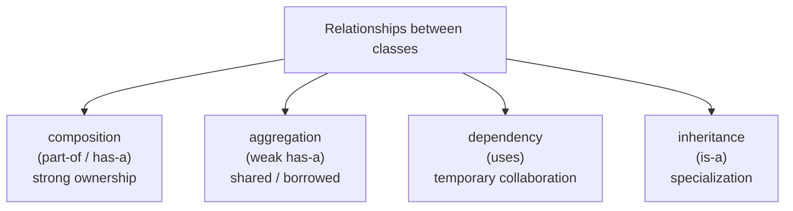
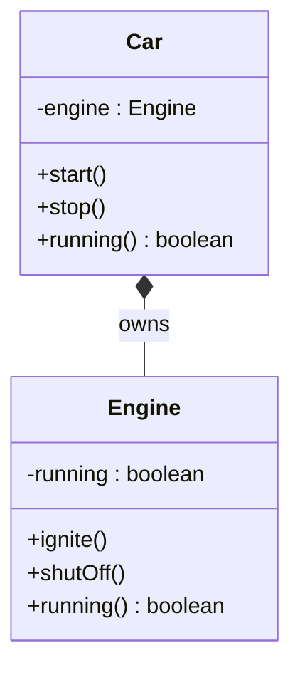
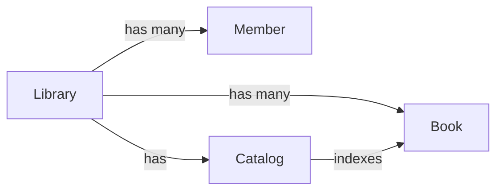
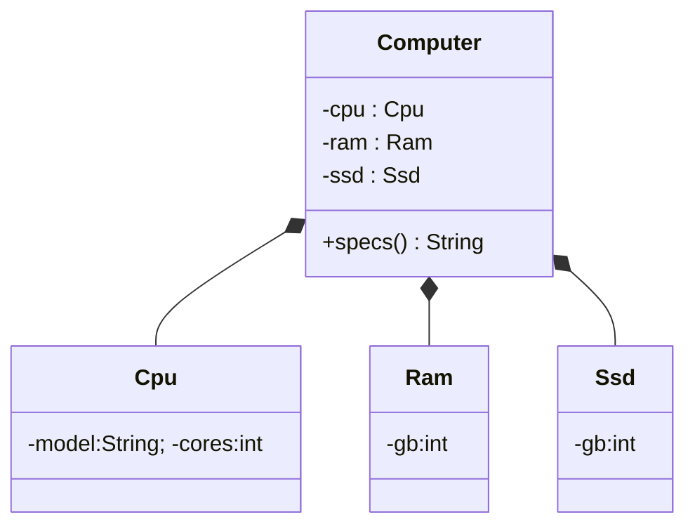

A complete object model is never one giant class. It is a *graph* of
small classes that hold references to each other. The most common —
and most important — relationship between two classes is
**composition**: one class is *made out of* another.

> A `Car` has an `Engine`. A `House` has `Room`s. A `Person` has an
> `Address`. A `Library` has `Book`s.

Every one of those sentences is a composition relationship in disguise.

## The "has-a" relationship

Two classes can relate in many ways. The four we'll meet in this
course are:

This page is about the strongest of them: **composition**. In a
composition relationship, the *whole* owns the *part*. The part's
lifetime is tied to the whole's. If the car goes to the junkyard, so
does the engine.

In Java, composition looks like one class holding a `private final`
field of another type, with the part being constructed by the whole
(or handed in via the constructor) and never shared with anyone else.

## A first example: Car has an Engine

The solid diamond `*--` in UML means *composition* — strong
ownership. The `Engine` is part of the `Car`.

<CodeBlock
  adapter="java"
  entryFilename="Main.java"
  files={[
    {
      filename: "Main.java",
      initialContent: `public class Main {
    public static void main(String[] args) {
        Car c = new Car();
        System.out.println("Before start, running? " + c.running());
        c.start();
        System.out.println("After  start, running? " + c.running());
        c.stop();
        System.out.println("After  stop,  running? " + c.running());
    }
}
`,
    },
    {
      filename: "Engine.java",
      initialContent: `public class Engine {
    private boolean running;

    public void ignite()   { running = true;  }
    public void shutOff()  { running = false; }
    public boolean running() { return running; }
}
`,
    },
    {
      filename: "Car.java",
      initialContent: `public class Car {
    // The engine is constructed and OWNED by the Car.
    private final Engine engine = new Engine();

    public void start()  { engine.ignite();  }
    public void stop()   { engine.shutOff(); }
    public boolean running() { return engine.running(); }
}
`}
  ]}
/>

Things to notice:

1. The `Engine` is created *inside* the `Car`. No outside code ever
   gets a reference to it.
2. The `Car`'s `start`, `stop`, and `running` methods **delegate** to
   the engine. The car does not implement engine logic itself — it
   *asks the engine*.
3. When the `Car` becomes unreachable, the `Engine` becomes
   unreachable too. They live and die together.

## Why composition matters

Composition is what lets you build *big* objects out of *small*
ones. Each small one is well-encapsulated, easy to reason about, and
easy to test. The big one just orchestrates.

If `Library` tried to do everything itself, it would be a 2000-line
class. With composition, each concept gets its own small class with
a focused job, and `Library` is mostly a *coordinator*.

## Delegation: the partner of composition

A class that owns a part very often **delegates** part of its behavior
to that part. Delegation just means "I'll ask the part to do this
for me." It is the everyday verb of composition.

<CodeBlock
  adapter="java"
  entryFilename="Main.java"
  files={[
    {
      filename: "Main.java",
      initialContent: `public class Main {
    public static void main(String[] args) {
        Person p = new Person("Ada", new Address("13 Albemarle St", "London"));
        System.out.println(p.describe());
        System.out.println("City: " + p.city());      // Person delegates to Address
    }
}
`,
    },
    {
      filename: "Address.java",
      initialContent: `public class Address {
    private final String street;
    private final String city;
    public Address(String street, String city) {
        this.street = street;
        this.city = city;
    }
    public String street() { return street; }
    public String city()   { return city; }
    public String oneLine() { return street + ", " + city; }
}
`,
    },
    {
      filename: "Person.java",
      initialContent: `public class Person {
    private final String  name;
    private final Address address;

    public Person(String name, Address address) {
        this.name    = name;
        this.address = address;
    }

    public String describe() {
        return name + " — " + address.oneLine();          // delegation
    }

    public String city() {
        return address.city();                             // delegation
    }
}
`,
    },
  ]}
/>

`Person.city()` doesn't keep a `city` field. It asks its `Address`.
If the rules for "what is your city" ever change, they change in one
place — inside `Address`.

## Composition is the *answer* to most modeling problems

Beginners often reach for inheritance ("a `SportsCar` extends `Car`")
when composition would serve better ("a `Car` has an `Engine`, which
might be a sports engine"). We will study inheritance later, and you
will see how often the right move is to reach for composition first.

> "**Favor object composition over class inheritance**" — Gang of
> Four

We're going to repeat that sentence several times this course. It is
worth the repetition.

## A richer example: a Computer composed of parts

This example shows multiple components combined into a whole, with
each component encapsulated.

<CodeBlock
  adapter="java"
  entryFilename="Main.java"
  files={[
    {
      filename: "Main.java",
      initialContent: `public class Main {
    public static void main(String[] args) {
        Computer c = new Computer(
            new Cpu("M4", 10),
            new Ram(16),
            new Ssd(512)
        );
        System.out.println(c.specs());
    }
}
`,
    },
    {
      filename: "Cpu.java",
      initialContent: `public class Cpu {
    private final String model;
    private final int cores;
    public Cpu(String model, int cores) {
        this.model = model;
        this.cores = cores;
    }
    public String describe() { return model + " (" + cores + " cores)"; }
}
`,
    },
    {
      filename: "Ram.java",
      initialContent: `public class Ram {
    private final int gb;
    public Ram(int gb) { this.gb = gb; }
    public String describe() { return gb + " GB RAM"; }
}
`,
    },
    {
      filename: "Ssd.java",
      initialContent: `public class Ssd {
    private final int gb;
    public Ssd(int gb) { this.gb = gb; }
    public String describe() { return gb + " GB SSD"; }
}
`,
    },
    {
      filename: "Computer.java",
      initialContent: `public class Computer {
    private final Cpu cpu;
    private final Ram ram;
    private final Ssd ssd;

    public Computer(Cpu cpu, Ram ram, Ssd ssd) {
        this.cpu = cpu;
        this.ram = ram;
        this.ssd = ssd;
    }

    public String specs() {
        return "Computer: " + cpu.describe()
             + ", "         + ram.describe()
             + ", "         + ssd.describe();
    }
}
`,
    },
  ]}
/>

`Computer` has *zero* logic of its own about CPUs, RAM, or SSDs. It
delegates everything to the components and just assembles the
answer. That is the goal: a containing class that orchestrates, with
the real behavior living in well-defined parts.

## Practice

<ChallengeCard
  adapter="java"
  title="Compose a Book and an Author"
  instructions={`Build a tiny model with two classes, \`Author\` and \`Book\`. A \`Book\` *owns* its \`Author\`.

- \`Author\` has private final fields \`firstName\` and \`lastName\` and a method \`fullName()\` returning \`firstName + " " + lastName\`.
- \`Book\` has private final fields \`title\` (\`String\`) and \`author\` (\`Author\`), and a method \`citation()\` returning \`title + " by " + author.fullName()\` — that is, \`Book\` delegates to \`Author\`.

The provided \`Main\` will print:

\`\`\`
Pride and Prejudice by Jane Austen
\`\`\``}
  entryFilename="Main.java"
  files={[
    {
      filename: "Main.java",
      initialContent: `public class Main {
    public static void main(String[] args) {
        Author austen = new Author("Jane", "Austen");
        Book   book   = new Book("Pride and Prejudice", austen);
        System.out.println(book.citation());
    }
}
`,
    },
    {
      filename: "Author.java",
      initialContent: `public class Author {
    // TODO
}
`,
      solutionContent: `public class Author {
    private final String firstName;
    private final String lastName;
    public Author(String firstName, String lastName) {
        this.firstName = firstName;
        this.lastName  = lastName;
    }
    public String fullName() {
        return firstName + " " + lastName;
    }
}
`,
    },
    {
      filename: "Book.java",
      initialContent: `public class Book {
    // TODO — must compose an Author
}
`,
      solutionContent: `public class Book {
    private final String title;
    private final Author author;
    public Book(String title, Author author) {
        this.title  = title;
        this.author = author;
    }
    public String citation() {
        return title + " by " + author.fullName();
    }
}
`,
    },
  ]}
  tests={[
    {
      id: "compose-book-author",
      name: "Book delegates author formatting to Author",
      expect: { stdoutEquals: "Pride and Prejudice by Jane Austen" },
    },
  ]}
/>

## Test your understanding

<MultipleChoice
  markdown={`Which of these is the clearest example of **composition**?

- A \`Dog\` *is a* \`Mammal\`
  > That is *inheritance* (is-a).
- A \`PrintService\` *uses* a \`Logger\` it was handed temporarily
  > That is closer to *dependency* (uses).
- [o] A \`House\` *has* \`Room\`s that are created and destroyed with the house
  > Strong ownership of parts whose lifetime is bound to the whole.
- A \`Library\` keeps references to \`Book\`s borrowed from a national archive
  > Books that live outside the library are more like *aggregation* (weak has-a).`}
/>

<MultipleChoice
  markdown={`When \`Car\` exposes \`start()\` and internally calls \`engine.ignite()\`, what is that pattern called?

- Inheritance
  > No subclassing is happening.
- Polymorphism
  > No method overriding is happening here.
- [o] Delegation — the \`Car\` asks its part (the engine) to do the work
  > Composition + delegation is the workhorse of OOP.
- Abstraction leak
  > It's the opposite — the engine details are hidden from callers.`}
/>

<MultipleChoice
  markdown={`Why is composition often preferred over inheritance when both are possible?

- Composition is required by the Java compiler
  > It is not.
- Inheritance was deprecated in Java 17
  > It was not.
- [o] Composition assembles small, swappable pieces, while inheritance locks classes into a rigid tree that's hard to change later
  > The GoF principle "favor object composition over class inheritance" captures this.
- Composition methods always run faster
  > Speed is not the criterion.`}
/>

<Callout type="success">
You can build big objects out of small ones. Next: the *weaker*
relationships — **aggregation and dependency** — for when one object
*uses* another without owning it.
</Callout>
