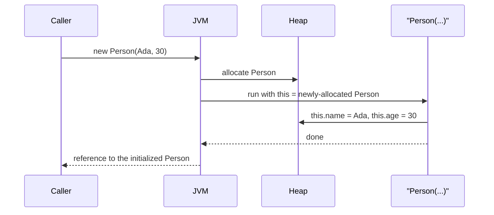
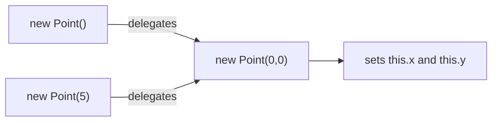
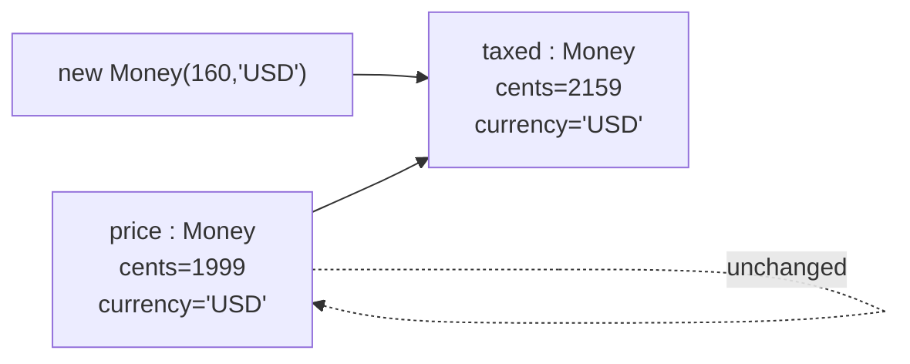

A constructor's job is small but absolute: **make sure that an object
exists in a valid state from the moment it is born.** A class that
fails at this lets the rest of the system inherit half-built objects
— and half-built objects produce bugs that look like ghosts.

## What a constructor is

A constructor looks like a method but with two differences:

1. It has the same name as the class.
2. It has no return type.

When you write `new Person("Ada", 30)`, Java allocates a new `Person`
on the heap and then *calls* the constructor on that fresh allocation
to initialize it.

<CodeBlock
  adapter="java"
  initialCode={`public class Main {
    public static void main(String[] args) {
        Person p = new Person("Ada", 30);
        System.out.println(p.describe());
    }
}

class Person {
    private final String name;
    private final int    age;

    public Person(String name, int age) {
        this.name = name;
        this.age  = age;
    }

    public String describe() {
        return name + " (" + age + ")";
    }
}
`}
/>

## The default constructor and what happens without one

If a class declares **no** constructors at all, Java *secretly* gives
it a no-argument constructor that does nothing. The moment you
declare *any* constructor, that freebie disappears.

<CodeBlock
  adapter="java"
  initialCode={`public class Main {
    public static void main(String[] args) {
        Empty e = new Empty();          // works: default no-arg constructor
        System.out.println("e built: " + (e != null));

        // Uncommenting this will fail to compile, because Person no longer
        // has a no-arg constructor (you defined a Person(String,int) above):
        // Person p = new Person();
    }
}

class Empty {
    // no constructor declared — Java inserts a default Empty()
}
`}
/>

## Constructors enforce invariants from the very first moment

The thing constructors *really* do for design is enforce invariants
before the object is allowed to exist. The rule "a `Person`'s age is
never negative" is a *class* rule — and the class can enforce it by
refusing to be constructed in violation of it.

<CodeBlock
  adapter="java"
  initialCode={`public class Main {
    public static void main(String[] args) {
        try {
            Person p = new Person("", -1);    // both bad
            System.out.println(p);
        } catch (IllegalArgumentException e) {
            System.out.println("rejected: " + e.getMessage());
        }
    }
}

class Person {
    private final String name;
    private final int    age;

    public Person(String name, int age) {
        if (name == null || name.isBlank())
            throw new IllegalArgumentException("name must not be blank");
        if (age < 0)
            throw new IllegalArgumentException("age must be >= 0");
        this.name = name;
        this.age  = age;
    }
}
`}
/>

This is enormously important. Once that constructor returns
successfully, every other method in `Person` can *assume* the name is
non-blank and the age is ≥ 0. Without that guarantee, every method
would need to start with defensive checks.

## Overloaded constructors and `this(...)`

Java lets a class have several constructors with different parameter
lists. This is called **constructor overloading**. The most common
use is convenience: one "real" constructor that does the work, and a
shorter one that fills in defaults by calling the real one with
`this(...)`.

<CodeBlock
  adapter="java"
  initialCode={`public class Main {
    public static void main(String[] args) {
        System.out.println(new Point());
        System.out.println(new Point(5));
        System.out.println(new Point(3, 4));
    }
}

class Point {
    private final int x, y;

    public Point()                  { this(0, 0); }      // origin
    public Point(int both)          { this(both, both); } // square
    public Point(int x, int y) {                          // the "real" one
        this.x = x;
        this.y = y;
    }

    public String toString() { return "(" + x + ", " + y + ")"; }
}
`}
/>

The rule for `this(...)` chains: if you use it, it must be the *first
statement* in the constructor. This guarantees there is exactly one
"primary" constructor that does the actual initialization, and all
others funnel through it.

## `final` fields and immutability

When a field is declared `final`, it must be assigned *exactly once*,
in the constructor (or at the declaration). After that it cannot be
reassigned.

An object whose fields are all `final` and whose constructor sets
them is **immutable**: it cannot change after creation. Immutable
objects are extremely safe — they can be passed around freely, shared
between methods, even shared between threads, with no risk of
accidental mutation.

<CodeBlock
  adapter="java"
  initialCode={`public class Main {
    public static void main(String[] args) {
        Money price = new Money(1999, "USD");        // $19.99
        Money taxed = price.add(new Money(160, "USD"));
        System.out.println("price: " + price);
        System.out.println("taxed: " + taxed);
    }
}

class Money {
    private final long   cents;
    private final String currency;

    public Money(long cents, String currency) {
        if (currency == null) throw new IllegalArgumentException("currency required");
        this.cents = cents;
        this.currency = currency;
    }

    public Money add(Money other) {
        if (!this.currency.equals(other.currency))
            throw new IllegalArgumentException("currency mismatch");
        // Note: we do NOT mutate this. We return a brand new Money.
        return new Money(this.cents + other.cents, this.currency);
    }

    public String toString() {
        return String.format("%.2f %s", cents / 100.0, currency);
    }
}
`}
/>

That `add` method is a small pattern worth remembering: **operations
return new instances instead of mutating the receiver**. `price`
stays `$19.99` forever; `taxed` is a *new* `Money`. This is how
strings, `BigDecimal`, `LocalDate`, and many other Java built-ins
work.

## Multi-file practice: build a valid object

<ChallengeCard
  adapter="java"
  title="Valid User construction"
  instructions={`Implement \`User\` so it cannot be constructed in an invalid state.

Rules:

- \`username\` must be non-null and length \`>= 3\`. Otherwise throw \`IllegalArgumentException("invalid username")\`.
- \`email\` must contain the character \`'@'\`. Otherwise throw \`IllegalArgumentException("invalid email")\`.
- Both fields are \`private final\`.
- Add public methods \`username()\` and \`email()\` that return the values.

Main runs three scenarios and is expected to print:

\`\`\`
ok: ada @ ada@oop.dev
bad: invalid username
bad: invalid email
\`\`\``}
  entryFilename="Main.java"
  files={[
    {
      filename: "Main.java",
      initialContent: `public class Main {
    public static void main(String[] args) {
        try {
            User u = new User("ada", "ada@oop.dev");
            System.out.println("ok: " + u.username() + " @ " + u.email());
        } catch (IllegalArgumentException e) {
            System.out.println("bad: " + e.getMessage());
        }
        try {
            new User("a", "ada@oop.dev");
        } catch (IllegalArgumentException e) {
            System.out.println("bad: " + e.getMessage());
        }
        try {
            new User("ada", "no-at-sign");
        } catch (IllegalArgumentException e) {
            System.out.println("bad: " + e.getMessage());
        }
    }
}
`,
    },
    {
      filename: "User.java",
      initialContent: `public class User {
    // TODO: private final fields + a validating constructor + accessors
}
`,
      solutionContent: `public class User {
    private final String username;
    private final String email;

    public User(String username, String email) {
        if (username == null || username.length() < 3)
            throw new IllegalArgumentException("invalid username");
        if (email == null || email.indexOf('@') < 0)
            throw new IllegalArgumentException("invalid email");
        this.username = username;
        this.email    = email;
    }

    public String username() { return username; }
    public String email()    { return email; }
}
`,
    },
  ]}
  tests={[
    {
      id: "validated-construction",
      name: "Constructs valid users and rejects invalid ones",
      expect: {
        stdoutLines: [
          "ok: ada @ ada@oop.dev",
          "bad: invalid username",
          "bad: invalid email",
        ],
        stdoutLinesExact: true,
      },
    },
  ]}
/>

## Test your understanding

<MultipleChoice
  markdown={`What is the single most important job of a constructor?

- To call all the other methods in the class
  > Constructors typically don't call public methods at all.
- [o] To bring an object into existence in a valid state, enforcing its invariants
  > Correct. After a constructor returns, every other method should be able to assume the object is valid.
- To print a debug message describing the new object
  > Side effects like logging don't belong in constructors.
- To allocate memory for the object
  > Allocation is the JVM's job; the constructor *initializes* an already-allocated object.`}
/>

<MultipleChoice
  markdown={`If a class declares the constructor \`public Person(String name, int age)\` and *no* no-argument constructor, what happens when you write \`new Person()\`?

- It runs Java's default no-arg constructor
  > That freebie is only generated when no other constructor is declared.
- It runs the two-argument constructor with \`null\` and \`0\`
  > Java does not invent argument values.
- [o] It fails to compile — there is no matching constructor
  > Correct. Once you declare any constructor, the implicit no-arg one disappears.
- It produces a \`NullPointerException\` at runtime
  > The problem is detected at compile time, not runtime.`}
/>

<MultipleChoice
  markdown={`Why is it useful for a class like \`Money\` to be immutable (all fields \`final\`, operations like \`add\` return new instances)?

- Immutable objects are slightly larger in memory and that helps caching
  > Size is unrelated to the benefits of immutability.
- The JVM can compile them down to machine code more easily
  > That's not the design motivation.
- [o] They cannot accidentally change underneath you, so they can be passed and shared freely without surprising mutations
  > Correct. Immutability eliminates an entire class of bug.
- They automatically run faster than mutable objects
  > Performance is not guaranteed; safety is the real benefit.`}
/>

<Callout type="success">
Objects come into existence valid. Now let's look at what they *do*
once they exist — the messages they respond to, in **Methods and
Messages**.
</Callout>
