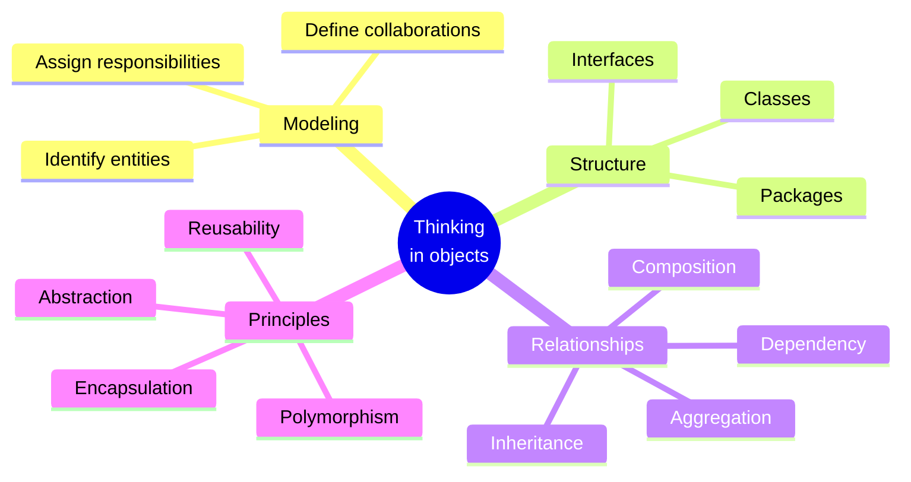

Welcome to **Object-Oriented Programming Blueprint with Java**, a course
about *thinking in objects*. It is designed for students of computer
science who are meeting object-oriented programming for the first time
and who want to understand *why* it exists, not just how to type its
syntax.

Java is the vehicle, not the destination. We use it because it forces
you to be explicit: every value is part of a class, every responsibility
lives somewhere on purpose, and every relationship between objects has
a name. By the end of the course you should be able to look at a
real-world problem — a library, a hospital ward, a vending machine, a
ride-share system — and **decompose it into a small society of
collaborating objects**.

## What this course is about

You will spend most of your time on:

- **Core OOP thinking** — what an object is, what it means for objects to *send messages*, and how a system emerges from their interactions
- **Object modeling** — turning vague descriptions ("a school has students") into precise classes, interfaces, and relationships
- **Encapsulation and abstraction** — hiding what callers should not see; exposing what they need
- **Relationships** — composition, aggregation, dependency, inheritance, and the trade-offs between them
- **Responsibility-driven design** — deciding *which* object should know *what* and *do* what
- **Software architecture fundamentals** — packages, layering, and how OOP keeps large codebases maintainable

This course intentionally does **not** spend much time on web frameworks,
build tools, dependency injection containers, ORMs, or production
operations. Those skills are valuable, but they distract from the more
important — and more durable — skill of being able to design a clean
object model in the first place.

## How to use this site

Every page mixes prose with three kinds of interactive widget:

1. **Executable Java code blocks.** Each block is compiled by `javac`
   and run on the JVM inside your browser via **CheerpJ**. The first
   run in a session is slow because the JVM has to boot; subsequent
   runs are fast.
2. **Multi-file challenge cards.** A real object model lives in many
   files: classes, interfaces, abstract classes, enums. You will see
   workspaces with several `.java` files side by side and fill in the
   missing parts.
3. **Multiple-choice questions.** Short single-answer checks at the
   end of most pages, with a per-choice explanation so a wrong answer
   still teaches you something.

<Callout type="info" title="Each code block is independent">
A variable, class, or method defined in one `<CodeBlock>` is **not**
visible in the next. This keeps every example self-contained. For a
persistent multi-file workspace, open the
[Java Playground](/playground/java) in a new tab.
</Callout>

## A tiny taste

This is the simplest possible object: a `Lamp` that can be turned on
and off. Notice that the lamp keeps its own state (`isOn`) and exposes
*behavior* (`turnOn`, `turnOff`, `describe`) rather than letting outside
code touch its fields. That is the seed of every idea in this course.

<CodeBlock
  adapter="java"
  starterCode={`public class Main {
    public static void main(String[] args) {
        Lamp desk = new Lamp("desk");
        System.out.println(desk.describe());
        desk.turnOn();
        System.out.println(desk.describe());
        desk.turnOff();
        System.out.println(desk.describe());
    }
}

class Lamp {
    private final String name;
    private boolean isOn;

    public Lamp(String name) {
        this.name = name;
        this.isOn = false;
    }

    public void turnOn()  { this.isOn = true; }
    public void turnOff() { this.isOn = false; }

    public String describe() {
        return name + " lamp is " + (isOn ? "ON" : "off");
    }
}
`}
/>

## Course outline

### Origins of OOP
A short story: the **software crisis** of the 1960s and 70s, the
**birth of OOP** in Simula and Smalltalk, and how the **Gang of Four**
popularized reusable design thinking. This is the *why*.

### Java and objects
Your first Java class, then a look at what *really* happens in memory
when you write `new Dog()` — the JVM's heap, references on the stack,
and what `null` means.

### Core OOP
Encapsulation, constructors, methods as messages, static vs. instance,
enums, and utility classes. The everyday vocabulary of object design.

### Relationships between objects
Composition, aggregation, dependency, inheritance, abstract classes,
interfaces, and polymorphism. How small objects compose into bigger
systems.

### Design thinking
Responsibility-driven design and how to organize a codebase into
packages and layers without losing your mind.

### Capstone
A guided modeling exercise: design a small **library management
system** end-to-end, exercising every idea in the course.
