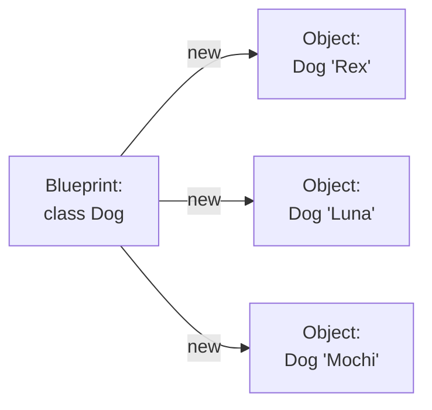
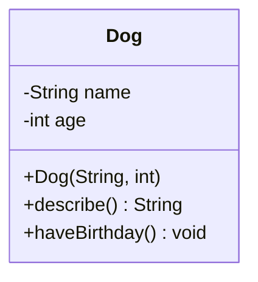

A **class** is a blueprint. An **object** is a thing built from that
blueprint. This page is a slow, careful look at the difference,
because almost every confusion in OOP starts with mixing those two
words up.

## The class is the description, the object is the thing

Imagine an architect's blueprint for a house. The blueprint says
"three bedrooms, two bathrooms, a kitchen." You cannot live in the
blueprint. You can only live in a *house built from the blueprint*.
And from the same blueprint you can build many houses — same shape,
different addresses, different colors, different families inside.

In Java, the keyword `class` declares a blueprint. The keyword `new`
builds an object from it. Each object has its own copy of the class's
*fields* (state), and the class defines what *methods* every object
of that type can respond to.

<CodeBlock
  adapter="java"
  starterCode={`public class Main {
  public static void main(String[] args) {
    Dog rex = new Dog("Rex", 4);
    Dog luna = new Dog("Luna", 2);

    System.out.println(rex.describe());
    System.out.println(luna.describe());

    rex.haveBirthday();
    System.out.println(rex.describe());
  }
}

class Dog {
  String name; // field: each Dog has its own
  int age;     // field: each Dog has its own

  Dog(String name, int age) { // constructor: how to build one
    this.name = name;
    this.age = age;
  }

  String describe() { // method: behavior every Dog supports
    return name + " is " + age + " years old";
  }

  void haveBirthday() { age = age + 1; }
}
`}
/>

Notice:

- `class Dog { ... }` is the **blueprint**.
- `new Dog("Rex", 4)` produces an **instance** (an object).
- `rex` and `luna` are **two different objects**. They share the
  blueprint but each has its own `name` and `age`.
- `rex.haveBirthday()` changes `rex.age`. It does not touch `luna.age`.

That last bullet point is the entire reason classes are useful. Each
object has its own state.

## The anatomy of a class

A class declaration typically has four sections, in this order by
convention:

| Part | Purpose |
| --- | --- |
| **Fields** | The state every instance carries |
| **Constructor(s)** | How to bring a valid new instance into existence |
| **Methods** | The behavior — the messages instances respond to |
| (sometimes) **Static members** | Things that belong to the class as a whole, not to instances |

We will meet static members in a later page. For now, almost
everything you write will be a field, a constructor, or a method.

## Multi-file classes: one class per file

Real Java programs put each top-level public class in its **own file**,
with the filename equal to the class name. We will follow that
convention from now on. CheerpJ in your browser does the same.

<CodeBlock
  adapter="java"
  entryFilename="Main.java"
  files={[
    {
      filename: "Main.java",
      initialContent: `public class Main {
    public static void main(String[] args) {
        Book hp = new Book("Harry Potter", "J. K. Rowling", 1997);
        Book lr = new Book("The Lord of the Rings", "J. R. R. Tolkien", 1954);

        System.out.println(hp.citation());
        System.out.println(lr.citation());
        System.out.println("Older book: " + (hp.olderThan(lr) ? hp.title() : lr.title()));
    }
}
`,
    },
    {
      filename: "Book.java",
      initialContent: `public class Book {
    private final String title;
    private final String author;
    private final int    year;

    public Book(String title, String author, int year) {
        this.title  = title;
        this.author = author;
        this.year   = year;
    }

    public String title()  { return title; }
    public String author() { return author; }
    public int    year()   { return year; }

    public String citation() {
        return author + ", \\"" + title + "\\" (" + year + ")";
    }

    public boolean olderThan(Book other) {
        return this.year < other.year;
    }
}
`,
    },
  ]}
/>

A few things are worth pointing out in `Book`:

- The fields are `private final`. **Private** means no code outside
  `Book` can read or write them directly. **Final** means once a
  field is assigned in the constructor, it cannot be reassigned. We
  will study both ideas in detail in *Encapsulation*.
- The methods `title()`, `author()`, `year()` are sometimes called
  **accessors** or **getters** — they answer questions about the
  object's state.
- `olderThan(Book other)` takes another `Book` as a parameter and
  compares the two. Inside that method, `this.year` refers to *this
  particular book's* year, while `other.year` refers to the
  argument's. (`other.year` is allowed because *the comparison is
  happening inside the `Book` class itself*.)

## `this`: the object the method is running on

Every non-static method has an implicit parameter called `this`. It is
**the object the method was called on**. When you write
`rex.describe()`, inside `describe`, `this` is `rex`. When you write
`luna.describe()`, inside the *same* method body, `this` is `luna`.

You usually don't have to type `this` — Java assumes it — but you
*must* type it when you have a parameter or local variable with the
same name as a field, which is why constructors often look like
`this.name = name;`.

<CodeBlock
  adapter="java"
  starterCode={`public class Main {
  public static void main(String[] args) {
    Counter c = new Counter();
    c.bump();
    c.bump();
    c.bump();
    System.out.println("count = " + c.value());

    Counter d = new Counter(); // a separate Counter
    d.bump();
    System.out.println("c = " + c.value() + ", d = " + d.value());
  }
}

class Counter {
  private int count; // each Counter has its own
  public void bump() { this.count = this.count + 1; }
  public int value() { return this.count; }
}
`}
/>

## Beginner-friendly objects exercise

<ChallengeCard
  adapter="java"
  title="Build a Rectangle class"
  instructions={`Create a \`Rectangle\` with a \`width\` and \`height\` (both \`double\`). It must support \`area()\` and \`perimeter()\` methods.

\`Main.java\` is already wired up — it constructs a \`Rectangle\` with width \`4\` and height \`3\` and prints two lines:

\`\`\`
area: 12.0
perimeter: 14.0
\`\`\``}
  entryFilename="Main.java"
  files={[
    {
      filename: "Main.java",
      initialContent: `public class Main {
    public static void main(String[] args) {
        Rectangle r = new Rectangle(4.0, 3.0);
        System.out.println("area: " + r.area());
        System.out.println("perimeter: " + r.perimeter());
    }
}
`,
    },
    {
      filename: "Rectangle.java",
      initialContent: `public class Rectangle {
    // TODO: declare private fields width and height (both double)

    public Rectangle(double width, double height) {
        // TODO: assign the parameters into the fields
    }

    public double area() {
        // TODO: return width * height
        return 0;
    }

    public double perimeter() {
        // TODO: return 2 * (width + height)
        return 0;
    }
}
`,
      solutionContent: `public class Rectangle {
    private final double width;
    private final double height;

    public Rectangle(double width, double height) {
        this.width  = width;
        this.height = height;
    }

    public double area() {
        return width * height;
    }

    public double perimeter() {
        return 2.0 * (width + height);
    }
}
`,
    },
  ]}
  tests={[
    {
      id: "rect",
      name: "Prints area and perimeter",
      expect: {
        stdoutLines: ["area: 12.0", "perimeter: 14.0"],
        stdoutLinesExact: true,
      },
    },
  ]}
/>

## Two objects, one class

This challenge introduces a second object to drive home that
**each instance has its own state**.

<ChallengeCard
  adapter="java"
  title="Two independent counters"
  instructions={`Implement the \`Counter\` class with a private \`int count\` initialized to 0, a \`bump()\` method that increases the count by 1, and a \`value()\` method that returns the current count. The provided \`Main\` creates **two** counters and prints their values; they must be independent.

Expected output:

\`\`\`
a=3, b=1
\`\`\``}
  entryFilename="Main.java"
  files={[
    {
      filename: "Main.java",
      initialContent: `public class Main {
    public static void main(String[] args) {
        Counter a = new Counter();
        Counter b = new Counter();
        a.bump(); a.bump(); a.bump();
        b.bump();
        System.out.println("a=" + a.value() + ", b=" + b.value());
    }
}
`,
    },
    {
      filename: "Counter.java",
      initialContent: `public class Counter {
    // TODO: a private int field, a bump() method, a value() method
}
`,
      solutionContent: `public class Counter {
    private int count = 0;
    public  void bump()  { count++; }
    public  int  value() { return count; }
}
`,
    },
  ]}
  tests={[
    {
      id: "independent",
      name: "Counters keep separate state",
      expect: { stdoutEquals: "a=3, b=1" },
    },
  ]}
/>

## Test your understanding

<MultipleChoice
  markdown={`What is the difference between a *class* and an *object* in Java?

- They are exactly the same thing
  > They are different in a very specific way.
- An object is a description; a class is built from it
  > That's backwards.
- [o] A class is a blueprint that describes structure and behavior; an object (instance) is an individual thing created from that blueprint
  > You can have many objects of the same class, each with its own field values.
- A class can have state but an object cannot
  > Objects are the things that *carry* state; classes are descriptions.`}
/>

<MultipleChoice
  markdown={`If you write \`Dog a = new Dog("Rex", 4);\` and \`Dog b = new Dog("Luna", 2);\`, and then call \`a.haveBirthday();\`, what happens to \`b.age\`?

- It is also incremented because all dogs share the field
  > Each instance has its own copy of the fields.
- It is set to 0
  > Not modified at all.
- [o] It stays the same — each object has its own copy of the fields
  > \`age\` belongs to each instance individually.
- The program raises an error
  > No error; instance fields are independent.`}
/>

<MultipleChoice
  markdown={`Inside an instance method, what does the keyword \`this\` refer to?

- The class itself (the blueprint)
  > That's closer to what static members operate on.
- A copy of every other object of the same class
  > No, \`this\` is a single reference.
- [o] The specific object the method was called on
  > If you call \`rex.describe()\`, then inside \`describe\`, \`this\` is \`rex\`.
- A field automatically named \`this\`
  > \`this\` is a keyword, not a user-defined field.`}
/>
