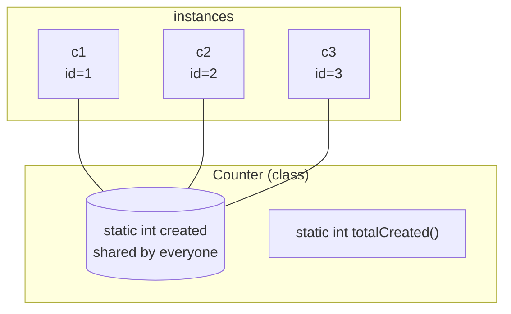
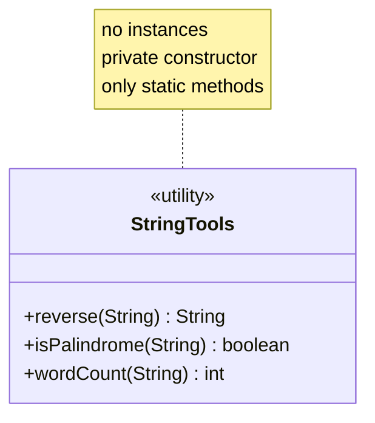
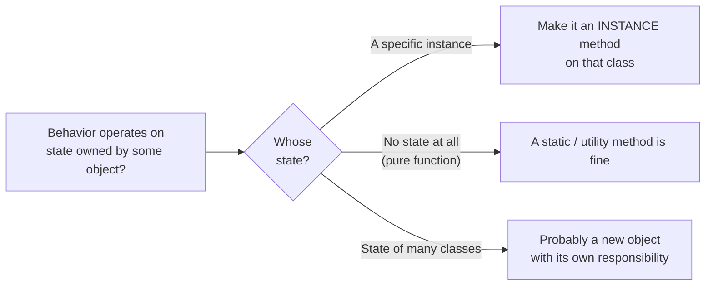

So far, every field and every method we've written has belonged to
**individual objects**. Each `Dog` has its own `name`. Each
`BankAccount` has its own `balance`. We send messages to specific
instances.

But sometimes a piece of data or a piece of behavior doesn't belong
to any one instance — it belongs to the *class itself*. Java models
that with the keyword **`static`**.

## `static`: belongs to the class, not to instances

A `static` member exists *once* per class, no matter how many
instances you create. Every instance shares the same `static` field
and the same `static` method.

<CodeBlock
  adapter="java"
  starterCode={`public class Main {
  public static void main(String[] args) {
    Widget a = new Widget();
    Widget b = new Widget();
    Widget c = new Widget();

    System.out.println("a.id = " + a.id());
    System.out.println("b.id = " + b.id());
    System.out.println("c.id = " + c.id());
    System.out.println("total created so far = " + Widget.totalCreated());
  }
}

class Widget {
  // Belongs to the CLASS — shared by all instances:
  private static int created = 0;

  // Belongs to each INSTANCE — each Widget has its own:
  private final int id;

  public Widget() {
    created++; // bump the shared counter
    this.id = created;
  }

  public int id() { return id; }

  public static int totalCreated() { return created; }
}
`}
/>

Notice the difference in how you call the two methods. `a.id()` is
sent to a specific widget. `Widget.totalCreated()` is sent *to the
class*. There is no specific widget involved.

<Callout type="warn" title="Static state is global state in disguise">
A `static` field is essentially a global variable scoped to a class.
It's convenient, but it has the same downside the *Software Crisis*
chapter warned about: anyone with access to the class can change it.
Prefer instance state. Use static state for things that are genuinely
class-wide (a counter of instances, a cached singleton resource, a
constant).
</Callout>

## Constants: `public static final`

The combination `public static final` is the standard idiom for a
**constant**: a single value that belongs to the class and can never
change. By convention, constants are written in `UPPER_SNAKE_CASE`.

<CodeBlock
  adapter="java"
  starterCode={`public class Main {
  public static void main(String[] args) {
    System.out.println("Circumference of unit circle: " + Geometry.TAU);
    System.out.println("Circle area, r=3:           " + Geometry.circleArea(3));
  }
}

class Geometry {
  public static final double PI = 3.14159265358979;
  public static final double TAU = 2 * PI;

  public static double circleArea(double r) { return PI * r * r; }
}
`}
/>

Java's standard library is full of these: `Integer.MAX_VALUE`,
`Math.PI`, `Boolean.TRUE`, `String.CASE_INSENSITIVE_ORDER`. They are
*values that have always been there* and that you never want anyone
to change.

## Utility classes

A **utility class** is a class that holds *only* `static` members —
no instance state, no constructor anyone calls. It is a namespace for
related helper functions. Java's own `Math` class is the canonical
example.

The convention is to give a utility class a `private` constructor so
nobody can mistakenly write `new StringTools()`.

<CodeBlock
  adapter="java"
  entryFilename="Main.java"
  files={[
    {
      filename: "Main.java",
      initialContent: `public class Main {
  public static void main(String[] args) {
    System.out.println(StringTools.reverse("OOP"));
    System.out.println(StringTools.isPalindrome("level"));
    System.out.println(StringTools.isPalindrome("Java"));
    System.out.println(StringTools.wordCount("encapsulation is a discipline"));
  }
}
`,
    },
    {
      filename: "StringTools.java",
      initialContent: `public final class StringTools {
  private StringTools() {
    // Never instantiated. This constructor exists only to forbid
    // \`new StringTools()\`.
    throw new AssertionError("no instances");
  }

  public static String reverse(String s) {
    return new StringBuilder(s).reverse().toString();
  }

  public static boolean isPalindrome(String s) { return s.equals(reverse(s)); }

  public static int wordCount(String s) {
    if (s == null || s.isBlank())
      return 0;
    return s.trim().split("\\\\s+").length;
  }
}
`,
    },
  ]}
/>

The class is also marked `final` (no class can extend it) — another
convention for utility classes.

## When *not* to use a utility class

It is tempting, especially when coming from procedural languages, to
solve every problem with a utility class. Resist. A pile of static
methods on a bag of fields is a procedural program in disguise.

Rule of thumb: **if a method's behavior depends on the state of some
object, the method belongs to that object as an instance method.**
Static is for genuinely stateless helpers.

## Factory methods: a friendly use of `static`

A static method on a class that *creates and returns instances of
that class* is called a **factory method**. It can be more readable
than a constructor and can return existing instances rather than
always allocating.

<CodeBlock
  adapter="java"
  starterCode={`public class Main {
  public static void main(String[] args) {
    Color red = Color.rgb(255, 0, 0);
    Color black = Color.named("black");
    Color white = Color.named("white");

    System.out.println(red);
    System.out.println(black);
    System.out.println(white);
  }
}

class Color {
  private final int r, g, b;
  private Color(int r, int g, int b) {
    this.r = r;
    this.g = g;
    this.b = b;
  }

  // Factory methods — the *named* construction paths
  public static Color rgb(int r, int g, int b) { return new Color(r, g, b); }
  public static Color named(String name) {
    switch (name) {
    case "black":
      return new Color(0, 0, 0);
    case "white":
      return new Color(255, 255, 255);
    case "red":
      return new Color(255, 0, 0);
    default:
      throw new IllegalArgumentException("unknown color: " + name);
    }
  }

  public String toString() { return "Color(" + r + "," + g + "," + b + ")"; }
}
`}
/>

The constructor is `private`, so the only way to construct a `Color`
is through one of the factory methods. They have intent-revealing
names (`rgb`, `named`) that no overloaded constructor could match.

## Practice

<ChallengeCard
  adapter="java"
  title="A Math utility"
  instructions={`Implement \`MyMath\` as a *pure utility class*:

- A \`private\` no-arg constructor (so \`new MyMath()\` is impossible).
- Static methods:
  - \`max(int a, int b)\` returns the larger of \`a\` and \`b\`.
  - \`clamp(int x, int lo, int hi)\` returns \`x\` constrained to \`[lo, hi]\`. Throws \`IllegalArgumentException\` if \`lo > hi\`.
  - \`sum(int[] xs)\` returns the sum of all elements (returns 0 for empty or \`null\`).

\`Main.java\` will exercise the API and is expected to print:

\`\`\`
max=10
clamp1=5
clamp2=0
clamp3=10
sum=15
\`\`\``}
  entryFilename="Main.java"
  files={[
    {
      filename: "Main.java",
      initialContent: `public class Main {
  public static void main(String[] args) {
    System.out.println("max=" + MyMath.max(7, 10));
    System.out.println("clamp1=" + MyMath.clamp(5, 0, 10));
    System.out.println("clamp2=" + MyMath.clamp(-3, 0, 10));
    System.out.println("clamp3=" + MyMath.clamp(99, 0, 10));
    System.out.println("sum=" + MyMath.sum(new int[] {1, 2, 3, 4, 5}));
  }
}
`,
    },
    {
      filename: "MyMath.java",
      initialContent: `public final class MyMath {
  // TODO: private constructor + the three static methods
}
`,
      solutionContent: `public final class MyMath {
  private MyMath() { throw new AssertionError("no instances"); }

  public static int max(int a, int b) { return a >= b ? a : b; }
  public static int clamp(int x, int lo, int hi) {
    if (lo > hi)
      throw new IllegalArgumentException("lo > hi");
    if (x < lo)
      return lo;
    if (x > hi)
      return hi;
    return x;
  }
  public static int sum(int[] xs) {
    if (xs == null)
      return 0;
    int s = 0;
    for (int v : xs)
      s += v;
    return s;
  }
}
`,
    },
  ]}
  tests={[
    {
      id: "mymath",
      name: "Static helpers produce expected results",
      expect: {
        stdoutLines: ["max=10", "clamp1=5", "clamp2=0", "clamp3=10", "sum=15"],
        stdoutLinesExact: true,
      },
    },
  ]}
/>

## Test your understanding

<MultipleChoice
  markdown={`A field declared \`static\` belongs to...

- Each instance, with one independent copy per instance
  > That describes *non-static* (instance) fields.
- [o] The class itself; there is one copy shared by all instances
  > \`static\` members belong to the class, not to any individual object.
- The first instance created
  > Static state is independent of any instance.
- The package that contains the class
  > It belongs to the class specifically.`}
/>

<MultipleChoice
  markdown={`What is the convention used in Java to define a constant?

- \`const\` keyword in front of the field
  > Java has no \`const\` keyword.
- \`@Constant\` annotation
  > No such annotation.
- [o] \`public static final\` field, written in \`UPPER_SNAKE_CASE\`
  > This is the standard idiom — class-wide, immutable, and easy to spot.
- \`private\` field with a getter
  > That makes a constant-ish *instance* value, but the canonical Java idiom is \`public static final\`.`}
/>

<MultipleChoice
  markdown={`When is a *utility class* (only \`static\` members, private constructor) a reasonable choice?

- Whenever you want to avoid writing constructors
  > Avoidance isn't a design reason.
- [o] When the methods are genuinely stateless and don't naturally belong to any particular object
  > Pure functions on a shared theme (like \`Math\`) fit this nicely.
- For all classes — it makes them easier to test
  > Heavy static use *hurts* testability and reuse. It also negates most OOP benefits.
- For any class that has more than ten methods
  > Method count is not a criterion.`}
/>
