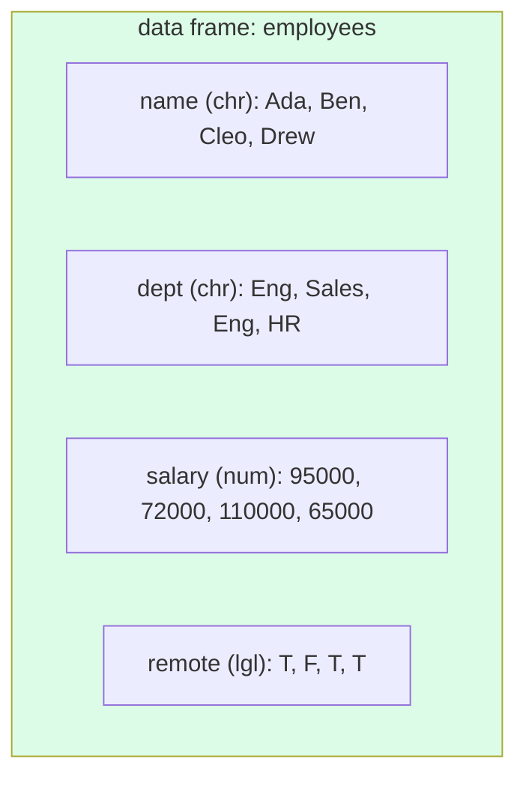

A real dataset rarely lives as a single vector. It lives as a
**table**: rows for observations, columns for variables. In R,
that table is called a **data frame** — and it's the central data
structure for nearly all statistical and data work.

A data frame is, fundamentally, just **a list of equal-length
vectors, displayed as a table.** Each column is a vector. All
columns must have the same length. That's it.

## Creating a data frame from scratch

You can build one with `data.frame()`:

<CodeBlock
  adapter="r"
  starterCode={`employees <- data.frame(
  name   = c("Ada", "Ben", "Cleo", "Drew"),
  dept   = c("Eng", "Sales", "Eng", "HR"),
  salary = c(95000, 72000, 110000, 65000),
  remote = c(TRUE, FALSE, TRUE, TRUE)
)

print(employees)
`}
/>

When you `print` a data frame in WebR, you get a real rendered
HTML table. Each column has its own type — `name` and `dept` are
character, `salary` is numeric, `remote` is logical.

The columns are vectors. The table just *displays* them
side-by-side.

## Inspecting a data frame

R provides a small toolkit of inspection functions. You will use
these at the start of *every* real analysis:

<CodeBlock
  adapter="r"
  starterCode={`# A built-in data frame
data(mtcars)

dim(mtcars)        # rows, columns
nrow(mtcars)
ncol(mtcars)
names(mtcars)      # column names
head(mtcars)       # first 6 rows
tail(mtcars, 3)    # last 3 rows
str(mtcars)        # compact summary of structure
summary(mtcars)    # column-by-column statistics
`}
/>

Of these, `str()` and `summary()` are the two you will use the
most. `str()` shows the *shape* of the data; `summary()` shows the
*content*.

## Accessing columns

A data frame is a list of columns. You access a column with `$`
or with `[["..."]]`:

<CodeBlock
  adapter="r"
  starterCode={`employees <- data.frame(
  name   = c("Ada", "Ben", "Cleo", "Drew"),
  salary = c(95000, 72000, 110000, 65000)
)

employees$salary           # by name with $
employees[["salary"]]      # by name with [[
mean(employees$salary)     # use it like any vector
`}
/>

Once you've grabbed a column, you're back in vector land — every
trick from the last four pages works.

## Indexing rows and columns: `[row, col]`

A data frame can also be indexed with two-dimensional `[ ]`
notation. The convention is `[rows, columns]`. Leave a slot empty
to mean "all":

<CodeBlock
  adapter="r"
  starterCode={`data(mtcars)

mtcars[1, ]              # first row, all columns
mtcars[, 1]              # all rows, first column (returns a vector)
mtcars[1:5, c("mpg","hp")]   # rows 1-5, just mpg and hp
mtcars[mtcars$mpg > 25, ]    # rows where mpg > 25, all columns
`}
/>

That last line is the classic data-frame *filter*: use a logical
vector built from one of the columns to select rows.

## Adding and modifying columns

Adding a new column is just like assigning to a name with `$`:

<CodeBlock
  adapter="r"
  starterCode={`employees <- data.frame(
  name   = c("Ada", "Ben", "Cleo", "Drew"),
  salary = c(95000, 72000, 110000, 65000)
)

# Add a derived column
employees$bonus <- employees$salary * 0.10

# Add a static column
employees$active <- TRUE

print(employees)
`}
/>

Vectorized arithmetic works exactly as you'd hope —
`employees$salary * 0.10` produces a new vector of bonuses, which
is then stored as a new column.

## Built-in datasets: your sandbox

R comes with dozens of built-in datasets you can experiment with
freely. A few favorites we'll use throughout the course:

<CodeBlock
  adapter="r"
  starterCode={`# mtcars: 32 cars (1974 Motor Trend magazine), 11 variables
head(mtcars)

# iris: 150 flowers, 4 measurements, 3 species
head(iris)

# airquality: New York air quality measurements
head(airquality)
`}
/>

Real datasets, even classics like these, have quirks: missing
values, weird scales, oddly-named columns. Half the joy of EDA is
finding them.

## Test your understanding

<MultipleChoice
  markdown={`Fundamentally, what is a data frame in R?

- A single multi-dimensional array
- An Excel file
- [o] A list of equal-length vectors (one per column), displayed as a table
  > Each column is a vector — possibly of a different type — and they all share the same length.
- A SQL table`}
/>

<MultipleChoice
  markdown={`Which expression returns the \`mpg\` column of \`mtcars\` as a vector?

- \`mtcars[mpg]\`
- [o] \`mtcars$mpg\`
  > \`$\` extracts a single column by name and returns it as a vector. \`mtcars[["mpg"]]\` works too.
- \`mtcars.mpg\`
- \`mtcars(mpg)\``}
/>

<MultipleChoice
  markdown={`What does \`mtcars[mtcars$mpg > 25, ]\` return?

- The single value of \`mpg\` greater than 25
- The column \`mpg\` filtered
- [o] All rows of \`mtcars\` where \`mpg > 25\`, with all columns kept
  > The logical vector \`mtcars$mpg > 25\` selects rows; the empty slot after the comma keeps all columns.
- An error`}
/>

## Mini challenge: build and summarize a small data frame

Build a data frame `students` with columns `name` (character),
`grade` (integer), and `score` (numeric), then compute the
`avg_score` of all students.

<ChallengeCard
  adapter="r"
  title="Your first data frame"
  instructions={`Create a data frame called \`students\` with these three rows:

- "Ada", grade 10, score 92
- "Ben", grade 11, score 78
- "Cleo", grade 10, score 85

Then assign \`avg_score\` to the mean of the \`score\` column.`}
  starterCode={`students  <- NULL  # build a data.frame with name, grade, score
avg_score <- NULL  # mean of students$score

print(students)
cat("Average:", avg_score, "\\n")
`}
  solutionCode={`students <- data.frame(
  name  = c("Ada", "Ben", "Cleo"),
  grade = c(10, 11, 10),
  score = c(92, 78, 85)
)
avg_score <- mean(students$score)
print(students)
cat("Average:", avg_score, "\\n")
`}
  tests={[
    {
      id: "is_df",
      name: "students is a data.frame",
      code: `if (!is.data.frame(students)) stop("students should be a data.frame")`,
    },
    {
      id: "cols",
      name: "Has the right columns",
      code: `if (!all(c("name","grade","score") %in% names(students))) stop("missing columns")`,
    },
    {
      id: "rows",
      name: "Has 3 rows",
      code: `if (nrow(students) != 3) stop(sprintf("expected 3 rows, got %s", nrow(students)))`,
    },
    {
      id: "avg",
      name: "avg_score is correct",
      code: `if (!isTRUE(all.equal(avg_score, mean(c(92,78,85))))) stop(sprintf("expected %s, got %s", mean(c(92,78,85)), avg_score))`,
    },
  ]}
/>

Now that we can *create* and *inspect* data frames, the next page
focuses on the very first thing a real data analyst does with a
new dataset: *look at it*.
