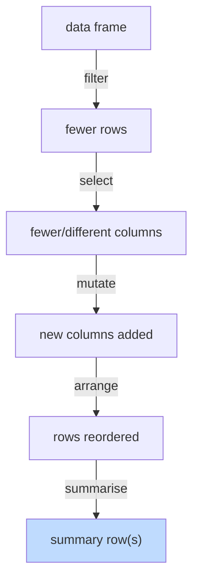

So far we've been doing data manipulation in base R: bracket
notation, `$` access, `order()`, and so on. It works, but it gets
verbose fast. Compare:

```r
# base R
sub <- mtcars[mtcars$mpg > 20 & mtcars$cyl == 4,
              c("mpg", "wt", "hp")]
sub <- sub[order(-sub$mpg), ]
```

vs.

```r
# dplyr
sub <- mtcars |>
  filter(mpg > 20, cyl == 4) |>
  select(mpg, wt, hp) |>
  arrange(desc(mpg))
```

The dplyr version reads like instructions: *"take mtcars, filter
to fuel-efficient four-cylinders, select these three columns,
sort by mpg descending."*

dplyr is built on five "verbs," each of which does exactly one
thing.

## The five core verbs

| Verb | What it does |
| --- | --- |
| `filter()` | keep rows that match a condition |
| `select()` | keep, drop, or reorder columns |
| `mutate()` | add or change columns |
| `arrange()` | sort rows |
| `summarise()` | collapse many rows into one summary row |

Plus one helper: `group_by()`, which makes `summarise()`,
`mutate()`, and friends operate **per group**. We'll meet that
properly on the next page.



You almost never use all five at once. But every dplyr pipeline
is some composition of these.

## The pipe: `|>`

The pipe takes the thing on its left and passes it as the first
argument to the function on its right.

```r
mtcars |> head()       # same as head(mtcars)
mtcars |> head(3)      # same as head(mtcars, 3)
```

This sounds trivial. It is not. It lets you write a sequence of
transformations top-to-bottom, in reading order, instead of
nesting parentheses inside out:

```r
# Without the pipe (read inside out)
head(arrange(filter(mtcars, mpg > 20), desc(mpg)))

# With the pipe (read top to bottom)
mtcars |>
  filter(mpg > 20) |>
  arrange(desc(mpg)) |>
  head()
```

The second version reads like an English instruction sentence —
which is exactly the point. R has two pipes: the native `|>`
(added in R 4.1) and the older `%>%` from the `magrittr` package
(used widely with `dplyr`). They're nearly equivalent for our
purposes; we'll use `|>` throughout.

## `filter()` — keep rows

<CodeBlock
  adapter="r"
  starterCode={`library(dplyr)
data(mtcars)

# Single condition
mtcars |> filter(mpg > 25)

# Multiple conditions (comma = AND)
mtcars |> filter(mpg > 20, cyl == 4)

# OR with |
mtcars |> filter(mpg > 30 | hp > 200)

# Member of a set
mtcars |> filter(cyl %in% c(4, 6))
`}
/>

Notice we wrote `mpg`, not `mtcars$mpg`. Inside the dplyr verbs,
column names refer to columns of the data frame you piped in.
That's a major usability win.

`filter()` also handles NAs gracefully — it silently drops rows
where the condition is `NA`, which is almost always what you
want.

## `select()` — keep columns

<CodeBlock
  adapter="r"
  starterCode={`library(dplyr)
data(mtcars)

# By name
mtcars |>
  select(mpg, cyl, hp) |>
  head()

# Drop columns with -
mtcars |>
  select(-disp, -drat) |>
  head()

# Reorder by listing first
mtcars |>
  select(cyl, mpg, everything()) |>
  head()

# By position
mtcars |>
  select(1:3) |>
  head()

# By pattern
mtcars |>
  select(starts_with("d")) |>
  head()
`}
/>

`select()` has many "helper" functions: `starts_with()`,
`ends_with()`, `contains()`, `matches()`, `everything()`,
`where()`. They make column selection in wide datasets very
ergonomic.

## `mutate()` — add or change columns

<CodeBlock
  adapter="r"
  starterCode={`library(dplyr)
data(mtcars)

mtcars |>
  mutate(
    kpl       = mpg * 0.425144, # km per liter
    power_wt  = hp / wt, # horsepower per ton-ish
    is_heavy  = wt > 3.5 # logical
  ) |>
  select(mpg, kpl, power_wt, is_heavy) |>
  head()
`}
/>

`mutate()` is for *adding* derived columns. The new columns can
reference any existing column — and any new column defined
earlier in the same `mutate()` call.

To *replace* a column, mutate with the same name:

<CodeBlock
  adapter="r"
  starterCode={`library(dplyr)
data(mtcars)

mtcars |>
  mutate(mpg = round(mpg, 0)) |>
  select(mpg) |>
  head()
`}
/>

## `arrange()` — sort rows

<CodeBlock
  adapter="r"
  starterCode={`library(dplyr)
data(mtcars)

# Ascending
mtcars |>
  arrange(mpg) |>
  head()

# Descending
mtcars |>
  arrange(desc(mpg)) |>
  head()

# Multiple keys
mtcars |>
  arrange(cyl, desc(mpg)) |>
  head()
`}
/>

## `summarise()` — collapse to a single row

`summarise()` (or `summarize()` — both spellings work) takes a
data frame and returns a *single row* containing summary
statistics:

<CodeBlock
  adapter="r"
  starterCode={`library(dplyr)
data(mtcars)

mtcars |>
  summarise(
    n        = n(),
    avg_mpg  = mean(mpg),
    sd_mpg   = sd(mpg),
    max_hp   = max(hp)
  )
`}
/>

By itself, this isn't more interesting than `mean()` etc. on
their own. The magic happens when you combine it with
`group_by()` — which is the entire next page.

## Putting it together: a small pipeline

<CodeBlock
  adapter="r"
  starterCode={`library(dplyr)
data(mtcars)

mtcars |>
  filter(cyl %in% c(4, 6)) |>
  mutate(power_wt = hp / wt) |>
  select(mpg, cyl, hp, wt, power_wt) |>
  arrange(desc(power_wt)) |>
  head(10)
`}
/>

Read it top to bottom: *"From mtcars, keep four- and six-cylinder
cars, compute a power-to-weight ratio, select these five columns,
sort by power-to-weight descending, and show me the top 10."* Five
verbs, one sentence.

## Test your understanding

<MultipleChoice
  markdown={`Which dplyr verb would you use to **keep only rows where \`age >= 18\`**?

- \`select()\`
  > \`select()\` is for columns, not rows.
- [o] \`filter()\`
  > \`filter()\` keeps rows matching a condition.
- \`arrange()\`
- \`mutate()\``}
/>

<MultipleChoice
  markdown={`What does the pipe operator \`|>\` do?

- It runs two commands in parallel.
- [o] It passes the value on the left as the first argument to the function on the right, letting you chain operations in reading order.
  > \`x |> f()\` is the same as \`f(x)\`, but reads top to bottom when chained.
- It compares two values for equality.
- It declares a function.`}
/>

<MultipleChoice
  markdown={`Which verb would you use to **add a new column \`bmi = weight / height^2\`**?

- \`select()\`
- \`summarise()\`
  > \`summarise()\` *collapses* rows; you want to add a derived column.
- \`filter()\`
- [o] \`mutate()\`
  > \`mutate()\` adds or changes columns based on other columns.`}
/>

## Mini challenge: top efficient cars

Using `dplyr` and the pipe, from `mtcars`:

- filter to cars with `wt < 3` (lightweight)
- add a column `mpg_per_cyl = mpg / cyl`
- select `mpg`, `cyl`, `wt`, `mpg_per_cyl`
- arrange by `mpg_per_cyl` descending
- assign the result to `top_eff`

<ChallengeCard
  adapter="r"
  title="A small dplyr pipeline"
  instructions={`Use the pipe and four dplyr verbs (\`filter\`, \`mutate\`, \`select\`, \`arrange\`) to produce \`top_eff\` as described.`}
  starterCode={`library(dplyr)
data(mtcars)

top_eff <- NULL # build a pipeline that produces a data.frame

print(top_eff)
`}
  solutionCode={`library(dplyr)
data(mtcars)

top_eff <- mtcars |>
  filter(wt < 3) |>
  mutate(mpg_per_cyl = mpg / cyl) |>
  select(mpg, cyl, wt, mpg_per_cyl) |>
  arrange(desc(mpg_per_cyl))

print(top_eff)
`}
  tests={[
    {
      id: "df",
      name: "Result is a data.frame",
      code: `if (!is.data.frame(top_eff)) stop("top_eff must be a data.frame")`,
    },
    {
      id: "cols",
      name: "Has correct columns",
      code: `if (!identical(sort(names(top_eff)), sort(c("mpg","cyl","wt","mpg_per_cyl")))) stop("wrong columns")`,
    },
    {
      id: "filter",
      name: "All wt < 3",
      code: `if (!all(top_eff$wt < 3)) stop("all rows must have wt < 3")`,
    },
    {
      id: "sorted",
      name: "Sorted by mpg_per_cyl descending",
      code: `if (is.unsorted(-top_eff$mpg_per_cyl)) stop("must be sorted by mpg_per_cyl descending")`,
    },
  ]}
/>

`summarise()` becomes spectacularly useful when paired with
`group_by()`. That's the next page.
