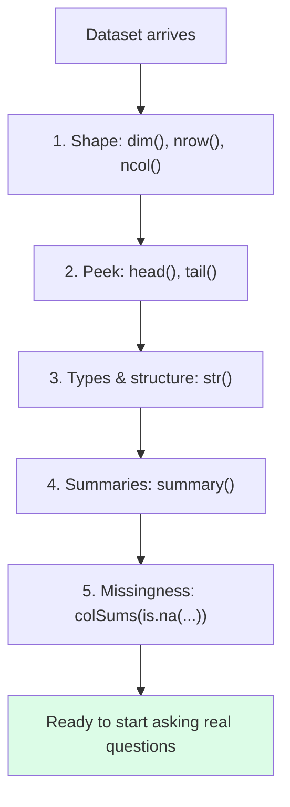

When a new dataset arrives, the temptation is to dive straight into
the interesting question — *"do customers in region X spend more
than customers in region Y?"* — and start running analyses.

That is almost always a mistake. The very first thing every
experienced analyst does is something more modest: **find out what
you actually have.** How big is it? What are the columns? Are there
missing values? Are the numbers in sensible ranges? Are there
obviously wrong rows?

This page is the ritual. Memorize it.

## The five-minute ritual

Each step takes seconds and gives you orientation. Skip any of
them and you risk asking a meaningless question of a misunderstood
dataset.

We'll use `airquality` — a built-in dataset of daily air quality
measurements in New York, May–September 1973 — as our example.

## Step 1: shape

<CodeBlock
  adapter="r"
  starterCode={`data(airquality)

dim(airquality) # rows, columns
nrow(airquality)
ncol(airquality)
`}
/>

The shape tells you what kind of analysis is even feasible.
153 rows × 6 columns is small — every operation will be instant.
A million rows × 200 columns is a different problem entirely.

## Step 2: peek

<CodeBlock
  adapter="r"
  starterCode={`head(airquality)
tail(airquality)
`}
/>

Glance at the first few and last few rows. You're checking:

- Did the data load correctly? (No mangled headers, no obvious
  parsing errors.)
- Do the values *look like* what you'd expect?
- Are there obvious anomalies?

It is astonishing how often a 10-second `head()` catches a problem
that would have wasted an hour downstream.

## Step 3: structure and types

<CodeBlock
  adapter="r"
  starterCode={`str(airquality)
`}
/>

`str()` packs an enormous amount of information into a few lines:
how many rows, how many columns, every column name, every column
type, and a sample of values.

What you're looking for:

- Are types right? (Is the "amount" column truly numeric, or did
  it accidentally get loaded as character because of a stray
  comma?)
- Are dates being treated as dates or as strings?
- Are categorical variables stored as factors, characters, or
  numbers?

## Step 4: summaries

<CodeBlock
  adapter="r"
  starterCode={`summary(airquality)
`}
/>

`summary()` gives you, per column:

- For numerics: min, 1st quartile, median, mean, 3rd quartile,
  max, and the count of `NA`s
- For factors: counts per level
- For characters: just the count

You're scanning for:

- **Implausible values.** Negative ages. Heights of 3 meters.
  Temperatures of 999 (a common "missing" sentinel).
- **Suspiciously round means.** A mean of exactly 0 in a column
  that should be variable is suspicious.
- **Mean very different from median.** Suggests skew or outliers.
- **Lots of NAs.**

In `airquality`, look at the `Ozone` column. The max is 168 but
the median is around 30 — a heavy right tail. That's a real
finding, not a glitch, but worth noting.

## Step 5: missingness

The default `summary()` does report `NA`s, but it's often
clearer to ask explicitly:

<CodeBlock
  adapter="r"
  starterCode={`# Count of NAs per column
colSums(is.na(airquality))

# Percentage of NAs per column
round(colMeans(is.na(airquality)) * 100, 1)

# Are there any complete rows? How many?
sum(complete.cases(airquality))
nrow(airquality) - sum(complete.cases(airquality))
`}
/>

In `airquality`, Ozone and Solar.R have meaningful amounts of
missing data. That will affect how you compute averages, how you
plot, how you join with other data, *everything*. Knowing it
upfront lets you choose your strategy.

## A multi-file walkthrough: meet `iris`

Let's apply the ritual to a fresh dataset, with the inspection
split across files so you can see each step clearly:

<ChallengeCard
  adapter="r"
  title="Inspect the iris dataset"
  instructions={`Use the inspection ritual on \`iris\`. The starter code already loads the data, and there's a helper file with a "report" function. Complete \`main.R\` so the script prints shape, head, structure, and a summary. The test just checks that nothing errors.`}
  starterCode={null}
  entryFilename="main.R"
  files={[
    {
      filename: "main.R",
      initialContent: `source("report.R")

data(iris)

# 1. Shape
# 2. head
# 3. str
# 4. summary
# 5. NAs per column

# Try filling in each step using the report() helper
`,
      solutionContent: `source("report.R")

data(iris)

report("Shape", dim(iris))
report("Head",  head(iris))
report("Structure", str(iris))
report("Summary", summary(iris))
report("NAs per column", colSums(is.na(iris)))
`,
    },
    {
      filename: "report.R",
      initialContent: `report <- function(label, value) {
  cat("---", label, "---\\n")
  print(value)
  cat("\\n")
}
`,
      solutionContent: `report <- function(label, value) {
  cat("---", label, "---\\n")
  print(value)
  cat("\\n")
}
`,
    },
  ]}
  tests={[
    {
      id: "ran",
      name: "Script ran without errors",
      code: `cat("ok\\n")`,
    },
  ]}
/>

## Test your understanding

<MultipleChoice
  markdown={`Which function gives you a compact view of a data frame's structure: number of rows, number of columns, every column's type, and a sample of its values?

- \`summary()\`
  > \`summary()\` gives per-column statistics (min, mean, quartiles), not the column *types* and structure.
- \`head()\`
  > \`head()\` shows the first few rows, but not a one-line report of types and dimensions.
- [o] \`str()\`
  > \`str()\` is the structural summary — types and a sample, in one screen.
- \`dim()\`
  > \`dim()\` returns just the row and column counts, with no type or value information.`}
/>

<MultipleChoice
  markdown={`Why is it a bad idea to skip the "inspect the dataset" ritual?

- It's required by R; the language won't compute without it.
  > Not true — R will happily compute on a dataset you've never looked at.
- [o] Because real datasets contain surprises (missing values, wrong types, implausible values) that can silently corrupt every downstream analysis.
  > Five minutes of inspection saves hours of debugging later.
- Because \`summary()\` is the only way to compute means.
- Because it's a tradition.`}
/>

<MultipleChoice
  markdown={`If \`mean(airquality$Ozone)\` returns \`NA\`, the most likely reason is:

- The \`mean\` function is broken.
- The dataset has fewer than 30 rows.
- [o] The \`Ozone\` column contains \`NA\` values, and \`mean()\` returns \`NA\` unless told otherwise.
  > Fix it with \`mean(airquality$Ozone, na.rm = TRUE)\`.
- R refuses to compute means on built-in datasets.`}
/>

Inspecting tells us *what's there*. The next page is about
extracting just the parts we *want*.
