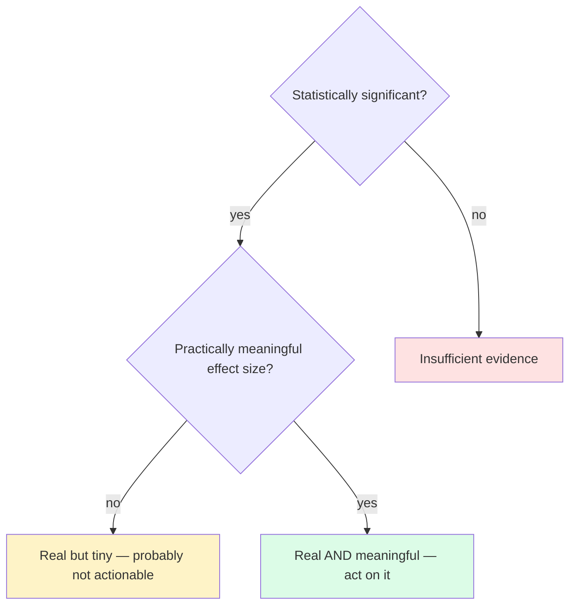

You've now seen that any statistic computed from a sample
wiggles. Inference is the art of saying useful things about a
population *despite* that wiggling.

We'll cover three workhorse ideas:

1. **Confidence intervals** — a range of plausible values for an
   unknown parameter.
2. **p-values** — how surprising your data would be under a
   skeptical "no effect" assumption.
3. **Effect size** — *how big* a difference is, separate from
   *how confident* we are that it exists.

We'll do all of them in R using built-in functions like
`t.test()`. The math is secondary; the meaning is the goal.

## A confidence interval, plainly

A **95% confidence interval** for a parameter is a range
constructed from your data such that, *across many hypothetical
repetitions of the study*, 95% of intervals constructed this way
would contain the true parameter.

Read that carefully. It is **not** "there's a 95% chance the
true value is in this specific interval." The true value is
fixed; the interval is what wiggles from sample to sample.

The intuition is easier to see in a simulation:

<CodeBlock
  adapter="r"
  starterCode={`set.seed(1)
# Truth: mean = 100
true_mean <- 100

# Run 100 mini-studies, each with n=30
results <- replicate(100, {
  s   <- rnorm(30, mean = true_mean, sd = 15)
  x   <- mean(s)
  se  <- sd(s) / sqrt(30)
  ci  <- x + c(-1, 1) * qt(0.975, df = 29) * se
  list(x = x, lo = ci[1], hi = ci[2])
}, simplify = FALSE)

contains <- sapply(results, function(r) r$lo <= true_mean && true_mean <= r$hi)
mean(contains)
`}
/>

Run it a few times. You'll see the fraction of CIs containing
the truth hovers around 0.95. That's what "95% confidence"
means. Each individual CI either covers the truth or doesn't —
we just don't know which.

Visualize it:

<CodeBlock
  adapter="r"
  starterCode={`set.seed(1)
true_mean <- 100

n_studies <- 30
results <- replicate(n_studies, {
  s   <- rnorm(30, mean = true_mean, sd = 15)
  x   <- mean(s)
  se  <- sd(s) / sqrt(30)
  ci  <- x + c(-1, 1) * qt(0.975, df = 29) * se
  c(x = x, lo = ci[1], hi = ci[2])
})

results <- t(results)

plot(NA, xlim = range(results[, c("lo", "hi")]),
     ylim = c(1, n_studies),
     xlab = "Estimated mean (with 95% CI)", ylab = "Study #",
     main = "30 simulated studies — vertical line is the truth")
abline(v = true_mean, col = "red", lwd = 2)

for (i in 1:n_studies) {
  covers <- results[i, "lo"] <= true_mean && results[i, "hi"] >= true_mean
  col_i  <- if (covers) "steelblue" else "tomato"
  segments(results[i, "lo"], i, results[i, "hi"], i, col = col_i, lwd = 2)
  points(results[i, "x"], i, pch = 19, col = col_i)
}
`}
/>

Most lines cross the red truth-line. A few miss. That's
sampling variability made visible.

## A p-value, plainly

A **p-value** is the probability, *if there were no real
effect*, of seeing a result as extreme as the one you got — or
more extreme.

Small p-value → your observed result is surprising under "no
effect" → you have evidence of *some* effect.

Large p-value → your observed result is unsurprising under "no
effect" → you have no strong evidence of an effect (but also no
strong evidence *against* one — absence of evidence is not
evidence of absence).

Let's run a quick test:

<CodeBlock
  adapter="r"
  starterCode={`set.seed(5)

# Two groups; truth: group B is slightly higher (mean 102 vs 100)
groupA <- rnorm(40, mean = 100, sd = 10)
groupB <- rnorm(40, mean = 102, sd = 10)

t.test(groupB, groupA)
`}
/>

The output gives you:

- `t`: a standardized measure of how far apart the groups look
  relative to the noise.
- `df`: degrees of freedom (sample-size-related).
- `p-value`: how surprising this gap (or bigger) would be if the
  two populations actually had identical means.
- `95 percent confidence interval`: a plausible range for the
  *true* difference in means.

If `p < 0.05`, by convention we say the result is "statistically
significant." That convention is useful — but also widely
abused.

## Three things p-values do NOT mean

- **NOT** "the probability the null hypothesis is true."
- **NOT** "the probability your result was a fluke."
- **NOT** "the probability your finding will replicate."

A p-value answers exactly one question: *given a specific
skeptical assumption (the null), how surprising is what we
saw?* That's it.

## Effect size: significance ≠ importance

Two studies can both have `p < 0.001` and tell wildly different
stories:

<CodeBlock
  adapter="r"
  starterCode={`set.seed(1)

# Study A: small but reliable effect, huge n
A1 <- rnorm(50000, mean = 100.0, sd = 15)
A2 <- rnorm(50000, mean = 100.1, sd = 15)
cat("A: diff =", round(mean(A2) - mean(A1), 3),
    "p =", format.pval(t.test(A2, A1)$p.value), "\\n")

# Study B: big effect, modest n
B1 <- rnorm(80,    mean = 100, sd = 15)
B2 <- rnorm(80,    mean = 110, sd = 15)
cat("B: diff =", round(mean(B2) - mean(B1), 3),
    "p =", format.pval(t.test(B2, B1)$p.value), "\\n")
`}
/>

A and B might both look "highly significant" by p-value, but the
*effect sizes* differ by ~100×. A is a real but trivial
difference; B is a real and large one. Always report — and
think about — the *effect*, not just the p.

## A complete inference workflow

Putting the pieces together: load data, summarize, plot, test,
interpret.

<CodeBlock
  adapter="r"
  starterCode={`# Built-in dataset: sleep
# Two groups (drug 1 vs drug 2), extra hours of sleep
head(sleep)
summary(sleep)

# Visualize
boxplot(extra ~ group, data = sleep,
        col = c("steelblue", "tomato"),
        main = "Extra hours of sleep by drug")

# Inference
t.test(extra ~ group, data = sleep)
`}
/>

A grounded reading of that output:

1. The boxplot suggests group 2 trends higher on average.
2. The estimated difference is reported, with a CI.
3. If `p < 0.05`, we have decent evidence the two drugs differ in
   their effect — but always re-check the CI to see *by how
   much*.

That last step — looking at the CI, not only the p-value — is
the single best habit you can develop. The CI tells you both
*direction* and *magnitude* of the difference and how much it
could plausibly be larger or smaller.

## Common pitfalls

- **p-hacking.** Trying many tests and reporting only the
  "significant" ones. With 20 random tests under no-effect, you
  expect about 1 to land below p=0.05 by chance.
- **Overinterpreting non-significance.** "p = 0.07" is not
  "no effect" — it's "we couldn't reliably distinguish it from
  zero with this sample size."
- **Ignoring sample size.** With huge n, *any* tiny gap becomes
  significant. With small n, even large real effects can be
  missed.
- **Confusing CI with prediction interval.** A CI is about the
  *parameter*, not about individual future values.

## Test your understanding

<MultipleChoice
  markdown={`"A 95% confidence interval for the mean is [45, 55]." The most accurate reading is:

- There is a 95% chance the true mean is between 45 and 55.
- 95% of the data falls between 45 and 55.
- [o] If we repeated the study many times and built CIs the same way each time, about 95% of those intervals would contain the true mean.
  > The interval is what varies across hypothetical repetitions — the true value is fixed.
- The mean is exactly 50.`}
/>

<MultipleChoice
  markdown={`A study reports p = 0.001 for a difference in means. Which is correct?

- The probability the null hypothesis is true is 0.001.
- The probability the finding is a fluke is 0.001.
- [o] If there were no real difference between the groups, the chance of seeing a difference at least this extreme would be about 0.001.
  > That's the actual definition of a p-value.
- The difference is definitely large.`}
/>

<MultipleChoice
  markdown={`Why is it important to report effect size in addition to a p-value?

- p-values are unreliable.
- Effect size determines the p-value entirely.
- [o] A result can be statistically significant (especially with large n) yet practically meaningless — effect size tells you whether it matters in the real world.
  > Significance and importance are different questions.
- Confidence intervals are not used in practice.`}
/>

## Mini challenge: full t-test workflow

Using the built-in `mtcars` dataset, test whether cars with
automatic transmission (`am == 0`) and manual transmission
(`am == 1`) have different mean miles-per-gallon. Save the
output of `t.test()` to a variable `tt`, and pull out:

- `est_diff` — the *difference of sample means* (manual − auto)
- `ci`       — the 95% confidence interval for that difference (length-2 numeric)
- `p`        — the p-value

<ChallengeCard
  adapter="r"
  title="t-test workflow on mtcars"
  instructions={`Run \`t.test(mpg ~ am, data = mtcars)\` and from its returned object set: \`tt\` to the test result, \`est_diff\` to \`mean(manual) - mean(automatic)\` (note: \`am = 1\` is manual, \`am = 0\` is automatic), \`ci\` to the confidence interval as a length-2 numeric, and \`p\` to the p-value.`}
  starterCode={`tt       <- NULL
est_diff <- NULL
ci       <- NULL
p        <- NULL

print(tt)
cat("est_diff:", est_diff, "\\n")
cat("ci:      ", ci,       "\\n")
cat("p:       ", p,        "\\n")
`}
  solutionCode={`tt <- t.test(mpg ~ am, data = mtcars)
# t.test with formula uses level order; group 0 (auto) first, group 1 (manual) second.
# tt$estimate is c("mean in group 0" = auto, "mean in group 1" = manual)
est_diff <- unname(tt$estimate[2] - tt$estimate[1])
ci       <- as.numeric(tt$conf.int) * -1   # flip CI to match (manual - auto) direction
ci       <- sort(ci)
p        <- tt$p.value
`}
  tests={[
    {
      id: "ttype",
      name: "tt is htest object",
      code: `if (!inherits(tt, "htest")) stop("tt should be the result of t.test(...)")`,
    },
    {
      id: "diff",
      name: "est_diff is a numeric scalar",
      code: `if (!is.numeric(est_diff) || length(est_diff) != 1) stop("est_diff must be a single numeric")`,
    },
    {
      id: "diffsign",
      name: "Manual cars have higher mpg",
      code: `if (est_diff <= 0) stop("expected manual mpg > automatic mpg — check sign")`,
    },
    {
      id: "cilen",
      name: "ci length 2",
      code: `if (length(ci) != 2) stop("ci should be a length-2 numeric")`,
    },
    {
      id: "p",
      name: "p is between 0 and 1",
      code: `if (!is.numeric(p) || length(p) != 1 || p < 0 || p > 1) stop("p should be a single numeric in [0,1]")`,
    },
  ]}
/>

You now understand the conceptual core of statistical inference:
sampling, uncertainty, intervals, and tests. The next two pages
shift back into the craft of *writing* analysis code that's
clean, reusable, and reproducible.
