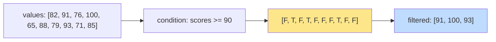

So far our vectors have held numbers. But in a real dataset, you
will see two other types just as often:

- **Logical vectors** — every element is `TRUE` or `FALSE`. These
  are the engine of filtering.
- **Character vectors** — every element is a string. These hold
  names, categories, labels, IDs, anything textual.

This page is about both.

## Logical vectors

A logical vector is just a vector whose elements are `TRUE` or
`FALSE`:

<CodeBlock
  adapter="r"
  initialCode={`flags <- c(TRUE, FALSE, TRUE, TRUE, FALSE)
print(flags)
length(flags)
`}
/>

You rarely *type* logical vectors out by hand. Almost always, you
**produce** them by comparing a vector to something:

<CodeBlock
  adapter="r"
  initialCode={`scores <- c(82, 91, 76, 100, 65, 88, 79, 93, 71, 85)

# Which scores are 80 or above?
scores >= 80

# Which equal exactly 100?
scores == 100

# Which are not perfect?
scores != 100
`}
/>

Notice the result is a vector of `TRUE`/`FALSE` values, one per
input. Every comparison operator is vectorized, just like
arithmetic.

## Counting and summarizing logicals

Here is one of the most useful R tricks of all time: **`sum()` and
`mean()` work on logical vectors**, because R quietly treats
`TRUE` as 1 and `FALSE` as 0.

<CodeBlock
  adapter="r"
  initialCode={`scores <- c(82, 91, 76, 100, 65, 88, 79, 93, 71, 85)

# How many scores are 80 or above?
sum(scores >= 80)

# What fraction of scores are 80 or above?
mean(scores >= 80)

# Any perfect scores?
any(scores == 100)

# Are all scores above 50?
all(scores > 50)
`}
/>

Read that out loud:

- `sum(scores >= 80)` = "*count* the scores that are 80 or above"
- `mean(scores >= 80)` = "*proportion* of scores that are 80 or above"
- `any(scores == 100)` = "is there *at least one* perfect score?"
- `all(scores > 50)` = "are they *all* above 50?"

These four lines cover an astonishing amount of real-world
analytical questions.

## Combining logical conditions

You can combine logicals with the operators `&` (and), `|` (or),
and `!` (not):

<CodeBlock
  adapter="r"
  initialCode={`scores <- c(82, 91, 76, 100, 65, 88, 79, 93, 71, 85)

# Scores between 75 and 90 (inclusive)
scores >= 75 & scores <= 90

# Scores below 70 OR exactly 100
scores < 70 | scores == 100

# Scores that are NOT above 80
!(scores > 80)
`}
/>

Use `&` and `|` (single character) for vector-wise logic. R also
has `&&` and `||` (double character), but these are for
*single*-value control flow and behave differently — for data
analysis, **always use `&` and `|`**.

## Filtering with logicals

The real payoff: you can use a logical vector as an *index* into
another vector. R keeps only the positions where the logical is
`TRUE`.

<CodeBlock
  adapter="r"
  initialCode={`scores <- c(82, 91, 76, 100, 65, 88, 79, 93, 71, 85)
names  <- c("alice","bob","carol","dan","eve","frank","grace","heidi","ivan","judy")

# Just the high scores
scores[scores >= 90]

# Just the names of high scorers
names[scores >= 90]

# Mid-range scores
scores[scores >= 75 & scores <= 90]
`}
/>

This is the foundation of *filtering*. Later we will see how
`dplyr::filter()` builds on this exact pattern for whole data
frames — but understanding it on vectors first is what makes the
whole library click.

## Character vectors

Strings in R live inside character vectors. Each element is a
string enclosed in double or single quotes:

<CodeBlock
  adapter="r"
  initialCode={`fruits <- c("apple", "banana", "cherry", "date")
print(fruits)
length(fruits)
nchar(fruits)        # number of characters in each string
toupper(fruits)
substr(fruits, 1, 3) # first three characters of each
`}
/>

Like everything else in R, character functions are vectorized:
`toupper()` doesn't take one string — it takes a whole vector and
returns a transformed one.

## Pasting strings together

`paste()` and `paste0()` glue strings (and any other type, after
coercion) into one:

<CodeBlock
  adapter="r"
  initialCode={`first <- c("Alice", "Bob", "Carol")
last  <- c("Smith", "Jones", "Lee")

# paste() puts a space between by default
paste(first, last)

# paste0() uses no separator
paste0(first, "@example.com")

# Use sep = "..." to control the separator
paste(first, last, sep = "_")

# Use collapse = "..." to fold a vector into a single string
paste(first, collapse = ", ")
`}
/>

The two arguments people most confuse are `sep` and `collapse`.
The rule is:

- `sep` = "what goes *between* the parallel inputs"
- `collapse` = "what goes *between* the elements of the result, when folding into one string"

## Detecting patterns in text

For checking which strings contain something, the workhorse is
`grepl()` ("global regular expression, logical"). It takes a
*pattern* and a *vector of strings*, and returns a logical vector.

<CodeBlock
  adapter="r"
  initialCode={`emails <- c("alice@a.com", "bob@b.org", "carol@a.com", "dan@c.net")

# Which emails are from the ".com" domain?
grepl(".com", emails, fixed = TRUE)

# Count them
sum(grepl(".com", emails, fixed = TRUE))

# Filter to just those emails
emails[grepl(".com", emails, fixed = TRUE)]
`}
/>

(Setting `fixed = TRUE` tells `grepl()` to treat the pattern as a
plain string, not a regular expression. Regex is a whole topic of
its own — for now, `fixed = TRUE` keeps things simple.)

## Categorical data: a peek at factors

When a character vector represents one of a fixed set of
categories (like "low" / "medium" / "high"), R has a specialized
type called a **factor**. We won't dwell on factors here, but
quick exposure:

<CodeBlock
  adapter="r"
  initialCode={`severity <- c("low", "high", "medium", "low", "high", "low")
severity_f <- factor(severity, levels = c("low", "medium", "high"))

print(severity_f)
table(severity_f)
`}
/>

Factors look like character vectors but carry information about
*which categories are valid* and *in what order*. They become
important when you plot or run models — but for today, character
vectors will do.

## Test your understanding

<MultipleChoice
  markdown={`Given \`x <- c(10, 20, 30, 40)\`, what does \`sum(x > 15)\` return?

- \`90\` (the sum of values greater than 15)
- [o] \`3\`
  > Correct! \`x > 15\` is \`c(FALSE, TRUE, TRUE, TRUE)\`. \`sum()\` treats \`TRUE\` as 1, so the count is 3.
- \`TRUE\`
- \`0.75\``}
/>

<MultipleChoice
  markdown={`What does \`mean(c(TRUE, TRUE, FALSE, TRUE))\` evaluate to?

- \`3\`
- [o] \`0.75\`
  > Correct! \`mean()\` treats \`TRUE\` as 1 and \`FALSE\` as 0, so the mean is \`(1+1+0+1)/4 = 0.75\` — the *proportion* of \`TRUE\` values.
- \`TRUE\`
- An error`}
/>

<MultipleChoice
  markdown={`Given \`names <- c("Ana", "Bo", "Cara")\` and \`ages <- c(40, 25, 33)\`, what does \`names[ages > 30]\` return?

- \`c(40, 33)\`
- \`c(TRUE, FALSE, TRUE)\`
- [o] \`c("Ana", "Cara")\`
  > Correct! The logical \`ages > 30\` is \`c(TRUE, FALSE, TRUE)\`, used as an index into \`names\`, keeping positions 1 and 3.
- An error`}
/>

## Mini challenge: who passed?

You're given names and exam scores. Produce a character vector
`passed` containing only the names of students who scored 70 or
higher.

<ChallengeCard
  adapter="r"
  title="Filter names by score"
  instructions={`Using a logical index, build a character vector \`passed\` containing the names of every student who scored 70 or higher.`}
  initCode={`students <- c("Ada", "Ben", "Cleo", "Drew", "Ella")
scores   <- c(82, 64, 91, 70, 58)
`}
  initialCode={`# students and scores are already defined
passed <- NULL  # replace with the filtered names

print(passed)
`}
  solutionCode={`passed <- students[scores >= 70]
print(passed)
`}
  tests={[
    {
      id: "passed",
      name: "Right names included",
      description: "Should contain Ada, Cleo, Drew",
      code: `if (!identical(passed, c("Ada","Cleo","Drew"))) stop(sprintf("expected Ada, Cleo, Drew; got %s", paste(passed, collapse=",")))`,
    },
  ]}
/>

One last topic before we leave vectors behind: what happens when a
value is simply *missing* — R's special `NA` marker, and the
small set of rules for dealing with it.
