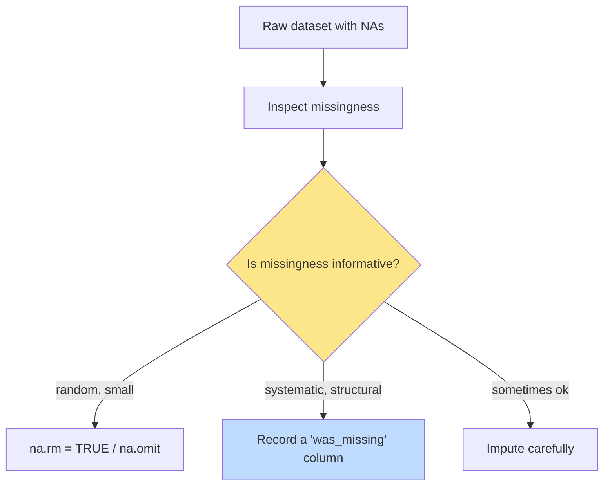

In real datasets, things go missing. A survey respondent skips a
question. A sensor fails for a day. A field on a form is left
blank. R has a special value to represent this: **`NA`**, which
stands for *Not Available*.

`NA` is **not** the same as zero, and it is **not** an empty
string. It is R's way of saying: *we don't have a value here.*

## How `NA` propagates

The single most important rule about `NA`: **most computations
involving `NA` return `NA`**. R is being careful — if you don't
know one of the inputs, you don't know the answer either.

<CodeBlock
  adapter="r"
  starterCode={`5 + NA            # unknown plus 5 = unknown
NA > 3            # unknown vs. 3 = unknown
NA == NA          # unknown vs. unknown = unknown (!)
mean(c(1, 2, NA))
sum(c(1, 2, NA))
`}
/>

Notice that even `NA == NA` returns `NA`. That trips up almost
everyone the first time. Think of it this way: if I don't know
*either* value, I cannot tell you whether they're equal.

This is why R has a dedicated function for "is this value
missing?":

<CodeBlock
  adapter="r"
  starterCode={`x <- c(1, 2, NA, 4, NA, 6)

is.na(x)            # logical vector: which positions are NA
sum(is.na(x))       # count of missings
mean(is.na(x))      # proportion missing
which(is.na(x))     # positions of NAs
`}
/>

`is.na()` is **the** way to test for missing values. Never use `==
NA` — it will silently give you all `NA`s.

## Summary functions and the `na.rm` argument

Most summary functions (`mean`, `sum`, `sd`, `min`, `max`,
`median`) accept an `na.rm` argument. Setting `na.rm = TRUE`
quietly removes `NA`s before computing.

<CodeBlock
  adapter="r"
  starterCode={`temps <- c(68, 70, NA, 72, 75, NA, 69)

mean(temps)               # NA — there are missings
mean(temps, na.rm = TRUE) # works: average of the non-NA values
sum(temps, na.rm = TRUE)
max(temps, na.rm = TRUE)
`}
/>

This is *deliberately* not the default. R's designers wanted you
to consciously *choose* to ignore missingness, rather than have it
silently swept under the rug. It is one of the language's most
important small design decisions.

## Removing or replacing NAs

Sometimes you want to remove `NA` values entirely from a vector
before doing anything else:

<CodeBlock
  adapter="r"
  starterCode={`x <- c(1, 2, NA, 4, NA, 6)

# Keep only non-NA values
x[!is.na(x)]

# Or use na.omit()
na.omit(x)
`}
/>

Other times, you want to *replace* NAs with some sensible value
(zero, the mean, the last known value):

<CodeBlock
  adapter="r"
  starterCode={`x <- c(10, 20, NA, 40, NA, 60)

# Replace NA with 0
x2 <- x
x2[is.na(x2)] <- 0
print(x2)

# Replace NA with the mean of the rest
x3 <- x
x3[is.na(x3)] <- mean(x3, na.rm = TRUE)
print(x3)
`}
/>

**Be careful** with the second pattern (mean imputation). It is a
real statistical decision, not just a cleaning step. Imputing the
mean understates the variability in your data and can bias
downstream analyses. Use it knowingly, not by default.

## Missingness has *meaning*

Here is the most important idea in this entire page, and probably
the most under-appreciated idea in beginner data work: **the fact
that a value is missing is itself information.**

If 30% of survey respondents skipped the "income" question, that
is not noise — that's a signal. Maybe people in certain income
brackets are more likely to skip. Maybe the question was poorly
worded. Maybe there's a UI bug. Either way, you cannot find out
unless you *look at the missingness* before deciding what to do.

For now, the practical takeaway is: **always check for `NA`s
before computing summaries**, and always make a conscious choice
about how to handle them.

## A close cousin: `NaN`, `Inf`, and `NULL`

R has a few other "special" values that beginners sometimes
confuse with `NA`:

- **`NaN`** = "Not a Number." Comes from operations like `0/0`. It
  is technically of numeric type. `is.na(NaN)` returns `TRUE`.
- **`Inf`** and **`-Inf`** = positive and negative infinity. Come
  from operations like `1/0`. Not the same as missing.
- **`NULL`** = "nothing at all" — an empty object, length 0. Not
  the same as `NA`. Used most often to mean "there is no value
  here, not even a missing one."

<CodeBlock
  adapter="r"
  starterCode={`0 / 0     # NaN
1 / 0     # Inf
-1 / 0    # -Inf

is.na(NaN)      # TRUE — NaN counts as missing
is.nan(NA)      # FALSE
is.null(NA)     # FALSE — NA is not NULL

length(NULL)    # 0
length(NA)      # 1
`}
/>

You will mostly only see `NA` in your day-to-day data. The others
are good to recognize when they appear, but you don't need to
work with them constantly.

## Test your understanding

<MultipleChoice
  markdown={`What does \`mean(c(1, 2, 3, NA))\` return?

- \`2\`
- [o] \`NA\`
  > By default, the presence of \`NA\` makes most summary functions return \`NA\`. Use \`na.rm = TRUE\` to ignore them.
- An error
- \`0\``}
/>

<MultipleChoice
  markdown={`Which of these is the **correct** way to test whether \`x\` is missing?

- \`x == NA\`
  > This returns \`NA\`, not \`TRUE\` or \`FALSE\` — comparing to \`NA\` is always \`NA\`.
- \`x = NA\`
  > That's *assignment*, not a test.
- [o] \`is.na(x)\`
  > \`is.na()\` is the only reliable way to check for missingness.
- \`x !== NA\``}
/>

<MultipleChoice
  markdown={`What does \`sum(c(10, NA, 20), na.rm = TRUE)\` return?

- \`NA\`
- [o] \`30\`
  > \`na.rm = TRUE\` removes the \`NA\` first, then sums the rest.
- \`10\`
- \`20\``}
/>

## Mini challenge: clean and summarize

You have temperature readings for one week. Some days the sensor
failed, leaving `NA`. Compute:

- `n_missing`: the number of missing readings
- `avg_temp`: the average of the available readings (ignoring NAs)

<ChallengeCard
  adapter="r"
  title="Handle a week of readings"
  instructions={`Given the \`week\` vector, set \`n_missing\` to the count of NAs and \`avg_temp\` to the mean of the non-NA values.`}
  initCode={`week <- c(68, NA, 72, 70, NA, 75, 71)
`}
  starterCode={`# week is already defined: 7 daily temps with NAs

n_missing <- NULL   # replace with the count of NAs
avg_temp  <- NULL   # replace with the mean ignoring NAs

cat("Missing readings:", n_missing, "\\n")
cat("Average temp:", avg_temp, "\\n")
`}
  solutionCode={`n_missing <- sum(is.na(week))
avg_temp  <- mean(week, na.rm = TRUE)
cat("Missing readings:", n_missing, "\\n")
cat("Average temp:", avg_temp, "\\n")
`}
  tests={[
    {
      id: "missing",
      name: "n_missing is correct",
      description: "Should equal 2",
      code: `if (!isTRUE(all.equal(n_missing, 2L)) && !isTRUE(all.equal(n_missing, 2))) stop(sprintf("expected 2, got %s", n_missing))`,
    },
    {
      id: "avg",
      name: "avg_temp is correct",
      description: "Mean of available values",
      code: `expected <- mean(c(68, 72, 70, 75, 71))
if (!isTRUE(all.equal(avg_temp, expected))) stop(sprintf("expected %s, got %s", expected, avg_temp))`,
    },
  ]}
/>

That completes our tour of vectors. Next we step up to the
two-dimensional star of R: the **data frame**, where every column
is a vector and every row is a record.
