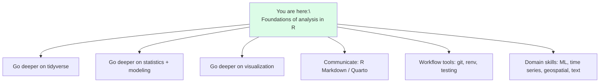
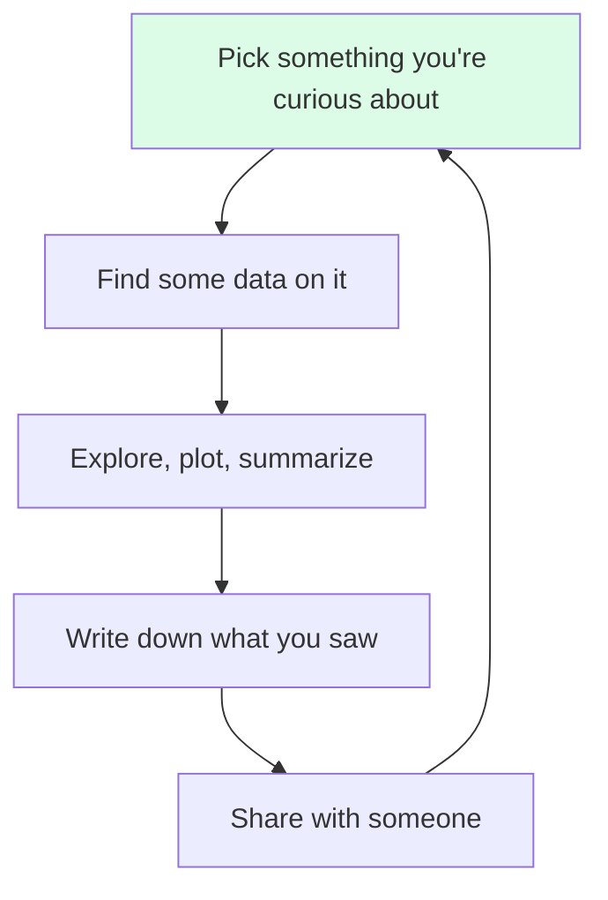

You started this course knowing little or no programming. You
now know how to:

- Think computationally about data problems.
- Read and write R for loading, cleaning, transforming,
  summarizing, and visualizing data.
- Reason about uncertainty, sampling, and statistical inference
  honestly.
- Organize a project so anyone — including future-you — can
  reproduce it.

That is genuinely a lot. Real, hire-able analyst skills. But of
course this is the beginning, not the end. Here's a map of what
to explore next, organized by goal.

## Map of where to go next

## 1. Master the tidyverse

You've met `dplyr`, `tidyr`, and `ggplot2`. The full
[**tidyverse**](https://www.tidyverse.org/) extends them with:

- **`readr`** — fast, sane CSV/TSV reading (`read_csv()`).
- **`tibble`** — better-behaved data frames.
- **`stringr`** — consistent string functions.
- **`forcats`** — working with categorical variables (factors).
- **`lubridate`** — dates and times that don't fight you.
- **`purrr`** — functional programming over lists and data
  frames (a more powerful, consistent alternative to `lapply`
  family).

The canonical book is **["R for Data Science"](https://r4ds.hadley.nz/)**
by Hadley Wickham, Mine Çetinkaya-Rundel, and Garrett
Grolemund. It's free online and is the single best next step
after this course.

## 2. Go deeper on modeling

You've met `cor()`, `lm()`, and `t.test()`. Next:

- **`broom`** — turns model outputs into tidy data frames (so
  you can pipe them into dplyr/ggplot).
- **`glm()`** — generalized linear models: logistic regression,
  Poisson regression, etc.
- **`tidymodels`** — a modern, consistent framework for fitting
  many model types: recipes for preprocessing, parsnip for
  model specification, workflows to glue it together, yardstick
  for evaluation.

A great book here is **["Tidy Modeling with R"](https://www.tmwr.org/)**
by Max Kuhn and Julia Silge.

## 3. Become fluent in visualization

ggplot2 has *enormous* depth. Things to explore:

- Faceting (`facet_wrap`, `facet_grid`) for small-multiples
  plots.
- Custom themes and color scales (e.g. `scale_color_viridis_c`).
- `patchwork` — combine multiple ggplots side by side.
- Interactive plots with **`plotly`** or **`ggiraph`**.
- The book **["ggplot2: Elegant Graphics for Data Analysis"](https://ggplot2-book.org/)**
  by Hadley Wickham, Danielle Navarro, and Thomas Pedersen.

## 4. Communicate your work

Analysis you can't share is analysis that doesn't matter. Pick
*one* of these and learn it well:

- **R Markdown** — the original "code + prose + outputs"
  document format.
- **Quarto** — R Markdown's modern successor. Works with R,
  Python, Julia, and others. Renders to HTML, PDF, Word, slides,
  websites, books.

Quarto is the better long-term bet. Read **["Quarto Guide"](https://quarto.org/docs/guide/)**.

## 5. Reproducibility and workflow tools

- **git + GitHub** — version control your projects. Read
  **["Happy Git with R"](https://happygitwithr.com/)** by
  Jenny Bryan.
- **`renv`** — pin package versions per project (you met this
  briefly).
- **`testthat`** — unit-test your functions. As soon as you have
  a `R/` folder with helpers, you'll want tests.
- **`targets`** — turn your pipeline into a dependency graph
  that re-runs only the steps that changed. Excellent once your
  analyses get bigger.

## 6. Pick a domain

R has world-class libraries in many specialized areas. Pick one
that excites *you*:

- **Time series / forecasting** — `forecast`, `fable`, `tsibble`.
- **Geospatial** — `sf`, `terra`, `tmap`, `leaflet`.
- **Text** — `tidytext`, `stringr`, `quanteda`.
- **Bayesian modeling** — `brms`, `rstan`, `cmdstanr`.
- **Machine learning** — `tidymodels`, `mlr3`, `xgboost`.
- **Bioinformatics** — Bioconductor packages.

Pick *one*. Build a real little project in it. That depth will
serve you far better than surface-level exposure to all of
them.

## 7. Practice — with real, messy data

Books and courses give you clean data. The world doesn't. To
*actually* improve, you need to wrestle with messy datasets.
Sources:

- [**Tidy Tuesday**](https://github.com/rfordatascience/tidytuesday) —
  weekly dataset + community of people doing analyses you can
  learn from. Probably the single best practice resource for R
  analysts.
- [**Kaggle**](https://www.kaggle.com/) — datasets and competitions
  (though many are too clean to teach you cleaning).
- Public open data: city budgets, government open-data portals,
  WHO, World Bank, FiveThirtyEight.
- **Your own life**: download your Spotify history, your
  bank statement, your fitness tracker data — anything you're
  curious about.

A single substantial project on real data you care about teaches
more than 10 tutorials.

## 8. Habits worth keeping

You've already started a few of these — keep at them:

- **Always inspect new data before analyzing.** `dim`, `head`,
  `str`, `summary`, then a plot.
- **Make a plot early.** Before any model, before any test.
- **Comment the *why*, not the *what*.** The code shows what.
  Comments should explain why a non-obvious decision was made.
- **Refactor when you see repetition.** Three near-identical
  blocks = lift it into a function.
- **Be honest about uncertainty.** Report effect sizes,
  intervals, and limitations alongside p-values.
- **Use version control.** Even for solo projects.
- **Write a README every time.** Even if it's three sentences.

## 9. Cultivate statistical taste

Programming skill grows with practice. Statistical taste —
knowing what's a real finding vs. an artifact, what's worth
reporting, when to be suspicious — grows from reading good
analyses (and bad ones) and from talking to people who think
clearly about data. Some excellent free reads:

- *"Statistical Rethinking"* by Richard McElreath — a
  beautifully-written Bayesian-flavored intro that builds
  intuition from the ground up.
- *"Statistical Inference via Data Science: A ModernDive into R
  and the Tidyverse"* — gentle modern intro, free online.
- Andrew Gelman's blog (statmodeling.stat.columbia.edu) — long
  treatment of common statistical mistakes, often in plain
  English.

## 10. One last thing: don't rush

You learned a lot in this course. It's normal — actually
expected — to forget half of it within a month. The
half-life of programming knowledge is short until you use it.

Pick a small project this week. Open RStudio (or your editor of
choice). Load a dataset. Run `head()`, `summary()`, make a
plot, write a paragraph about what you see. Do that ten times
and you'll be a competent R analyst. Do it a hundred times
and you'll be a good one.

That loop is the entire job. Welcome to it.

## A final reflection

<MultipleChoice
  markdown={`What is the most important skill you'll keep developing as an analyst?

- Memorizing function arguments.
- Writing the shortest possible code.
- [o] Asking good questions of data, exploring honestly, and communicating findings clearly — the technical skills exist to serve those.
  > Tools change. Statistical and analytical thinking endures.
- Avoiding loops.`}
/>

<MultipleChoice
  markdown={`Which of these is the best next step right after this course?

- Memorize the dplyr cheat sheet.
- [o] Pick a real dataset you care about and complete a small end-to-end analysis — load, clean, explore, summarize, visualize, write up.
  > Knowledge sticks when you use it on something that matters to you.
- Learn five new languages.
- Watch ten more tutorials.`}
/>

<MultipleChoice
  markdown={`When you forget a function (and you will), the healthiest reaction is:

- Start over.
- Memorize harder.
- [o] Look it up — \`?function_name\`, the docs, a search — and move on. Looking things up is the work.
  > Even very experienced R users look things up constantly.
- Switch tools.`}
/>

## Thank you

Thank you for working through this course. You now have the
foundations to read, write, and reason with data in R. The rest
is practice, curiosity, and time.

Now go find a dataset that interests you. Open R. Have at it.
