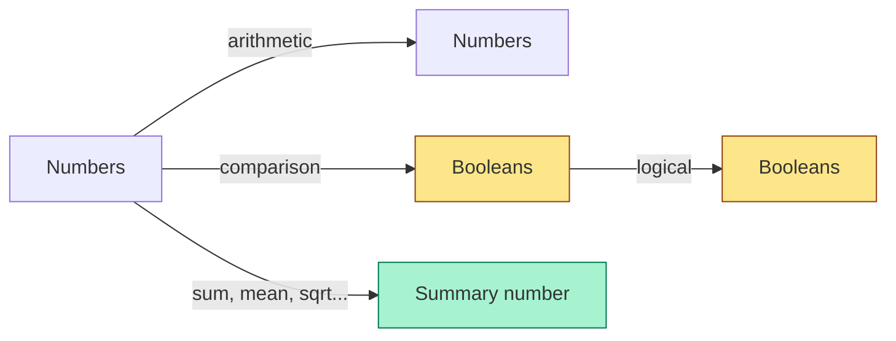

The very first thing you can do in R is *use it as a calculator*.
This is not a throwaway exercise — every later calculation in
every later page builds on what's on this page.

## The basic arithmetic operators

| Operator | Meaning            | Example       | Result |
| -------- | ------------------ | ------------- | ------ |
| `+`      | addition           | `2 + 3`       | `5`    |
| `-`      | subtraction        | `10 - 4`      | `6`    |
| `*`      | multiplication     | `3 * 7`       | `21`   |
| `/`      | division           | `10 / 4`      | `2.5`  |
| `^`      | exponentiation     | `2 ^ 10`      | `1024` |
| `%%`     | modulo (remainder) | `17 %% 5`     | `2`    |
| `%/%`    | integer division   | `17 %/% 5`    | `3`    |

Notice that `/` always returns a real number (so `10 / 4` is `2.5`,
not `2`). If you want integer division, R has a dedicated operator
`%/%`. The two together (`17 %/% 5` is `3`, and `17 %% 5` is `2`)
give you both halves of a division.

<CodeBlock
  adapter="r"
  initialCode={`# Each line produces an answer

2 + 3            # addition
10 - 4           # subtraction
3 * 7            # multiplication
10 / 4           # real division
2 ^ 10           # exponentiation: 2 to the 10th power
17 %% 5          # modulo: remainder of 17 / 5
17 %/% 5         # integer division: how many times 5 fits into 17
`}
/>

Try changing the numbers and re-running. R does not save anything
between runs unless you assign to a variable.

## Order of operations

R follows standard mathematical order of operations:
**exponentiation > multiplication and division > addition and
subtraction**, with **parentheses overriding** everything.

<CodeBlock
  adapter="r"
  initialCode={`# These two expressions are NOT the same
print(2 + 3 * 4)       # 2 + 12 = 14
print((2 + 3) * 4)     # 5 * 4  = 20

# Exponentiation is higher than multiplication
print(2 * 3 ^ 2)       # 2 * 9 = 18
print((2 * 3) ^ 2)     # 6^2  = 36

# When in doubt, parenthesize
print(((1 + 2) * (3 + 4)) / 5)
`}
/>

A good habit: **when an expression has more than two operators,
parenthesize even when you don't have to**. Future readers (and
future you) will not have to mentally re-run the precedence rules.

## Numbers in R

R has two kinds of numbers you will routinely encounter:

- **doubles** (the default — floating-point real numbers).
- **integers** (whole numbers, marked with a trailing `L`).

<CodeBlock
  adapter="r"
  initialCode={`x <- 42       # double (the default in R!)
y <- 42L      # integer (the L stands for "long integer")

cat("type of x:", typeof(x), "\\n")
cat("type of y:", typeof(y), "\\n")
`}
/>

For most practical purposes you can ignore the difference — R will
quietly convert between them as needed. The case where it matters
is interfacing with other systems (databases, foreign code) that
care about the distinction.

### Special numeric values

R has a few special "numbers" that pop up in real data analysis:

| Value | Meaning                          |
| ----- | -------------------------------- |
| `NA`  | "missing" (not available)        |
| `NaN` | "not a number" (e.g. `0 / 0`)    |
| `Inf` | positive infinity (e.g. `1 / 0`) |
| `-Inf`| negative infinity                |

<CodeBlock
  adapter="r"
  initialCode={`print(1 / 0)        # Inf
print(-1 / 0)       # -Inf
print(0 / 0)        # NaN — "not a number"
print(NA + 5)       # NA — anything plus a missing value is missing
print(is.na(NA))    # TRUE
print(is.nan(0/0))  # TRUE
print(is.infinite(1/0))  # TRUE
`}
/>

These special values are critical to understand because real
datasets are full of missing values, and R takes the position that
**arithmetic with a missing value should produce a missing value**
(rather than silently making one up). We will return to `NA` in a
dedicated chapter on missing data.

## Comparison operators

To ask R *questions* about values, you use comparison operators.
Each comparison returns a **logical** value: `TRUE` or `FALSE`.

| Operator | Meaning             |
| -------- | ------------------- |
| `==`     | equal to            |
| `!=`     | not equal to        |
| `<`      | less than           |
| `<=`     | less than or equal  |
| `>`      | greater than        |
| `>=`     | greater than or equal |

<CodeBlock
  adapter="r"
  initialCode={`5 == 5          # TRUE
5 != 5          # FALSE
5 < 10          # TRUE
5 > 10          # FALSE
5 <= 5          # TRUE — note the difference vs. <

# Mix with arithmetic
(2 + 3) > (1 * 4)   # 5 > 4 is TRUE

# Watch out: floating point equality is tricky!
(0.1 + 0.2) == 0.3
`}
/>

That last line is one of the most famous traps in numeric
computing. `0.1 + 0.2` produces something *very slightly* different
from `0.3` because of how computers represent decimal fractions in
binary. The right way to compare numbers like this is with
`all.equal()`:

<CodeBlock
  adapter="r"
  initialCode={`# The "is it basically equal?" check
print(all.equal(0.1 + 0.2, 0.3))
`}
/>

This will return `TRUE` when the two numbers agree within a tiny
tolerance, which is almost always what you actually want.

## Logical operators

Once you have logical values, you can combine them.

| Operator | Meaning                                       |
| -------- | --------------------------------------------- |
| `!`      | NOT                                           |
| `&`      | AND (vectorized)                              |
| `\|`     | OR (vectorized)                               |
| `&&`     | AND (single value, used in `if`)              |
| `\|\|`   | OR (single value, used in `if`)               |

<CodeBlock
  adapter="r"
  initialCode={`age      <- 30
income   <- 55000

# Eligible if age between 25 and 60 AND income at least 40000
eligible <- (age >= 25) & (age <= 60) & (income >= 40000)
print(eligible)

# At least one of: under 18 or over 65
discounted <- (age < 18) | (age > 65)
print(discounted)

# NOT eligible
ineligible <- !eligible
print(ineligible)
`}
/>

For now, use `&` and `|` (single ones) — they work on both single
values and vectors. The doubled versions (`&&` and `||`) are only
for single-value logic inside `if` statements; we will see them
later.

## A short worked example

Let us compute the area and perimeter of a rectangle, and check
whether it is a "wide" or "tall" rectangle, with one little
program:

<CodeBlock
  adapter="r"
  initialCode={`width  <- 8
height <- 5

area      <- width * height
perimeter <- 2 * (width + height)
is_wide   <- width > height

cat("Width:    ", width, "\\n")
cat("Height:   ", height, "\\n")
cat("Area:     ", area, "\\n")
cat("Perimeter:", perimeter, "\\n")
cat("Wide?    ", is_wide, "\\n")
`}
/>

Notice the pattern again: name your inputs, compute things from
them, name the outputs, then describe what happened. Try changing
`width` and `height` and rerunning.

## Useful built-in math functions

R ships with dozens of math functions. You will use these often:

| Function     | What it does                          |
| ------------ | ------------------------------------- |
| `abs(x)`     | absolute value                        |
| `sqrt(x)`    | square root                           |
| `exp(x)`     | e raised to the x                     |
| `log(x)`     | natural logarithm                     |
| `log10(x)`   | base-10 log                           |
| `log2(x)`    | base-2 log                            |
| `round(x, n)`| round to n decimal places             |
| `floor(x)`   | round down                            |
| `ceiling(x)` | round up                              |
| `sign(x)`    | -1 / 0 / 1 depending on sign of x     |
| `max(...)`   | maximum                               |
| `min(...)`   | minimum                               |
| `sum(...)`   | sum                                   |
| `mean(...)`  | average                               |

<CodeBlock
  adapter="r"
  initialCode={`cat("abs(-7)        =", abs(-7), "\\n")
cat("sqrt(16)       =", sqrt(16), "\\n")
cat("exp(1)         =", exp(1), "\\n")
cat("log(exp(5))    =", log(exp(5)), "\\n")
cat("log10(1000)    =", log10(1000), "\\n")
cat("round(3.14159, 2) =", round(3.14159, 2), "\\n")
cat("floor(2.9)     =", floor(2.9), "\\n")
cat("ceiling(2.1)   =", ceiling(2.1), "\\n")
cat("sum(1:10)      =", sum(1:10), "\\n")    # 1+2+...+10
cat("mean(1:10)     =", mean(1:10), "\\n")   # 5.5
`}
/>

The shortcut `1:10` creates the sequence `1, 2, 3, ..., 10`. We
will use ranges constantly later.

This little diagram captures most of what you can do with R as a
calculator: numbers in, numbers / booleans out.

## Test your understanding

<MultipleChoice
  markdown={`What does \`10 %% 3\` evaluate to in R?

- 3.33
- 3
  > That would be \`10 %/% 3\` — integer division.
- [o] 1
  > Correct! \`%%\` is the modulo operator: 10 divided by 3 leaves a remainder of 1.
- 30`}
/>

<MultipleChoice
  markdown={`Which of these is the **correct** R expression for "is 0.1 + 0.2 approximately equal to 0.3, allowing for floating-point error"?

- \`(0.1 + 0.2) == 0.3\`
  > This returns \`FALSE\` because of floating-point representation issues.
- \`(0.1 + 0.2) ~ 0.3\`
- [o] \`all.equal(0.1 + 0.2, 0.3)\`
  > Correct! \`all.equal()\` is R's idiom for "are these approximately equal within tolerance?"
- \`(0.1 + 0.2) === 0.3\`
  > R does not have a \`===\` operator — that's JavaScript.`}
/>

<MultipleChoice
  markdown={`What does \`2 + 3 * 4 ^ 2\` evaluate to in R?

- 80
  > That would require \`(2 + 3) * 4 ^ 2 = 5 * 16\`.
- 196
  > That would require \`((2 + 3) * 4) ^ 2 = 400\` — not this either.
- [o] 50
  > Correct! Apply exponentiation first: \`4 ^ 2 = 16\`. Then multiplication: \`3 * 16 = 48\`. Then addition: \`2 + 48 = 50\`.
- 100`}
/>

## Challenge: tip calculator

Build a small tip calculator. Given a bill amount `bill` (a number)
and a tip percentage `tip_pct` (a number like `18` for 18%), compute:

- `tip` — the dollar amount of the tip, rounded to 2 decimals
- `total` — the total bill (bill + tip), rounded to 2 decimals

Both should be plain numeric scalars.

<ChallengeCard
  adapter="r"
  title="Tip calculator"
  instructions={`Using \`bill\` and \`tip_pct\` (both already defined), compute:
- \`tip\`: the tip amount in dollars, rounded to 2 decimals.
- \`total\`: \`bill + tip\`, rounded to 2 decimals.`}
  initCode={`bill    <- 42.75
tip_pct <- 18`}
  initialCode={`tip   <- NA
total <- NA

cat("Bill:  $", bill, "\\n", sep = "")
cat("Tip:   $", tip, "\\n", sep = "")
cat("Total: $", total, "\\n", sep = "")
`}
  solutionCode={`tip   <- round(bill * tip_pct / 100, 2)
total <- round(bill + tip, 2)

cat("Bill:  $", bill, "\\n", sep = "")
cat("Tip:   $", tip, "\\n", sep = "")
cat("Total: $", total, "\\n", sep = "")
`}
  tests={[
    {
      id: "tip",
      name: "tip is the correct dollar amount",
      description: "Should equal round(bill * tip_pct / 100, 2)",
      code: `expected <- round(bill * tip_pct / 100, 2); if (!isTRUE(all.equal(tip, expected))) stop(sprintf("expected tip %s, got %s", expected, tip))`,
    },
    {
      id: "total",
      name: "total is bill + tip rounded to 2 decimals",
      description: "Should equal round(bill + tip, 2)",
      code: `expected <- round(bill + round(bill * tip_pct / 100, 2), 2); if (!isTRUE(all.equal(total, expected))) stop(sprintf("expected total %s, got %s", expected, total))`,
    },
  ]}
/>

In the next page we will give *names* to things — the missing piece
that turns calculator work into actual programming.
