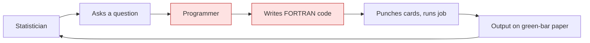
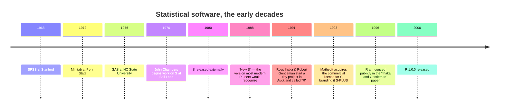

When electronic computers became available in the 1950s and 1960s,
statisticians were among the first people to want them.

The reason was obvious. If a t-test took half a day by hand, and a
computer could do the same arithmetic in milliseconds, then a
statistician's *productivity* could jump by factors of *thousands*.
But there was a catch — and that catch is the whole story of this
chapter.

## The catch: computers spoke FORTRAN

Early computers were programmed in low-level languages like
**FORTRAN** and **assembly**. To run a t-test, an analyst could not
just say "run a t-test." They had to:

1. Write a FORTRAN program that read in numbers from a stack of
   punched cards.
2. Manually allocate arrays of the right size.
3. Code up the sums and sums-of-squares.
4. Print the result onto a line printer.
5. If a card was misread, start over.

This was *faster* than hand computation, but it was still
**engineering work**. The statistician's job got mixed up with the
programmer's job, and that meant teams of researchers often had to
share a single programmer who was perpetually backlogged.



The bottleneck was not the machine. It was that *the language of
the machine was not the language of the analyst*.

## The first specialized statistical software

Three pieces of software emerged in the late 1960s and early 1970s
to fix this. Each let an analyst describe a statistical operation
in a high-level way and have the computer carry it out.

**SPSS** (Statistical Package for the Social Sciences) appeared in
1968 at Stanford. It was originally aimed at social scientists who
were drowning in survey data. Its style was procedural: write a
file with a few SPSS commands ("REGRESSION VARIABLES = …"), submit
it, get a printout.

**SAS** (Statistical Analysis System) appeared in 1976 at North
Carolina State University. It quickly became dominant in business
and biomedical settings, especially anything involving clinical
trials or regulated data. SAS was famous for its `DATA` steps and
`PROC` steps, and for being *very* good at handling large datasets
on the limited hardware of the time.

**Minitab** (1972) was designed for teaching, with a simpler
command language.

These tools had a transformative effect. A clinical trial that
might have taken a team six months to analyze in 1960 could be
analyzed in days by 1980. But each of them had a particular
flavor: they were **batch-oriented**. You wrote a script, you
submitted it, you waited, you got output. They were not interactive
the way modern analysis feels.

## The Bell Labs experiment

While SAS and SPSS were focused on solving practical problems in
business and the social sciences, something different was happening
inside **Bell Labs**, the legendary research arm of AT&T in Murray
Hill, New Jersey.

Bell Labs in the 1970s was one of the most extraordinary research
institutions in history. It had already given the world the
**transistor** (Bardeen, Brattain, Shockley), **information
theory** (Shannon), **Unix** (Thompson, Ritchie), and the **C
programming language** (Ritchie). Its statistics group was equally
ambitious.

That group included **John Chambers**, **Rick Becker**, **Allan
Wilks**, and others. They were interactive thinkers — they wanted
to *play with data*, not write batch jobs and wait for output. They
wanted to fit a model, look at the residuals, fit another one, plot
something, change a parameter, and try again.

Their working environment was Unix and FORTRAN. Existing
statistical packages did not fit the way they worked. So in 1976,
they started building their own.



## What was different about S

The system they built — and called, with characteristic Bell-Labs
brevity, **"S"** — had three radical ideas baked in from the start.

**Idea 1: An interactive prompt.** You typed a command, you saw an
answer, you typed another command. No batch jobs. No waiting.
Modern data analysts now take this for granted; in 1976 it was
revolutionary for serious statistical computing.

**Idea 2: Treat data as a first-class object.** In SAS, data lived
in special "datasets" you manipulated with `PROC` steps. In S, data
was just a variable in your workspace — you could pass it around,
look at it, modify it, save it, like any other object. This sounds
mundane today, but it changed the *mental model* of analysis.

**Idea 3: Provide both a high-level interface and a way to extend
it.** S had built-in functions for the common statistical
operations, but if you needed something custom, you could write your
own functions in the same language. There was no second-class
"scripting" layer.

The combination of these three ideas defined a new style of work:
**interactive data analysis** as a craft, where the language is
shaped to fit how an analyst thinks, not how the machine works.

## A short example: the same analysis in three styles

Let us imagine analyzing a tiny dataset on car fuel economy. In each
style, we will compute average miles per gallon by number of
cylinders. Here is the analysis in R (a direct descendant of S):

<CodeBlock
  adapter="r"
  initialCode={`# R-style: one expression, interactive
data(mtcars)
aggregate(mpg ~ cyl, data = mtcars, FUN = mean)
`}
/>

In SAS (circa 1980), the same analysis would look something like
this (not runnable here — for illustration only):

```sas
PROC MEANS DATA=mtcars NWAY;
  CLASS cyl;
  VAR mpg;
  OUTPUT OUT=means MEAN=mean_mpg;
RUN;

PROC PRINT DATA=means; RUN;
```

In FORTRAN (mid-1970s), it would be a hundred or more lines: open
the file, read records into arrays, sort by cylinder, accumulate
sums, divide, format and print. We will spare you the code.

You can feel the philosophical difference. R says "tell me what you
want." SAS says "tell me what procedure to run." FORTRAN says
"explain to me, step by step, how to compute it." Each represents a
different vision of what statistical computing should feel like.

## The legacy of S

By the late 1980s, S was being used inside Bell Labs for serious
work, and a commercial version — **S-PLUS** — had been licensed and
sold to companies that needed it for statistical work.

S-PLUS was expensive. A single-seat license could cost several
thousand dollars. For corporate users this was reasonable; for
graduate students, university departments, and independent
researchers, it was prohibitive.

In 1991, two statisticians at the University of Auckland — Ross
Ihaka and Robert Gentleman — quietly began a side project. Their
goal was modest: they wanted a *free* implementation of an
S-like language for their teaching. They called it **R**.

What happened next surprised everyone, including them.

## Test your understanding

<MultipleChoice
  markdown={`What was the main innovation that distinguished S (and later R) from earlier statistical packages like SAS and SPSS?

- It was faster than SAS at large-scale data crunching.
- It supported larger datasets than SAS.
- [o] It treated data analysis as an *interactive, programmable* activity rather than a batch job.
  > S was designed for interactive use at a terminal, with data as first-class objects and full programmability. This shaped the modern style of "exploratory data analysis as a conversation with the data."
- It was the first statistical software to use the normal distribution.`}
/>

<MultipleChoice
  markdown={`Where was the S language created?

- Stanford University
- North Carolina State University
- [o] Bell Labs
  > S was created at Bell Labs in Murray Hill, New Jersey, by a team led by John Chambers starting around 1976.
- IBM Research`}
/>

<MultipleChoice
  markdown={`Which is the most accurate description of how a SAS analyst in 1985 typically worked?

- Sitting at a terminal, typing one expression at a time and seeing immediate output.
- [o] Writing a batch script of \`DATA\` and \`PROC\` steps, submitting it, and reading the printed output later.
  > SAS was — and historically still is — primarily a batch language, in which an analyst writes a complete program of steps and submits it as a job.
- Writing FORTRAN code that called SAS subroutines.
- Editing data interactively in a spreadsheet-like grid.`}
/>

## A quick code exercise

Most modern R code uses **vectorized operations** — single
expressions that operate on a whole column of data — because that
is what S was designed for. As a warm-up, let us compute a column
of "is this car efficient?" labels (TRUE if mpg ≥ 25, FALSE
otherwise) without writing a loop.

<ChallengeCard
  adapter="r"
  title="Vectorized labeling"
  instructions={`Create a logical vector \`efficient\` the same length as \`mpg\`, where each element is \`TRUE\` if the corresponding mpg is at least 25, and \`FALSE\` otherwise. No loops — use a single comparison.`}
  initCode={`mpg <- c(21, 24, 22, 30, 18, 33, 26, 19)`}
  initialCode={`efficient <- NA  # TODO

print(efficient)
`}
  solutionCode={`efficient <- mpg >= 25

print(efficient)
`}
  tests={[
    {
      id: "logical",
      name: "efficient is logical",
      description: "Should be of type logical",
      code: `if (!is.logical(efficient)) stop("efficient must be a logical vector")`,
    },
    {
      id: "length",
      name: "Same length as mpg",
      description: "One TRUE/FALSE per car",
      code: `if (length(efficient) != length(mpg)) stop(sprintf("expected length %d, got %d", length(mpg), length(efficient)))`,
    },
    {
      id: "values",
      name: "Correct values",
      description: "Matches mpg >= 25",
      code: `if (!identical(efficient, mpg >= 25)) stop("values do not match mpg >= 25")`,
    },
  ]}
/>

This one-line operation — "compare a whole vector to a number,
get a whole vector back" — was already idiomatic in S in the
1980s. It is one of the most important habits to learn in R, and
we will return to it many times.

In the next chapter we will tell the story of how R itself came
about — and why a humble university teaching project ended up
displacing its million-dollar commercial parent.
