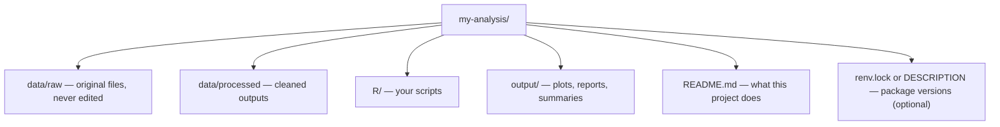
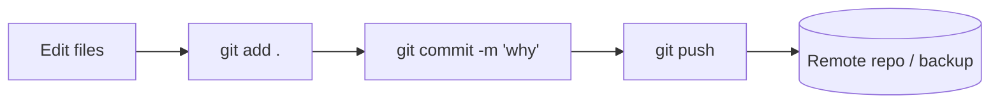

In an interactive console, you can do anything. Type a command,
inspect a result, type another. That's wonderful for
exploration — and terrible for *reproducing* an analysis a week,
a month, or a year later.

The remedy is to treat your work as a **project**: a folder on
disk with a predictable structure, R scripts that run top-to-
bottom, data kept in known locations, and outputs written in
ways anyone (including future-you) can re-run.

## A minimal project layout



A common starter layout:

```
my-analysis/
├── README.md
├── data/
│   ├── raw/
│   │   └── sales.csv
│   └── processed/
│       └── sales_clean.csv
├── R/
│   ├── 01-load.R
│   ├── 02-clean.R
│   ├── 03-analyze.R
│   └── 04-plot.R
└── output/
    ├── summary.csv
    └── trend.png
```

A few conventions worth adopting from day one:

- **Never edit `data/raw/`.** Treat it as read-only. All
  transformations produce *new* files in `data/processed/`.
- **Number your scripts.** `01-`, `02-`, `03-` makes the order
  unambiguous and tab-completion easy.
- **Write a `README.md`.** Even 5 sentences explaining what the
  project does and how to run it pays for itself the first time
  you return after a break.

## Scripts vs. interactive sessions

A script is just a `.R` file you can run top-to-bottom. The
discipline is: *anything important should live in a script*. If
you fix a bug in the console, copy that fix back into the
script. The script is the source of truth; the console is a
scratchpad.

A typical analysis script:

```r
# R/02-clean.R
# Clean the raw sales CSV.

library(readr)
library(dplyr)

raw <- read_csv("data/raw/sales.csv")

clean <- raw |>
  filter(!is.na(amount)) |>
  mutate(
    date     = as.Date(date),
    amount   = as.numeric(amount),
    category = tolower(trimws(category))
  )

write_csv(clean, "data/processed/sales_clean.csv")
```

Notice:

- It declares its dependencies at the top with `library()` calls.
- It reads from `data/raw/` and writes to `data/processed/`.
- It would run identically on any machine that has the same
  packages and the same input file.

## `source()` for orchestration

You can chain scripts with `source()`, which runs another R file
in your current session:

```r
# run-all.R
source("R/01-load.R")
source("R/02-clean.R")
source("R/03-analyze.R")
source("R/04-plot.R")

cat("Done!\n")
```

Now you have a single command — `Rscript run-all.R` — that
reproduces the entire analysis from raw data to final outputs.

## Working directory & paths

A common source of "it worked on my computer" pain is hard-coded
paths like `"C:/Users/Ada/Documents/data/sales.csv"`. Don't do
that. Use *relative* paths anchored to the project root, like
`"data/raw/sales.csv"`. Tools like RStudio Projects or the
`here` package make this even safer:

<CodeBlock
  adapter="r"
  initialCode={`# In a real RStudio project, the 'here' package finds the project root automatically:
#   install.packages("here")
#   library(here)
#   read.csv(here("data", "raw", "sales.csv"))

# In a script, getwd() shows where R thinks "you are":
cat("Working directory:", getwd(), "\\n")

# Build a relative path:
file.path("data", "raw", "sales.csv")
`}
/>

Relative paths + a consistent project root = portable code.

## Bringing scripts into a notebook with R Markdown / Quarto

R Markdown (`.Rmd`) and its successor **Quarto** (`.qmd`) let
you mix prose, code, and outputs in one document — perfect for
analyses you want to share as readable reports.

A tiny Quarto-style example (don't run this — it's just the
flavor):

````markdown
---
title: "Sales analysis"
author: "Ada Lovelace"
format: html
---

## Setup

```{r}
library(dplyr)
sales <- read.csv("data/processed/sales_clean.csv")
```

## Monthly totals

```{r}
sales |>
  group_by(month = format(as.Date(date), "%Y-%m")) |>
  summarise(total = sum(amount))
```
````

When you render the document, it runs all code blocks and weaves
the outputs into the final HTML/PDF. You get a single
self-describing report that anyone can re-run.

## Version control (just a taste)

You don't need to master git to benefit from it. A few habits:

- Initialize a git repo in your project folder: `git init`.
- Commit often, with messages that explain *why*.
- **Don't commit large raw data.** Add it to `.gitignore`.
- Push to a remote (GitHub, GitLab, etc.) for backup and
  collaboration.

Git turns "I overwrote yesterday's file" from a tragedy into
"oh, let me check the history."



## Package management

A frequent source of broken analyses: "I updated dplyr and now
my code doesn't work." The standard fix is to **pin** package
versions per project. Two common tools:

- **`renv`** — creates a project-local library and a lockfile
  (`renv.lock`) with exact package versions.
- **`packrat`** — older predecessor of `renv`.

A typical workflow:

```r
# install.packages("renv")
renv::init()        # set up the project library
# ... install packages, do work ...
renv::snapshot()    # record current versions to renv.lock
```

Now anyone (including future-you on a new laptop) can run
`renv::restore()` to install the *exact* versions used.

## Checklist for a reproducible project

When you finish a project, run through this list:

1. ☐ Does the `README.md` explain the project and how to run it?
2. ☐ Is raw data preserved unchanged in `data/raw/`?
3. ☐ Do scripts run top-to-bottom without manual steps?
4. ☐ Are there no hard-coded absolute paths?
5. ☐ Are package versions pinned (renv, DESCRIPTION) or at
   least listed in the README?
6. ☐ Are outputs (plots, tables) regenerated from scripts — not
   hand-edited?
7. ☐ Is the project under version control?

A project that satisfies all 7 is one a stranger could pick up
and rerun. That is the single highest-leverage skill an analyst
can develop.

## Test your understanding

<MultipleChoice
  markdown={`Why should you never edit files in \`data/raw/\`?

- They're owned by the OS.
- [o] Raw data is the immutable ground truth — preserving it means anyone can re-derive every cleaned output by re-running scripts, and accidental edits can't silently corrupt your analysis.
  > Correct! Treat raw data as read-only.
- R can't write to that folder.
- It's a tradition with no real reason.`}
/>

<MultipleChoice
  markdown={`What's the main problem with a hard-coded path like \`"C:/Users/Ada/Documents/data/sales.csv"\` in a script?

- It's longer to type.
- [o] It won't work on anyone else's machine (or even yours, after you reorganize your files) — relative paths anchored to the project root are portable.
  > Correct! Portability matters even if "anyone else" is just future-you.
- R can't read Windows paths.
- It only works for CSV files.`}
/>

<MultipleChoice
  markdown={`What's the purpose of a tool like \`renv\` or \`packrat\`?

- They speed up script execution.
- [o] They record the exact package versions a project uses, so the analysis can be reliably re-run later even after packages on CRAN have changed.
  > Correct! Reproducibility doesn't end at code — it includes the environment around it.
- They replace base R.
- They make scripts run in parallel.`}
/>

## Mini challenge: design a project layout

Imagine you're starting an analysis that pulls daily stock-price
data from a CSV, computes monthly returns, and produces a chart.
**Without writing any code,** sketch (in plain text or comments)
the directory structure you'd create — folder names, file names,
and what each script does.

There's no automated test for this one — but a good sketch would
include:

- `data/raw/` and `data/processed/` folders
- A `R/` folder with numbered scripts (e.g., `01-load.R`,
  `02-clean.R`, `03-monthly-returns.R`, `04-plot.R`)
- An `output/` folder for the chart
- A `README.md` describing the project
- An optional `renv.lock` for reproducibility

Compare your sketch to the template above. Did you split
"load" from "clean"? Did you keep raw and processed data
separate? Did you give yourself a single entry point to re-run
everything?

The two remaining pages walk through a complete end-to-end mini
analysis and then point you at what to learn next.
