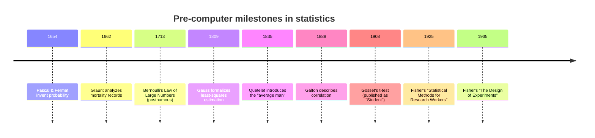
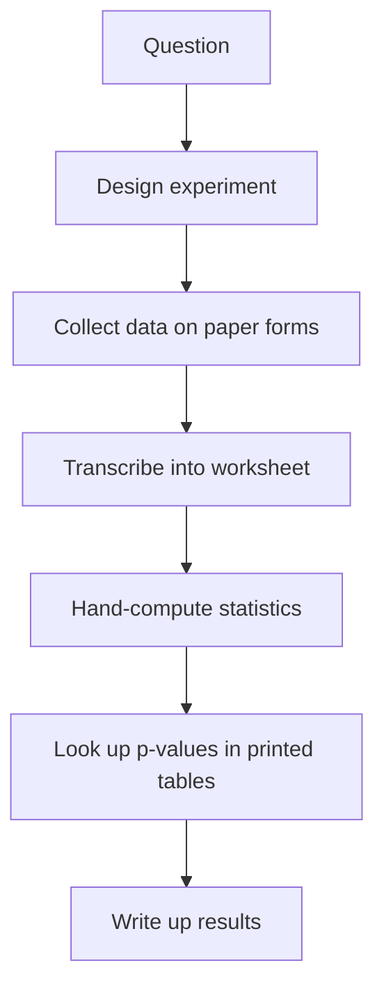

The word **"computer"** used to mean a person.

If you read a scientific paper from the 1930s and it says "the
computations were performed by Miss J. Smith," it does not mean
some machine. It means a real woman, sitting at a desk with a
mechanical adding machine and a stack of paper, working through
equations by hand for weeks at a time.

To appreciate why R looks the way it does, it helps to remember
what statistics was like in that world.

## A craft built around scarcity

The intellectual roots of statistics go back to the 1600s, when a
small group of mathematicians began studying games of chance.

- **Blaise Pascal** and **Pierre de Fermat** corresponded in 1654
  about how to fairly split a wager when a game was interrupted —
  inventing the basic logic of probability in the process.
- **John Graunt** published *Natural and Political Observations Made
  upon the Bills of Mortality* in 1662, using parish death records
  to argue, for the first time, that you could learn things about
  populations by carefully counting them.
- **Jakob Bernoulli** proved (around 1700) the **law of large
  numbers**: if you flip a fair coin enough times, the proportion
  of heads will reliably approach one half. This sounds obvious now
  — but it was the first mathematical bridge between *probability*
  (a theoretical idea) and *data* (what we actually observe).

For the next two hundred years, statistics grew slowly. A few names
you may have heard of:

- **Carl Friedrich Gauss** (early 1800s) — developed least-squares
  estimation while trying to predict the orbit of the asteroid
  Ceres from a handful of telescope sightings.
- **Adolphe Quetelet** (1830s) — coined "social physics" and
  introduced the idea of the *average person*.
- **Francis Galton** (late 1800s) — invented regression and
  correlation while studying inheritance.
- **Karl Pearson** and **R. A. Fisher** (early 1900s) — built the
  foundations of modern statistical inference.

Every one of these breakthroughs was achieved without a computer.
The arithmetic was done by hand, sometimes with mechanical
calculators (the Brunsviga, the Marchant, the Friden), but most of
the *thinking* — and most of the bookkeeping — was paper-and-pencil
work.

## What a real analysis looked like in 1920

Imagine you are R. A. Fisher, working at Rothamsted Experimental
Station in the 1920s. You want to know whether a new fertilizer
improves wheat yields. You design an experiment with, say, 8
varieties of wheat planted in 5 plots each — 40 plots total. At
harvest, you have 40 numbers.

The analysis you want to perform is what we now call **ANOVA**
(analysis of variance) — a way to ask "is the difference between
varieties bigger than the random variation between plots?" The
formula involves computing sums, sums of squares, and ratios of
those quantities.

For just 40 numbers, this might be:

- An hour to enter the numbers neatly into a worksheet (probably
  twice, by two different people, to catch transcription errors).
- Two hours to compute the various sums of squares by hand.
- An hour to assemble the ANOVA table and look up the F-statistic
  in a printed table.

That is about half a day of careful work to analyze one
experiment. And Fisher actually did this kind of thing routinely.
The famous *Statistical Methods for Research Workers* (1925) is
full of worked examples that were each many hours of arithmetic.

<Callout type="info" title="Why statistical methods are so 'computational'">
This is why many classical statistical techniques have such
strange-looking shortcuts and rules of thumb. They were not designed
for elegance — they were designed to *minimize the number of
multiplications a human had to do by hand*. When you see weird
formulas in old textbooks, that is often what you are looking at:
hand-calculation tricks frozen into the method.
</Callout>

## Tables, slides, and human computers

To make this feasible, the statisticians of the early 20th century
built three kinds of tools.

**Printed tables.** Books of values for the normal distribution,
the t-distribution, the F-distribution, the chi-squared
distribution — all computed once, painstakingly, and printed so
that everyone else could look up the answer instead of computing
it. Some of these tables took years of work to produce.

**Mechanical calculators.** The Brunsviga (introduced in 1892) and
its successors let you crank a handle to multiply or divide.
Logarithms and slide rules helped further. By the 1930s a typical
research office had several of these.

**Human computers.** Large projects — astronomy, ballistics,
actuarial science — were carried out by teams of (often female)
mathematicians doing arithmetic in parallel. NASA's early space
programs ran this way well into the 1960s, as immortalized in the
book and film *Hidden Figures*.

That whole pipeline — every step — was manual. If you found a
transcription error at step E, you might have to redo hours of work.

## A taste of "manual statistics" in R

Let us reproduce a calculation Fisher might have done. We have
yields from 5 plots growing two different varieties of wheat and
want to know whether they look reliably different.

<CodeBlock
  adapter="r"
  starterCode={`# 5 plots each of two wheat varieties (bushels per acre)
variety_A <- c(48, 52, 47, 50, 53)
variety_B <- c(45, 47, 44, 46, 48)

# Step 1: the means
mean_A <- mean(variety_A)
mean_B <- mean(variety_B)
cat("mean A:", mean_A, "  mean B:", mean_B, "\\n")

# Step 2: the difference of means
diff_means <- mean_A - mean_B
cat("difference:", diff_means, "\\n")

# Step 3: the pooled standard deviation
n <- length(variety_A)
sd_pooled <- sqrt(((n - 1) * var(variety_A) + (n - 1) * var(variety_B)) / (2 * n - 2))
cat("pooled sd:", round(sd_pooled, 3), "\\n")

# Step 4: the t-statistic
t_stat <- diff_means / (sd_pooled * sqrt(2 / n))
cat("t-statistic:", round(t_stat, 3), "\\n")
`}
/>

Every line above is a step Fisher would have done by hand with a
pencil and a Brunsviga. With R, it took us a second. And — crucially
— if we want to check this against R's built-in t-test, it is one
more line:

<CodeBlock
  adapter="r"
  initCode={`variety_A <- c(48, 52, 47, 50, 53)
variety_B <- c(45, 47, 44, 46, 48)`}
  starterCode={`# R's built-in t-test for two samples
t.test(variety_A, variety_B, var.equal = TRUE)
`}
/>

Look at the *t* value in the output — it matches what we computed
manually. That is the gift of programming for statistics: you can
build up an answer the long way to understand it, then trust the
short way for production.

## What carried over — and what didn't

The constraints of the pre-computer era shaped statistics in ways
that are still with us:

- **The obsession with *small samples*.** Many classical tests
  (the t-test, ANOVA) were designed for n=10 or n=30, not n=10,000.
  That is because hand-computing anything bigger was infeasible.
- **The use of *closed-form formulas*.** A formula is something you
  can compute once and be done. Modern alternatives — bootstrapping,
  simulation, Bayesian sampling — require thousands of computations
  per analysis and were simply impossible before computers.
- **The cultural emphasis on *publication of methods*, not data.**
  Datasets were small enough to fit in a paper appendix. There was
  no need for a system to share gigabyte-scale data files.

But once computers arrived in the second half of the 20th century,
the *possibilities* of statistics exploded. Suddenly an analyst
could try methods that had been theoretically known for decades
but practically unreachable. We will see that next.

## Test your understanding

<MultipleChoice
  markdown={`Why were many classical statistical methods designed around very small sample sizes (say, n = 10 to n = 30)?

- Larger samples are statistically invalid.
- [o] Hand-computation made larger samples impractical at the time.
  > Many famous methods (the t-test, ANOVA) were tuned to give useful answers from the kind of data a researcher could realistically analyze with paper, pencil, and a mechanical calculator.
- Statisticians had not yet discovered that more data is better.
- The math was always intended for small n on philosophical grounds.
  > While there are interesting modern conversations about small data, the historical reason was very practical: arithmetic was expensive.`}
/>

<MultipleChoice
  markdown={`In the early 1900s, what did the word "computer" usually refer to?

- A mainframe machine in a glass-walled room.
- A research grant for computation.
- [o] A person — often a woman — whose job was to do arithmetic.
  > The word "computer" originally meant a person who performs calculations. Mechanical and then electronic computers eventually inherited the job title.
- A pocket calculator.`}
/>

<MultipleChoice
  markdown={`Why did pre-computer statisticians rely so heavily on **printed tables** of distribution values (e.g. the normal, t, F, chi-squared distributions)?

- The math was too complicated to ever understand.
- It was illegal to compute these values yourself.
- [o] Computing those values from scratch was prohibitively expensive — so once computed, the answers were published once and reused everywhere.
  > A table you can look up in five seconds replaces hours of hand computation.
- They contained errors that statisticians could correct over time.`}
/>

## A small history-flavored challenge

In the 1908 paper that introduced the t-test, William Sealy Gosset
(writing under the pen-name "Student") used a dataset of yields from
a barley experiment. Let's reproduce a tiny version. Compute and
store three quantities about the vector `yield`: the mean, the
standard deviation, and the t-statistic against the hypothesis that
the true mean is `40`.

<ChallengeCard
  adapter="r"
  title="Compute a one-sample t-statistic by hand"
  instructions={`Given the vector \`yield\` (already loaded), define:
- \`m\` — the mean of \`yield\`
- \`s\` — the standard deviation of \`yield\`
- \`t_stat\` — the one-sample t-statistic, \`(m - 40) / (s / sqrt(n))\`, where \`n\` is the length of yield.

You can use base R only — no packages needed.`}
  initCode={`yield <- c(42, 39, 45, 41, 44, 40, 43, 38, 46, 42)`}
  starterCode={`m      <- NA
s      <- NA
t_stat <- NA

cat("mean:", m, " sd:", s, " t:", t_stat, "\\n")
`}
  solutionCode={`n      <- length(yield)
m      <- mean(yield)
s      <- sd(yield)
t_stat <- (m - 40) / (s / sqrt(n))

cat("mean:", m, " sd:", s, " t:", t_stat, "\\n")
`}
  tests={[
    {
      id: "mean",
      name: "Mean is correct",
      description: "m should equal mean(yield)",
      code: `if (!isTRUE(all.equal(m, mean(yield)))) stop(sprintf("expected mean %s, got %s", mean(yield), m))`,
    },
    {
      id: "sd",
      name: "SD is correct",
      description: "s should equal sd(yield)",
      code: `if (!isTRUE(all.equal(s, sd(yield)))) stop(sprintf("expected sd %s, got %s", sd(yield), s))`,
    },
    {
      id: "t",
      name: "t-statistic is correct",
      description: "t_stat should equal (m - 40) / (s / sqrt(n))",
      code: `expected <- (mean(yield) - 40) / (sd(yield) / sqrt(length(yield))); if (!isTRUE(all.equal(t_stat, expected))) stop(sprintf("expected t %s, got %s", expected, t_stat))`,
    },
  ]}
/>

In the next chapter, we will see how the arrival of computers
turned this slow, careful craft into something altogether new — and
why the most influential of those tools came from an unexpected
place: **Bell Labs**.
