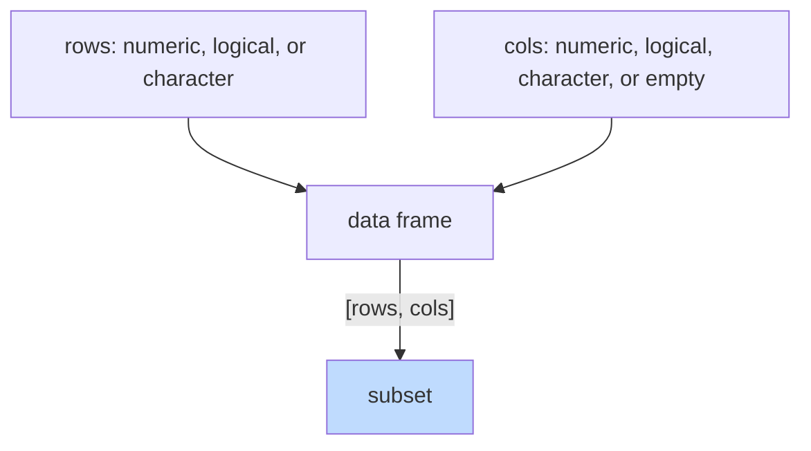

The single most common operation in data analysis is some flavor
of: **keep some of the rows, keep some of the columns, ignore the
rest.**

R has more than one way to do this. On this page we'll learn the
*base R* way — using `[ , ]` — because it builds directly on
what you already know about vectors. On the next pages we'll meet
`dplyr`, which gives a more readable syntax for the same ideas.

<svg
  viewBox="0 0 640 230"
  role="img"
  aria-label="A translucent window marks a small block of rows and columns inside a faint table, and a dotted trail carries the lifted copy out to the right — keep some rows, keep some columns, ignore the rest"
  style={{ display: "block", width: "100%", maxWidth: "640px", height: "auto", margin: "2.5rem auto" }}
>
  <g fill="currentColor" opacity="0.07">
    <rect x="120" y="44" width="30" height="22" rx="5" />
    <rect x="156" y="44" width="30" height="22" rx="5" />
    <rect x="192" y="44" width="30" height="22" rx="5" />
    <rect x="228" y="44" width="30" height="22" rx="5" />
    <rect x="264" y="44" width="30" height="22" rx="5" />
    <rect x="300" y="44" width="30" height="22" rx="5" />
    <rect x="120" y="72" width="30" height="22" rx="5" />
    <rect x="156" y="72" width="30" height="22" rx="5" />
    <rect x="192" y="72" width="30" height="22" rx="5" />
    <rect x="228" y="72" width="30" height="22" rx="5" />
    <rect x="264" y="72" width="30" height="22" rx="5" />
    <rect x="300" y="72" width="30" height="22" rx="5" />
    <rect x="120" y="100" width="30" height="22" rx="5" />
    <rect x="156" y="100" width="30" height="22" rx="5" />
    <rect x="192" y="100" width="30" height="22" rx="5" />
    <rect x="228" y="100" width="30" height="22" rx="5" />
    <rect x="264" y="100" width="30" height="22" rx="5" />
    <rect x="300" y="100" width="30" height="22" rx="5" />
    <rect x="120" y="128" width="30" height="22" rx="5" />
    <rect x="156" y="128" width="30" height="22" rx="5" />
    <rect x="192" y="128" width="30" height="22" rx="5" />
    <rect x="228" y="128" width="30" height="22" rx="5" />
    <rect x="264" y="128" width="30" height="22" rx="5" />
    <rect x="300" y="128" width="30" height="22" rx="5" />
  </g>
  <g style={{ color: "var(--ds-blue-500)" }} fill="currentColor">
    <rect x="186" y="66" width="114" height="62" rx="9" fillOpacity="0.14" />
  </g>
  <g fill="currentColor" opacity="0.3">
    <circle cx="310" cy="86" r="3" />
    <circle cx="346" cy="90" r="3" />
    <circle cx="382" cy="94" r="3" />
    <circle cx="418" cy="98" r="3" />
  </g>
  <g style={{ color: "var(--ds-blue-500)" }} fill="currentColor">
    <rect x="452" y="72" width="118" height="66" rx="10" fillOpacity="0.08" />
    <rect x="462" y="82" width="30" height="22" rx="5" fillOpacity="0.75" />
    <rect x="498" y="82" width="30" height="22" rx="5" fillOpacity="0.75" />
    <rect x="462" y="110" width="30" height="22" rx="5" fillOpacity="0.75" />
    <rect x="498" y="110" width="30" height="22" rx="5" fillOpacity="0.75" />
  </g>
  <g style={{ color: "var(--ds-blue-500)" }} fill="currentColor">
    <rect x="534" y="82" width="30" height="22" rx="5" fillOpacity="0.75" />
    <rect x="534" y="110" width="30" height="22" rx="5" fillOpacity="0.75" />
  </g>
</svg>

## The mental model: `[rows, cols]`

The bracket on a data frame takes two arguments separated by a
comma: which rows, which columns. An empty slot means *all*.

## Selecting columns

<CodeBlock
  adapter="r"
  files={[
    {
      filename: "main.r",
      starterCode: `data(mtcars)

# A single column by name (returns a vector)
mtcars[, "mpg"][1:6]

# A single column by name as a data frame (note: drop = FALSE)
head(mtcars[, "mpg", drop = FALSE])

# Multiple columns by name
head(mtcars[, c("mpg", "hp", "wt")])

# By position
head(mtcars[, 1:3])

# Drop columns by negative index
head(mtcars[, -c(1, 2)])
`,
    },
  ]}
/>

The "single column returns a vector" surprise trips beginners up.
If you want to *always* get back a data frame, either select
multiple columns or pass `drop = FALSE`.

## Selecting rows

<CodeBlock
  adapter="r"
  files={[
    {
      filename: "main.r",
      starterCode: `data(mtcars)

# Rows by position
mtcars[1:5, ]

# Specific rows by name (mtcars has rownames!)
mtcars[c("Mazda RX4", "Fiat 128"), ]

# Rows by logical condition — the most useful pattern
mtcars[mtcars$mpg > 25, ]

# Combine conditions
mtcars[mtcars$mpg > 20 & mtcars$cyl == 4, ]
`,
    },
  ]}
/>

The third form — passing a *logical vector* of the same length as
the number of rows — is the workhorse. Every "filter" you'll ever
do is some variation of it.

## Selecting rows AND columns at once

You can do both in one expression:

<CodeBlock
  adapter="r"
  files={[
    {
      filename: "main.r",
      starterCode: `data(mtcars)

# Fuel-efficient cars: just mpg, cyl, and weight
mtcars[mtcars$mpg > 25, c("mpg", "cyl", "wt")]

# 8-cylinder cars: just horsepower and quarter-mile time
mtcars[mtcars$cyl == 8, c("hp", "qsec")]
`,
    },
  ]}
/>

Read these out loud: "from mtcars, take the rows where mpg > 25,
and from those, just the mpg, cyl, and wt columns." The bracket
notation maps cleanly onto the sentence.

## A common pitfall: `==` vs `%in%`

If you want to match against a *set* of values, don't try to
combine many `==` with `|`. Use `%in%`:

<CodeBlock
  adapter="r"
  files={[
    {
      filename: "main.r",
      starterCode: `data(iris)

# Tedious and error-prone:
sub1 <- iris[iris$Species == "setosa" | iris$Species == "virginica", ]

# Idiomatic:
sub2 <- iris[iris$Species %in% c("setosa", "virginica"), ]

# Confirm they're the same
identical(sub1, sub2)
nrow(sub2)
`,
    },
  ]}
/>

`%in%` is one of R's nicest small operators. It's vectorized:
*"for each element of the left side, is it found anywhere in the
right side?"*

## A common pitfall: missing values in the condition

If your filter condition involves a column with `NA`s, those rows
become problematic — `NA > 5` is `NA`, not `FALSE`, and indexing
with `NA` yields a row of all `NA`s.

<CodeBlock
  adapter="r"
  files={[
    {
      filename: "main.r",
      starterCode: `data(airquality)

# Naive filter — includes rows of all NAs!
naive <- airquality[airquality$Ozone > 100, ]
head(naive)
nrow(naive)

# Safer: handle NAs explicitly
safe <- airquality[!is.na(airquality$Ozone) & airquality$Ozone > 100, ]
head(safe)
nrow(safe)
`,
    },
  ]}
/>

The fix is to always guard with `!is.na(col)` when filtering on a
column that might be missing. (`dplyr::filter()`, which we'll meet
soon, does this for you.)

## Sorting

Sorting is a sibling of subsetting. You sort a data frame by
ordering its rows according to one or more columns. `order()` is
the helper:

<CodeBlock
  adapter="r"
  files={[
    {
      filename: "main.r",
      starterCode: `data(mtcars)

# Sort by mpg ascending
head(mtcars[order(mtcars$mpg), c("mpg", "cyl", "wt")])

# Descending — wrap in -
head(mtcars[order(-mtcars$mpg), c("mpg", "cyl", "wt")])

# By two columns: first cyl ascending, then mpg descending within each
head(mtcars[order(mtcars$cyl, -mtcars$mpg), c("mpg", "cyl", "wt")])
`,
    },
  ]}
/>

`order()` returns the *positions* that would sort the vector; you
then use those positions as row indices.

## Test your understanding

<MultipleChoice
  markdown={`What is the convention for indexing a data frame with brackets?

- \`df[cols, rows]\`
  > The order is reversed here; R follows the row-first, column-second convention from matrix notation, so columns do not come first.
- [o] \`df[rows, cols]\`
  > Rows first, columns second — same convention as matrices in mathematics.
- \`df[rows][cols]\`
  > Chaining two separate bracket calls like this does not select rows and then columns; the second bracket would subset the result of the first, which is not a reliable way to filter rows and select columns simultaneously.
- \`df.rows.cols\`
  > R does not use dot notation for indexing data frames; that syntax belongs to languages like Python or JavaScript.`}
/>

<MultipleChoice
  markdown={`Which expression filters \`iris\` to rows where the species is either "setosa" or "versicolor"?

- \`iris[iris$Species == "setosa" == "versicolor", ]\`
  > Chaining \`==\` like this does not test membership; it compares the first result to \`"versicolor"\` and gives nonsense.
- [o] \`iris[iris$Species %in% c("setosa", "versicolor"), ]\`
  > \`%in%\` is the idiomatic way to match against a set of values.
- \`iris[iris$Species = "setosa" | "versicolor", ]\`
  > A single \`=\` is assignment, not comparison, and \`| "versicolor"\` is not a valid condition.
- \`iris[in(iris$Species, "setosa", "versicolor"), ]\`
  > There is no \`in()\` function in R; the membership operator is \`%in%\`.`}
/>

<MultipleChoice
  markdown={`Why is \`airquality[airquality$Ozone > 100, ]\` potentially dangerous?

- It's not — it works perfectly.
  > The expression silently includes rows where \`Ozone\` is \`NA\` as rows of all-\`NA\` values rather than excluding them, which corrupts downstream analyses.
- [o] \`Ozone\` contains NAs, and \`NA > 100\` evaluates to NA, which produces rows of all NAs in the result.
  > Always guard with \`!is.na(col) & ...\` (or use \`dplyr::filter()\`, which handles this for you).
- It sorts the data instead of filtering it.
  > Logical indexing selects rows, not sorts them; sorting requires \`order()\`.
- \`Ozone\` is character, so the comparison errors.
  > \`Ozone\` is numeric in \`airquality\`; the problem is not a type error but the propagation of \`NA\` through the comparison.`}
/>

## Mini challenge: heavy cars with poor fuel economy

From `mtcars`, build `heavy_inefficient`: a data frame containing
only the rows where `wt > 4` and `mpg < 18`, and only the columns
`mpg`, `cyl`, and `wt`.

<ChallengeCard
  adapter="r"
  title="Filter and select"
  instructions={`Use base R subsetting to filter \`mtcars\` to cars with \`wt > 4\` and \`mpg < 18\`, keeping only the \`mpg\`, \`cyl\`, and \`wt\` columns. Assign the result to \`heavy_inefficient\`.`}
  files={[
    {
      filename: "main.r",
      starterCode: `data(mtcars)

heavy_inefficient <- NULL # replace with a subset of mtcars

print(heavy_inefficient)
cat("Number of cars:", nrow(heavy_inefficient), "\\n")
`,
      solutionCode: `data(mtcars)

heavy_inefficient <- mtcars[
  mtcars$wt > 4 & mtcars$mpg < 18,
  c("mpg", "cyl", "wt")
]
print(heavy_inefficient)
cat("Number of cars:", nrow(heavy_inefficient), "\\n")
`,
    },
  ]}
  tests={[
    {
      id: "is_df",
      name: "Result is a data.frame",
      code: `if (!is.data.frame(heavy_inefficient)) stop("must be a data.frame")`,
    },
    {
      id: "cols",
      name: "Has exactly the right columns",
      code: `if (!identical(sort(names(heavy_inefficient)), sort(c("mpg","cyl","wt")))) stop("wrong columns")`,
    },
    {
      id: "rows",
      name: "Filter is correct",
      code: `expected <- mtcars[mtcars$wt > 4 & mtcars$mpg < 18, c("mpg","cyl","wt")]
if (nrow(heavy_inefficient) != nrow(expected)) stop(sprintf("expected %s rows, got %s", nrow(expected), nrow(heavy_inefficient)))`,
    },
  ]}
/>

We've now seen the *bracket* way to wrangle data. It is powerful
but verbose. The next big topic is **tidy data** — a principle for
how to *shape* your data so wrangling becomes easy.
