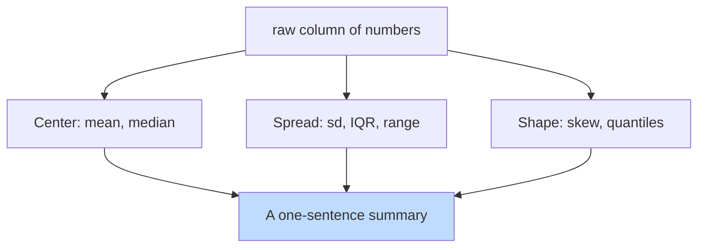

When you can't look at every value in a column (and you usually
can't — even 100 numbers is too many to mentally hold), you need
to **summarize** it. A handful of summary statistics, chosen well,
can carry an enormous amount of information.

## The two questions every summary answers

Every summary statistic answers one of two questions:

1. **Where is the center?** (location: mean, median)
2. **How spread out are the values?** (dispersion: sd, IQR, range)

Together, these two ideas describe a column with surprising
faithfulness.

## Measures of center

<CodeBlock
  adapter="r"
  starterCode={`incomes <- c(32, 38, 42, 45, 48, 51, 55, 58, 62, 250)

mean(incomes) # average — pulled up by the 250
median(incomes) # middle value — robust to outliers
`}
/>

The mean and the median tell different stories. Both are
"averages" in everyday language, but:

- **Mean** is the sum divided by the count. It uses every value
  equally and is *sensitive to outliers*.
- **Median** is the middle value when sorted. Half the data is
  below, half is above. It is *robust to outliers*.

In our income example, the mean (\$68k) is misleading — it makes
the typical person sound wealthier than they are. The median
(\$49.5k) is closer to what most people earn.

**Rule of thumb:** if mean and median differ noticeably, your
distribution is skewed, and you should report the median (or
both).

## Measures of spread

<CodeBlock
  adapter="r"
  starterCode={`a <- c(48, 49, 50, 51, 52) # tight
b <- c(10, 30, 50, 70, 90) # spread

mean(a)
mean(b) # same mean!
sd(a)
sd(b) # very different spread
var(a)
var(b) # variance = sd^2
range(a)
range(b)
IQR(a)
IQR(b) # interquartile range: Q3 - Q1
`}
/>

Two distributions with identical means can have wildly different
shapes. Spread tells you "how concentrated is the data near its
center?"

- **Standard deviation (sd)**: roughly, the typical distance from
  the mean.
- **Variance**: the square of the standard deviation. Same idea,
  different scale.
- **Range**: max minus min. Simple but extremely sensitive to
  outliers.
- **IQR**: the spread of the middle 50% of values. Robust to
  outliers.

## Quantiles: a richer picture

Quantiles split sorted data into equal-sized chunks. The
*quartiles* (25%, 50%, 75%) and *quintiles* (every 20%) are the
most common.

<CodeBlock
  adapter="r"
  starterCode={`scores <- c(60, 65, 67, 70, 72, 75, 78, 80, 82, 85, 88, 90, 92, 95, 100)

# Quartiles (default)
quantile(scores)

# Deciles
quantile(scores, probs = seq(0, 1, by = 0.1))

# A single quantile
quantile(scores, probs = 0.9) # 90th percentile
`}
/>

The classic "five-number summary" (min, Q1, median, Q3, max) is
what `summary()` and the boxplot are built around. We'll see
boxplots in the visualization section.

## Putting it all together: `summary()`

R's built-in `summary()` for a numeric vector gives you the
five-number summary plus the mean, for free:

<CodeBlock
  adapter="r"
  starterCode={`data(mtcars)

summary(mtcars$mpg)
summary(mtcars$hp)
`}
/>

On a data frame, it does this column by column. It's the
fastest way to size up a dataset.

## Summary statistics by group

Combine `dplyr` with the summary statistics we know:

<CodeBlock
  adapter="r"
  starterCode={`library(dplyr)
data(iris)

iris |>
  group_by(Species) |>
  summarise(
    n            = n(),
    mean_petal   = mean(Petal.Length),
    median_petal = median(Petal.Length),
    sd_petal     = sd(Petal.Length),
    iqr_petal    = IQR(Petal.Length),
    .groups      = "drop"
  )
`}
/>

In one table, you can see that *setosa* petals are much shorter
and tighter than the others, while *virginica* petals are longer
and more variable.

## A subtlety: which mean for which question?

Sometimes the "right" summary depends on what you're actually
trying to communicate.

- "What does a typical day look like?" → **median**
- "What is the total resource cost?" → **mean × count** (or
  `sum()` directly)
- "What's the worst day we should plan for?" → maybe **max**, or
  the **95th percentile**
- "How variable is performance?" → **sd** or **IQR**

Every summary is a *compression* of the data. You're throwing
information away. Choose the summary that throws away the
information you don't need.

## When summary statistics lie

Anscombe's quartet is a famous demonstration that the same
summary statistics can describe wildly different datasets:

<CodeBlock
  adapter="r"
  starterCode={`data(anscombe)

# Compute means and sds of all four (x, y) pairs
sapply(1:4, function(i) {
  c(
    mean_x = mean(anscombe[[paste0("x", i)]]),
    mean_y = mean(anscombe[[paste0("y", i)]]),
    sd_x = sd(anscombe[[paste0("x", i)]]),
    sd_y = sd(anscombe[[paste0("y", i)]])
  )
})
`}
/>

All four datasets have *nearly identical* means and standard
deviations. But if you plotted them (try it!), they look
completely different — one is roughly linear, one is curved, one
has a single outlier dominating the line, and one has all its
variation in a single point.

The moral: **summary statistics are not a substitute for looking
at your data.** They are a complement. Always combine them with
a plot.

## Test your understanding

<MultipleChoice
  markdown={`Which measure of center is **robust to outliers**?

- mean
  > The mean is a measure of center, but it uses every value's magnitude, so one outlier can pull it far from the typical value.
- variance
  > Variance measures *spread*, not center, and it is highly sensitive to outliers because it squares distances from the mean.
- [o] median
  > The median only depends on the *position* of values, not their magnitude. A single extreme value can pull the mean a lot but barely move the median.
- range
  > Range measures *spread*, not center, and it is the most outlier-sensitive of all — it is defined entirely by the two most extreme values.`}
/>

<MultipleChoice
  markdown={`Two columns both have mean 50, but one has sd 2 and the other has sd 20. The one with sd 20:

- has more values
  > Standard deviation describes how spread out values are, not how many there are; the number of observations is captured by \`length()\` or \`n()\`, not by sd.
- has higher values
  > Both columns have the same mean (50), so neither has systematically higher values; the difference is in variability, not location.
- [o] has values that are more spread out around 50
  > Standard deviation measures typical distance from the mean — bigger sd means values are scattered farther from the center.
- has fewer NAs
  > Missing values are tracked separately (e.g., with \`is.na()\`) and have no systematic relationship to the standard deviation.`}
/>

<MultipleChoice
  markdown={`Anscombe's quartet is famous because it shows:

- That R has poor numerical precision.
  > Anscombe's quartet was constructed by hand in 1973, long before R existed, specifically to demonstrate the limits of summary statistics — not any computing platform's precision.
- [o] Four very different datasets can share nearly identical summary statistics — proving you must visualize, not just summarize.
  > It's the canonical reminder that summaries compress; plots reveal.
- That correlation always implies causation.
  > The quartet demonstrates that identical statistics can mask completely different relationships — correlation vs. causation is a separate (though related) lesson.
- That outliers should be removed.
  > One of the four datasets does contain an influential point, but the quartet's lesson is about visualizing data, not a prescription to remove outliers.`}
/>

## Mini challenge: describe a column

Write a function `describe()` that takes a numeric vector and
returns a named numeric vector of (n, mean, median, sd, min, max,
iqr) — ignoring NAs throughout.

<ChallengeCard
  adapter="r"
  title="Build a describe() helper"
  instructions={`Implement \`describe(x)\` so that it returns a named numeric vector with the listed statistics. NAs should be ignored.`}
  starterCode={`describe <- function(x) {
  # return a named numeric vector with:
  # n, mean, median, sd, min, max, iqr
  NULL
}

# Test:
print(describe(c(1, 2, 3, 4, 5, NA, 100)))
`}
  solutionCode={`describe <- function(x) {
  c(
    n      = sum(!is.na(x)),
    mean   = mean(x, na.rm = TRUE),
    median = median(x, na.rm = TRUE),
    sd     = sd(x, na.rm = TRUE),
    min    = min(x, na.rm = TRUE),
    max    = max(x, na.rm = TRUE),
    iqr    = IQR(x, na.rm = TRUE)
  )
}

print(describe(c(1, 2, 3, 4, 5, NA, 100)))
`}
  tests={[
    {
      id: "exists",
      name: "describe() is a function",
      code: `if (!is.function(describe)) stop("describe must be a function")`,
    },
    {
      id: "shape",
      name: "Returns the expected named values",
      code: `r <- describe(c(1,2,3,4,5))
need <- c("n","mean","median","sd","min","max","iqr")
if (!all(need %in% names(r))) stop("missing names")
if (!isTRUE(all.equal(unname(r["mean"]), 3))) stop("mean wrong")
if (!isTRUE(all.equal(unname(r["n"]), 5))) stop("n wrong")`,
    },
    {
      id: "na",
      name: "Ignores NAs",
      code: `r <- describe(c(1, NA, 3))
if (!isTRUE(all.equal(unname(r["n"]), 2))) stop("n should ignore NAs")
if (!isTRUE(all.equal(unname(r["mean"]), 2))) stop("mean should ignore NAs")`,
    },
  ]}
/>

Summary statistics compress a column into a few numbers. The
next page is about *seeing* the column's full shape — the world
of distributions.
