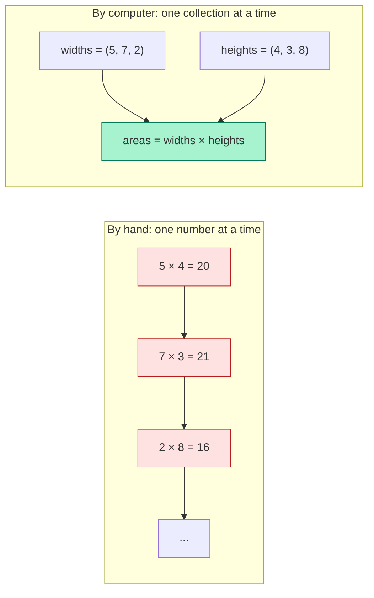
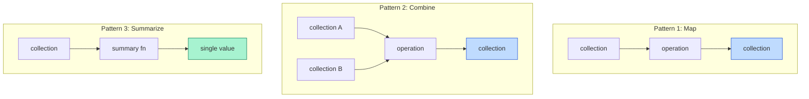

This is the most important page in the course.

If you skim everything else and only read one page carefully, make
it this one — because the mental shift it describes is the
difference between *using R well* and *fighting it forever*.

## A different way of thinking

When you do arithmetic by hand, you think one **number** at a
time. "What is 5 times 7? Thirty-five. Write that down. Next:
what is 8 times 9? Seventy-two. Write that down."

When you do arithmetic on a computer, you think one **collection**
at a time. "I have a column of widths and a column of heights — I
want a column of areas. Compute it."

That subtle shift — from *number at a time* to *collection at a
time* — is the entire essence of **computational thinking** for
data analysis.



Both approaches give the same numeric answer. But the
*computational* approach scales. Three rows? Three hundred?
Three million? The expression is the same.

## A first taste

Watch how this looks in R. We will compute the area of three
rectangles.

<CodeBlock
  adapter="r"
  files={[
    {
      filename: "main.r",
      starterCode: `# A collection of widths and a collection of heights
widths <- c(5, 7, 2)
heights <- c(4, 3, 8)

# Compute the area of each rectangle — in ONE expression
areas <- widths * heights

print(areas)
`,
    },
  ]}
/>

Three things happened here, and all three are worth pausing on:

1. We **named two collections** of numbers (`widths` and `heights`)
   instead of writing them out repeatedly.
2. We **applied an operation to entire collections at once**
   (`widths * heights`).
3. We **named the result** (`areas`) so we can use it again.

That is the basic loop of computational thinking for data
analysis: *name things, operate on whole collections, name the
result.* Every R analysis in this course is some elaboration of
that loop.

## Why this matters

To see why, imagine you suddenly had 1,000 rectangles instead of 3.

In the hand-arithmetic way of thinking, you would need to do
multiplications 1,000 times. With a spreadsheet, you could drag a
formula down 1,000 rows. With R, your code does not change at all —
just the input does:

<CodeBlock
  adapter="r"
  files={[
    {
      filename: "main.r",
      starterCode: `# 1,000 random widths and heights, all between 1 and 10
set.seed(42)
widths <- runif(1000, 1, 10)
heights <- runif(1000, 1, 10)

# Same expression as before
areas <- widths * heights

# Quick summary instead of printing 1,000 numbers
summary(areas)
`,
    },
  ]}
/>

The line `areas <- widths * heights` is **byte-for-byte identical**
to the one in the previous example. Three rectangles or three
thousand — the computer does the work either way. *The code
describes the operation, not the count.*

This is huge. It means the same code you write to explore a tiny
sample dataset will work on the full production dataset. It means
your mental model does not have to scale just because your data
does.

## "Computational thinking," in plainer words

The phrase **computational thinking** is sometimes made to sound
fancy. For our purposes it just means cultivating a few habits:

1. **Think in collections, not in individual values.** Whenever you
   feel the urge to write "for each row…", first ask: "is there a
   way to express this as one operation on the whole column?"
2. **Name things meaningfully.** A variable called `x` is a guess;
   a variable called `pediatric_visits_2024` is a sentence. Future
   you will thank present you.
3. **Build up from simple steps.** Big analyses are not written all
   at once. They are stacks of tiny steps, each one of which can be
   inspected and verified.
4. **Trust the computer for the tedious parts, but check the
   important parts.** Computers do not get tired or make
   transcription errors — but they will happily compute the wrong
   thing if you ask them to.
5. **Treat data as something to *interrogate*, not just *report on*.**
   A dataset is not the answer to a question; it is a thing you
   investigate to develop an answer.

These habits are not specific to R. Anyone working with data —
in Python, in SQL, in a spreadsheet, even with paper — benefits
from them. But R is *especially* well-suited to them, because the
language is shaped around the idea that collections are the basic
unit of work.

## Patterns we will see again and again

Three patterns underlie almost every R analysis we will write
later in this course. Recognizing them now will make all the
specific syntax easier to absorb.

### Pattern 1: Build a collection, operate on it

```r
heights_cm <- c(168, 172, 165, 180)
heights_m  <- heights_cm / 100
```

Notice: one operation, applied to every element.

### Pattern 2: Combine two collections elementwise

```r
height <- c(1.68, 1.72, 1.65, 1.80)
weight <- c(63,   70,   58,   85)
bmi    <- weight / height^2
```

Two collections in, one collection out.

### Pattern 3: Summarize a collection

```r
heights <- c(168, 172, 165, 180)
mean(heights)    # one number out of many
median(heights)
sd(heights)
```

This is the "many in, one out" direction — the basic gesture of
statistics.



Almost every analysis you will write is a stacked combination of
those three moves.

## A small worked example

Suppose we have monthly sales for a year and we want to ask: in
which months did sales beat the annual average?

<CodeBlock
  adapter="r"
  files={[
    {
      filename: "main.r",
      starterCode: `# 12 monthly sales numbers (in thousands of dollars)
months <- c(
  "Jan", "Feb", "Mar", "Apr", "May", "Jun",
  "Jul", "Aug", "Sep", "Oct", "Nov", "Dec"
)
sales <- c(
  120, 132, 101, 134, 90, 110,
  145, 160, 158, 142, 175, 200
)

# Step 1: summary (many in, one out)
avg_sales <- mean(sales)
cat("Annual average:", avg_sales, "\\n\\n")

# Step 2: combine elementwise (sales vs. average) — the result is a
#         logical vector, one TRUE/FALSE per month
above_avg <- sales > avg_sales

# Step 3: subset by a logical vector
good_months <- months[above_avg]
print(good_months)
`,
    },
  ]}
/>

That five-line analysis used all three patterns: a summary
(`mean`), an elementwise combine (`sales > avg_sales`), and a map
(`months[above_avg]`). The code reads almost like English: *take
the mean, mark months above it, pick those names.*

If next year you have 24 months of data, you change nothing except
the inputs.

## Why loops are usually unnecessary in R

People coming from languages like C, Java, or Python often expect
data analysis code to look like this:

```r
# Not idiomatic R
result <- numeric(length(sales))
for (i in seq_along(sales)) {
  result[i] <- sales[i] - mean(sales)
}
```

In R, you almost never have to write that. The same idea is one
line and is dramatically clearer:

```r
result <- sales - mean(sales)
```

R interprets `sales - mean(sales)` as "subtract the mean from each
element of sales," giving you a vector of deviations. This is
called **vectorization**, and we will dedicate an entire page to it
soon. For now, just absorb the cultural rule: **if you find
yourself writing a `for` loop, look hard for a vectorized
expression first.**

## Test your understanding

<MultipleChoice
  markdown={`Which statement best captures the **shift** from hand arithmetic to computational thinking?

- "Computers are faster, but the way you think about a problem stays exactly the same."
  > The shift to computation is not just about speed; it requires a fundamentally different mental model — thinking in collections rather than individual values.
- "Computers think in numbers; humans think in patterns."
  > This is a vague contrast that does not capture the actual shift described in the lesson, which is about operating on whole collections versus one value at a time.
- [o] "Hand arithmetic operates one number at a time; computational thinking operates on whole collections at a time."
  > This is the central idea. The size of the data stops being a bottleneck because each *line of code* applies to as much data as you give it.
- "Computational thinking means avoiding statistics."
  > Computational thinking and statistics are complementary, not mutually exclusive; the course explicitly combines both throughout.`}
/>

<MultipleChoice
  markdown={`Which of the following best describes what happens when you write \`widths * heights\` in R, where each is a vector of length 3?

- R multiplies the lengths together to get 9.
  > R does not multiply the *lengths* of the vectors; it multiplies their *elements* pairwise, returning a vector of the same length.
- [o] R multiplies the two vectors *elementwise* and returns a new vector of length 3.
  > This is vectorization in action: matching positions are multiplied, and you get back a vector of the same length.
- R picks the first element of each and multiplies those.
  > R operates on all matched pairs, not just the first elements; every position is multiplied, producing a full-length result vector.
- R raises an error because you can't multiply two vectors.
  > Multiplying two equal-length vectors element-by-element is exactly what the \`*\` operator is designed to do in R; no error occurs.`}
/>

<MultipleChoice
  markdown={`In R, why is writing a \`for\` loop over a column of data often considered non-idiomatic?

- Because R does not support loops.
  > R does support loops; it just rarely needs them for data analysis.
- Because loops always crash.
  > Loops in R are syntactically valid and do not crash; the reason to prefer vectorized expressions is clarity and conciseness, not stability.
- [o] Because most operations can be expressed more clearly and concisely with vectorized expressions on whole columns.
  > Vectorization is shorter, easier to read, often faster, and matches the way R was designed to be used.
- Because loops are illegal in statistical analysis.
  > Loops are legal everywhere in R, including in statistical analyses; the preference for vectorization is a matter of idiom and efficiency, not a rule.`}
/>

## A small challenge

Given a vector of temperatures in Fahrenheit, compute a vector of
the same length giving the temperature in Celsius. The formula is
`C = (F - 32) * 5 / 9`. **Do not use a loop** — write one
vectorized expression.

<ChallengeCard
  adapter="r"
  title="Convert Fahrenheit to Celsius (vectorized)"
  instructions={`Given the vector \`temps_f\` (already loaded), create a vector \`temps_c\` of the same length, where each element is the Celsius equivalent of the corresponding Fahrenheit value. Use a single vectorized expression — no loops, no \`sapply\`.`}
  files={[
    {
      filename: "main.r",
      initCode: `temps_f <- c(32, 50, 68, 86, 104, 212)`,
      starterCode: `temps_c <- NA # TODO: vectorized expression

print(round(temps_c, 2))
`,
      solutionCode: `temps_c <- (temps_f - 32) * 5 / 9

print(round(temps_c, 2))
`,
    },
  ]}
  tests={[
    {
      id: "len",
      name: "Same length as input",
      description: "One Celsius value per Fahrenheit input",
      code: `if (length(temps_c) != length(temps_f)) stop(sprintf("expected length %d, got %d", length(temps_f), length(temps_c)))`,
    },
    {
      id: "values",
      name: "Correct conversion",
      description: "Each element converted properly",
      code: `expected <- (temps_f - 32) * 5/9; if (!isTRUE(all.equal(temps_c, expected))) stop("conversion is incorrect")`,
    },
  ]}
/>

In the next page we will *finally* run our first R program from
scratch and get comfortable with the running surface of WebR.
