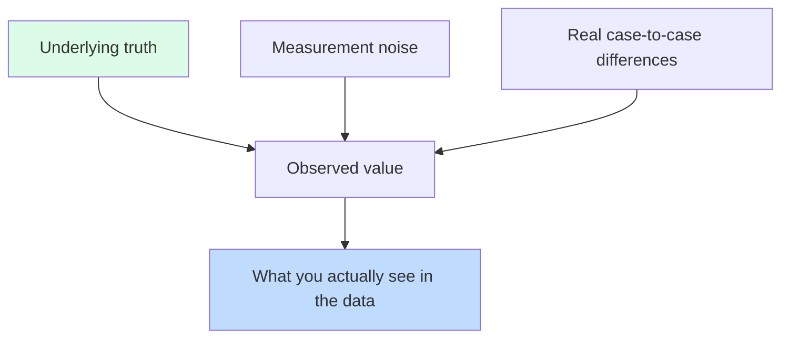

When you weigh yourself five times in a row, the scale doesn't
show the exact same number. When you survey 100 people about
their favorite color, a different 100 would give you different
percentages. When you run an A/B test and version A gets 8.2%
clicks vs. version B's 8.4% — is that a win, or just noise?

The job of statistics is to answer that family of questions.
This page is the conceptual on-ramp: what variability *is*, why
it's everywhere, and the mental moves for thinking clearly about
it.

## Two kinds of variability

Variability comes from two main sources:

1. **Measurement noise.** Your scale isn't perfect. The
   thermometer rounds. The respondent misclicks. Every time you
   measure, the result wiggles around the true value.
2. **Real differences between cases.** Different people have
   different heights. Different days have different temperatures.
   Different customers click at different rates.

Both matter. Both contribute to what you see in your data. The
analyst's job is to *attribute* observed variation to these
sources correctly.

## A live experiment

Let's *simulate* a coin. We know the truth: probability of heads
is exactly 0.5. Now flip it 10 times and count heads:

<CodeBlock
  adapter="r"
  initialCode={`set.seed(1)
flips <- sample(c("H","T"), size = 10, replace = TRUE)
print(flips)
sum(flips == "H")
mean(flips == "H")
`}
/>

You probably did *not* get exactly 5. With only 10 flips,
anywhere from 3 to 7 is unremarkable. With 100, you'd get closer
to 50. With 10,000, almost exactly 5,000.

<CodeBlock
  adapter="r"
  initialCode={`set.seed(1)
for (n in c(10, 100, 1000, 10000, 100000)) {
  fraction_heads <- mean(sample(c("H","T"), size = n, replace = TRUE) == "H")
  cat(sprintf("n = %6d -> %.4f heads\\n", n, fraction_heads))
}
`}
/>

Two lessons:

- Even when you *know* the truth, observed proportions wander.
- The wander *shrinks* as the sample size grows. This is the
  **law of large numbers** — averages converge to the true
  underlying rate as data accumulates.

## A picture of variability: the sampling distribution

Imagine repeating "flip 10 coins and count heads" *many* times.
You'd get a distribution of counts. We can simulate it:

<CodeBlock
  adapter="r"
  initialCode={`set.seed(42)

# Repeat "10 flips" 10,000 times
counts <- replicate(10000, sum(sample(c("H","T"), 10, replace = TRUE) == "H"))

hist(counts,
     breaks = -0.5:10.5,
     main = "Distribution of heads count in 10 flips (10,000 reps)",
     xlab = "Heads",
     col  = "steelblue")
`}
/>

The histogram peaks at 5 (the most common count) and tapers off
on both sides. Counts of 0 or 10 happen, but rarely. This is the
shape of "what could have happened" — the **sampling
distribution** of our statistic.

When we later say something like "this observed difference is
extreme," what we mean precisely is: *it's far out in the tail of
the sampling distribution we'd expect if there were no real
effect.*

## Signal vs. noise: when does a difference matter?

Suppose two web page versions A and B are shown to visitors. A
gets 82 clicks out of 1000 (8.2%); B gets 95 out of 1000 (9.5%).
Is B really better?

Compute it:

<CodeBlock
  adapter="r"
  initialCode={`set.seed(7)
nA <- 1000; clicksA <- 82
nB <- 1000; clicksB <- 95

pA <- clicksA / nA
pB <- clicksB / nB

cat("A click rate:", pA, "\\n")
cat("B click rate:", pB, "\\n")
cat("Difference:",  pB - pA, "\\n")
`}
/>

The observed difference is 1.3 percentage points. Is that
*plausibly* just random luck of who happened to visit each page,
or is it a real difference between the versions?

Let's simulate the "no real difference" world. We pool both
groups, assume the true click rate is the same (say, 8.85%), and
simulate "what would A − B look like in many parallel universes
where there's no real effect":

<CodeBlock
  adapter="r"
  initialCode={`set.seed(7)
p_pool <- (82 + 95) / (1000 + 1000)   # pooled rate ~ 0.0885

# 10,000 simulated experiments under "no effect"
diffs <- replicate(10000, {
  simA <- rbinom(1, 1000, p_pool) / 1000
  simB <- rbinom(1, 1000, p_pool) / 1000
  simB - simA
})

# How often does a no-effect world produce a gap as big as 0.013?
mean(abs(diffs) >= 0.013)

hist(diffs, breaks = 40, col = "steelblue",
     main  = "Simulated B - A differences under 'no effect'",
     xlab  = "Difference in click rate")
abline(v = c(-0.013, 0.013), col = "red", lwd = 2)
`}
/>

If even a "no real difference" world produces gaps this big or
bigger fairly often, we should not be surprised by what we saw —
the difference is well within plausible noise. If it almost
never produces such gaps, the difference is meaningful.

That fraction (`mean(abs(diffs) >= 0.013)`) is the conceptual
core of a *p-value*. We won't dwell on the formal hypothesis
testing machinery in this course, but the *intuition* —
"compare what you saw to what noise could produce" — is the
single most important idea in statistics.

## "More data" beats "fancier methods"

Two practical consequences of variability:

1. **Small samples wiggle a lot.** Be very cautious interpreting
   a survey of 30 people, a week of metrics, a single user
   study. Real-looking patterns can appear in noise.
2. **Big samples have small wiggles.** With enough data, even
   trivial differences become reliably detectable. (Which means:
   "statistically significant" doesn't automatically mean
   "matters in practice." With 10 million users, a 0.001%
   difference can be "significant" without being important.)

A useful pair of questions to ask of any reported result:

- *Practically*: is this difference big enough to act on?
- *Statistically*: is this difference larger than the noise we'd
  expect?

Both must be yes for a finding to be both real and worth
caring about.

## Variability and the mean

Returning to one of our earliest tools: the **mean ± standard
error** is the everyday way of communicating uncertainty about a
mean estimate. (The standard error is roughly `sd / sqrt(n)`.)

<CodeBlock
  adapter="r"
  initialCode={`set.seed(1)
sample10  <- rnorm(10,  mean = 100, sd = 15)
sample100 <- rnorm(100, mean = 100, sd = 15)

se10  <- sd(sample10)  / sqrt(length(sample10))
se100 <- sd(sample100) / sqrt(length(sample100))

cat(sprintf("n=10:   mean %.2f, SE %.2f\\n",  mean(sample10),  se10))
cat(sprintf("n=100:  mean %.2f, SE %.2f\\n",  mean(sample100), se100))
`}
/>

Note how the standard error shrinks roughly by 1/√10 ≈ 3× when
you 10× the sample. To halve uncertainty, you need 4× the data.
To shrink it by 10×, you need 100× the data. Statistics is
expensive!

## Test your understanding

<MultipleChoice
  markdown={`If you flip a fair coin 10 times, you should expect:

- Exactly 5 heads every time.
- [o] Around 5 heads on average, but individual experiments vary considerably — anywhere from 3 to 7 is unremarkable.
  > Even when the true rate is exactly 0.5, small samples wiggle. That's variability.
- Always between 4 and 6 heads.
- A different number every time, drawn uniformly from 0–10.`}
/>

<MultipleChoice
  markdown={`The "law of large numbers" tells us that:

- Larger numbers are more accurate.
- [o] As your sample grows, the observed average converges to the true underlying value — variability of the mean shrinks.
  > That's why a 10,000-flip coin is much closer to 50/50 than a 10-flip one.
- The mean is always the right statistic.
- The mean grows with sample size.`}
/>

<MultipleChoice
  markdown={`A web test shows version B 1.3 percentage points better than version A. Before declaring victory, you should:

- Roll it out immediately.
- [o] Ask whether a "no real difference" world could plausibly produce a gap this big by chance — i.e., compare the observed effect to the noise floor for samples this size.
  > That's the central question of statistical inference, and the intuition behind concepts like the p-value and confidence interval.
- Run the test for one more day, then declare victory.
- Average the two rates.`}
/>

## Mini challenge: simulate variability shrinking

Write a script that, for each `n` in `c(10, 100, 1000, 10000)`,
draws `n` values from a normal distribution with mean 50, sd 10,
and stores the *sample mean* in a numeric vector `means`. (So
`means` should have length 4.) Then print it.

<ChallengeCard
  adapter="r"
  title="Sample means at different sizes"
  instructions={`Build a length-4 numeric vector \`means\` containing the sample mean of \`rnorm(n, mean = 50, sd = 10)\` for n = 10, 100, 1000, and 10000 (in that order). Use \`set.seed(42)\` once at the start so the results are reproducible.`}
  initialCode={`set.seed(42)

ns    <- c(10, 100, 1000, 10000)
means <- NULL   # length-4 vector of sample means

print(means)
`}
  solutionCode={`set.seed(42)
ns    <- c(10, 100, 1000, 10000)
means <- sapply(ns, function(n) mean(rnorm(n, mean = 50, sd = 10)))
print(means)
`}
  tests={[
    {
      id: "len",
      name: "Length 4",
      code: `if (length(means) != 4) stop(sprintf("expected length 4, got %s", length(means)))`,
    },
    {
      id: "close",
      name: "All within ±5 of 50",
      code: `if (any(abs(means - 50) > 5)) stop("each sample mean should be close to 50")`,
    },
    {
      id: "shrink",
      name: "Bigger n is closer to 50 on average",
      code: `if (abs(means[4] - 50) > abs(means[1] - 50)) stop("the n=10000 mean should normally be closer to 50 than n=10 — re-check your code")`,
    },
  ]}
/>

The next page goes deeper on one specific consequence of all
this: the idea of **sampling** — how we make inferences about a
whole population from a single sample.
