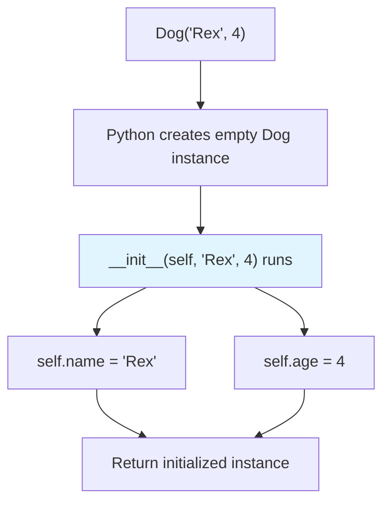
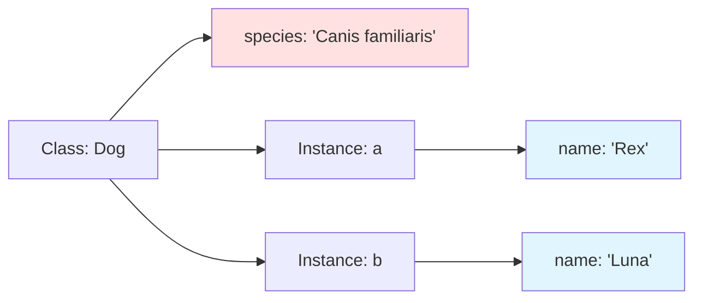

A **class** bundles data and behavior. Every value in Python is an instance of some class — `42` is an `int`, `"hello"` is a `str`, `[1, 2, 3]` is a `list`. Classes let you define your own types to model the problem you're solving.

## Why classes matter: the real world

Classes are how you model **entities** in your domain:

- **Web frameworks** — Django models, Flask views, FastAPI request/response objects
- **Data pipelines** — Pandas DataFrame methods, SQLAlchemy table definitions
- **Games** — Player, Enemy, Item, Inventory classes
- **APIs** — User, Order, Payment, Invoice objects
- **Configuration** — Settings classes, feature flags, environment wrappers

Every major Python library uses classes to organize behavior and state. Understanding classes is essential for reading and writing idiomatic Python.

<Callout type="info" title="Etymology: why 'class'?">
The word "class" comes from **classification** — the practice of grouping things by shared characteristics. Linnaeus used classes in biological taxonomy (Kingdom, Phylum, **Class**, Order...). In programming, a class is a template for creating objects that share structure and behavior.
</Callout>

## A minimal class

<CodeBlock
  adapter="python"
  initialCode={`class Dog:
    """A very simple dog."""
    pass

d = Dog()
print(d)
print(type(d))
print(isinstance(d, Dog))
`}
/>

`class Dog:` defines a new type. `Dog()` creates an **instance** of that type. The class body can be empty (`pass`), but usually you add an `__init__` method.

## The `__init__` method

`__init__` is the **initializer** (not "constructor" — the object already exists when `__init__` runs). It sets up a new instance.

<CodeBlock
  adapter="python"
  initialCode={`class Dog:
    def __init__(self, name, age):
        self.name = name
        self.age = age

d = Dog("Rex", 4)
print(d.name)
print(d.age)
`}
/>

When you call `Dog("Rex", 4)`, Python:

1. Creates a new, empty `Dog` instance.
2. Calls `__init__(d, "Rex", 4)` to initialize it.
3. Returns the initialized instance.

<Callout type="info" title="What is 'self'?">
`self` is just a **convention** — the name is not special. The first parameter of an instance method always receives the instance, and by convention we name it `self`. You could call it `this` or `me` or `obj`, but everyone uses `self`, so you should too.
</Callout>

## Instance attributes vs class attributes

An **instance attribute** belongs to a single object. A **class attribute** is shared by all instances.

<CodeBlock
  adapter="python"
  initialCode={`class Dog:
    species = "Canis familiaris"   # class attribute

    def __init__(self, name):
        self.name = name           # instance attribute

a = Dog("Rex")
b = Dog("Luna")
print(a.species, b.species)        # both see the same class attribute

Dog.species = "Canis lupus familiaris"
print(a.species, b.species)        # change is reflected in all instances
`}
/>

<Callout type="warn" title="Mutable class attributes are a gotcha">
If a class attribute is a **mutable** object (list, dict, set), all instances share that single object. Modifying it in one instance affects all others. This is almost never what you want.

\`\`\`python
class Bad:
    items = []  # shared by all instances!

a = Bad()
b = Bad()
a.items.append(1)
print(b.items)  # [1] — oops!
\`\`\`

**Always** initialize mutable per-instance data in \`__init__\`.
</Callout>

## Methods

A **method** is a function defined inside a class. The first parameter is always the instance (`self`), and Python passes it automatically when you call `instance.method()`.

<CodeBlock
  adapter="python"
  initialCode={`class Dog:
    def __init__(self, name):
        self.name = name

    def bark(self):
        return f"{self.name} says woof!"

d = Dog("Rex")
print(d.bark())
`}
/>

When you write `d.bark()`, Python translates it to `Dog.bark(d)` — the instance is passed as the first argument.

<CodeBlock
  adapter="python"
  initialCode={`class Counter:
    def __init__(self, start=0):
        self.value = start

    def increment(self, step=1):
        self.value += step
        return self.value

c = Counter()
c.increment()
c.increment()
c.increment(5)
print(c.value)
`}
/>

## `@classmethod` and `@staticmethod`

Sometimes you want a method that operates on the **class** itself, or a utility function that logically belongs to the class but doesn't need access to instances.

<CodeBlock
  adapter="python"
  initialCode={`class Temperature:
    def __init__(self, celsius):
        self.celsius = celsius

    @classmethod
    def from_fahrenheit(cls, f):
        """Alternative constructor."""
        return cls((f - 32) * 5 / 9)

    @staticmethod
    def is_freezing(celsius):
        """Utility function."""
        return celsius <= 0

t = Temperature.from_fahrenheit(32)
print(t.celsius)
print(Temperature.is_freezing(-1))
`}
/>

- `@classmethod` receives the **class** as the first argument (`cls`). Useful for **alternative constructors**.
- `@staticmethod` receives **nothing automatic**. It's just a function that lives in the class namespace for organizational reasons.

<Callout type="tip" title="When to use @classmethod">
Use `@classmethod` for **alternative constructors** — methods that create instances in different ways. Examples: `dict.fromkeys(...)`, `datetime.fromtimestamp(...)`, `json.loads(...)` (conceptually). The pattern is `@classmethod` returns `cls(...)`.
</Callout>

## Properties: computed attributes

Use `@property` to define a method that looks like an attribute.

<CodeBlock
  adapter="python"
  initialCode={`class Circle:
    def __init__(self, radius):
        self.radius = radius

    @property
    def area(self):
        return 3.14159 * self.radius ** 2

    @property
    def diameter(self):
        return self.radius * 2

c = Circle(5)
print(c.area)       # looks like an attribute, runs a method
print(c.diameter)
`}
/>

Properties are useful when you want to compute a value on-the-fly or add logic (validation, logging) when reading/writing an attribute.

## Dunder methods: special behavior

Methods with double underscores ("dunder") define how instances interact with Python operators and built-in functions.

| Dunder | Purpose | Triggered by |
| --- | --- | --- |
| `__init__` | Initialize instance | `MyClass(...)` |
| `__repr__` | Unambiguous string | `repr(obj)`, REPL display |
| `__str__` | User-friendly string | `str(obj)`, `print(obj)` |
| `__eq__`, `__lt__`, ... | Comparisons | `a == b`, `a < b` |
| `__len__` | Length | `len(obj)` |
| `__iter__` | Iteration | `for x in obj` |
| `__getitem__` | Indexing | `obj[key]` |
| `__call__` | Make instance callable | `obj()` |

<CodeBlock
  adapter="python"
  initialCode={`class Money:
    def __init__(self, amount, currency="USD"):
        self.amount = amount
        self.currency = currency

    def __repr__(self):
        return f"Money({self.amount!r}, {self.currency!r})"

    def __str__(self):
        return f"{self.amount:.2f} {self.currency}"

    def __eq__(self, other):
        return (isinstance(other, Money)
                and self.amount == other.amount
                and self.currency == other.currency)

    def __add__(self, other):
        if self.currency != other.currency:
            raise ValueError("currency mismatch")
        return Money(self.amount + other.amount, self.currency)

a = Money(10)
b = Money(2.5)
print(a)            # uses __str__
print(repr(a))      # uses __repr__
print(a == Money(10))
print(a + b)
`}
/>

<Callout type="tip" title="__repr__ vs __str__">
- `__repr__` should be **unambiguous** and ideally show how to reconstruct the object. Target audience: **developers**.
- `__str__` should be **readable** and friendly. Target audience: **end users**.

If you only define one, define `__repr__`. `str(obj)` falls back to `repr(obj)` if `__str__` is missing.
</Callout>

<Callout type="warn" title="Defining __eq__ without __hash__">
If you define `__eq__`, Python sets `__hash__` to `None`, making instances **unhashable** (can't be dict keys or set elements). If you want hashable instances, define both `__eq__` and `__hash__`, or use `@dataclass(frozen=True)`.
</Callout>

## `@dataclass`: the easy mode

Writing `__init__`, `__repr__`, and `__eq__` for every data-holding class is tedious. `@dataclass` generates them from type-annotated attributes.

<CodeBlock
  adapter="python"
  initialCode={`from dataclasses import dataclass

@dataclass
class Point:
    x: float
    y: float

p = Point(3, 4)
q = Point(3, 4)
print(p)                # auto __repr__
print(p == q)           # auto __eq__
print(p.x, p.y)
`}
/>

`@dataclass` generates:

- `__init__` that takes `x` and `y` as arguments
- `__repr__` that shows `Point(x=3, y=4)`
- `__eq__` that compares all fields

<CodeBlock
  adapter="python"
  initialCode={`from dataclasses import dataclass

@dataclass(frozen=True)
class Point:
    x: float
    y: float

p = Point(3, 4)
# p.x = 5  # would raise FrozenInstanceError

# frozen=True makes instances hashable
points = {Point(0, 0), Point(1, 1), Point(0, 0)}
print(len(points))  # 2 (duplicates removed)
`}
/>

<Callout type="tip" title="Use @dataclass for simple records">
If your class is mostly "a bundle of named fields", use `@dataclass`. It's less boilerplate and more readable than writing `__init__` by hand. For complex behavior, a regular class is fine.
</Callout>

## Multi-file challenges

<ChallengeCard
  adapter="python"
  title="Bank account with deposit and withdraw"
  instructions={`Open \`account.py\` and implement the \`BankAccount\` class with:

- \`__init__(self, owner, balance=0)\` — Store owner and balance.
- \`deposit(amount)\` — Add to balance, return new balance. Raise \`ValueError\` if amount is negative.
- \`withdraw(amount)\` — Subtract from balance, return new balance. Raise \`ValueError\` if amount is negative or exceeds balance.

\`main.py\` uses your class. Do not edit \`main.py\`.`}
  entryFilename="main.py"
  files={[
    {
      filename: "main.py",
      initialContent: `from account import BankAccount

acc = BankAccount("Alice", 100)
print(f"Initial: {acc.balance}")

acc.deposit(50)
print(f"After deposit: {acc.balance}")

acc.withdraw(30)
print(f"After withdraw: {acc.balance}")
`,
    },
    {
      filename: "account.py",
      initialContent: `class BankAccount:
    def __init__(self, owner, balance=0):
        # your code here
        pass

    def deposit(self, amount):
        # your code here
        return 0

    def withdraw(self, amount):
        # your code here
        return 0
`,
      solutionContent: `class BankAccount:
    def __init__(self, owner, balance=0):
        self.owner = owner
        self.balance = balance

    def deposit(self, amount):
        if amount < 0:
            raise ValueError("amount must be non-negative")
        self.balance += amount
        return self.balance

    def withdraw(self, amount):
        if amount < 0:
            raise ValueError("amount must be non-negative")
        if amount > self.balance:
            raise ValueError("insufficient funds")
        self.balance -= amount
        return self.balance
`,
    },
  ]}
  tests={[
    {
      id: "init",
      name: "Constructor stores owner and balance",
      code: `from account import BankAccount
acc = BankAccount("Alice", 100)
assert acc.owner == "Alice"
assert acc.balance == 100`,
    },
    {
      id: "deposit",
      name: "Deposit increases balance",
      code: `from account import BankAccount
acc = BankAccount("Alice")
assert acc.deposit(50) == 50
assert acc.balance == 50`,
    },
    {
      id: "withdraw",
      name: "Withdraw decreases balance",
      code: `from account import BankAccount
acc = BankAccount("Alice", 100)
assert acc.withdraw(40) == 60`,
    },
    {
      id: "errors",
      name: "Raises ValueError for invalid amounts",
      code: `from account import BankAccount
acc = BankAccount("Alice", 50)
try:
    acc.deposit(-1)
    raise AssertionError("Expected ValueError")
except ValueError:
    pass
try:
    acc.withdraw(100)
    raise AssertionError("Expected ValueError")
except ValueError:
    pass`,
    },
  ]}
/>

<ChallengeCard
  adapter="python"
  title="Shopping cart with products"
  instructions={`You'll implement two classes across two files:

**product.py**: Define \`Product\` with \`__init__(self, name, price)\` and a \`__repr__\`.

**cart.py**: Define \`ShoppingCart\` with:
- \`__init__(self)\` — Initialize an empty list of items.
- \`add(product)\` — Append a product.
- \`total()\` — Return sum of all product prices.

\`main.py\` uses both. Do not edit \`main.py\`.`}
  entryFilename="main.py"
  files={[
    {
      filename: "main.py",
      initialContent: `from product import Product
from cart import ShoppingCart

cart = ShoppingCart()
cart.add(Product("Laptop", 1200))
cart.add(Product("Mouse", 25))
cart.add(Product("Keyboard", 75))

print(f"Total: \${cart.total()}")
`,
    },
    {
      filename: "product.py",
      initialContent: `class Product:
    def __init__(self, name, price):
        # your code here
        pass

    def __repr__(self):
        # your code here
        return ""
`,
      solutionContent: `class Product:
    def __init__(self, name, price):
        self.name = name
        self.price = price

    def __repr__(self):
        return f"Product({self.name!r}, {self.price})"
`,
    },
    {
      filename: "cart.py",
      initialContent: `class ShoppingCart:
    def __init__(self):
        # your code here
        pass

    def add(self, product):
        # your code here
        pass

    def total(self):
        # your code here
        return 0
`,
      solutionContent: `class ShoppingCart:
    def __init__(self):
        self.items = []

    def add(self, product):
        self.items.append(product)

    def total(self):
        return sum(p.price for p in self.items)
`,
    },
  ]}
  tests={[
    {
      id: "product",
      name: "Product stores name and price",
      code: `from product import Product
p = Product("Laptop", 1200)
assert p.name == "Laptop"
assert p.price == 1200`,
    },
    {
      id: "cart_empty",
      name: "Empty cart has total 0",
      code: `from cart import ShoppingCart
cart = ShoppingCart()
assert cart.total() == 0`,
    },
    {
      id: "cart_add",
      name: "Adding products increases total",
      code: `from product import Product
from cart import ShoppingCart
cart = ShoppingCart()
cart.add(Product("A", 10))
cart.add(Product("B", 20))
assert cart.total() == 30`,
    },
  ]}
/>

<ChallengeCard
  adapter="python"
  title="Dataclass Point"
  instructions={`Open \`geometry.py\` and define a \`@dataclass\` named \`Point\` with two float fields: \`x\` and \`y\`.

\`main.py\` uses your class. Do not edit \`main.py\`.`}
  entryFilename="main.py"
  files={[
    {
      filename: "main.py",
      initialContent: `from geometry import Point

p = Point(3.0, 4.0)
q = Point(3.0, 4.0)

print(p)
print("Equal?", p == q)
`,
    },
    {
      filename: "geometry.py",
      initialContent: `from dataclasses import dataclass

# Define Point here
`,
      solutionContent: `from dataclasses import dataclass

@dataclass
class Point:
    x: float
    y: float
`,
    },
  ]}
  tests={[
    {
      id: "fields",
      name: "Point has x and y",
      code: `from geometry import Point
p = Point(3.0, 4.0)
assert p.x == 3.0
assert p.y == 4.0`,
    },
    {
      id: "equality",
      name: "Dataclass auto-generates __eq__",
      code: `from geometry import Point
assert Point(1.0, 2.0) == Point(1.0, 2.0)
assert Point(1.0, 2.0) != Point(2.0, 1.0)`,
    },
    {
      id: "repr",
      name: "Dataclass auto-generates __repr__",
      code: `from geometry import Point
p = Point(3.0, 4.0)
assert "Point" in repr(p)
assert "3.0" in repr(p)`,
    },
  ]}
/>

<ChallengeCard
  adapter="python"
  title="A simple counter class"
  instructions={`Define a class \`Counter\` with:

- An \`__init__(self, start=0)\` constructor that stores the starting value in \`self.value\`.
- A method \`increment(step=1)\` that adds \`step\` to \`self.value\` and returns the new value.
- A method \`reset()\` that sets \`self.value\` back to 0.`}
  initialCode={`class Counter:
    pass
`}
  solutionCode={`class Counter:
    def __init__(self, start=0):
        self.value = start

    def increment(self, step=1):
        self.value += step
        return self.value

    def reset(self):
        self.value = 0
`}
  tests={[
    {
      id: "init",
      name: "Constructor sets value",
      code: `c = Counter(10)
assert c.value == 10`,
    },
    {
      id: "increment",
      name: "Increment increases value",
      code: `c = Counter()
c.increment()
c.increment()
assert c.value == 2`,
    },
    {
      id: "increment_step",
      name: "Increment with custom step",
      code: `c = Counter()
c.increment(5)
assert c.value == 5`,
    },
    {
      id: "reset",
      name: "Reset sets value to 0",
      code: `c = Counter(10)
c.reset()
assert c.value == 0`,
    },
  ]}
/>

## Multiple choice questions

<MultipleChoice
  markdown={`What is the role of \`self\` in instance methods?

- It is a keyword that Python requires in method definitions.
  > No, \`self\` is just a convention; the name is not special.
- [o] It is the conventional name for the first parameter, which receives the instance.
  > **Correct.** Python passes the instance automatically; we name it \`self\` by convention.
- It refers to the class, not the instance.
  > No, \`self\` is the instance. The class is \`cls\` in \`@classmethod\`.
- It is automatically defined; you do not need to include it in method signatures.
  > No, you must explicitly list it as the first parameter.`}
/>

<MultipleChoice
  markdown={`What does \`@dataclass\` generate for you?

- Only \`__init__\`.
  > No, it also generates \`__repr__\` and \`__eq__\` by default.
- [o] \`__init__\`, \`__repr__\`, and \`__eq__\` (and optionally \`__hash__\` if \`frozen=True\`).
  > **Correct.** Dataclasses reduce boilerplate for data-holding classes.
- Runtime type validation for all fields.
  > No, type hints are not enforced at runtime by \`@dataclass\`. Use Pydantic for that.
- Private attributes for all fields.
  > No, fields remain public. Python has no true private attributes.`}
/>

<MultipleChoice
  markdown={`What is the difference between \`__repr__\` and \`__str__\`?

- They are synonyms; Python 3 renamed \`__str__\` to \`__repr__\`.
  > No, both exist and serve different purposes.
- [o] \`__repr__\` is unambiguous for developers; \`__str__\` is user-friendly.
  > **Correct.** \`__repr__\` should ideally let you reconstruct the object; \`__str__\` is what \`print()\` uses.
- \`__repr__\` is for built-in types; \`__str__\` is for user classes.
  > No, both can be defined on any class.
- \`__str__\` is automatically generated; \`__repr__\` must be written by hand.
  > No, neither is auto-generated unless you use \`@dataclass\`.`}
/>

<MultipleChoice
  markdown={`When should you use \`@classmethod\` instead of a regular method?

- When the method does not need access to \`self\`.
  > That is \`@staticmethod\`. \`@classmethod\` receives \`cls\`.
- [o] When the method needs to access the class itself, often for alternative constructors.
  > **Correct.** \`@classmethod\` is commonly used for factory methods that return \`cls(...)\`.
- When the method modifies a class attribute.
  > You can do that with \`@classmethod\`, but it is not the primary reason to use it.
- When the method is private.
  > Method privacy (by convention, leading \`_\`) is orthogonal to \`@classmethod\`.`}
/>

<MultipleChoice
  markdown={`Why is defining \`__eq__\` without \`__hash__\` a problem?

- Python will raise a \`SyntaxError\`.
  > No, it is legal; Python just sets \`__hash__ = None\`.
- [o] Instances become unhashable and cannot be used as dict keys or in sets.
  > **Correct.** If \`__eq__\` is defined but \`__hash__\` is not, \`__hash__\` is set to \`None\`, making instances unhashable.
- \`__eq__\` comparisons will always return \`False\`.
  > No, \`__eq__\` works fine; the issue is hashing.
- The class becomes abstract and cannot be instantiated.
  > No, this has nothing to do with abstract base classes.`}
/>

<MultipleChoice
  markdown={`What happens if a class attribute is a mutable object (e.g., a list) and you modify it in one instance?

- Each instance gets its own copy of the list.
  > No, class attributes are shared by all instances.
- [o] The change is visible in all instances because they share the same list object.
  > **Correct.** Mutable class attributes are a common gotcha. Always initialize mutable per-instance data in \`__init__\`.
- Python raises a \`TypeError\`.
  > No, it is legal; just usually not what you want.
- The class attribute becomes an instance attribute.
  > No, unless you reassign it (e.g., \`self.items = []\`), it remains a class attribute.`}
/>

Inheritance lets one class build on another. That is next.
