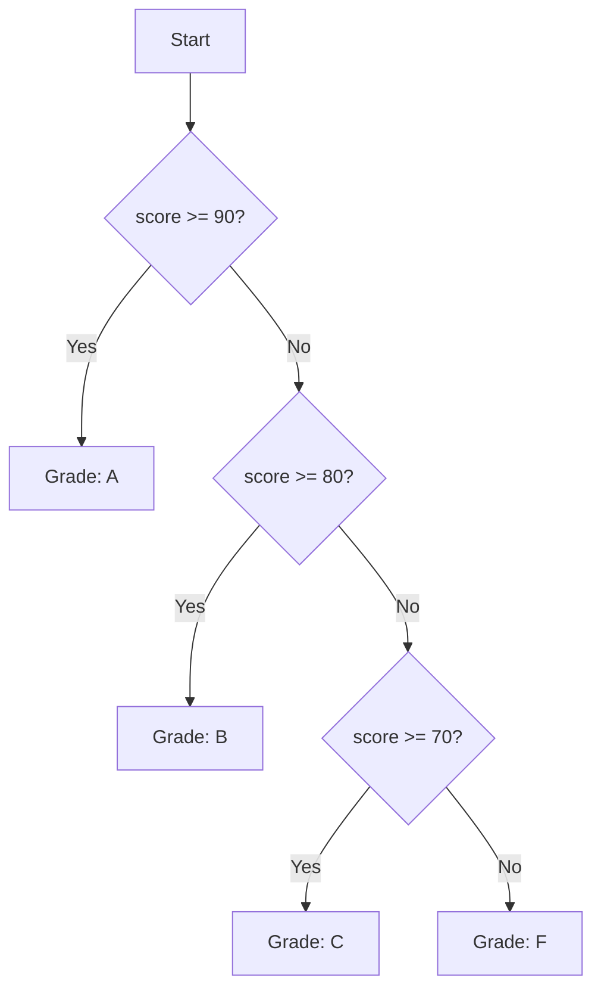

Every decision in software is a conditional. From "should I cache this result?" to "is the user authorized?" to "which HTTP status code do I return?", control flow is the engine that routes execution through different paths. Python's control flow is straightforward: `if`, `elif`, `else`, and (since Python 3.10) a `match` statement for pattern matching.

Every snippet on this page runs in your browser — no setup required.

## Real-world impact

Conditionals are not just syntax — they are the logical heart of every program. A web server routes requests with `if method == "GET"`. A data pipeline filters invalid rows with `if is_valid(row)`. A game checks `if player.health <= 0`. You write conditionals hundreds of times a day. Mastering them means writing clear, correct, maintainable logic.



## Just `if`

The simplest form: execute a block only if a condition is true.

<CodeBlock
  adapter="python"
  starterCode={`x = 10
if x > 0:
    print("positive")
`}
/>

<CodeBlock
  adapter="python"
  starterCode={`password = "secret"
if len(password) < 8:
    print("too short")
`}
/>

If the condition is false, the block is skipped entirely.

<CodeBlock
  adapter="python"
  starterCode={`x = -5
if x > 0:
    print("positive")
print("done")
`}
/>

## `if` + `elif`

When you have multiple mutually exclusive conditions, use `elif` (short for "else if").

<CodeBlock
  adapter="python"
  starterCode={`score = 85
if score >= 90:
    print("A")
elif score >= 80:
    print("B")
`}
/>

Python evaluates the conditions **in order** and stops at the first true one.

<CodeBlock
  adapter="python"
  starterCode={`x = 7
if x > 0:
    print("a")
elif x > 5:
    print("b")
print("done")
`}
/>

Even though `x > 5` is also true, only `"a"` prints because the first branch matches.

## Full `if` / `elif` / `else`

Add an `else` block to catch all remaining cases.

<CodeBlock
  adapter="python"
  starterCode={`score = 55
if score >= 90:
    print("A")
elif score >= 80:
    print("B")
elif score >= 70:
    print("C")
elif score >= 60:
    print("D")
else:
    print("F")
`}
/>

There can be any number of `elif` branches; `else` is optional. Each branch needs its own indented body (no braces).

<CodeBlock
  adapter="python"
  starterCode={`def classify(score):
    if score >= 90:
        return "A"
    elif score >= 80:
        return "B"
    elif score >= 70:
        return "C"
    elif score >= 60:
        return "D"
    else:
        return "F"


for s in [95, 82, 73, 60, 50]:
    print(s, "->", classify(s))
`}
/>

## Truthiness in conditions

The `if` condition is evaluated for truthiness, not strict equality with `True`. See the *Booleans* page for the full rules. In short: `0`, `""`, `[]`, `{}`, `None`, and `False` are falsy; everything else is truthy.

<CodeBlock
  adapter="python"
  starterCode={`items = []
if items:
    print("non-empty")
else:
    print("empty")
`}
/>

<CodeBlock
  adapter="python"
  starterCode={`result = None
if result is None:
    print("no result yet")
`}
/>

<Callout type="info">
Use `if items:` to check for non-empty sequences. Use `if x is None:` for explicit `None` checks. Use `if x:` for general "does this have a meaningful value?" checks. All three are idiomatic.
</Callout>

## Conditional expression (ternary)

When you need a **value**, not a statement, use the inline form:

```text
<value_if_true> if <condition> else <value_if_false>
```

<CodeBlock
  adapter="python"
  starterCode={`age = 17
status = "adult" if age >= 18 else "minor"
print(status)
`}
/>

<CodeBlock
  adapter="python"
  starterCode={`score = 85
print(f"Grade: {'pass' if score >= 60 else 'fail'}")
`}
/>

This reads naturally: "pick X if condition, else pick Y." It combines nicely with f-strings and comprehensions.

<Callout type="warn">
The conditional expression requires **both** the `if` and `else` parts. You cannot write `x if condition` without an `else`. If you only need the `if`, write a full `if` statement instead.
</Callout>

## Chained comparisons

Python lets you chain comparison operators, which usually reads more naturally than `a > 0 and a < 10`.

<CodeBlock
  adapter="python"
  starterCode={`x = 5
if 0 < x < 10:
    print("in range")
`}
/>

<CodeBlock
  adapter="python"
  starterCode={`age = 25
if 18 <= age <= 65:
    print("working age")
`}
/>

This is **not** syntactic sugar for separate comparisons; Python evaluates each term only once, which matters if the term has side effects.

<CodeBlock
  adapter="python"
  starterCode={`a, b, c = 1, 2, 3
if a < b < c:
    print("ascending")
`}
/>

## `match` statement (Python 3.10+)

`match` is **structural pattern matching**, not just a `switch`. It matches the *shape* of data and can bind values from inside it.

<CodeBlock
  adapter="python"
  starterCode={`def describe(point):
    match point:
        case (0, 0):
            return "origin"
        case (0, y):
            return f"on the y-axis at y={y}"
        case (x, 0):
            return f"on the x-axis at x={x}"
        case (x, y) if x == y:
            return f"on the diagonal at ({x}, {y})"
        case (x, y):
            return f"at ({x}, {y})"
        case _:
            return "not a point"


for p in [(0, 0), (0, 5), (3, 0), (4, 4), (2, 7), "nope"]:
    print(p, "->", describe(p))
`}
/>

Patterns can also match class instances, dict shapes, and sequences of varying lengths. See [PEP 634](https://peps.python.org/pep-0634/) for the full reference.

<CodeBlock
  adapter="python"
  starterCode={`def http_status(code):
    match code:
        case 200:
            return "OK"
        case 404:
            return "Not Found"
        case 500 | 502 | 503:
            return "Server Error"
        case _:
            return "Unknown"


for c in [200, 404, 500, 999]:
    print(c, "->", http_status(c))
`}
/>

<Callout type="info" title="Why no switch before 3.10?">
Before Python 3.10, Python deliberately had no `switch`. The community preferred chained `if`/`elif` or, for value-to-value mappings, a dict lookup. The `match` statement was added not to replace those patterns, but to enable **structural pattern matching** — destructuring complex data shapes in one expression.
</Callout>

## Dict-based dispatch (alternative to switch)

For simple value-to-value mappings, a dict is often clearer than `if`/`elif` or `match`.

<CodeBlock
  adapter="python"
  starterCode={`def http_label(code):
    return {
        200: "OK",
        301: "Moved Permanently",
        404: "Not Found",
        500: "Server Error",
    }.get(code, "Unknown")


print(http_label(200))
print(http_label(404))
print(http_label(999))
`}
/>

This pattern is especially useful when the mapping is data-driven (e.g., loaded from a config file).

<Callout type="info" title="The walrus operator">
Python 3.8 added the **walrus operator** `:=`, which assigns a value inside an expression. This is useful in conditionals:

```python
if (n := len(items)) > 10:
    print(f"Too many items: {n}")
```

It saves a line by combining the assignment and the check. Use sparingly — only when it genuinely improves readability.
</Callout>

## Challenges

<ChallengeCard
  adapter="python"
  title="FizzBuzz, the classic"
  instructions={`Define a function \`fizzbuzz(n)\` that returns a list of length \`n\` where the i-th element (1-indexed) is:

- \`"FizzBuzz"\` if i is divisible by both 3 and 5
- \`"Fizz"\` if i is divisible by 3 only
- \`"Buzz"\` if i is divisible by 5 only
- The string form of i otherwise`}
  starterCode={`def fizzbuzz(n):
    # your code here
    return []
`}
  solutionCode={`def fizzbuzz(n):
    out = []
    for i in range(1, n + 1):
        if i % 15 == 0:
            out.append("FizzBuzz")
        elif i % 3 == 0:
            out.append("Fizz")
        elif i % 5 == 0:
            out.append("Buzz")
        else:
            out.append(str(i))
    return out
`}
  tests={[
    {
      id: "first_15",
      name: "First 15 are the canonical sequence",
      code: `assert fizzbuzz(15) == ["1", "2", "Fizz", "4", "Buzz", "Fizz", "7", "8", "Fizz", "Buzz", "11", "Fizz", "13", "14", "FizzBuzz"]`,
    },
    {
      id: "zero",
      name: "fizzbuzz(0) is empty",
      code: `assert fizzbuzz(0) == []`,
    },
  ]}
/>

<ChallengeCard
  adapter="python"
  title="Leap year"
  instructions={`A year is a leap year if it is divisible by 4, **except** century years (divisible by 100), which must also be divisible by 400. Define \`is_leap(year)\` returning \`True\` or \`False\`.`}
  starterCode={`def is_leap(year):
    # your code here
    return False
`}
  solutionCode={`def is_leap(year):
    if year % 400 == 0:
        return True
    if year % 100 == 0:
        return False
    return year % 4 == 0
`}
  tests={[
    {
      id: "divisible_by_4",
      name: "2024 is a leap year",
      code: `assert is_leap(2024) is True`,
    },
    {
      id: "century_non_leap",
      name: "1900 is NOT a leap year",
      code: `assert is_leap(1900) is False`,
    },
    {
      id: "div_400",
      name: "2000 IS a leap year",
      code: `assert is_leap(2000) is True`,
    },
    {
      id: "ordinary",
      name: "2023 is not a leap year",
      code: `assert is_leap(2023) is False`,
    },
  ]}
/>

<ChallengeCard
  adapter="python"
  title="Grade calculator"
  instructions={`Define a function \`letter_grade(score)\` that returns the letter grade for a numeric score:

- \`"A"\` for 90-100
- \`"B"\` for 80-89
- \`"C"\` for 70-79
- \`"D"\` for 60-69
- \`"F"\` for below 60

Assume \`score\` is an integer between 0 and 100.`}
  starterCode={`def letter_grade(score):
    # your code here
    return "F"
`}
  solutionCode={`def letter_grade(score):
    if score >= 90:
        return "A"
    elif score >= 80:
        return "B"
    elif score >= 70:
        return "C"
    elif score >= 60:
        return "D"
    else:
        return "F"
`}
  tests={[
    {
      id: "a",
      name: "95 is A",
      code: `assert letter_grade(95) == "A"`,
    },
    {
      id: "b",
      name: "85 is B",
      code: `assert letter_grade(85) == "B"`,
    },
    {
      id: "c",
      name: "75 is C",
      code: `assert letter_grade(75) == "C"`,
    },
    {
      id: "d",
      name: "65 is D",
      code: `assert letter_grade(65) == "D"`,
    },
    {
      id: "f",
      name: "55 is F",
      code: `assert letter_grade(55) == "F"`,
    },
    {
      id: "boundary",
      name: "90 is A",
      code: `assert letter_grade(90) == "A"`,
    },
  ]}
/>

<MultipleChoice
  markdown={`What does this print?

\`\`\`python
x = 7
if x > 0:
    print("a")
elif x > 5:
    print("b")
else:
    print("c")
\`\`\`

- [o] \`a\`
  > Only the **first** matching branch runs, even though \`x > 5\` is also true.
- \`b\`
  > The first branch matches, so the \`elif\` is never evaluated.
- \`a\` then \`b\`
  > Only one branch runs in an \`if/elif/else\` chain.
- \`c\`
  > The \`else\` only runs if **no** branch matches.`}
/>

<MultipleChoice
  markdown={`Which \`match\` case matches a 2-tuple **only when its two elements are equal** (e.g. \`(4, 4)\`)?

*Hint: a guard is an \`if\` condition written after the pattern.*

- \`case (x, y):\`
  > This matches **any** 2-tuple and binds \`x\` and \`y\`, but it has no condition, so it also matches \`(2, 7)\`.
- [o] \`case (x, y) if x == y:\`
  > This matches a 2-tuple and the \`if x == y\` guard runs only when the two bound values are equal.
- \`case x and y:\`
  > \`and\` is not valid pattern syntax; a tuple pattern is written \`case (x, y):\`.
- \`case (x, x):\`
  > A pattern cannot bind the same name twice; Python raises a \`SyntaxError\` for repeated capture names.`}
/>

<MultipleChoice
  markdown={`What is the value of \`result\` after this code?

\`\`\`python
x = 5
result = "big" if x > 10 else "small"
\`\`\`

- \`"big"\`
  > The condition \`x > 10\` is false.
- [o] \`"small"\`
  > When the condition is false, the \`else\` part is used.
- \`None\`
  > The conditional expression always evaluates to one of the two values.
- A \`SyntaxError\`
  > This is valid syntax.`}
/>

<MultipleChoice
  markdown={`Which expression is equivalent to \`0 < x < 10\`?

- \`(0 < x) < 10\`
  > This would compare a boolean to 10, which is not the same.
- [o] \`0 < x and x < 10\`
  > Chained comparisons are equivalent to combining with \`and\`.
- \`0 < (x < 10)\`
  > Parentheses do not change the chaining behavior.
- \`x in range(1, 10)\`
  > This would only be true for integers, not all values.`}
/>

Next: looping.
