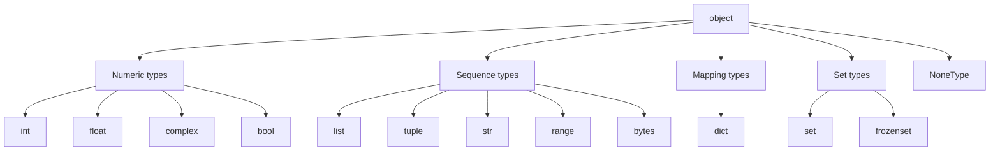

Python comes with a small, focused set of built-in types. You'll spend 99% of your time juggling these. Each one gets its own page later; this is the map.

Every snippet on this page runs in your browser—no setup required.

## Real-world context: Dynamic vs static typing

Python is **dynamically typed**: the type of a value is checked at runtime, not compile time. This is different from statically typed languages like Java, Go, or TypeScript, where you declare types upfront and the compiler enforces them.

**Dynamic typing tradeoffs:**
- ✅ Faster to write: no boilerplate type declarations.
- ✅ More flexible: a function can accept any type that supports the operations it uses (duck typing).
- ❌ Errors surface late: typos and type mismatches aren't caught until the code runs.
- ❌ Harder to refactor: tooling can't always infer what type a variable should be.

**Type annotations** (Python 3.5+) bridge the gap: you can add optional type hints and use tools like `mypy` to catch type errors before runtime, while keeping Python's runtime flexibility.

```python
def greet(name: str) -> str:
    return f"Hello, {name}"
```

In production codebases, type annotations are increasingly standard practice.

## The cheat sheet

| Category | Type | Example | Mutable? |
| --- | --- | --- | --- |
| Numeric | `int` | `42`, `-7`, `0b1010` | No |
| Numeric | `float` | `3.14`, `1e-3` | No |
| Numeric | `complex` | `3+2j` | No |
| Text | `str` | `"hello"`, `'a'` | No |
| Boolean | `bool` | `True`, `False` | No |
| Sequence | `list` | `[1, 2, 3]` | Yes |
| Sequence | `tuple` | `(1, 2, 3)` | No |
| Sequence | `range` | `range(10)` | No |
| Mapping | `dict` | `{"a": 1}` | Yes |
| Set | `set` | `{1, 2, 3}` | Yes |
| Set | `frozenset` | `frozenset({1, 2})` | No |
| Binary | `bytes` | `b"\\x00\\x01"` | No |
| Binary | `bytearray` | `bytearray(b"...")` | Yes |
| Nothing | `NoneType` | `None` | No |

## Type hierarchy

Python's type system is built on a hierarchy rooted in `object`. Every value in Python is an instance of some class, and every class (eventually) inherits from `object`.



<Callout type="info" title="bool is a subclass of int">
This is a quirk of Python's design: `True` and `False` are instances of `bool`, which inherits from `int`. So `True == 1` and `False == 0` are both true, and you can do arithmetic with booleans: `True + True` is `2`.
</Callout>

## Checking the type

`type(obj)` returns the exact class; `isinstance(obj, T)` checks the class or any of its parent classes.

<CodeBlock
  adapter="python"
  starterCode={`values = [1, 1.0, True, "1", [1], (1,), {1}, {"1": 1}, None]

for v in values:
    print(f"{v!r:>15}  type={type(v).__name__}")
`}
/>

`isinstance` is what you should use in real code, because it respects inheritance:

<CodeBlock
  adapter="python"
  starterCode={`print(isinstance(True, bool))   # True
print(isinstance(True, int))    # True (bool is a subclass of int)
print(isinstance(1, bool))      # False (int is not a subclass of bool)
`}
/>

<Callout type="warn" title="bool inherits from int">
Because `bool` is a subclass of `int`, boolean values behave as integers in arithmetic contexts:

```python
print(True + True)   # 2
print(False * 10)    # 0
```

This is usually harmless, but it can surprise you in functions that expect an integer.
</Callout>

## Converting between types

Every built-in type doubles as a converter when you call it as a function.

<CodeBlock
  adapter="python"
  starterCode={`# String to int / float
print(int("42"))
print(float("3.14"))
`}
/>

<CodeBlock
  adapter="python"
  starterCode={`# int to string
print(str(255))
print(hex(255), bin(255), oct(255))
`}
/>

<CodeBlock
  adapter="python"
  starterCode={`# float to int (truncates toward zero)
print(int(3.9))
print(int(-3.9))
`}
/>

<CodeBlock
  adapter="python"
  starterCode={`# list / tuple / set are interchangeable in many cases
items = [1, 2, 2, 3]
print(tuple(items))
print(set(items))   # duplicates removed
print(list("abc"))
`}
/>

## Mutability matters

Two patterns to remember:

1. **Immutable types** (`int`, `float`, `str`, `tuple`, `frozenset`) cannot be changed after creation. Operations like `s.upper()` return a **new** string.
2. **Mutable types** (`list`, `dict`, `set`, `bytearray`) can be changed in place. Methods like `list.append()` modify the object directly.

<CodeBlock
  adapter="python"
  starterCode={`s = "hello"
s.upper()       # returns "HELLO" but does not change s
print("s is still", s)
`}
/>

<CodeBlock
  adapter="python"
  starterCode={`s = "hello"
s = s.upper()   # rebinding is how you "change" an immutable
print("now s is", s)
`}
/>

<CodeBlock
  adapter="python"
  starterCode={`nums = [1, 2, 3]
nums.append(4)  # changes the list in place
print("nums is now", nums)
`}
/>

## `None`

`None` is the unique value of type `NoneType`. It represents the absence of a value. Use `is None` or `is not None` to check for it (not `==`).

<CodeBlock
  adapter="python"
  starterCode={`result = None
if result is None:
    print("nothing yet")
`}
/>

<CodeBlock
  adapter="python"
  starterCode={`# A function with no return statement returns None.
def shout(msg):
    print(msg.upper())

ret = shout("hello")
print("shout returned:", ret)
`}
/>

<Callout type="info" title="Why 'is None' not '== None'?">
`None` is a singleton—there's only one `None` object in memory. `is` checks object identity (same object?), while `==` checks value equality. For singletons like `None`, `True`, and `False`, always use `is`.
</Callout>

## Challenges

<ChallengeCard
  adapter="python"
  title="Parse a CSV-ish line"
  instructions={`A variable \`line\` holds the string \`"42,3.14,hello,True"\`. Split it on commas and produce a list called \`parsed\` containing, in order:

1. The integer \`42\`
2. The float \`3.14\`
3. The string \`"hello"\`
4. The boolean \`True\`

Hard-code the types (you do not need to detect them automatically).`}
  starterCode={`line = "42,3.14,hello,True"
parts = line.split(",")
print(parts)

parsed = None  # Your code here
print(parsed)
`}
  solutionCode={`line = "42,3.14,hello,True"
parts = line.split(",")
parsed = [int(parts[0]), float(parts[1]), parts[2], parts[3] == "True"]
print(parsed)
`}
  tests={[
    {
      id: "is_list",
      name: "parsed is a list of length 4",
      code: `assert isinstance(parsed, list) and len(parsed) == 4`,
    },
    {
      id: "types_right",
      name: "Each item has the right type",
      code: `assert type(parsed[0]) is int
assert type(parsed[1]) is float
assert type(parsed[2]) is str
assert type(parsed[3]) is bool`,
    },
    {
      id: "values_right",
      name: "Each item has the right value",
      code: `assert parsed == [42, 3.14, "hello", True]`,
    },
  ]}
/>

<ChallengeCard
  adapter="python"
  title="Safe int conversion"
  instructions={`Write a function \`safe_int(s, default=0)\` that tries to convert the string \`s\` to an integer. If the conversion fails (e.g., \`s\` is \`"abc"\`), return \`default\` instead. Use a try/except block.`}
  starterCode={`def safe_int(s, default=0):
    # Your code here
    return default

print(safe_int("123"))
print(safe_int("abc"))
print(safe_int("", -1))
`}
  solutionCode={`def safe_int(s, default=0):
    try:
        return int(s)
    except ValueError:
        return default

print(safe_int("123"))
print(safe_int("abc"))
print(safe_int("", -1))
`}
  tests={[
    {
      id: "valid_int",
      name: "Converts valid integer string",
      code: `assert safe_int("123") == 123`,
    },
    {
      id: "invalid_string",
      name: "Returns default on invalid string",
      code: `assert safe_int("abc") == 0`,
    },
    {
      id: "custom_default",
      name: "Respects custom default",
      code: `assert safe_int("", -1) == -1`,
    },
  ]}
/>

## Check your understanding

<MultipleChoice
  markdown={`Which of the following Python types is **immutable**?

- \`list\`
  > Lists are mutable: \`l.append(x)\` changes them in place.
- \`dict\`
  > Dicts are mutable: \`d["key"] = value\` changes them in place.
- [o] \`tuple\`
  > Tuples are immutable sequences—you can't change their contents after creation.
- \`set\`
  > Sets are mutable: \`s.add(x)\` changes them in place.`}
/>

<MultipleChoice
  markdown={`What does \`isinstance(True, int)\` return?

- \`False\`
  > \`bool\` is a subclass of \`int\`, so \`isinstance\` returns \`True\`.
- [o] \`True\`
  > \`bool\` inherits from \`int\`, so \`isinstance(True, int)\` is \`True\`.
- A \`TypeError\`
  > \`isinstance\` is perfectly legal with \`int\` and \`bool\`.
- \`None\`
  > \`isinstance\` returns a boolean, not \`None\`.`}
/>

<MultipleChoice
  markdown={`After this code runs, what is the type of \`x\`?

\`\`\`python
x = "42"
x = int(x)
\`\`\`

- \`str\`
  > The second line rebinds \`x\` to an integer.
- [o] \`int\`
  > \`int("42")\` converts the string to the integer \`42\`, and the assignment rebinds \`x\` to that integer.
- \`float\`
  > We called \`int(x)\`, not \`float(x)\`.
- A \`TypeError\`
  > \`int("42")\` is perfectly valid.`}
/>

<MultipleChoice
  markdown={`Which statement about \`None\` is **false**?

- \`None\` is the only value of type \`NoneType\`.
  > True. \`None\` is a singleton.
- You should use \`is None\` to check for \`None\`.
  > True. \`is\` checks object identity, which is what you want for singletons.
- [o] A function that doesn't return anything raises an error.
  > False. A function with no \`return\` statement returns \`None\` implicitly.
- \`None\` represents the absence of a value.
  > True. That's its purpose.`}
/>

The next pages drill into each type, starting with numbers.
